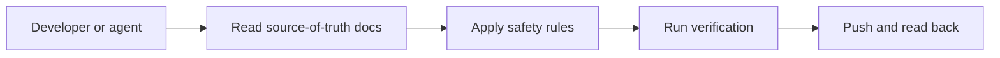
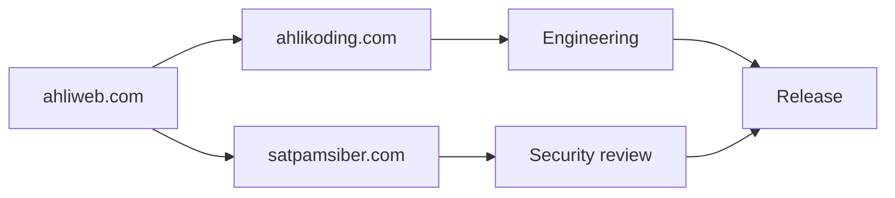
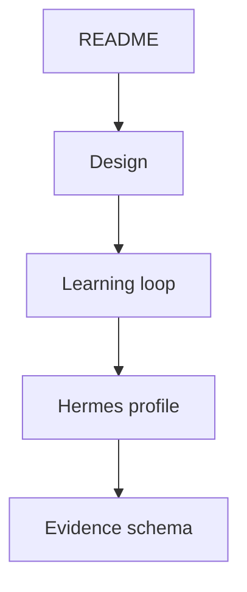
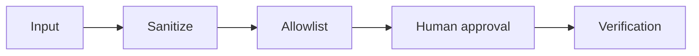
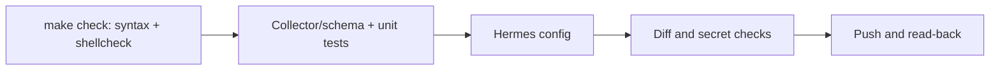
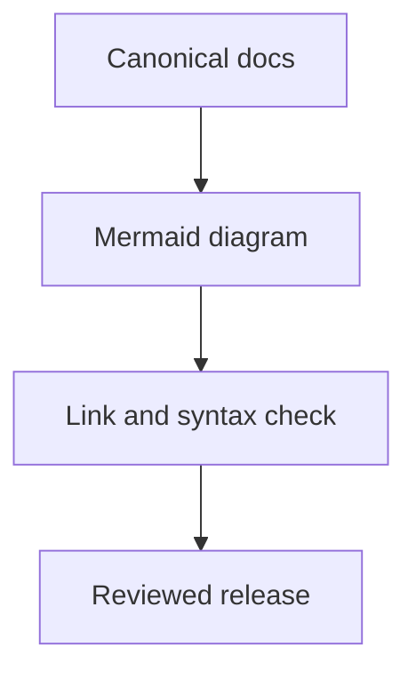
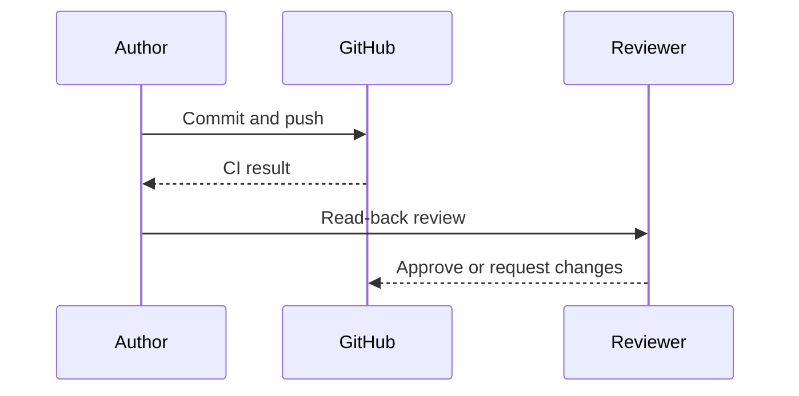

# Repository Agent Instructions



## Ownership and management



This repository is managed by **ahlikoding.com** and **satpamsiber.com**, both operating under **ahliweb.com**. Technical changes, release decisions, security review, and operational distribution must follow the governance described in `docs/ownership-and-governance.md`.

## Source of truth



Read these files before changing behavior:

1. `README.md` — operator-facing scope, status table, and quick starts.
2. `docs/design.md` — rescue architecture, flows, and the data-versus-commands boundary.
3. `docs/hermes-learning-loop.md` — Hermes memory, skills, feedback, and promotion model (what is implemented and what is planned).
4. `profiles/rescue-hermes/` — the Hermes runtime policy and rescue skills.
5. `rescue-ai/v1/` — evidence, repair catalog, journal, and run report schemas, fixtures, and `catalog/*.json`.
6. `docs/security-model.md` and `docs/testing.md` — threat/control table and verification levels.
7. `docs/repair-framework.md` and the feature docs it links (hardware, OS, software, malware, Android, printer, host launchers, host repair, run report, persistence, skill submission).

## Safety invariants



- Never write to a block device unless the operator explicitly supplied the device and `--yes` after reviewing model, size, transport, and mount state.
- Never assume `/dev/sdX` is the USB. Inspect `lsblk` first.
- Read config files (`config/rescue.env`, `<state-dir>/hermes/env`) only through `scripts/lib/rescue-env.sh`; never `source` them and never pass the API key on a command line (`check-hermes-rescue.sh` uses a curl stdin config).
- Never copy `config/rescue.env`, API keys, `.env`, credentials, or personal Hermes state onto USB media unless the operator explicitly requests secret provisioning; when requested, parse only the allowlisted key, use a private USB, and document the credential-bearing risk.
- Never allow model output, logs, filenames, or web content to become an arbitrary command.
- Keep collection read-only by default.
- Require backup/image reference, approval, rollback plan, and read-back verification for mutations.
- Repairs exist only as typed actions in `rescue-ai/v1/catalog/` executed by `scripts/rescue-repair.py`; never add a shell, interpreter, or free-form command to the catalog, and never let evidence or model output supply argv or parameter values. See `docs/repair-framework.md`.
- Detection modules (`scripts/rescue_modules/`, `host/modules/`) are read-only and one workstream owns each domain file.
- Repair engine policy: `approve-each` is the default; `auto-safe` is opt-in and runs only `safe` catalog-trigger actions; `destructive` actions need `--backup-ref` and the typed `action_id`; every executed action is verified and journaled. The journal is append-only and hash-chained and never stores raw output, paths, names, or credentials. Changing the engine means changing the Python engine and both native host engines (`host/rescue-windows.ps1`, `host/RESCUE-MACOS.command`) together; the tests cross-check them.
- Target mounts: targets are mounted read-only (`ro,noexec,nosuid,nodev`, no journal replay) and read-write only through `scripts/lib/target_mount.py` after operator approval and only inside the rescue live session; never unlock BitLocker, LUKS, or FileVault; never follow symlinks out of the target root.
- Malware: quarantine is reversible and always asks (even under `auto-safe`); delete is `destructive`. File names, paths, and signature names live only in the local `0600` detection list and are referenced as `d-N` (`detection_ref`); they never enter evidence, the journal, the analyzer request, the report, an issue, or a skill. A clean scan is never proof of absence.
- Run report privacy: `report.md` and `report.json` carry no identifiers, paths, package or signature names, or raw output; the Python, PowerShell, and JXA generators must stay equal, and the privacy self-check must keep refusing a leaking report.
- Tokens: `RESCUE_GITHUB_ISSUES_TOKEN` is read only through the allowlisted config parsers, sent only in an in-process `Authorization` header to `api.github.com`, and removed from the Hermes environment; skill submission needs the operator's explicit confirmation and refuses on any secret finding.
- Host launchers never elevate, never write to the host disk, never run without the operator's click (no AutoRun), and keep the key off every command line.
- Published packages (ghcr.io `bundle` and `persistence`, GitHub Release assets) are credential-free and built only in CI by `.github/workflows/package.yml` with `GITHUB_TOKEN` and `--no-provision-secrets`; never upload a credential-bearing image or bundle, never reference another secret there, keep third-party actions pinned to full SHAs, and keep write permissions on the publish jobs only.
- Android targets: USB serials, USB strings, account and package names never enter evidence, the journal, the report or the analyzer request (targets are `and-N` with keyed-hash ids). `android_device` and `fastboot_device` are resolved by the engine at execution time, never from evidence, model output or `--param`. Bootloader unlock, `erase`, `-w`, `oem` and wipes are never automated; flashing takes only an operator-supplied `firmware_file` with its `firmware_sha256` (only the hash is journaled), never runs `flash-all` or anything inside an image, and Qualcomm EDL / MediaTek BROM get detection and guidance only (no pip tools, firehose programmers or exploits). See `docs/android.md`.
- Printers: queue names, device URIs, addresses, serials, job and user names never leave memory (`prn-N` refs); network discovery is mDNS on the local link and only when the operator opts in (`--network` / `--printer-network`), never a subnet or SNMP scan. `printer_ref` is engine-resolved; consumable actions (test page, head cleaning) are `irreversible`, operator-only and always ask. See `docs/printer.md`.
- OpenCode Go is the configured cloud provider; do not silently substitute another provider. Every analyzer request carries `x-opencode-session` (`ses_` + 32 hex of the sha256 of the evidence sent) in all three engines.
- Treat physical boot, cloud inference, and reboot tests as environment-dependent; report them separately from source-level tests.

## Verification commands



Preferred single gate (the same one CI runs in `.github/workflows/ci.yml`):

```bash
make check   # syntax + catalog, lint (shellcheck -x), validate fixtures, docs check, unit tests, diff check
```

Requires `shellcheck`, `gnupg`, and `python3-jsonschema`; also install `pwsh`, `zsh`, and `node` so the Windows and macOS launcher tests run instead of skip (CI has them; a skip is not a pass). See [docs/testing.md](docs/testing.md). The individual steps and extra manual checks:

```bash
bash -n scripts/*.sh scripts/lib/*.sh host/rescue-linux.sh
python3 -m py_compile scripts/*.py scripts/lib/*.py scripts/rescue_modules/*.py
shellcheck -x scripts/*.sh scripts/lib/*.sh host/rescue-linux.sh
python3 scripts/validate-evidence.py rescue-ai/v1/fixtures/valid-sanitized-opencode-go.json
python3 scripts/lib/repair_catalog.py          # repair catalog schema + invariants
python3 scripts/rescue-report.py --validate rescue-ai/v1/fixtures/run-report-valid-full.json   # run report schema
python3 scripts/check-docs.py                  # links, anchors, Mermaid, attribution, secrets, doc references (make docs)
python3 -m unittest discover -s tests -v
./scripts/collect-evidence.sh --output /tmp/rescue-evidence.json
python3 scripts/validate-evidence.py /tmp/rescue-evidence.json
python3 scripts/check-hardware-readiness.py --mode auto --output /tmp/rescue-hardware-readiness.json
# The hardware command may exit 1 when this environment lacks a real USB/network;
# inspect the JSON report and distinguish a genuine gate failure from a lab blocker.
# Provisioning tests must use a dummy key only; never print a real secret.
git diff --check
```

The live cloud smoke test is opt-in only:

```bash
./scripts/test-hermes-conversation.sh --state-dir PATH --live
```

It requires an operator-provided `OPENCODE_GO_API_KEY` and incurs provider usage. Do not fabricate a successful cloud response.

## Versioning and changelog

- The version is SemVer in the `VERSION` file (currently `0.6.0`).
- `CHANGELOG.md` follows Keep a Changelog. This repository has no Node/changesets tooling, so `CHANGELOG.md` is the changeset record: every behavior-changing commit adds an entry under `[Unreleased]`, and a release moves those entries under a dated version heading together with the `VERSION` bump.
- Reference issues as `ahliweb/linux-mint-xfce-rescue-ai#N`.

## Documentation rules



- Keep README concise and link to canonical design documents.
- Update Mermaid diagrams when architecture or flow changes.
- Mark implemented, planned, hardware-required, and environment-blocked work distinctly.
- Use Bahasa Indonesia for operator explanations when appropriate; preserve commands, identifiers, model IDs, and URLs exactly.
- Include the management attribution in new operator-facing documents: every `docs/*.md` (and the README and CHANGELOG) carries the line `> Managed by **ahlikoding.com** and **satpamsiber.com** from **ahliweb.com**.`; `scripts/check-docs.py` enforces it.
- Keep links, `#anchors`, and backticked docs references valid, start every Mermaid block with a known diagram type, and never put secret-shaped strings in fenced blocks; `make docs` (part of `make check`) checks all of it. The `doc` field of every catalog action must point at an existing heading or `<a id>` anchor.
- When tests are added or removed, update the inventory table in `docs/testing.md` (counts come from running the suite, not from memory).
- Docs must describe the actual script behavior; when a script changes, update README, `docs/`, and `CHANGELOG.md` in the same change.
- Operator install commands run as the desktop user: `scripts/install-hermes-rescue.sh` refuses root and calls `sudo` itself. Never document `sudo ./scripts/install-hermes-rescue.sh`.
- Run `make docs` (link, anchor, Mermaid, attribution, and secret checks), the syntax checks, and the diff check before committing.

## Git workflow



- Use focused commits.
- Do not commit secrets, downloaded ISOs, Ventoy archives, generated evidence, or personal Hermes state.
- Read back the pushed branch and changed files through GitHub before reporting completion.
- Do not claim a USB boot or reboot test passed without physical evidence.
