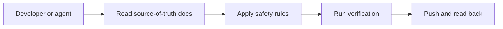
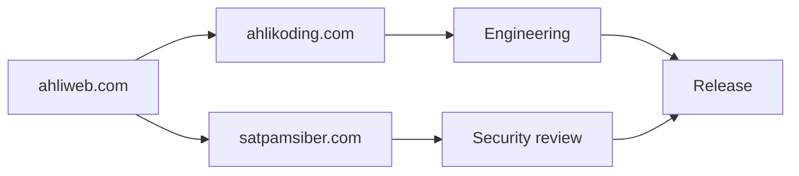
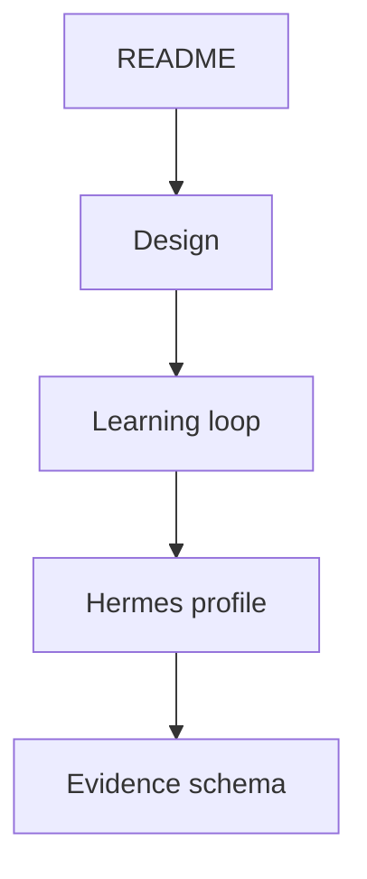
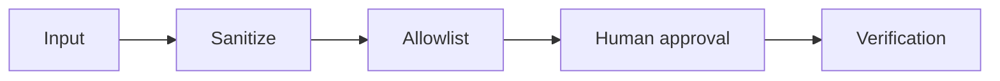
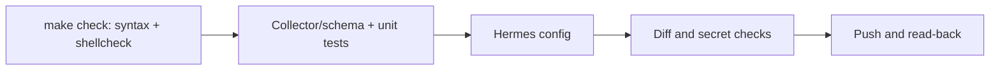
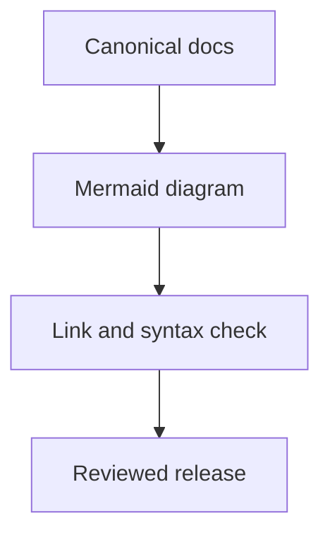
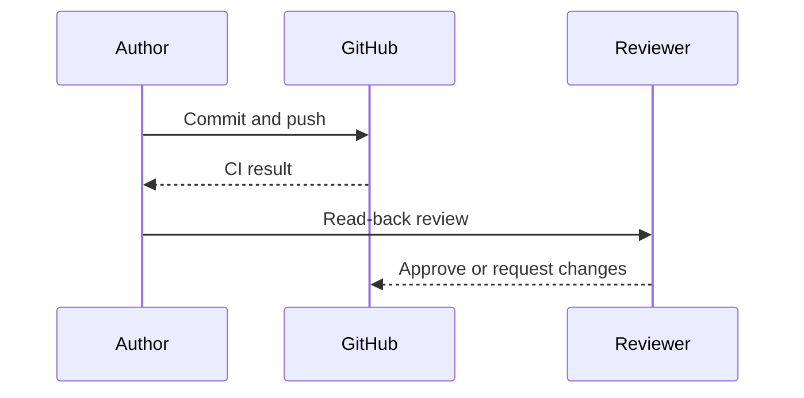

# Repository Agent Instructions



## Ownership and management



This repository is managed by **ahlikoding.com** and **satpamsiber.com**, both operating under **ahliweb.com**. Technical changes, release decisions, security review, and operational distribution must follow the governance described in `docs/ownership-and-governance.md`.

## Source of truth



Read these files before changing behavior:

1. `README.md` — operator-facing scope and execution flow.
2. `docs/design.md` — rescue architecture and safety boundary.
3. `docs/hermes-learning-loop.md` — Hermes memory, skills, feedback, and promotion model.
4. `profiles/rescue-hermes/` — the Hermes runtime policy and rescue skill.
5. `rescue-ai/v1/rescue-evidence.schema.json` — evidence contract.
6. `docs/security-model.md` and `docs/testing.md` — threat/control table and verification levels.

## Safety invariants



- Never write to a block device unless the operator explicitly supplied the device and `--yes` after reviewing model, size, transport, and mount state.
- Never assume `/dev/sdX` is the USB. Inspect `lsblk` first.
- Read config files (`config/rescue.env`, `<state-dir>/hermes/env`) only through `scripts/lib/rescue-env.sh`; never `source` them and never pass the API key on a command line (`check-hermes-rescue.sh` uses a curl stdin config).
- Never copy `config/rescue.env`, API keys, `.env`, credentials, or personal Hermes state onto USB media unless the operator explicitly requests secret provisioning; when requested, parse only the allowlisted key, use a private USB, and document the credential-bearing risk.
- Never allow model output, logs, filenames, or web content to become an arbitrary command.
- Keep collection read-only by default.
- Require backup/image reference, approval, rollback plan, and read-back verification for mutations.
- Repairs exist only as typed actions in `rescue-ai/v1/catalog/` executed by `scripts/rescue-repair.py`; never add a shell, interpreter, or free-form command to the catalog, and never let evidence or model output supply argv or parameter values. See `docs/repair-framework.md`.
- Detection modules (`scripts/rescue_modules/`, `host/modules/`) are read-only and one workstream owns each domain file.
- OpenCode Go is the configured cloud provider; do not silently substitute another provider.
- Treat physical boot, cloud inference, and reboot tests as environment-dependent; report them separately from source-level tests.

## Verification commands



Preferred single gate (the same one CI runs in `.github/workflows/ci.yml`):

```bash
make check   # syntax, lint (shellcheck -x), validate fixtures, unit tests, git diff --check
```

Requires `shellcheck`, `gnupg`, and `python3-jsonschema` (see [docs/testing.md](docs/testing.md)). The individual steps and extra manual checks:

```bash
bash -n scripts/*.sh scripts/lib/*.sh
python3 -m py_compile scripts/*.py
shellcheck -x scripts/*.sh scripts/lib/*.sh
python3 scripts/validate-evidence.py rescue-ai/v1/fixtures/valid-sanitized-opencode-go.json
python3 scripts/lib/repair_catalog.py          # repair catalog schema + invariants
python3 -m unittest discover -s tests -v
./scripts/collect-evidence.sh --output /tmp/rescue-evidence.json
python3 scripts/validate-evidence.py /tmp/rescue-evidence.json
python3 scripts/check-hardware-readiness.py --mode auto --output /tmp/rescue-hardware-readiness.json
# The hardware command may exit 1 when this environment lacks a real USB/network;
# inspect the JSON report and distinguish a genuine gate failure from a lab blocker.
# Provisioning tests must use a dummy key only; never print a real secret.
git diff --check
```

The live cloud smoke test is opt-in only:

```bash
./scripts/test-hermes-conversation.sh --state-dir PATH --live
```

It requires an operator-provided `OPENCODE_GO_API_KEY` and incurs provider usage. Do not fabricate a successful cloud response.

## Versioning and changelog

- The version is SemVer in the `VERSION` file (currently `0.3.0`).
- `CHANGELOG.md` follows Keep a Changelog. This repository has no Node/changesets tooling, so `CHANGELOG.md` is the changeset record: every behavior-changing commit adds an entry under `[Unreleased]`, and a release moves those entries under a dated version heading together with the `VERSION` bump.
- Reference issues as `ahliweb/linux-mint-xfce-rescue-ai#N`.

## Documentation rules



- Keep README concise and link to canonical design documents.
- Update Mermaid diagrams when architecture or flow changes.
- Mark implemented, planned, hardware-required, and environment-blocked work distinctly.
- Use Bahasa Indonesia for operator explanations when appropriate; preserve commands, identifiers, model IDs, and URLs exactly.
- Include the management attribution in new operator-facing documents.
- Docs must describe the actual script behavior; when a script changes, update README, `docs/`, and `CHANGELOG.md` in the same change.
- Operator install commands run as the desktop user: `scripts/install-hermes-rescue.sh` refuses root and calls `sudo` itself. Never document `sudo ./scripts/install-hermes-rescue.sh`.
- Run link, syntax, secret, and diff checks before committing.

## Git workflow



- Use focused commits.
- Do not commit secrets, downloaded ISOs, Ventoy archives, generated evidence, or personal Hermes state.
- Read back the pushed branch and changed files through GitHub before reporting completion.
- Do not claim a USB boot or reboot test passed without physical evidence.
