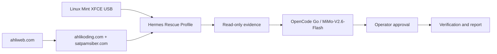
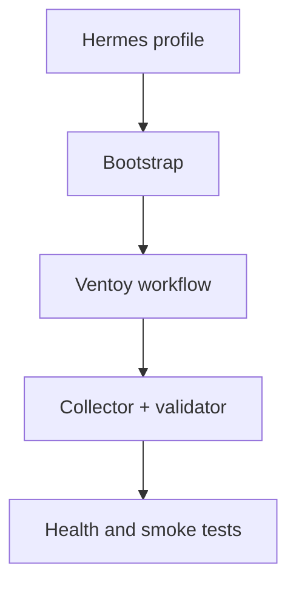
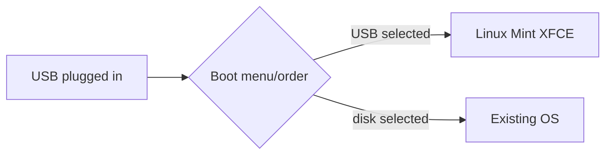
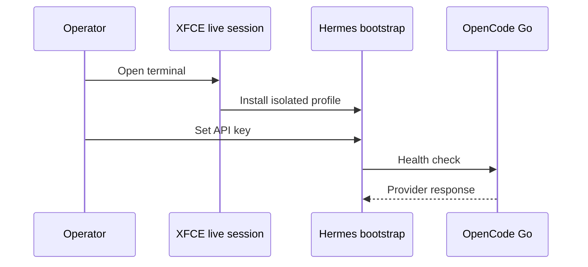
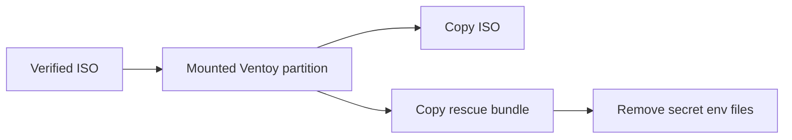
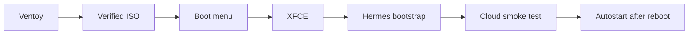
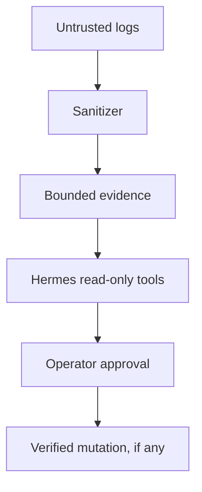
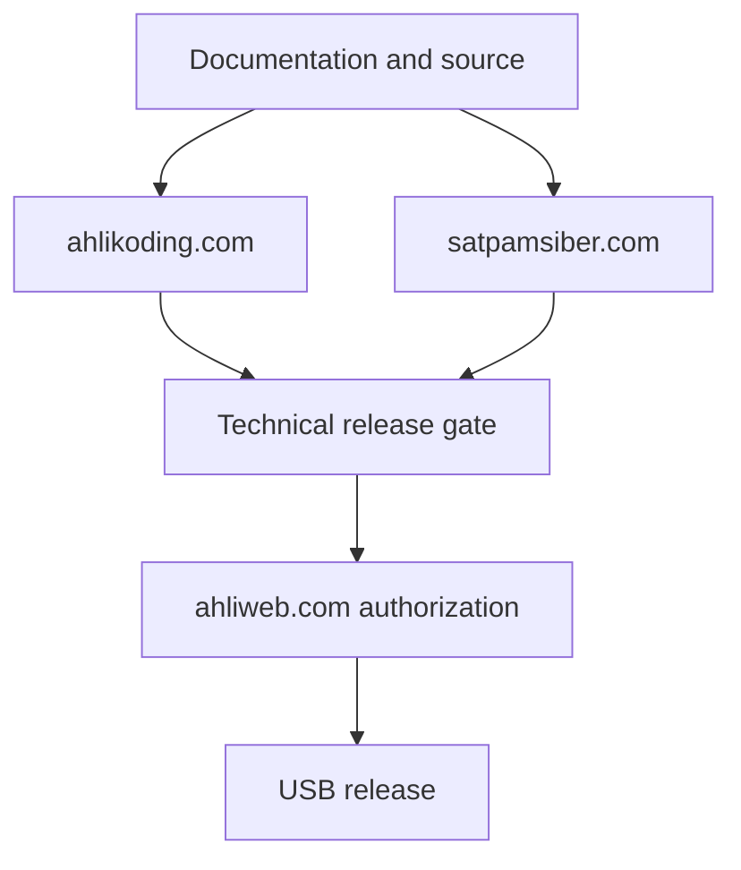
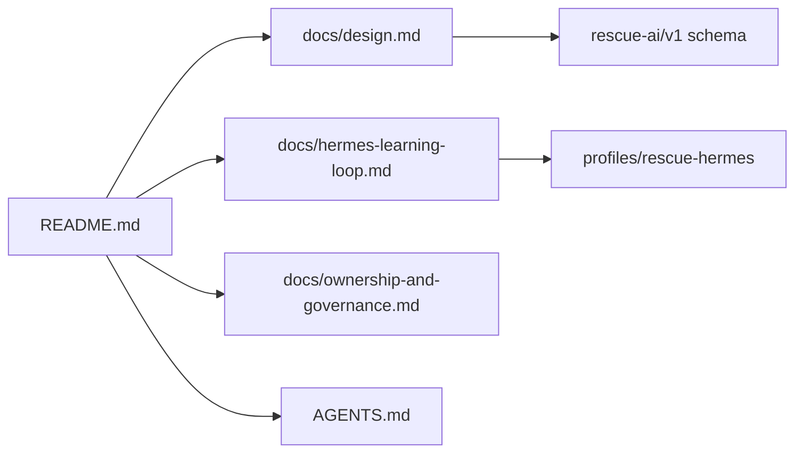

# Linux Mint XFCE Rescue AI

Bootable USB rescue toolkit with a dedicated **Hermes Rescue profile** and cloud AI default:

- Provider: OpenCode Go via OpenAI-compatible endpoint
- Model: `mimo-v2.6-flash`
- OpenCode model ID: `opencode-go/mimo-v2.6-flash`
- Hermes route: `custom` + `https://opencode.ai/zen/go/v1`

The system runs read-only diagnostics locally, sanitizes evidence, and asks Hermes/OpenCode Go for bounded hypotheses and next checks. It never performs destructive repair without operator approval.

> Managed by **ahlikoding.com** and **satpamsiber.com** from **ahliweb.com**.



## What is implemented



- Hermes profile files: `profiles/rescue-hermes/`.
- Hermes configuration template with OpenCode Go/MiMo-V2.6-Flash as the default model.
- Bootstrap installer that installs Hermes through the official installer, creates an isolated `HERMES_HOME`, installs the rescue profile, and creates a desktop autostart entry.
- `launch-hermes-rescue.sh` to start Hermes with the isolated profile.
- `check-hermes-rescue.sh` to validate Hermes, configuration, provider endpoint, and model settings without exposing the API key.
- Read-only evidence collector and schema validator.
- `scripts/prepare-ventoy-usb.sh` — verifies the Linux Mint ISO, configures Ventoy auto-selection, and optionally provisions only the API key from an ignored local dotenv file.
- `scripts/verify-mint-iso.sh` — performs Linux Mint SHA-256 and GPG verification.
- `scripts/download-ventoy.sh` — downloads the official Ventoy Linux release package.
- `scripts/install-ventoy-usb.sh` — installs Ventoy only to an explicitly confirmed removable USB disk.
- `scripts/test-hermes-conversation.sh` — dry-run by default; `--live` performs one bounded cloud smoke test.
- `scripts/verify-autostart.sh` — validates the XFCE autostart entry.
- `scripts/check-hardware-readiness.py` — read-only preflight for CPU, RAM, VGA/display, internet, and USB live-media minimums; writes a timestamped JSON report and blocks Hermes when required checks fail.

## Important boot limitation



Plugging in a USB flash drive does not force a PC to boot from it. The PC firmware must support USB boot and the operator must select the USB from the boot menu or change the boot order. Secure Boot may require an approved configuration.

This repository does not silently erase disks, install Ventoy, or manufacture an ISO. Those actions are deliberately explicit and operator-confirmed.

## Quick start on a live Linux Mint XFCE session



```bash
cp config/rescue.env.example config/rescue.env
chmod 600 config/rescue.env
$EDITOR config/rescue.env   # set OPENCODE_GO_API_KEY; never commit it

sudo ./scripts/install-hermes-rescue.sh \
  --state-dir /media/$USER/RESCUE-STATE/hermes-state

./scripts/check-hermes-rescue.sh \
  --state-dir /media/$USER/RESCUE-STATE/hermes-state

./scripts/launch-hermes-rescue.sh \
  --state-dir /media/$USER/RESCUE-STATE/hermes-state
```

The state directory must be on a writable persistent partition if memory and sessions should survive reboot. For a normal live session, use a separate encrypted writable storage device.

The launcher performs the hardware preflight after verifying the Hermes installation and before starting Hermes. The default is fully automatic through all checks:

```bash
./scripts/launch-hermes-rescue.sh --state-dir /media/$USER/RESCUE-STATE/hermes-state
```

It checks the minimum of 2 logical CPUs, 4 GiB RAM, a VGA/3D/display adapter, an IP route plus DNS/HTTPS access, and an 8 GiB USB live medium. Thresholds can be changed explicitly with `--min-cpu`, `--min-ram-gib`, and `--min-usb-gib`. Use the per-step wizard when an operator must confirm every check:

```bash
./scripts/launch-hermes-rescue.sh \
  --state-dir /media/$USER/RESCUE-STATE/hermes-state \
  --hardware-mode wizard
```

The report is saved under `<state-dir>/reports/hardware-readiness-YYYYMMDD-HHMMSS.json`. `fail` and `unknown` on required checks prevent Hermes from starting and show the unmet minimum; a physically unverified firmware boot is reported as a warning because software cannot prove that a particular PC firmware booted from USB. The check is read-only and does not format, partition, or write to any disk.

## Prepare an existing Ventoy USB



Install Ventoy to the confirmed USB using the official Ventoy workflow first. Then mount its data partition and run:

```bash
./scripts/prepare-ventoy-usb.sh \
  --ventoy-mount /media/$USER/VENTOY \
  --mint-iso /path/to/linuxmint-xfce.iso \
  --sha256sums /path/to/sha256sum.txt \
  --signature /path/to/sha256sum.txt.gpg
```

Before preparation, an operator may create a local ignored `.env` beside the repository:

```dotenv
OPENCODE_GO_API_KEY='operator-provided-secret'
```

The preparation helper reads this file without executing it and writes only the allowlisted API key to the USB's `config/rescue.env` with mode `0600`. Use `--env-file FILE` for another dotenv source. The USB must then be treated as a credential-bearing device. If the key must not be stored on the USB, pass `--no-provision-secrets`.


Use `--menu-timeout 0` for immediate Ventoy selection, or `--no-auto-boot`/`--manual-menu` to preserve a manual Ventoy menu. The helper never installs Ventoy and never writes a raw disk. On boot, firmware must still be instructed to boot from the USB; no file can force a PC firmware boot order.

## End-to-end execution checklist



1. Identify the removable USB with `lsblk -o NAME,PATH,RM,SIZE,MODEL,TRAN,MOUNTPOINTS`. Do not use `/dev/sda` or any disk with mounted children. Download and extract Ventoy, then run `sudo ./scripts/install-ventoy-usb.sh --device /dev/sdX --ventoy-dir ./ventoy-X.Y.Z --yes` only after reviewing the displayed model and size.
2. Download Linux Mint XFCE plus `sha256sum.txt` and `sha256sum.txt.gpg` from the same official mirror. Verify with `scripts/verify-mint-iso.sh`.
3. Mount the first Ventoy partition and run `scripts/prepare-ventoy-usb.sh` with the ISO, checksum file, and signature file. This copies the ISO and rescue source bundle.
4. On the target PC, select the USB in the UEFI/BIOS boot menu. Ventoy then auto-selects the configured Linux Mint XFCE ISO; the firmware selection itself cannot be automated by the USB contents.
5. In the Linux Mint XFCE desktop, connect the network and open a terminal in the copied `rescue-omes` directory. The provisioned `config/rescue.env` supplies the API key to the bootstrap; the first live boot still requires the bootstrap unless an approved persistent Hermes state has already been prepared.
6. Run `sudo ./scripts/install-hermes-rescue.sh --state-dir /media/$USER/RESCUE-STATE/hermes-state`. The installer creates the XFCE autostart entry with automatic hardware preflight as the default.
7. Verify that `OPENCODE_GO_API_KEY` is present in the provisioned `config/rescue.env`, then run `./scripts/check-hermes-rescue.sh --state-dir ...`.
8. Start the launcher. It runs the automatic hardware-readiness gate by default and writes a report; use `--hardware-mode wizard` for per-step confirmation. Hermes starts only when required CPU, RAM, display, internet, and USB checks pass.
9. Run `./scripts/test-hermes-conversation.sh --state-dir ... --live` only after approving a real cloud request. Without `--live`, it is a no-cost dry run.
10. Run `./scripts/verify-autostart.sh --state-dir ...`, reboot from the live environment, log in to XFCE, and verify the launcher with `pgrep -af hermes`. A physical reboot is required; it is not simulated by the source repository.


OpenCode Go credentials are secrets. They are not stored in this repository or in evidence. Set `OPENCODE_GO_API_KEY` in the local `config/rescue.env`, or place it in the isolated Hermes secret environment at setup time.

OpenCode Go currently documents the model as `MiMo-V2.6-Flash` with model ID `mimo-v2.6-flash`. Model availability and plan limits can change, so `check-hermes-rescue.sh` verifies the configured ID and endpoint but does not invent a fallback provider.

## Security boundary



Hermes has a separate rescue profile and must not reuse the operator's personal `~/.hermes` directory. Default actions are read-only. Logs are untrusted data and cannot issue commands. Skills are versioned and candidate learning is not promoted without verification and approval.

## Governance and licensing

This project is managed by **ahlikoding.com** and **satpamsiber.com** from **ahliweb.com**. See [ownership and governance](docs/ownership-and-governance.md), [agent instructions](AGENTS.md), and [MIT License](LICENSE).



## Documentation map



See:

- [Hermes learning loop](docs/hermes-learning-loop.md)
- [Rescue design](docs/design.md)
- [Hermes profile](profiles/rescue-hermes/)
- [OpenCode Go documentation](https://opencode.ai/docs/go)
- [Hermes provider documentation](https://hermes-agent.nousresearch.com/docs/integrations/providers)
