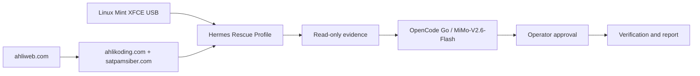
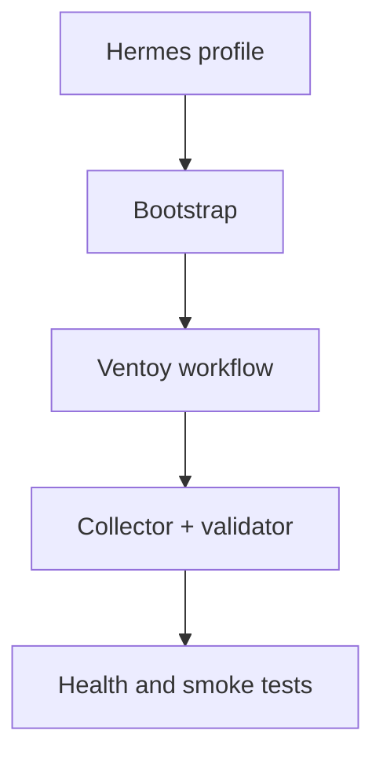
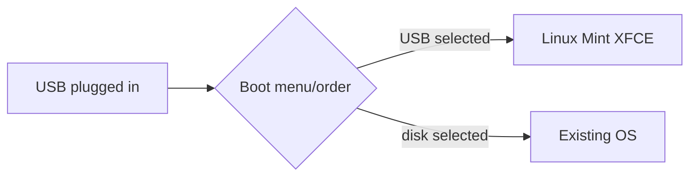
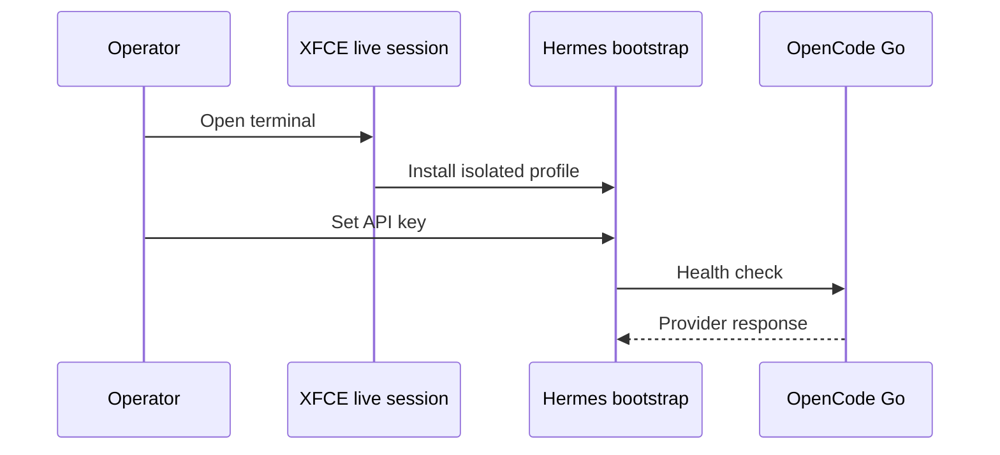
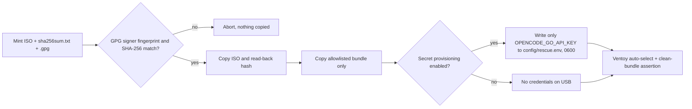
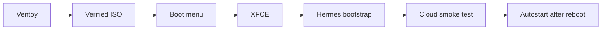
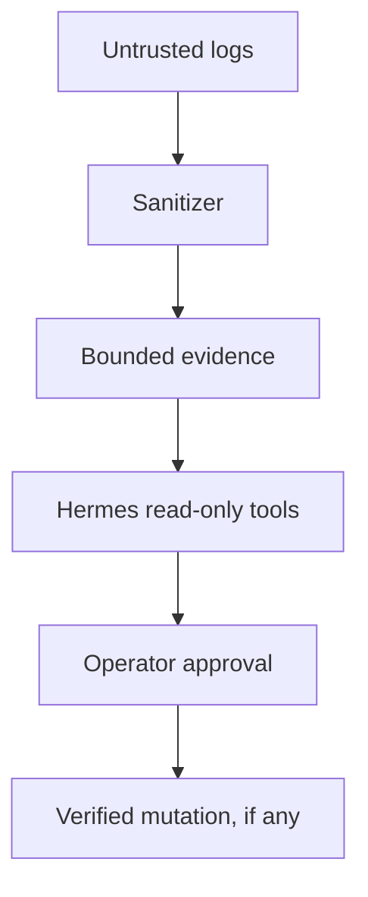
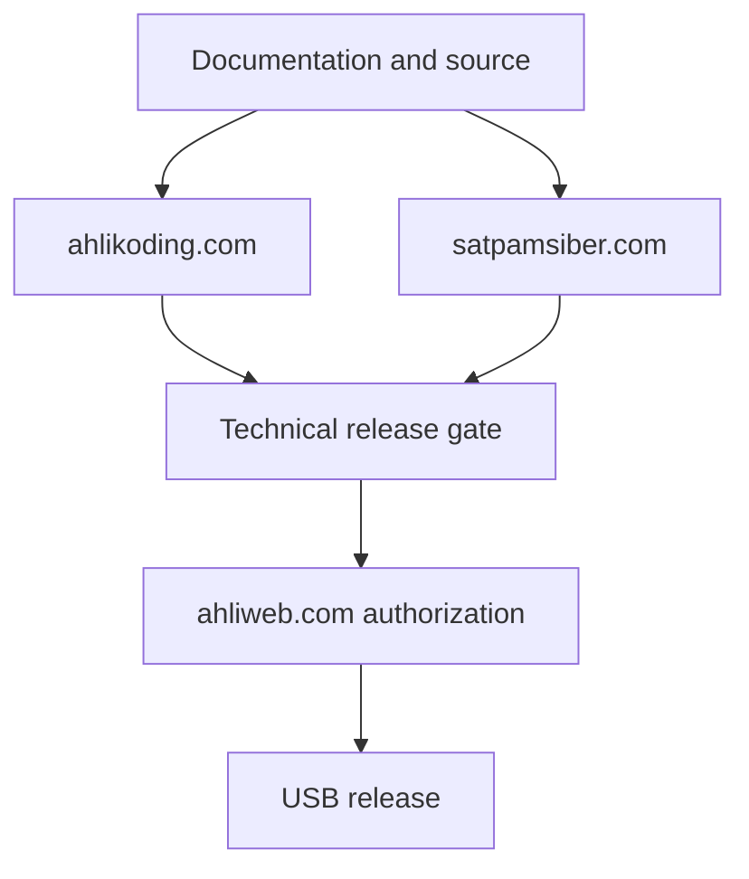
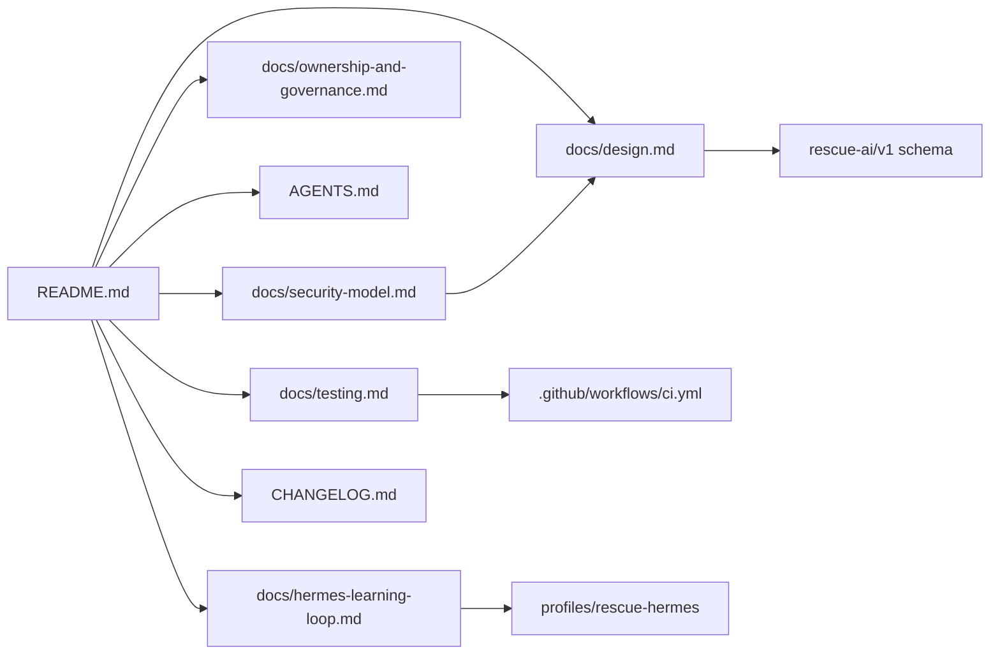

# Linux Mint XFCE Rescue AI

Bootable USB rescue toolkit with a dedicated **Hermes Rescue profile** and cloud AI default:

- Provider: OpenCode Go via OpenAI-compatible endpoint
- Model: `mimo-v2.6-flash`
- OpenCode model ID: `opencode-go/mimo-v2.6-flash`
- Hermes route: `custom` + `https://opencode.ai/zen/go/v1`

The system runs read-only diagnostics locally, sanitizes evidence, and asks Hermes/OpenCode Go for bounded hypotheses and next checks. It never performs destructive repair without operator approval.

> Managed by **ahlikoding.com** and **satpamsiber.com** from **ahliweb.com**.



## What is implemented



- Hermes profile files: `profiles/rescue-hermes/`.
- Hermes configuration template with OpenCode Go/MiMo-V2.6-Flash as the default model.
Status legend used in the docs: **Implemented** (source-level, covered by `make check`), **Hardware-required** (needs a real PC/USB), **Environment-blocked** (needs network, an API key, or provider spend), **Planned** (design only). See [testing](docs/testing.md) for what each level means.

- Hermes profile files: `profiles/rescue-hermes/`. **Implemented**
- `scripts/install-hermes-rescue.sh` — run as the desktop user (it refuses root and calls `sudo` only where needed). Installs Hermes through the official installer (optionally pinned with `--installer-sha256` / `HERMES_INSTALLER_SHA256`), creates an isolated `HERMES_HOME`, installs the profile, installs a runtime bundle to `/usr/local/lib/rescue-omes` (`--prefix`), symlinks `launch-hermes-rescue.sh` and `check-hermes-rescue.sh` into `/usr/local/bin` (`--bin-dir`), and creates the XFCE autostart entry (skip with `--no-autostart`; skip the Hermes download with `--skip-hermes-install`). **Implemented**
- `scripts/launch-hermes-rescue.sh` — hardware preflight, then Hermes with the isolated profile. **Implemented**
- `scripts/check-hermes-rescue.sh` — validates Hermes, configuration, provider endpoint, and model; the API key is passed to `curl` through a stdin config, never on the command line. **Implemented**; the endpoint probe is **Environment-blocked** without network and key.
- `scripts/lib/rescue-env.sh` — allowlisted config parser shared by the scripts (see [configuration file format](#configuration-file-format)). **Implemented**
- `scripts/collect-evidence.sh` and `scripts/validate-evidence.py` — read-only collector that reports verification honestly (`hashes_verified: false`, `status: not_applicable`) and a schema validator (exit `0` valid, `1` invalid, `2` usage/parse error). **Implemented**
- `scripts/analyze-opencode-go.sh` — validates evidence, then pipes it to the operator-configured `OPENCODE_ADAPTER_COMMAND`. **Implemented**; the adapter itself is operator-supplied.
- `scripts/verify-mint-iso.sh` — GPG signature (pinned Linux Mint signer fingerprint) plus direct SHA-256 comparison. **Implemented**
- `scripts/download-ventoy.sh` — downloads the official Ventoy Linux release; the release digest is required. **Implemented**
- `scripts/install-ventoy-usb.sh` — installs Ventoy only to an explicitly confirmed, unmounted, non-root removable USB disk. **Implemented**; the actual write is **Hardware-required**.
- `scripts/prepare-ventoy-usb.sh` — verifies the ISO, copies it and an allowlisted rescue bundle to Ventoy, configures auto-selection in `/ventoy/ventoy.json` (the only location Ventoy reads). **Implemented**; a physical boot is **Hardware-required**.
- `scripts/test-hermes-conversation.sh` — dry-run by default; `--live` performs one bounded cloud smoke test. **Environment-blocked** (`--live`).
- `scripts/verify-autostart.sh` — validates the XFCE autostart entry. The reboot itself is **Hardware-required**.
- `scripts/check-hardware-readiness.py` — read-only preflight for CPU, RAM, VGA/display, internet, and USB live-media minimums; writes a `0600` JSON report and blocks Hermes when required checks fail. **Implemented**; results are only meaningful on the target PC.
- Candidate learning, feedback, and signed promotion — **Planned** ([learning loop](docs/hermes-learning-loop.md)).

## Important boot limitation



Plugging in a USB flash drive does not force a PC to boot from it. The PC firmware must support USB boot and the operator must select the USB from the boot menu or change the boot order. Secure Boot may require an approved configuration.

This repository does not silently erase disks, install Ventoy, or manufacture an ISO. Those actions are deliberately explicit and operator-confirmed.

## Quick start on a live Linux Mint XFCE session



```bash
cp config/rescue.env.example config/rescue.env
chmod 600 config/rescue.env
$EDITOR config/rescue.env   # set OPENCODE_GO_API_KEY; never commit it

# Run as the desktop user, NOT with sudo: the installer refuses root and uses sudo internally.
./scripts/install-hermes-rescue.sh \
  --state-dir /media/$USER/RESCUE-STATE/hermes-state

./scripts/check-hermes-rescue.sh \
  --state-dir /media/$USER/RESCUE-STATE/hermes-state

./scripts/launch-hermes-rescue.sh \
  --state-dir /media/$USER/RESCUE-STATE/hermes-state
```

After installation, `launch-hermes-rescue.sh` and `check-hermes-rescue.sh` are also on `PATH` (`/usr/local/bin`), and the runtime bundle lives in `/usr/local/lib/rescue-omes`. The installer writes `<state-dir>/hermes/env` as `KEY='value'` lines with mode `0600`; an existing key is preserved when the installer is re-run without a new one. For an unpinned Hermes download the installer prints a warning; pass `--installer-sha256 HEX` (or set `HERMES_INSTALLER_SHA256`) to verify it before execution.

The state directory must be on a writable persistent partition if memory and sessions should survive reboot. For a normal live session, use a separate encrypted writable storage device.

The launcher performs the hardware preflight after verifying the Hermes installation and before starting Hermes. The default is fully automatic through all checks:

```bash
./scripts/launch-hermes-rescue.sh --state-dir /media/$USER/RESCUE-STATE/hermes-state
```

It checks the minimum of 2 logical CPUs, 4 GiB RAM, a VGA/3D/display adapter, an IP route plus DNS/HTTPS access, and an 8 GiB USB live medium. Thresholds can be changed explicitly with `--min-cpu`, `--min-ram-gib`, and `--min-usb-gib`. Use the per-step wizard when an operator must confirm every check:

```bash
./scripts/launch-hermes-rescue.sh \
  --state-dir /media/$USER/RESCUE-STATE/hermes-state \
  --hardware-mode wizard
```

The report is saved under `<state-dir>/reports/hardware-readiness-YYYYMMDD-HHMMSS.json`. `fail` and `unknown` on required checks prevent Hermes from starting and show the unmet minimum; a physically unverified firmware boot is reported as a warning because software cannot prove that a particular PC firmware booted from USB. The check is read-only and does not format, partition, or write to any disk.

## Prepare an existing Ventoy USB



Install Ventoy to the confirmed USB first (`scripts/download-ventoy.sh` then `scripts/install-ventoy-usb.sh`, see the checklist below). Then mount its data partition (label `Ventoy`). A freshly installed data partition is empty; the helper recognizes it by the `Ventoy` label plus a sibling `VTOYEFI` partition on the same disk, or by an existing `ventoy/` or `EFI/` directory.

`verify-mint-iso.sh` requires the signature on `sha256sum.txt` to come from the Linux Mint signing key `27DEB15644C6B3CF3BD7D291300F846BA25BAE09` (override only with `--signer-fingerprint` after out-of-band verification; use `--gpg-homedir DIR` for an isolated keyring). The operator must import that key first, following the [Linux Mint verification guide](https://linuxmint.com/verify.php):

```bash
gpg --keyserver hkp://keyserver.ubuntu.com:80 --recv-key "27DE B156 44C6 B3CF 3BD7  D291 300F 846B A25B AE09"
```

Then run:

```bash
./scripts/prepare-ventoy-usb.sh \
  --ventoy-mount /media/$USER/VENTOY \
  --mint-iso /path/to/linuxmint-xfce.iso \
  --sha256sums /path/to/sha256sum.txt \
  --signature /path/to/sha256sum.txt.gpg
```

Before preparation, the operator must create a local ignored `.env` beside the repository:

```dotenv
OPENCODE_GO_API_KEY='operator-provided-secret'
```

The rescue bundle is copied from an allowlist (`AGENTS.md`, `LICENSE`, `Makefile`, `README.md`, `CHANGELOG.md`, `VERSION`, the two `config/` templates, `docs`, `profiles`, `rescue-ai`, `scripts`, `tests`), so `.env`, `config/rescue.env`, `.git`, ISOs, images, and archives are never written to the USB. Secret provisioning is a separate, explicit step: by default the helper reads `.env` without executing it and writes only the allowlisted `OPENCODE_GO_API_KEY` to the USB's `config/rescue.env` (mode `0600` requested; FAT/exFAT may not enforce it). Use `--env-file FILE` for another dotenv source. The USB is then a credential-bearing device. If the key must not be stored on the USB, pass `--no-provision-secrets`. The helper also read-back verifies the copied ISO hash, and `--bundle-only DEST` copies just the bundle into a new or empty directory for inspection without touching any USB.

Use `--menu-timeout 0` for immediate Ventoy selection, or `--no-auto-boot`/`--manual-menu` to preserve a manual Ventoy menu. The helper never installs Ventoy and never writes a raw disk. On boot, firmware must still be instructed to boot from the USB; no file can force a PC firmware boot order.

## End-to-end execution checklist



1. Identify the removable USB with `lsblk -o NAME,PATH,RM,SIZE,MODEL,TRAN,MOUNTPOINTS`. Do not use `/dev/sda` or any disk with mounted children. Run `./scripts/download-ventoy.sh [--version X.Y.Z]` (single release API call; refuses to continue without a SHA-256 digest), extract the archive, then run `./scripts/install-ventoy-usb.sh --device /dev/sdX --ventoy-dir ./ventoy-X.Y.Z --yes` only after reviewing the displayed model and size. The script refuses a mounted disk, a non-whole-disk target, and the disk backing `/`, and calls `sudo` itself for `Ventoy2Disk.sh`. **Hardware-required.**
2. Download Linux Mint XFCE plus `sha256sum.txt` and `sha256sum.txt.gpg` from the same official mirror, import the Linux Mint key (see above), and verify with `scripts/verify-mint-iso.sh --iso ... --sha256sums ... --signature ...`.
3. Mount the first Ventoy partition and run `scripts/prepare-ventoy-usb.sh` with the ISO, checksum file, and signature file. This copies the ISO and rescue source bundle.
4. On the target PC, select the USB in the UEFI/BIOS boot menu. Ventoy then auto-selects the configured Linux Mint XFCE ISO; the firmware selection itself cannot be automated by the USB contents.
5. In the Linux Mint XFCE desktop, connect the network and open a terminal in the copied `rescue-omes` directory. The provisioned `config/rescue.env` supplies the API key to the bootstrap; the first live boot still requires the bootstrap unless an approved persistent Hermes state has already been prepared.
6. Run `./scripts/install-hermes-rescue.sh --state-dir /media/$USER/RESCUE-STATE/hermes-state` as the desktop user (not with `sudo`; the installer refuses root). The installer creates the XFCE autostart entry with automatic hardware preflight as the default.
7. Verify that `OPENCODE_GO_API_KEY` is present in the provisioned `config/rescue.env`, then run `./scripts/check-hermes-rescue.sh --state-dir ...`.
8. Start the launcher. It runs the automatic hardware-readiness gate by default and writes a report; use `--hardware-mode wizard` for per-step confirmation. Hermes starts only when required CPU, RAM, display, internet, and USB checks pass.
9. Run `./scripts/test-hermes-conversation.sh --state-dir ... --live` only after approving a real cloud request. Without `--live`, it is a no-cost dry run.
10. Run `./scripts/verify-autostart.sh --state-dir ...`, reboot from the live environment, log in to XFCE, and verify the launcher with `pgrep -af hermes`. A physical reboot is required; it is not simulated by the source repository.


## Configuration file format

`config/rescue.env` (source tree) and `<state-dir>/hermes/env` (installed state) are read by `scripts/lib/rescue-env.sh`. They are data, never executed: one `[export ]KEY=VALUE` per line, `#` comments and blank lines ignored, values unquoted, `'single'`, or `"double"` quoted. Only these keys are read; all others are ignored:

| Key | Purpose |
|---|---|
| `OPENCODE_GO_API_KEY` | OpenCode Go credential (secret) |
| `RESCUE_STATE_DIR` | Default state directory when `--state-dir` is not given |
| `HERMES_HOME` | Isolated Hermes home (written by the installer) |
| `OPENCODE_ADAPTER_COMMAND` | Operator-chosen adapter run by `analyze-opencode-go.sh` |
| `OPENCODE_TIMEOUT_SECONDS` | Adapter timeout, positive integer (default `120`) |

Unquoted or double-quoted `$` and backticks make a line invalid: it is skipped with a warning and nothing is expanded. Variables already set in the environment are not overridden. A missing file is fine; a world-writable file is refused. `config/rescue.env` is optional for `analyze-opencode-go.sh`. Details: [security model](docs/security-model.md).

OpenCode Go credentials are secrets. They are not stored in this repository or in evidence. Set `OPENCODE_GO_API_KEY` in the local `config/rescue.env`, or place it in the isolated Hermes secret environment at setup time.

OpenCode Go currently documents the model as `MiMo-V2.6-Flash` with model ID `mimo-v2.6-flash`. Model availability and plan limits can change, so `check-hermes-rescue.sh` verifies the configured ID and endpoint but does not invent a fallback provider.

## Development checks

Run `make check` (syntax, `shellcheck -x`, fixture validation, `python3 -m unittest discover -s tests`, `git diff --check`). CI runs the same gate. Physical boot, Ventoy write, reboot autostart, and live cloud calls are outside it; see [testing](docs/testing.md).

## Security boundary



Threats and controls are tabulated in the [security model](docs/security-model.md). Hermes has a separate rescue profile and must not reuse the operator's personal `~/.hermes` directory. Default actions are read-only. Logs are untrusted data and cannot issue commands. Skills are versioned and candidate learning is not promoted without verification and approval.

## Governance and licensing

This project is managed by **ahlikoding.com** and **satpamsiber.com** from **ahliweb.com**. See [ownership and governance](docs/ownership-and-governance.md), [agent instructions](AGENTS.md), and [MIT License](LICENSE).



## Documentation map



See:

- [Hermes learning loop](docs/hermes-learning-loop.md)
- [Rescue design](docs/design.md)
- [Security model](docs/security-model.md)
- [Testing and verification](docs/testing.md)
- [Changelog](CHANGELOG.md) (current version in `VERSION`: `0.2.1`)
- [Hermes profile](profiles/rescue-hermes/)
- [OpenCode Go documentation](https://opencode.ai/docs/go)
- [Hermes provider documentation](https://hermes-agent.nousresearch.com/docs/integrations/providers)
