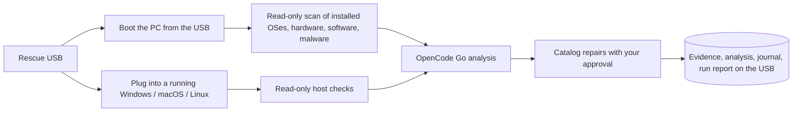
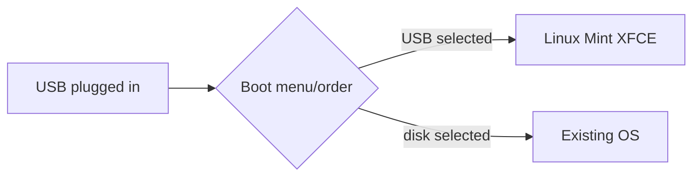
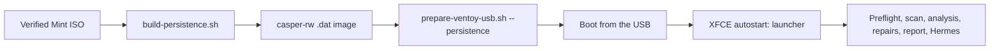
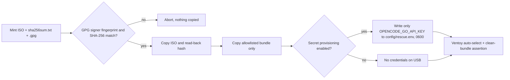
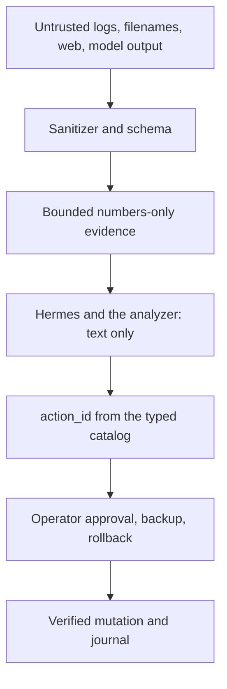
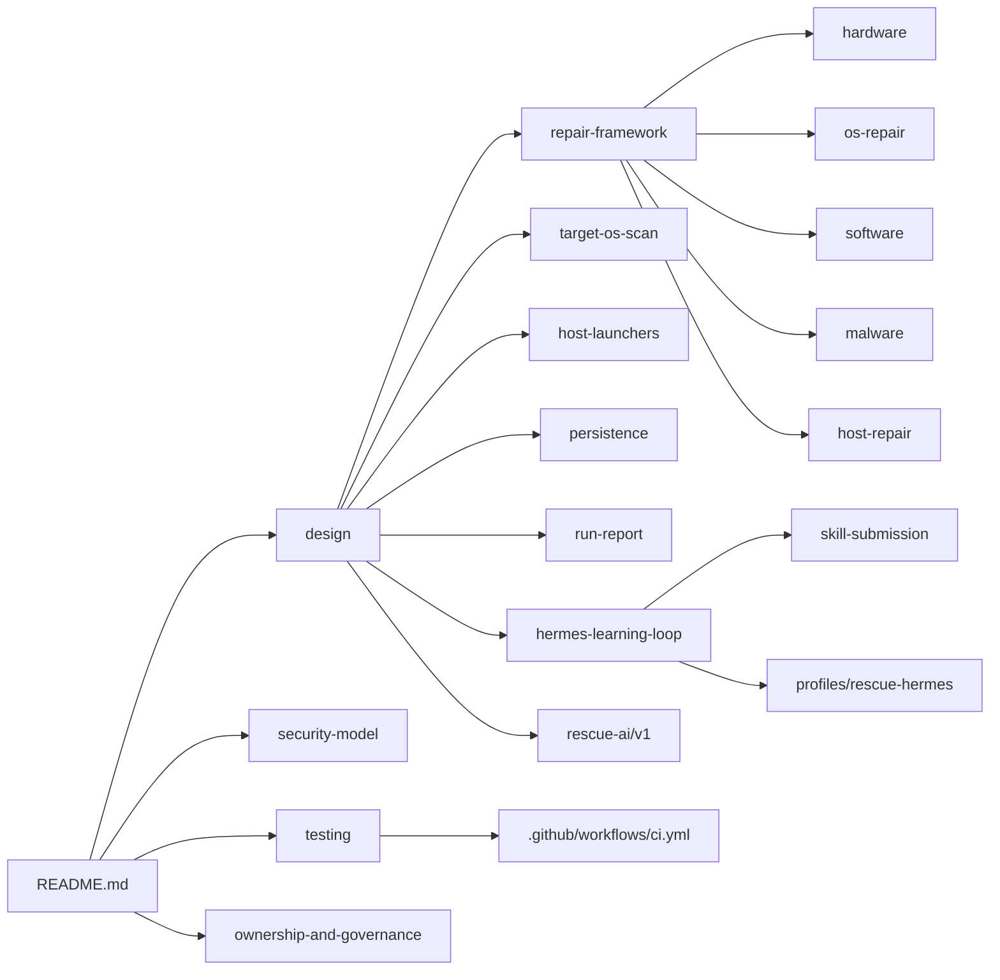

# Linux Mint XFCE Rescue AI

Bootable USB rescue toolkit with a dedicated **Hermes Rescue profile** and cloud AI default:

- Provider: OpenCode Go via OpenAI-compatible endpoint
- Model: `mimo-v2.6-flash`
- OpenCode model ID: `opencode-go/mimo-v2.6-flash`
- Hermes route: `custom` + `https://opencode.ai/zen/go/v1`

The toolkit runs read-only diagnostics (hardware, operating systems, installed software, malware), sanitizes the results into numbers-only evidence, and asks OpenCode Go for bounded hypotheses. A repair is only ever a typed catalog action that the operator approves; the AI can at most name an `action_id`. Everything it produces is written to the USB, and every run ends with a report.

> Managed by **ahlikoding.com** and **satpamsiber.com** from **ahliweb.com**.


## Ways to use the USB



| Mode | What happens | Guide |
|---|---|---|
| Boot from the USB (Linux Mint 22.3 XFCE live) | Hardware preflight, read-only scan of the operating systems on the internal disks, OpenCode Go analysis, catalog repairs under `--repair-policy` (default `approve-each`), run report, then Hermes. With the persistence image, Hermes and all its state live on the USB | [target OS scan](docs/target-os-scan.md), [persistence](docs/persistence.md) |
| Running Windows 10/11, macOS 12+, or Linux | Double-click `RESCUE-WINDOWS.cmd` / `RESCUE-MACOS.command`, or run `rescue-omes/host/rescue-linux.sh`. Nothing is installed on the host; evidence, analysis, repair journal, and report are written to the USB | [host launchers](docs/host-launchers.md), [host repair](docs/host-repair.md) |

## Status

Legend: **Implemented** (source level, covered by `make check`), **Hardware-required** (needs a real PC or USB), **Environment-blocked** (needs network, an API key, or provider spend), **Planned** (design only). See [testing](docs/testing.md).

| Area | Status | Details |
|---|---|---|
| Hermes profile, installer, launcher, health check, XFCE autostart | Implemented; the reboot itself is Hardware-required; the provider probe is Environment-blocked | this file, [design](docs/design.md) |
| Evidence collector and validator, schema 1.2, config parser | Implemented | [design](docs/design.md), [security model](docs/security-model.md) |
| Ventoy download, install, preparation, signer-pinned ISO check | Implemented; the USB write and the physical boot are Hardware-required | [below](#prepare-an-existing-ventoy-usb) |
| Persistence image with Hermes pre-installed | Implemented (needs docker and network); boot with persistence is Hardware-required | [persistence](docs/persistence.md) |
| Hardware readiness preflight | Implemented; meaningful only on the target PC | [design](docs/design.md#hardware-readiness-gate) |
| Live USB scan of the internal disks and cloud analysis | Implemented; real disks are Hardware-required, the cloud call is Environment-blocked | [target OS scan](docs/target-os-scan.md) |
| Detection: hardware, OS, software, malware | Implemented; real machines are Hardware-required | [hardware](docs/hardware.md), [OS](docs/os-repair.md), [software](docs/software.md), [malware](docs/malware.md) |
| Repair catalog, policy engine, hash-chained journal | Implemented; real repairs are Hardware-required | [repair framework](docs/repair-framework.md) |
| Windows, macOS, and Linux host launchers with native repairs | Implemented; real Windows 10/11 and macOS runs are Hardware-required | [host launchers](docs/host-launchers.md), [host repair](docs/host-repair.md) |
| Run report on the USB | Implemented | [run report](docs/run-report.md) |
| Candidate skill submission to GitHub Issues | Implemented; real GitHub calls are Environment-blocked | [skill submission](docs/skill-submission.md) |
| Live cloud smoke test (`test-hermes-conversation.sh --live`) | Environment-blocked | [testing](docs/testing.md) |
| Candidate memory, operator feedback labels, regression evaluation, signed promotion | Planned | [learning loop](docs/hermes-learning-loop.md) |
| Hardware boot matrix (Pi 5, x86, UEFI/BIOS) | Hardware-required | [testing](docs/testing.md) |

## Important boot limitation



Plugging in a USB flash drive does not force a PC to boot from it. The PC firmware must support USB boot and the operator must select the USB from the boot menu or change the boot order. Secure Boot may require a one-time key enrollment on each new machine; see [Secure Boot first boot](docs/secure-boot.md). This repository does not silently erase disks, install Ventoy, or manufacture an ISO; those actions are explicit and operator-confirmed.

## Quick start: boot from the USB (with the persistence image)



1. Install Ventoy on the USB and verify the ISO (see [Prepare an existing Ventoy USB](#prepare-an-existing-ventoy-usb)).
2. Build the image and copy everything to the USB (needs `docker`; details and credential risks in [persistence](docs/persistence.md)):

```bash
scripts/build-persistence.sh --iso /path/linuxmint-22.3-xfce-64bit.iso \
  --output /path/rescue-omes-casper-rw.dat --no-provision-secrets --installer-sha256 HEX
scripts/prepare-ventoy-usb.sh --ventoy-mount /mnt/ventoy --mint-iso /path/linuxmint-22.3-xfce-64bit.iso \
  --sha256sums sha256sum.txt --signature sha256sum.txt.gpg \
  --no-provision-secrets --persistence /path/rescue-omes-casper-rw.dat
```

3. Boot the PC from the USB. The autostart entry opens `xfce4-terminal` and runs `launch-hermes-rescue.sh --hardware-mode auto`; the result is in `<state-dir>/reports/` (`run-<utc>/report.md`, plus the local launcher log `launcher-<utc>.log`, `0600`). The network is advisory: if Wi-Fi is not connected yet, the launcher waits up to about 60 s, then asks (bilingual) to connect and press Enter, or type `L` to continue offline. Offline runs the local read-only scan, the catalog repairs under your policy, and the run report, skips the OpenCode Go analysis and Hermes, and tells you where the report is; run "Hermes Rescue AI" from the application menu once online. A non-zero exit never closes the window silently (see [persistence](docs/persistence.md#autostart-offline-dan-log)). Without a provisioned key, enter `OPENCODE_GO_API_KEY` in the live session; it is stored in the persistence image, so the USB is then credential-bearing.

## Quick start: live Linux Mint XFCE session (no persistence image)

```bash
cp config/rescue.env.example config/rescue.env
chmod 600 config/rescue.env
$EDITOR config/rescue.env   # set OPENCODE_GO_API_KEY; never commit it

# Run as the desktop user, NOT with sudo: the installer refuses root and uses sudo internally.
./scripts/install-hermes-rescue.sh \
  --state-dir /media/$USER/RESCUE-STATE/hermes-state

./scripts/check-hermes-rescue.sh \
  --state-dir /media/$USER/RESCUE-STATE/hermes-state

./scripts/launch-hermes-rescue.sh \
  --state-dir /media/$USER/RESCUE-STATE/hermes-state
```

The installer creates an isolated `HERMES_HOME`, installs the profile and every skill, installs a runtime bundle (`scripts`, `rescue-ai`, `profiles`, `docs`, config templates) to `/usr/local/lib/rescue-omes` (`--prefix`), symlinks `launch-hermes-rescue.sh`, `check-hermes-rescue.sh`, and `rescue-malware-quarantine` into `/usr/local/bin` (`--bin-dir`), and creates the XFCE autostart entry (`--no-autostart` skips it, `--skip-hermes-install` skips the Hermes download). For an unpinned Hermes download it prints a warning; pass `--installer-sha256 HEX` (or set `HERMES_INSTALLER_SHA256`) to verify it before execution. It writes `<state-dir>/hermes/env` as `KEY='value'` lines with mode `0600` and preserves an existing key on re-runs. The state directory must be on a writable persistent partition if memory and sessions should survive reboot; use a separate encrypted writable storage device.

The launcher runs the hardware preflight (2 logical CPUs, 4 GiB RAM, a display adapter, an IP route plus DNS/HTTPS, an 8 GiB USB live medium; change with `--min-cpu`, `--min-ram-gib`, `--min-usb-gib`; `--hardware-mode wizard` asks at every step), scans the internal disks, analyzes, offers repairs, writes the run report, and then starts Hermes. `fail` or `unknown` on a required preflight check stops it. The report is `<state-dir>/reports/hardware-readiness-YYYYMMDD-HHMMSS.json`; a physically unverified firmware boot is only a warning because software cannot prove which medium the firmware booted.

## Quick start: Windows, macOS, and Linux host

Plug the USB into the running computer. Nothing is installed on the host and there is no AutoRun: one double-click by the operator is the approval point.

| OS | Run | Notes |
|---|---|---|
| Windows 10/11 | Double-click `RESCUE-WINDOWS.cmd` on the USB | No admin rights requested; SmartScreen guidance in [host launchers](docs/host-launchers.md) |
| macOS 12+ (Intel and Apple Silicon) | Double-click `RESCUE-MACOS.command` | Built-in tools only; Gatekeeper guidance in [host launchers](docs/host-launchers.md) |
| Linux / Linux Mint (running system) | `/media/$USER/<USB>/rescue-omes/host/rescue-linux.sh` | Needs `python3` and `python3-jsonschema` |

Useful flags on all three: `--evidence-only` / `--dry-run` (no cloud call), `--scope`, `--packages`, `--repair-policy` (Windows uses `-EvidenceOnly`, `-DryRun`, `-Scope`, `-Packages`, `-RepairPolicy`). Output is in `rescue-omes/reports/`. Repair flags for Windows and macOS are in [host repair](docs/host-repair.md).

## Scope and repair policy

`--scope` selects what is examined: `all` (default), `hardware` or `hardware.cpu|memory|disk|gpu|display|network|battery|usb`, `os`, `software`, `software.selected` (with `--packages a,b`), and `malware`. Areas outside the scope are never reported as healthy. `--repair-policy` is `detect-only`, `approve-each` (default: every action needs your approval, destructive actions need a `--backup-ref` and the typed `action_id`), or `auto-safe` (opt-in; only `safe` catalog-trigger actions). Repairs are typed catalog actions in `rescue-ai/v1/catalog/` executed by `scripts/rescue-repair.py` (live USB and Linux host) or natively by the Windows and macOS launchers, and recorded in a hash-chained journal on the USB. Full contract: [repair framework](docs/repair-framework.md).

## Prepare an existing Ventoy USB



Install Ventoy to the confirmed USB first (`scripts/download-ventoy.sh`, then `scripts/install-ventoy-usb.sh`; see the checklist below). Then mount its data partition (label `Ventoy`). `verify-mint-iso.sh` requires the signature on `sha256sum.txt` to come from the Linux Mint signing key `27DEB15644C6B3CF3BD7D291300F846BA25BAE09` (override only with `--signer-fingerprint` after out-of-band verification; `--gpg-homedir DIR` for an isolated keyring). Import that key first, following the [Linux Mint verification guide](https://linuxmint.com/verify.php):

```bash
gpg --keyserver hkp://keyserver.ubuntu.com:80 --recv-key "27DE B156 44C6 B3CF 3BD7  D291 300F 846B A25B AE09"
```

Then run:

```bash
./scripts/prepare-ventoy-usb.sh \
  --ventoy-mount /media/$USER/VENTOY \
  --mint-iso /path/to/linuxmint-xfce.iso \
  --sha256sums /path/to/sha256sum.txt \
  --signature /path/to/sha256sum.txt.gpg
```

Before preparation, the operator creates a local ignored `.env` beside the repository:

```dotenv
OPENCODE_GO_API_KEY='operator-provided-secret'
```

The rescue bundle is copied from an allowlist (`AGENTS.md`, `LICENSE`, `Makefile`, `README.md`, `CHANGELOG.md`, `VERSION`, the two `config/` templates, `docs`, `host`, `profiles`, `rescue-ai`, `scripts`, `tests`), so `.env`, `config/rescue.env`, `.git`, ISOs, images, and archives are never written to the USB. The host launchers are also copied to the USB root. Secret provisioning is a separate, explicit step: by default the helper reads `.env` without executing it and writes only `OPENCODE_GO_API_KEY` to the USB's `config/rescue.env` (mode `0600` requested; FAT/exFAT may not enforce it), which makes the USB credential-bearing. Pass `--no-provision-secrets` to keep the key off the USB, `--env-file FILE` for another dotenv source, `--bundle-only DEST` to copy just the bundle into a new or empty directory for inspection, `--menu-timeout 0` for immediate Ventoy selection, and `--no-auto-boot`/`--manual-menu` to keep a manual Ventoy menu. The helper never installs Ventoy and never writes a raw disk. `--persistence FILE.dat` adds a persistence image ([persistence](docs/persistence.md)).

### End-to-end checklist

1. Identify the removable USB with `lsblk -o NAME,PATH,RM,SIZE,MODEL,TRAN,MOUNTPOINTS`. Do not use `/dev/sda` or any disk with mounted children. Run `./scripts/download-ventoy.sh [--version X.Y.Z]` (one release API call; refuses to continue without a SHA-256 digest), extract the archive, then `./scripts/install-ventoy-usb.sh --device /dev/sdX --ventoy-dir ./ventoy-X.Y.Z --yes` only after reviewing the displayed model and size. It refuses a mounted disk, a non-whole-disk target, and the disk backing `/`, and calls `sudo` itself. **Hardware-required.**
2. Download Linux Mint XFCE plus `sha256sum.txt` and `sha256sum.txt.gpg` from the same official mirror, import the Linux Mint key, and verify with `scripts/verify-mint-iso.sh --iso ... --sha256sums ... --signature ...`.
3. Mount the first Ventoy partition and run `scripts/prepare-ventoy-usb.sh` (optionally with `--persistence`).
4. On the target PC, select the USB in the UEFI/BIOS boot menu. Ventoy then auto-selects the Linux Mint XFCE ISO; the firmware selection itself cannot be automated.
5. In the live desktop, open a terminal in the copied `rescue-omes` directory and follow the live-session quick start (skip it with the persistence image: Hermes is already installed).
6. Run `./scripts/test-hermes-conversation.sh --state-dir ... --live` only after approving a real cloud request; without `--live` it is a no-cost dry run. **Environment-blocked.**
7. Run `./scripts/verify-autostart.sh --state-dir ...`, reboot from the live environment, log in to XFCE, and verify the launcher with `pgrep -af hermes`. A physical reboot is required. **Hardware-required.**

## Configuration file format

`config/rescue.env` (source tree) and `<state-dir>/hermes/env` (installed state) are read by `scripts/lib/rescue-env.sh`. They are data, never executed: one `[export ]KEY=VALUE` per line, `#` comments and blank lines ignored, values unquoted, `'single'`, or `"double"` quoted. Only these keys are read; all others are ignored:

| Key | Purpose |
|---|---|
| `OPENCODE_GO_API_KEY` | OpenCode Go credential (secret) |
| `RESCUE_STATE_DIR` | Default state directory when `--state-dir` is not given |
| `HERMES_HOME` | Isolated Hermes home (written by the installer) |
| `OPENCODE_ADAPTER_COMMAND` | Operator-chosen adapter run by `analyze-opencode-go.sh` |
| `OPENCODE_TIMEOUT_SECONDS` | Adapter and analyzer timeout, positive integer (default `120`) |
| `RESCUE_GITHUB_ISSUES_TOKEN` | Fine-grained token (Issues read/write on this repository only) for `submit-skill.py` (secret); never given to Hermes |

Unquoted or double-quoted `$` and backticks make a line invalid: it is skipped with a warning and nothing is expanded. Variables already set in the environment are not overridden. A missing file is fine; a world-writable file is refused. Credentials are not stored in this repository or in evidence. OpenCode Go documents the model as `MiMo-V2.6-Flash` with model ID `mimo-v2.6-flash`; availability and plan limits can change, so `check-hermes-rescue.sh` verifies the configured ID and endpoint but never invents a fallback provider.

## Security boundary



Threats and controls are tabulated in the [security model](docs/security-model.md). Hermes has a separate rescue profile and must not reuse the operator's personal `~/.hermes` directory. Default actions are read-only. Logs are untrusted data and cannot issue commands. Model output is only displayed and saved. Skills are versioned and candidate learning is not promoted without verification and approval.

## Development checks

Run `make check`: syntax (`bash -n`, `py_compile`, the repair catalog validator, and the launcher parse checks), `shellcheck -x`, fixture validation (evidence and run report), the documentation check (`make docs`), `python3 -m unittest discover -s tests`, and `git diff --check`. CI runs the same gate. Physical boot, Ventoy write, reboot autostart, and live cloud calls are outside it; see [testing](docs/testing.md).

## Governance and licensing

This project is managed by **ahlikoding.com** and **satpamsiber.com** from **ahliweb.com**. See [ownership and governance](docs/ownership-and-governance.md), [agent instructions](AGENTS.md), and the [MIT License](LICENSE). The current version is in `VERSION` (`0.4.1`); changes are in the [changelog](CHANGELOG.md).

## Documentation map



- [Rescue design](docs/design.md), [security model](docs/security-model.md), [testing and verification](docs/testing.md)
- [Persistence image with Hermes pre-installed](docs/persistence.md), [target OS scan](docs/target-os-scan.md)
- [Repair framework (scope, catalog, policy, journal)](docs/repair-framework.md)
- [Hardware](docs/hardware.md), [OS repair](docs/os-repair.md), [installed software](docs/software.md), [malware](docs/malware.md)
- [Host launchers](docs/host-launchers.md), [repairs from the Windows and macOS launchers](docs/host-repair.md)
- [Run report](docs/run-report.md), [candidate skill submission](docs/skill-submission.md), [Hermes learning loop](docs/hermes-learning-loop.md)
- [Hermes profile](profiles/rescue-hermes/), [changelog](CHANGELOG.md), [agent instructions](AGENTS.md)
- [OpenCode Go documentation](https://opencode.ai/docs/go), [Hermes provider documentation](https://hermes-agent.nousresearch.com/docs/integrations/providers)
