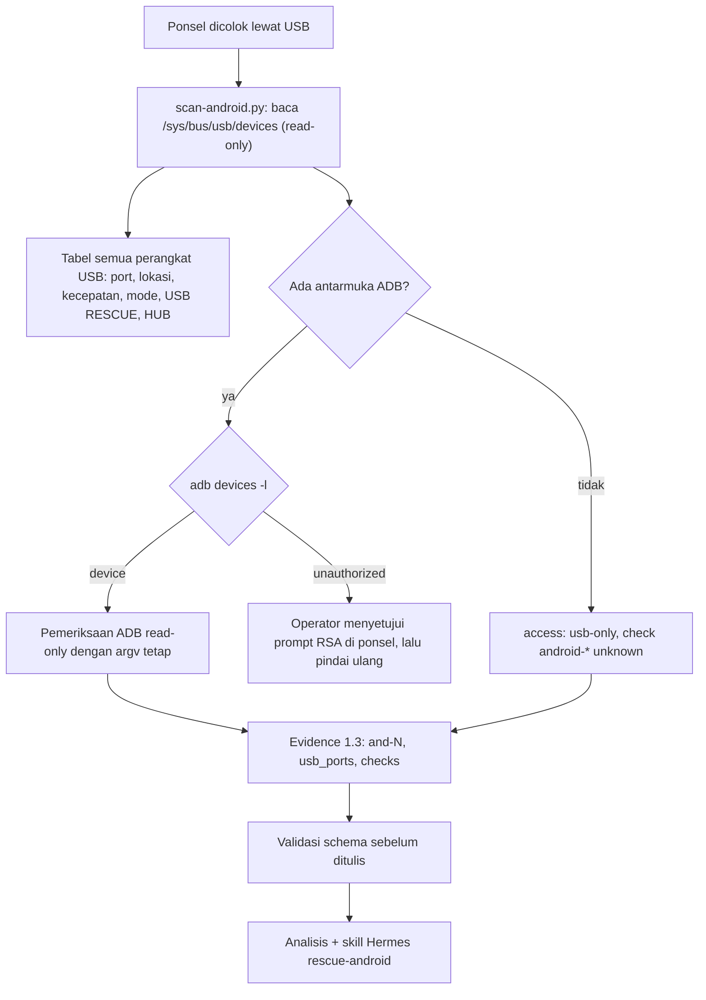

# Android (ponsel/tablet via USB)

> Managed by **ahlikoding.com** and **satpamsiber.com** from **ahliweb.com**.

Perangkat Android (smartphone atau tablet) yang dicolok lewat USB ke PC yang menjalankan USB rescue dapat menjadi **target** pemeriksaan: toolkit mendaftar semua perangkat USB, menunjukkan **port USB** mana yang dipakai ponsel (dan mana yang USB rescue itu sendiri), lalu menjalankan pemeriksaan ADB **read-only** bila USB debugging aktif dan disetujui. Isu: ahliweb/linux-mint-xfce-rescue-ai#48. Label status: **Implemented** (level source, dicakup `make check`), **Planned**, **Hardware-required** (butuh PC dan ponsel nyata), **Environment-blocked**. Lihat [testing](testing.md).

## Lingkup

| Bagian | Status |
|---|---|
| Inventaris USB read-only dari sysfs (tanpa kerja sama ponsel): port, kecepatan, lokasi fisik ACPI, penanda hub dan USB rescue, kelas, merek, mode Android | Implemented |
| Target keluarga `android` (`and-N`) dengan id opak (hash berkunci, bukan serial) di evidence schema 1.3 | Implemented |
| Pemeriksaan ADB read-only (versi, patch, verified boot, SELinux, penyimpanan, baterai, indikator root, admin perangkat, aksesibilitas, aplikasi non-store, Play Protect) | Implemented |
| Tindakan perbaikan katalog untuk Android (`rescue-ai/v1/catalog/android.json`, parameter `android_device`) dan pemasangan ke launcher | **Planned** (fase 2) |
| Flashing, unbrick, `fastboot flash`, EDL, Odin, buka/kunci bootloader, root, factory reset | **Di luar lingkup**: hanya mode-mode itu yang *dideteksi* |
| Uji dengan ponsel dan PC nyata (port fisik, prompt RSA, ACPI `_PLD` asli) | Hardware-required |



## Mode koneksi yang didukung

Mode dikenali hanya dari pasangan `vendor:product` dan triplet kelas/subkelas/protokol antarmuka USB (tidak ada string yang dibaca).

| Mode (`android_mode`) | Dikenali dari | Catatan |
|---|---|---|
| `adb` | antarmuka `ff/42/01` | USB debugging aktif (belum tentu disetujui). Recovery dan sideload juga tampil sebagai `adb`: tidak dapat dibedakan dengan andal |
| `fastboot` | antarmuka `ff/42/03` | Bootloader; hanya dideteksi |
| `mtp-ptp` | antarmuka `06/01/01` | MTP dan PTP memakai triplet yang sama; dilaporkan jujur sebagai `mtp-ptp`. Dianggap ponsel hanya bila vendornya ada di tabel merek (kamera dengan PTP tidak dianggap ponsel) |
| `rndis` | `e0/01/03` atau `ef/04/01` | Tethering USB. Tidak pernah cukup untuk menyebut perangkat sebagai Android (modem LTE juga memakainya) |
| `qualcomm-edl` | `05c6:9008` | Emergency Download; biasanya ponsel mati total atau sengaja dimasukkan ke EDL |
| `mediatek-brom` | `0e8d:2000` (preloader), `0e8d:0003` (BROM) | Preloader juga muncul beberapa detik pada setiap start normal ponsel MediaTek |
| `samsung-download` | `04e8:685d` | Download/Odin |
| `spreadtrum-download` | `1782:4d00` | Unisoc/Spreadtrum download |
| `none` | selain di atas | Perangkat USB biasa |

**Ponsel yang hanya mengisi daya tidak terlihat sama sekali.** Kabel charge-only (tanpa jalur data), port yang hanya menyuplai daya, atau ponsel dengan "Hanya mengisi daya" tidak menampilkan perangkat USB; tidak ada alat USB yang dapat mendeteksinya. Telepon dengan MTP vendor-spesifik (`ff/ff/00`, hanya dikenali lewat string deskriptor) tanpa ADB juga tidak dikenali sebagai Android karena toolkit tidak membaca string. Merek berasal dari tabel `vendor ID` kecil (Google, Samsung, Xiaomi, OPPO/Realme, vivo, Huawei, Motorola, LG, Sony, OnePlus, Qualcomm, MediaTek, Lenovo, ASUS, ZTE, HTC, HMD/Nokia, Unisoc, Meizu); lainnya `other`. Satu ID dapat dipakai beberapa merek, jadi merek hanyalah petunjuk.

## Identifikasi port USB

`python3 scripts/scan-android.py --list-usb` mencetak tabel dwibahasa semua perangkat USB (tanpa root, tanpa jaringan):

| Kolom | Sumber |
|---|---|
| PORT | nama entri `/sys/bus/usb/devices/<bus>-<port>[.<port>]*` (pola `^[0-9]{1,3}-[0-9]{1,3}(\.[0-9]{1,3}){0,6}$`; antarmuka `N-N:C.I` dan root hub `usbN` dilewati) |
| KECEPATAN, USB | `speed` (Mbps: 1.5, 12, 480, 5000, ...) dan `version` |
| LOKASI | `<dev>/port/physical_location/{panel,horizontal_position,vertical_position}` dan `port/connect_type` bila firmware (ACPI `_PLD`) menyediakannya; `internal` untuk perangkat `hardwired`; `-` bila tidak ada data (banyak PC tidak mengisinya) |
| KELAS | `bDeviceClass` dan kelas antarmuka (`mass-storage`, `hid`, `hub`, `vendor-specific`, ...) |
| MEREK, MODE ANDROID | tabel vendor ID dan triplet antarmuka (di atas) |
| TANDA | `[USB RESCUE]`, `[HUB]`, dan `[and-N]` untuk target Android |

Kedalaman hub (`hub_depth`) adalah jumlah hub di antara root hub dan perangkat (`3-2.1` ada di belakang satu hub). USB rescue ditandai `[USB RESCUE]` bila perangkat itu menopang medium live (mount `/cdrom`, `/run/live/medium`, atau `/isodevice` dari `/proc/self/mountinfo`; tumpukan device-mapper Ventoy diikuti sampai disk di bawahnya) atau partisi berlabel `Ventoy`/`VTOYEFI` (`/dev/disk/by-label`). Hanya dibaca; tidak ada perintah yang dijalankan. Contoh keluaran:

```
Ponsel and-0 terdeteksi di port 3-2.1 (panel kiri, sisi kiri, 480 Mbps), merek samsung, mode ADB.
(Phone and-0 detected on port 3-2.1 (left panel, left side, 480 Mbps), brand samsung, mode ADB.)
```

Bila tidak ada ponsel, tabel diikuti petunjuk: kabel charge-only, pilih "Transfer file (MTP)", aktifkan Opsi pengembang (Pengaturan > Tentang ponsel > ketuk Nomor build 7 kali) lalu USB debugging, colok langsung tanpa hub. Layar operator boleh menampilkan **merek dan port**, tidak pernah serial.

## Alur otorisasi ADB

1. Ponsel: aktifkan Opsi pengembang dan **USB debugging**, colok kabel data, buka kunci layar.
2. `scan-android.py` memanggil `adb devices -l`. Status `unauthorized` berarti ponsel belum menerima komputer ini: ponsel menampilkan prompt "Izinkan USB debugging?" (sidik jari kunci RSA). Operator menyetujuinya (opsional "Selalu izinkan dari komputer ini"), lalu pindai ulang. Kunci ADB tinggal di `~/.android` sesi live (volatil) sehingga prompt muncul lagi di sesi berikutnya; USB debugging sebaiknya dimatikan setelah perbaikan.
3. Setiap perangkat dialamatkan dengan `adb -t <transport_id>` (bilangan bulat dari `adb devices -l`), sehingga serial tidak pernah masuk argv yang kita bentuk. Setiap perintah adalah tuple argv tetap, dengan batas waktu 20 detik, `stdin` dari `/dev/null`, keluaran dibaca paling banyak 4 MiB, dan penemuan mDNS dimatikan (`ADB_MDNS=0`). `adb` memakai server localhost `127.0.0.1:5037`; pada sesi live server yang dimulai pemindaian dihentikan (`adb kill-server`) di akhir, di mode host server milik operator dibiarkan.
4. Status ADB lain (`offline`, `recovery`, `sideload`, `bootloader`, `no permissions`) menghasilkan `access: adb-unavailable` dan check `unknown`. Paket `adb` dan aturan udev (`android-sdk-platform-tools-common`) disediakan oleh [persistence](persistence.md); tanpa `adb` check ADB `unknown`.

Tidak pernah dijalankan: `adb root`, `install`, `push`, `pull`, `sideload`, `reboot`, `unlock`, `fastboot flash`, string shell yang dibentuk dari data, atau perintah dari keluaran model.

## Check yang dihasilkan

Check lingkungan (tanpa `target_ref`): `usb-device-count` (angka perangkat non-hub; `pass`) dan `usb-android-device-count` (angka perangkat Android; `warn` bila 0). Check per target memakai source `collector-allowlist` dan `target_ref` `and-0`..`and-7` (urutan menurut port, jadi nomor stabil selama ponsel tidak dipindah). Hanya status dan angka terbatas; `unknown` bila nilai tidak terbaca, dan semua check turunan ADB `unknown` bila `access` bukan `adb-authorized`.

| Check | Nilai | Status |
|---|---|---|
| `android-connection-mode` | - | `pass`: ADB disetujui. `warn`: `unauthorized`/`offline`/`recovery`/`sideload`/`bootloader`, mode tingkat rendah (fastboot, EDL, download), atau terlihat di USB tanpa ADB. `unknown`: `adb` tidak ada dan mode butuh ADB |
| `android-os-version` | `count` = API level (SDK) | `pass` 33+, `warn` 29-32, `fail` di bawah 29 |
| `android-security-patch-age` | `days` sejak `ro.build.version.security_patch` | `pass` sampai 90, `warn` di atas 90, `fail` di atas 365 (memakai jam PC; tanggal patch di masa depan dihitung 0) |
| `android-verified-boot` | - | `ro.boot.verifiedbootstate`: `green` `pass`, `yellow`/`orange` `warn`, `red` `fail` |
| `android-bootloader-lock` | - | `ro.boot.flash.locked`/`ro.boot.vbmeta.device_state`: terkunci `pass`, tidak terkunci `warn` |
| `android-selinux` | - | `getenforce`: `Enforcing` `pass`; `Permissive`/`Disabled` `fail` |
| `android-storage-free` | `percent` bebas di `/data` (`df /data`) | `warn` di bawah 10, `fail` di bawah 3 |
| `android-battery-level` | `percent` | `warn` di bawah 20, `fail` di bawah 10, kecuali sedang mengisi (`pass`) |
| `android-battery-health` | - | kode `dumpsys battery`: 2 baik `pass`; 3 panas berlebih, 4 mati, 5 tegangan berlebih `fail`; 6 gagal tak ditentukan, 7 dingin `warn` |
| `android-battery-temperature` | `celsius` bulat | `warn` 40 ke atas, `fail` 45 ke atas; di bawah 0 `warn` tanpa angka |
| `android-root-indicators` | - | `warn` bila `su` ada di jalur standar (`which su`, `ls -d` pada jalur tetap) atau `ro.debuggable=1`; `pass` hanya berarti tidak ada indikator standar (root dapat disembunyikan) |
| `android-device-admin-count` | `count` admin perangkat aktif | `pass` 0-2, `warn` 3 ke atas (jumlah saja, tanpa nama) |
| `android-accessibility-services-count` | `count` layanan aksesibilitas aktif | `warn` bila lebih dari 0 (jalur umum adware/malware; jumlah saja) |
| `android-unknown-sources-count` | `count` paket pihak ketiga yang tidak dipasang oleh toko (installer `null`, `adb`, atau pemasang paket) | `warn` bila lebih dari 0 (nama paket tidak pernah dikeluarkan) |
| `android-play-protect` | - | `warn` bila `package_verifier_user_consent=-1` atau `package_verifier_enable=0`; `pass` bila disetujui; `unknown` bila tidak ada (misalnya tanpa layanan Google) |
| `android-developer-options` | - | `not_applicable` (`development_settings_enabled=1`): wajib aktif agar pemindaian ini dapat berjalan, bukan temuan; `pass` bila 0 |
| `android-usb-port-speed` | - | `warn` bila ponsel bernegosiasi di bawah 480 Mbps (kabel atau port bermasalah); `unknown` bila port tidak diketahui |

Ambang di atas adalah heuristik dan hanya bergantung pada angka; hasil `pass` bukan bukti ponsel sehat atau bersih dari malware.

## Evidence schema 1.3

- `target_systems[]`: `family: android`, `ref: and-N`, `detection: usb-adb | usb-enumerated`, `access: adb-authorized | adb-unauthorized | adb-unavailable | usb-only`, `release: Android 14` (angka versi saja), `architecture`, `encryption: unknown`, plus `opaque_id` dan `usb_port`.
- `usb_ports[]` (maks. 64): `port`, `speed_mbps`, `usb_version`, `hub_depth`, `is_hub`, `is_boot_media`, `android_mode`, `android_modes`, `vendor_brand` (enum tertutup), `panel`, `horizontal_position`. Tanpa string bebas, `vendor:product`, atau serial; `additionalProperties: false`.
- Check ID baru: 17 `android-*` ditambah `usb-device-count` dan `usb-android-device-count`. Jenis nilai tidak bertambah (`count`, `percent`, `days`, `celsius`).
- `target_device_opaque_id` adalah `opaque_id` ponsel bila tepat satu target Android, selain itu id mesin seperti kolektor lain. Skema 1.0-1.2 menolak semua bidang 1.3 (aturan semantik `scripts/validate-evidence.py`).
- Fixture: `rescue-ai/v1/fixtures/valid-android-usb.json`, `invalid-android-serial.json` (serial diselundupkan ke `usb_ports`), `invalid-1.3-fields-in-1.2.json`.

## Privasi

| Data | Perlakuan |
|---|---|
| Serial USB (= serial Android), string pabrikan/produk, nama akun, nama paket, nomor telepon, IMEI, alamat MAC Wi-Fi/Bluetooth | **Tidak pernah** masuk evidence, laporan, journal, permintaan analyzer, issue, skill, atau layar. Hanya properti `ro.*` dalam allowlist, hitungan, dan angka terbatas yang dipertahankan; sisanya dibuang saat diurai |
| Identitas target | `opaque_id` = `target-` + 16 hex pertama HMAC-SHA256 serial dengan kunci dari `/etc/machine-id` mesin (tidak pernah dikeluarkan). Serial tebakan tidak dapat dicocokkan dari evidence; id stabil untuk ponsel yang sama di PC yang sama sehingga pemindaian sebelum/sesudah dapat dibandingkan. Tanpa serial dipakai port dan `vendor:product` |
| `vendor:product` | Tidak ada di evidence; hanya `vendor_brand` dari enum tertutup |
| Layar operator | Merek dan port boleh, serial tidak |
| Keluaran `adb` | Data tak tepercaya: diurai ke himpunan status tertutup dan angka terbatas lalu dibuang |

## Model ancaman dan batas

Ponsel adalah peer USB yang tidak tepercaya: ia dapat menjawab perintah dengan data sembarang, keluaran tak terbatas, atau tidak menjawab. Karena itu semua panggilan memakai batas waktu dan batas ukuran, keluaran tidak pernah dijadikan perintah, dan hasil hanya status tertutup. Lihat [security-model](security-model.md).

- Butuh ponsel dan PC nyata: aturan udev, prompt RSA, ACPI `_PLD`, dan berbagai versi `adb` adalah **Hardware-required** dan tidak diverifikasi `make check` (uji memakai pohon sysfs palsu dan `adb` palsu).
- Android sebelum 8 atau ROM khusus dapat mengubah format `dumpsys`/`pm`; bidang yang tidak terbaca menjadi `unknown`.
- Enkripsi tidak dilaporkan (`encryption: unknown`); pemindaian tidak membuka kunci layar dan tidak mengakses data pengguna.
- Perangkat tanpa data USB (hanya mengisi daya) dan MTP vendor-spesifik tanpa ADB tidak terdeteksi.
- Keluaran model tidak pernah dijalankan; skill Hermes [`rescue-android`](../profiles/rescue-hermes/skills/rescue-android/SKILL.md) memandu diagnosis read-only dan melarang flashing, unlock, root, factory reset, pemasangan APK, dan pencetakan serial.

## Planned (fase 2, belum diimplementasikan)

Dirancang, **belum ada**: katalog tindakan Android yang aman dan dapat dibalik (`rescue-ai/v1/catalog/android.json`) yang dijalankan hanya oleh mesin perbaikan Python lewat parameter bertipe `android_device` (di-resolve mesin dari urutan `and-N`, tidak pernah dari evidence atau model), dengan argv tetap dan persetujuan per tindakan; serta pemasangan pemindaian ke launcher live dan host. Lihat [repair-framework](repair-framework.md) untuk kontrak mesin yang akan dipakai.
