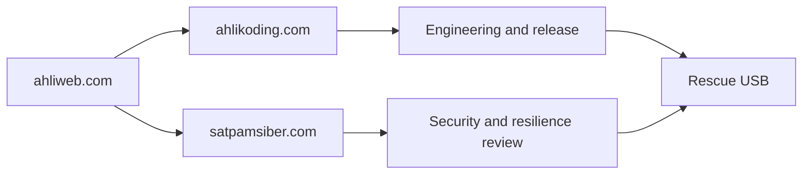
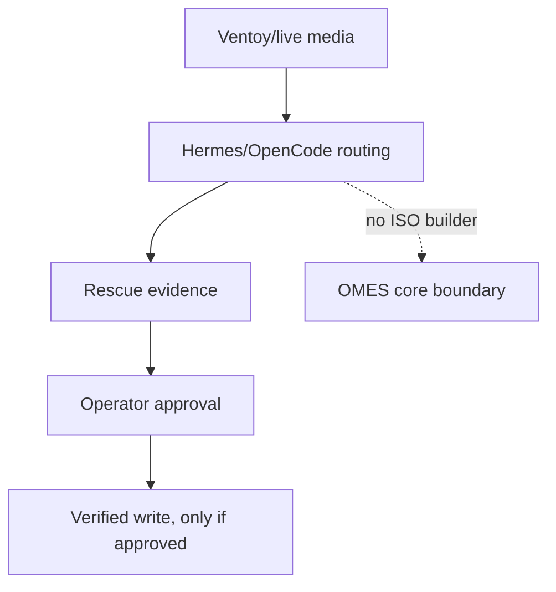
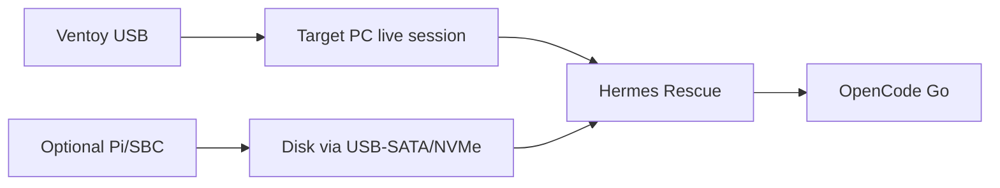
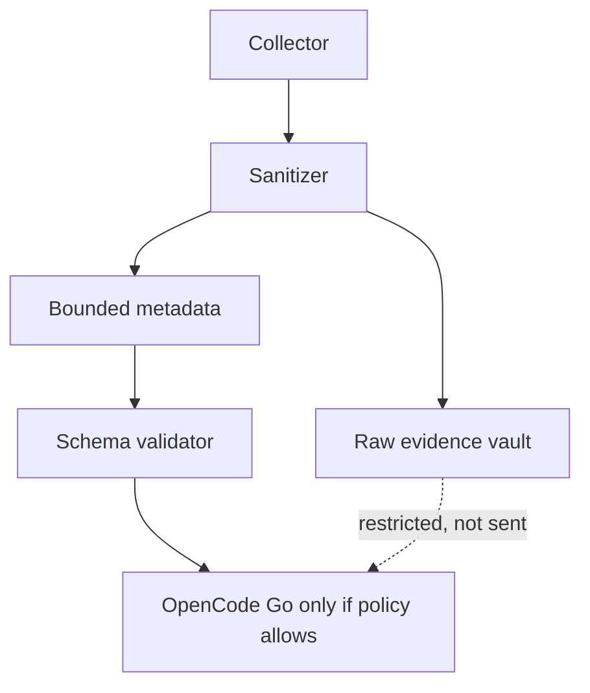
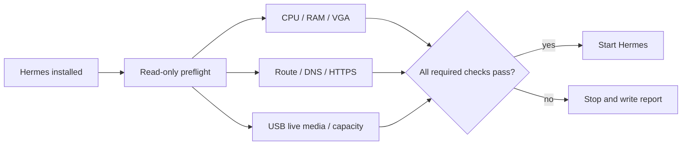
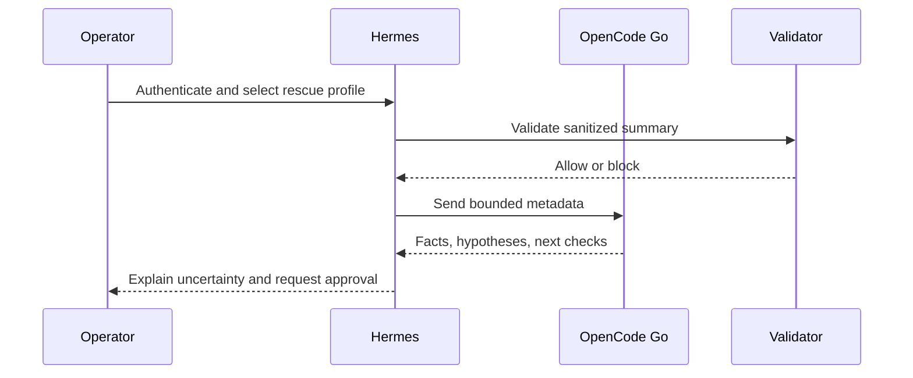
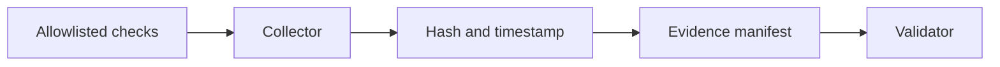
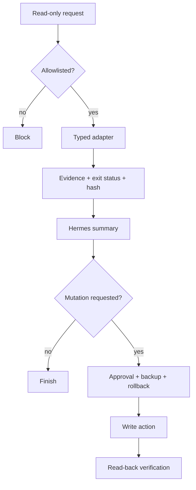
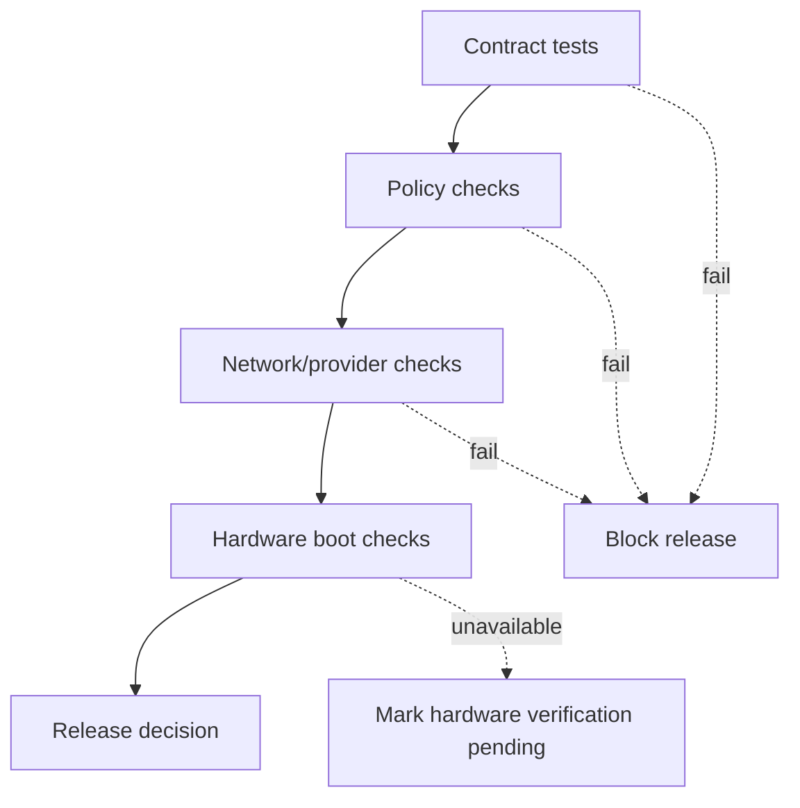
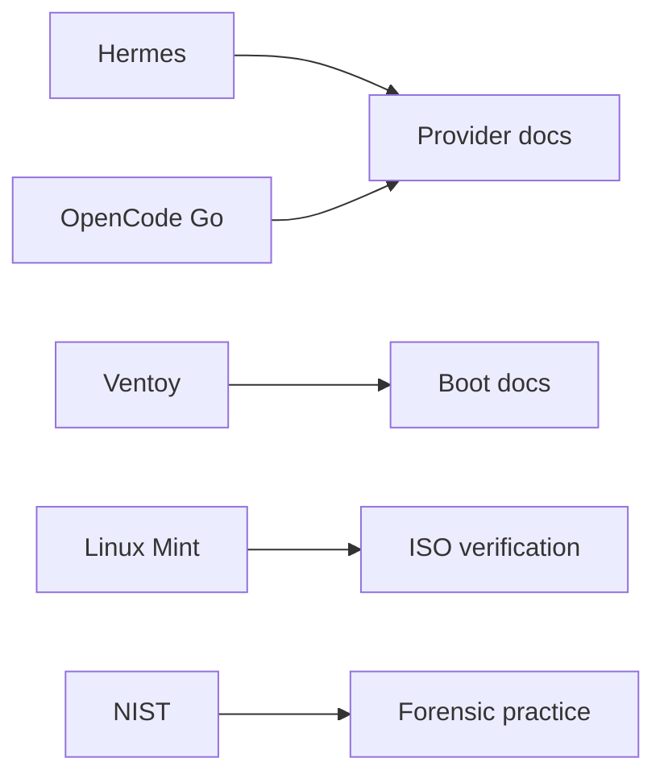

# Standalone Linux Mint XFCE Rescue AI companion

> Managed by **ahlikoding.com** and **satpamsiber.com** from **ahliweb.com**.
> This repository is standalone. It does not modify the `ahliweb/omes` repository.

The companion boots from Linux Mint XFCE selected through Ventoy and runs an isolated Hermes Rescue profile. The target PC's CPU/RAM/network are used by the live session; OpenCode Go provides cloud inference.

## Boundary

The companion is an operator-run external system, not an OMES ISO or a second
agent runtime:

- **Ventoy/Linux live media** boots the affected computer or provides tools.
- **Raspberry Pi 5 8 GB or equivalent ARM64 SBC** can act as an independent
  evidence workstation when the target disk is connected through a suitable
  USB-SATA/NVMe adapter.
- **OpenCode Go** is the explicit AI provider route. Hermes/OpenCode own model
  and provider routing; OMES does not implement another LLM router.
- **OMES** owns deterministic validation, provenance, bounded evidence, and
  reconciliation. It does not build an ISO, partition disks, or silently repair
  a target system.

A USB flash drive alone cannot replace the target computer's CPU/RAM. A Pi/SBC
is a separate computer and needs its own power, storage, network, and usually a
 display or SSH path.

## Evidence contract

`rescue-ai/v1/rescue-evidence.schema.json` accepts only bounded metadata:

- source live platform, boot mode, timestamps, opaque target identifier;
- tool and release identifiers;
- allowlisted check IDs and pass/fail/warn status;
- evidence manifest count, storage class, and SHA-256;
- explicit OpenCode Go provider/model identity without credentials;
- analysis, mutation, and verification status;
- data classification and closed source references.

It rejects prompts, model responses, raw logs, credentials, private keys,
arbitrary command fields, and extra properties. Raw evidence belongs in an
operator-controlled store and must not be sent to OpenCode Go when classified
`restricted`.

## Hardware readiness gate

Before Hermes starts, `scripts/check-hardware-readiness.py` validates that the
live PC has the minimum resources needed for diagnosis: 2 logical CPUs, 4 GiB
RAM, a display adapter, working internet access for OpenCode Go, and a detected
USB live medium of at least 8 GiB. The launcher defaults to `--hardware-mode
auto`; `--hardware-mode wizard` asks for confirmation at each step. Thresholds
are explicit and configurable with `--min-cpu`, `--min-ram-gib`, and
`--min-usb-gib`.

The result is a timestamped, permission-restricted JSON report under
`<state-dir>/reports/`. A failed or unknown required check blocks Hermes and
states the observed value and minimum. Software cannot prove that a particular
firmware boot menu selected the USB, so that physical acceptance test remains a
separate warning and must be tested on real hardware.

## OpenCode Go procedure

1. Authenticate interactively with OpenCode using `/connect` and select
   **OpenCode Go**. Credentials are stored by OpenCode; never place them in a
   Ventoy partition, report, command argument, or log.
2. Run `/models` and choose an available exact model identifier. Do not assume
   that a model name remains available; record the selected `provider/model`
   identifier only.
3. Verify the network path and perform a minimal non-sensitive probe.
4. Send only a sanitized, bounded summary. Treat all logs as untrusted data and
   require the model to separate facts, hypotheses, missing evidence, and
   read-only next checks.
5. If OpenCode Go is unavailable, produce the evidence report and mark AI status
   `manual_intervention`; do not silently switch providers.

## Read-only collection contract

The future external collector should use a fixed allowlist such as:

- `lsblk -f`, `blkid`, `findmnt`;
- `dmesg`, `journalctl -b` and offline journal queries;
- `efibootmgr -v` where UEFI access is available;
- `smartctl -a` or the corresponding NVMe health query;
- non-modifying LVM/RAID/encryption discovery;
- filesystem checks in non-repair mode;
- IP, route, DNS, and HTTPS connectivity checks.

The collector must record command identity, exit status, timestamp, target
opaque ID, and manifest hash. It must never accept a command string from AI or
from a remote request. Filesystem repair, `grub-install`, NVRAM changes,
partitioning, formatting, and disk writes require a human approval gate,
backup/image reference, rollback plan, and post-action read-back verification.

## Recovery media workflow

1. Verify Ventoy and Linux Mint ISO provenance/checksums.
2. Install Ventoy only to the confirmed USB whole disk; this erases that USB.
3. Copy ISO files to the Ventoy data partition; do not write the ISO with `dd`.
4. Boot the live environment and record UEFI/Legacy and Secure Boot state.
5. Connect the affected disk read-only first. For formal forensic work, prefer a
   suitable hardware write blocker; software read-only controls have limitations.
6. If the disk has I/O errors, image to a separate destination with GNU
   ddrescue and a mapfile before attempting filesystem repair.
7. Produce bounded metadata and a separate evidence manifest.
8. Use OpenCode Go only on sanitized evidence and preserve the operator's final
   decision separately from model output.

## Implementation stages

| Stage | Deliverable | Status |
|---|---|---|
| 1 | `rescue-ai/v1` bounded schema and valid/invalid fixtures | Implemented |
| 2 | Read-only collector and evidence validator | Implemented |
| 3 | Hermes Rescue profile with OpenCode Go/MiMo-V2.6-Flash default | Implemented |
| 4 | Hermes bootstrap, isolated state, autostart, and health check | Implemented |
| 5 | Ventoy preparation helper | Implemented; requires an operator-installed Ventoy USB |
| 6 | Hardware readiness preflight with auto/wizard modes and JSON report | Implemented; physical firmware boot still requires lab test |
| 7 | Candidate learning, feedback, regression evaluation, signed promotion | Design documented; implementation next |
| 8 | Hardware boot validation on Pi 5/PC x86 and UEFI/BIOS matrix | Requires lab hardware |

## Verification requirements

Before calling the integration ready:

- `scripts/validate-evidence.py` accepts the valid fixture and rejects raw
  prompt/response/credential/arbitrary-command fixtures for the intended reason;
- validator never executes discovered files or commands;
- checksum mismatch fails closed;
- the hardware preflight produces a report with all five check IDs and blocks on
  failed or unknown required checks;
- network failure still permits evidence collection and produces
  `manual_intervention` rather than a false AI success;
- OpenCode Go provider/model identity is recorded without secrets;
- all destructive actions remain approval-required;
- architecture registry, security model, and documentation distinguish the
  staged external companion from implemented OMES code.

## References

- [OpenCode Go](https://opencode.ai/docs/go)
- [OpenCode providers](https://opencode.ai/docs/providers)
- [OpenCode CLI](https://opencode.ai/docs/cli)
- [Ventoy](https://github.com/ventoy/Ventoy)
- [Linux Mint ISO verification](https://linuxmint.com/verify.php)
- [NIST SP 800-86](https://csrc.nist.gov/pubs/sp/800/86/final)
- [GNU ddrescue manual](https://www.gnu.org/software/ddrescue/manual/ddrescue_manual.html)
