# Standalone Linux Mint XFCE Rescue AI companion

> Managed by **ahlikoding.com** and **satpamsiber.com** from **ahliweb.com**.
> This repository is standalone. It does not modify the `ahliweb/omes` repository.

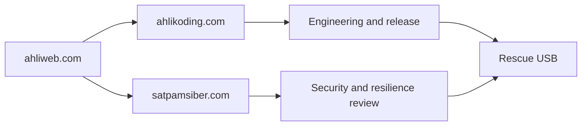

This is the architecture as implemented at `VERSION` `0.6.0`. Status labels: **Implemented** (source level, `make check`), **Hardware-required**, **Environment-blocked**, **Planned** (see [testing](testing.md)). Feature details live in the linked documents; this page shows how the parts fit together.

The companion boots from Linux Mint XFCE selected through Ventoy (or runs from the USB on a running Windows, macOS, or Linux) and drives an isolated Hermes Rescue profile. The target PC's CPU/RAM/network are used by the live session; OpenCode Go provides cloud inference.

## Boundary

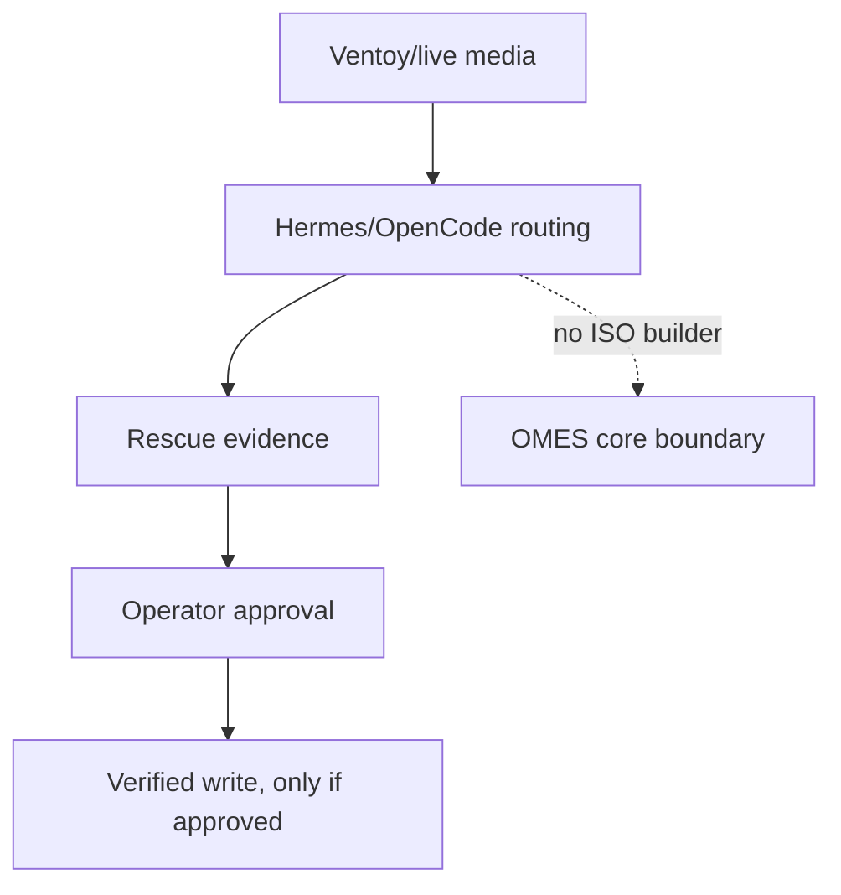

The companion is an operator-run external system, not an OMES ISO or a second agent runtime:

- **Ventoy/Linux live media** boots the affected computer or provides tools. **Hermes/OpenCode** own model and provider routing; OMES does not implement another LLM router.
- **OMES** owns deterministic validation, provenance, bounded evidence, and reconciliation. It does not build an ISO, partition disks, or silently repair a target system.
- A USB flash drive alone cannot replace the target computer's CPU/RAM.
- **Planned / Hardware-required:** a Raspberry Pi 5 8 GB or equivalent ARM64 SBC as an independent evidence workstation with the target disk on a USB-SATA/NVMe adapter. It is a separate computer with its own power, storage, and network. No script targets it specifically today.

## Components

| Component | Role | Script or file |
|---|---|---|
| Media tooling | Download and install Ventoy, verify the Mint ISO, copy ISO and allowlisted bundle, persistence entry | `download-ventoy.sh`, `install-ventoy-usb.sh`, `verify-mint-iso.sh`, `prepare-ventoy-usb.sh` |
| Persistence image | Ventoy `casper-rw` image with Hermes, the toolkit, and the XFCE autostart pre-installed | `build-persistence.sh`, `lib/overlay_whiteouts.py` ([persistence](persistence.md)) |
| Bootstrap and launcher | Isolated `HERMES_HOME`, profile, skills, autostart; the run sequence | `install-hermes-rescue.sh`, `launch-hermes-rescue.sh`, `check-hermes-rescue.sh`, `verify-autostart.sh` |
| Config parser | Allowlisted `KEY=VALUE` data parser shared by the shell scripts | `lib/rescue-env.sh` |
| Preflight | CPU, RAM, display, internet, USB live medium | `check-hardware-readiness.py` |
| Live scanner | Read-only mount and inspection of installed OSes, then the detection modules | `scan-target-os.py`, `rescue_modules/` |
| Android scanner | USB inventory with port identification and read-only ADB checks of a phone or tablet over USB (target family `android`, `and-N`) | `scan-android.py`, `rescue_modules/usb_devices.py`, `rescue_modules/android.py` ([android](android.md)) |
| Printer scanner and repair | USB printers on this PC, CUPS/IPP state of their queues, opt-in local-link network printers (target family `printer`, `prn-N`), and the spooler of installed OSes; typed repair actions (resume queue, accept jobs, cancel jobs, identify, operator-only test page and head cleaning, spool quarantine) behind the engine-resolved `printer_ref` | `scan-printers.py`, `rescue_modules/printer.py`, `rescue-ai/v1/catalog/printer.json`, `scripts/lib/ipp/*.test`, `scripts/lib/printer/` ([printer](printer.md)) |
| Detection modules | Numbers-only checks per domain | `rescue_modules/{hardware,operating_system,software,malware,printer}.py`, `host/modules/windows/*.ps1`, `host/modules/macos/*.zsh` |
| Evidence contract | Closed schema 1.0 / 1.1 / 1.2 / 1.3, validator, fixtures | `rescue-ai/v1/rescue-evidence.schema.json`, `validate-evidence.py` |
| Analyzer | One bounded request to OpenCode Go, text-only answer | `opencode-go-analyze.py`, `analyze-opencode-go.sh`, `profiles/rescue-hermes/analysis-prompt.md` |
| Repair catalog and engine | Typed actions, policy gate, backup, verify, rollback, journal | `rescue-ai/v1/catalog/*.json`, `lib/repair_catalog.py`, `rescue-repair.py` ([repair framework](repair-framework.md)) |
| Target mounts and quarantine | Operator-approved read-write remount; reversible quarantine | `lib/target_mount.py`, `malware-quarantine.py`, `lib/quarantine_store.py`, `lib/malware_detections.py` |
| Run report | `report.md`, `report.json`, `index.md` from evidence, analysis, and journal | `rescue-report.py`, `lib/run_report.py` ([run report](run-report.md)) |
| Host launchers | The same flow on a running Windows, macOS, or Linux | `host/rescue-windows.ps1`, `host/RESCUE-MACOS.command`, `host/rescue-linux.sh` ([host launchers](host-launchers.md)) |
| Skill submission | Sanitized candidate skills to GitHub Issues after operator confirmation | `submit-skill.py`, `lib/skill_sanitize.py` ([skill submission](skill-submission.md)) |
| Hermes profile | Runtime policy and skills | `profiles/rescue-hermes/` ([learning loop](hermes-learning-loop.md)) |
| Follow-ups and autorun | Typed read-only follow-ups of flagged checks, the fixed kickoff turn, and the skill `rescue-autorun` | `scripts/rescue-followup.py`, `rescue-ai/v1/followup.schema.json`, `profiles/rescue-hermes/kickoff.md` ([learning loop](hermes-learning-loop.md#autorun-hermes-69)) |

## End-to-end flow on the live USB

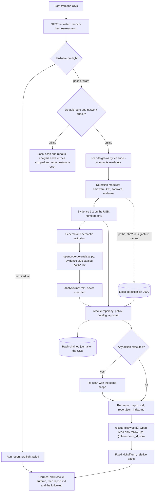

The follow-up step and the kickoff turn are **Implemented** as files (`scripts/rescue-followup.py`, `profiles/rescue-hermes/kickoff.md`, the skill `rescue-autorun`, the Hermes `approvals` policy); wiring them into `launch-hermes-rescue.sh` and the host launchers is done on the launcher side. Hermes may run exactly two typed commands without asking (`rescue-followup`, and `rescue-repair.py --policy auto-safe --select <proposed safe action_id>`); everything else needs the operator ([learning loop](hermes-learning-loop.md#autorun-hermes-69), [security model](security-model.md#hermes-autorun-follow-ups-and-deny-list)).

**Live launcher phases (#73).** `launch-hermes-rescue.sh` prints numbered phases `[N/10]` (network, preflight, scan, analysis, repairs, re-scan, follow-up, Android/printer offers, report, Hermes) through `scripts/lib/progress.sh`; only steps whose tool draws no bar of its own are wrapped in `rescue_progress_run` (the follow-up). The re-scan runs only when the journal holds an entry of THIS run with `stage: execute` and `outcome: ok` (`rescue_journal_executed_ok` parses the JSON lines). Hermes starts in `<state-dir>/reports` (relative paths only) with `-s rescue-autorun` and the kickoff as its first turn. The TUI takes its first turn only from `-q` (`HERMES_TUI_QUERY`); `hermes_cli/main.py` reads `--query-file` only after `_launch_tui()` has started, so the launcher passes the fixed kickoff text from the bundle with `-q` (it holds no secret and no path) and keeps the TUI the operator already uses. The host launchers have no Node TUI and use `chat --cli --query-file`. An old bundle without `kickoff.md` falls back to `hermes --tui`. If `persistence-active` is `warn` the launcher prints a bilingual warning first ([persistence](persistence.md#persistence-active-status-persistensi)).

A failed scan, a missing key, or a network error never blocks Hermes and never blocks the report; the outcome is recorded in `header.outcome` of the report. The sequence of one run:

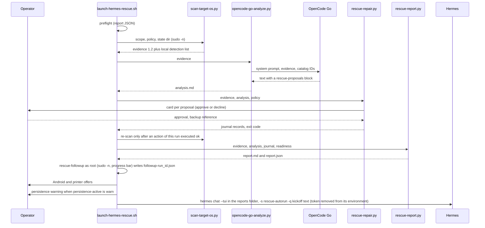

## Host mode (running Windows, macOS, Linux)

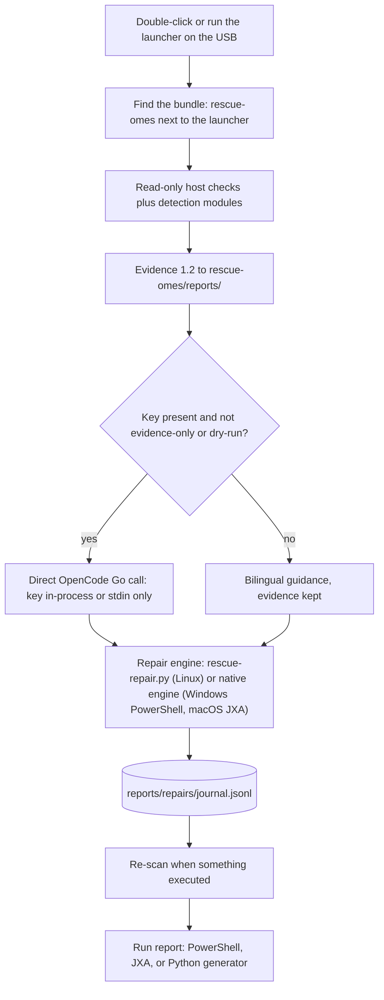

Nothing is installed or written on the host disk; there is no AutoRun, so one click by the operator is the approval point. The three launchers implement the same contract with different tools: `host/rescue-linux.sh` uses the Python engine and generator; `host/rescue-windows.ps1` and `host/RESCUE-MACOS.command` have native engines and generators (no Python on the host) whose output is cross-checked against the Python implementation in the tests. Details: [host launchers](host-launchers.md), [host repair](host-repair.md). Real Windows 10/11 and macOS execution is Hardware-required.

## Android target (phone or tablet over USB)

Besides installed operating systems (`os-N`), a phone or tablet attached over USB is a target of its own family, `android` (`and-N`). `scripts/scan-android.py` enumerates every USB device from sysfs without any cooperation from the phone, marks the rescue USB so it is never confused with the target, shows the port path, speed, and ACPI location, classifies the connection mode (ADB, fastboot, MTP/PTP, RNDIS, Qualcomm EDL, MediaTek preloader/BROM, Samsung Download, Unisoc download), and runs fixed-argv, read-only ADB checks only when USB debugging is enabled and authorized. Evidence is schema 1.3 with an opaque target ID, never the serial. Three catalog repair actions (`android.trim-caches`, `android.enable-package-verifier`, `android.reboot`) run only through the Python repair engine and the engine-resolved `android_device` parameter. Operator-invoked flashing (fastboot slot switch, official image or allowlisted partitions on an unlocked bootloader, Samsung Download through Heimdall as EXPERIMENTAL) is documented in [android](android.md#flashing-dan-unbrick-52); bootloader unlock is never automated and EDL/BROM get guidance only. Details, check table, actions, and privacy rules: [android](android.md).

## Printers (USB, opt-in network, installed OS spooler)

Printers are a target family of their own, `printer` (`prn-N`). `scripts/scan-printers.py` reuses the USB inventory (interface class 07: port path, speed, ACPI location, IPP-over-USB capability), reads the state of the local CUPS queues with fixed-argv `lpstat` calls, and reads one IPP Get-Printer-Attributes answer per printer with `ipptool` and a fixed request file that asks only for state, state reasons, accepting jobs, queued job count, marker levels and the make-and-model (reduced to an allowlisted brand). Queue names, device URIs, addresses, serials, job and user names stay in memory and never reach evidence, report, journal, or the analyzer request. Network printers are found only when the operator passes `--network` (mDNS `_ipp._tcp`/`_ipps._tcp` on the local link, no subnet scan, no SNMP, no credentials). Separately, `scan-target-os.py` counts stuck spool files and reports the print service of each installed OS (`printer-target-*` checks, scope `printer` since phase 2). Repairs are typed catalog actions (`rescue-ai/v1/catalog/printer.json`): the engine resolves the `prn-N` of a proposal to a CUPS queue at execution time (`printer_ref`, same `opaque_id` as the evidence, network printers only with `--printer-network`), the queue name only ever reaches the child argv, a test page or a head cleaning (risk `irreversible`: no rollback, nothing stored lost) is operator-only and always asks, and the live launcher offers the printer scan after the OS scan and the Android offer (default no). Details, check table, action table, and privacy rules: [printer](printer.md).

## Persistence

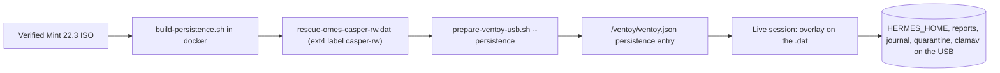

With the persistence image, Hermes, the runtime bundle, and the autostart are already installed, and every write of the live session (Hermes memory and sessions, reports, journal, quarantine, signature database) survives reboot on the USB. Building needs docker and network; a real persistence boot is Hardware-required. See [persistence](persistence.md).

Distribution: release tags are packaged in CI (`.github/workflows/package.yml`) into credential-free `bundle` and `persistence` packages on ghcr.io, built with `--no-provision-secrets` from a GPG+SHA-256 verified ISO; see [persistence](persistence.md#paket-github-tanpa-kredensial).

## Data versus commands

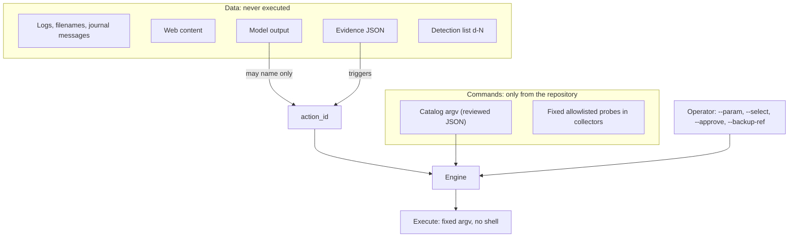

| Source | May influence | May never influence |
|---|---|---|
| Model output | Which catalog `action_id` is proposed (a `rescue-proposals` block: at most 4 KiB and 16 items, exact IDs that apply to the platform, scope, and target family) | argv, parameter values, paths, approvals |
| Evidence and logs | Catalog triggers (`repair_proposals` with `origin: catalog-trigger`) | Anything beyond the closed check IDs and numbers |
| File and signature names on a target | Nothing: they stay in the local `0600` detection list and are referenced as `d-N` | Evidence, journal, analyzer request, report |
| Operator | Parameter values (typed and validated), selection, approval, backup reference | Programs outside the catalog |
| Catalog | The fixed argv arrays | Shells, interpreters, `sudo`, network fetchers, and `dd` are refused by the loader |

## Evidence contract

`rescue-ai/v1/rescue-evidence.schema.json` accepts only bounded metadata (schema 1.0, 1.1, 1.2, and 1.3; the OS scanner and the host launchers write 1.2, `scan-android.py` and `scan-printers.py` write 1.3, `collect-evidence.sh` writes 1.0):

- source live platform, boot mode, timestamps, opaque target identifier;
- tool and release identifiers;
- allowlisted check IDs and pass/fail/warn/unknown/not_applicable status, with bounded numeric values;
- evidence manifest count, storage class, and SHA-256;
- explicit OpenCode Go provider/model identity without credentials;
- analysis, mutation, and verification status;
- data classification and closed source references;
- (1.1) `target_systems` and per-check `target_ref`; (1.2) `scope`, `repair_policy`, `repair_proposals`, up to 160 checks; (1.3) the `android` target family (`and-N` refs), `usb_ports`, and `android-*` / `usb-*` check IDs ([android](android.md)), the `printer` target family (`prn-N` refs), the closed `printers` list, and `printer-*` check IDs ([printer](printer.md); `printer-target-*` are valid since 1.2).

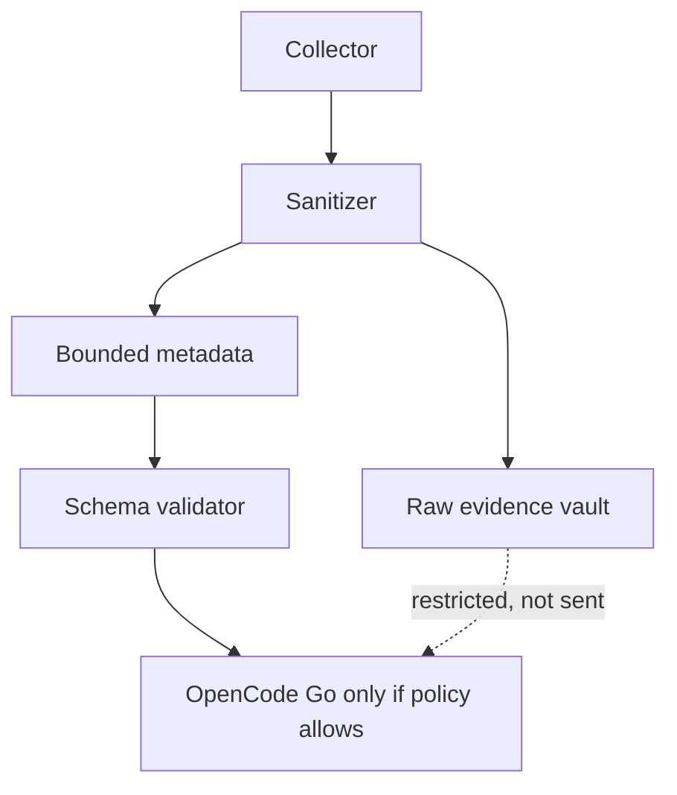

It rejects prompts, model responses, raw logs, credentials, private keys, arbitrary command fields, and extra properties. Raw evidence belongs in an operator-controlled store and must not be sent to OpenCode Go when classified `restricted`.

Field semantics that every collector follows (schema 1.2):

- `classification`: `confidential` evidence may be sent to the configured provider (OpenCode Go). `restricted` evidence never leaves the machine: `opencode-go-analyze.py` and `analyze-opencode-go.sh` refuse it. All shipped collectors write `confidential`.
- `ai_provider.authenticated` is `true` only when the producing launcher has a usable `OPENCODE_GO_API_KEY` and will send this evidence in this run. `destination_class` is then `cloud`; otherwise `false` and `unknown`. `cloud` without `authenticated` is invalid. The key itself never appears in evidence.
- Value kinds are `percent`, `count`, `bytes`, `days`, `seconds`, and (1.2) `celsius` for temperatures.
- `unknown` means "could not be determined", never "healthy". Areas outside `scope` were not examined.

## Hardware readiness gate

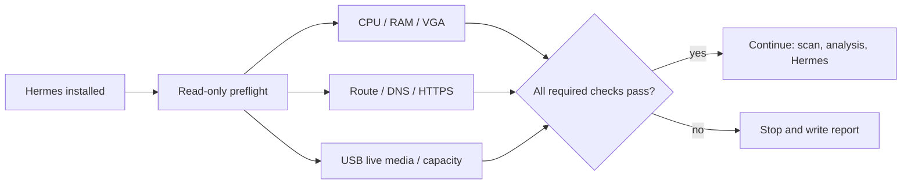

Before the scan and Hermes start, `scripts/check-hardware-readiness.py` validates that the live PC has the minimum resources needed for diagnosis: 2 logical CPUs, 4 GiB RAM, a display adapter, a detected USB live medium of at least 8 GiB (resolved through dm and loop devices to the physical disk), and, as an advisory check only, internet access for OpenCode Go. The launcher defaults to `--hardware-mode auto`; `--hardware-mode wizard` asks for confirmation at each step. Thresholds are configurable with `--min-cpu`, `--min-ram-gib`, and `--min-usb-gib`.

The result is a timestamped, permission-restricted JSON report under `<state-dir>/reports/`. A failed or unknown required check blocks the run and states the observed value and minimum; the run report is still written. `internet-connectivity` is not required and an unresolvable or non-USB live medium only warns (see [hardware](hardware.md#gerbang-kesiapan)); offline, the launcher still runs the local scan, the catalog repairs, and the report, then stops without Hermes. Software cannot prove that a particular firmware boot menu selected the USB, so that physical acceptance test remains a separate warning and must be tested on real hardware.

## OpenCode Go procedure

1. The key comes from `OPENCODE_GO_API_KEY`: the environment, `config/rescue.env`, or `<state-dir>/hermes/env`, read as data by `scripts/lib/rescue-env.sh` (the Python and PowerShell clients apply the same rules). Never place it in a report, command argument, or log; `check-hermes-rescue.sh` and the macOS launcher hand it to `curl` on stdin, the Windows launcher and the Python analyzer send it only in an in-process `Authorization` header.
2. The model ID is `mimo-v2.6-flash` on `https://opencode.ai/zen/go/v1`. Do not assume that a model name remains available; `check-hermes-rescue.sh` verifies the configured ID and endpoint.
3. Only sanitized, bounded evidence is sent, followed by the list of catalog action IDs that apply. Treat all logs as untrusted data; the prompt requires the model to separate facts, hypotheses, missing evidence, and read-only next checks, and to propose only catalog IDs.
4. The answer is displayed and saved as text; it is never executed or parsed as a command.
5. Every request carries `x-opencode-session: ses_` + the first 32 hex characters of the sha256 of the evidence JSON text that is sent (a stable, opaque id per analysis; a hash, never evidence content). OpenCode Go refuses a request without it with HTTP 400 `MissingSessionID`. The Python analyzer, the PowerShell engine, and the macOS engine derive the same value.
6. If OpenCode Go is unavailable, the evidence and the report are still produced (`no-key`, `network-error`, `provider-rejected`, or `analysis-failed`); do not silently switch providers. `network-error` means no usable answer (DNS, connection, timeout, an unusable response, HTTP 401/403/408/429 or 5xx); `provider-rejected` means the provider answered with another HTTP 4xx, so the network worked and the request was refused (the analyzer exits `5`; the launchers keep their exit code `4`). The message shows the HTTP status and the provider error type only when it is a short token, never the response body.

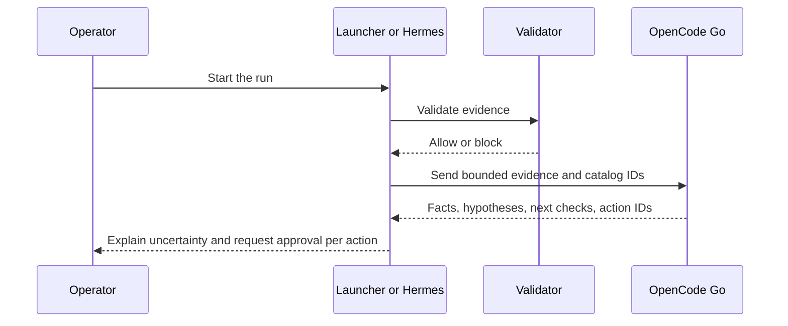

## Read-only collection contract

**Implemented:**

- `scripts/scan-target-os.py` (live USB) and the host launchers run fixed read-only probes and modules, mount targets `ro,noexec,nosuid,nodev` without journal replay, never unlock BitLocker, LUKS, or FileVault, and emit only closed check IDs, statuses, and bounded numbers ([target OS scan](target-os-scan.md)).
- `scripts/collect-evidence.sh` is the small generic collector (schema 1.0): `journalctl -k`/`dmesg`, `findmnt`, `ip`, `lsblk` feed four checks (`kernel-log`, `filesystem-discovery`, `network-connectivity`, `block-device-discovery`) whose status derives from those signals, never a hard-coded pass. It sets `verification` to `hashes_verified: false`, `read_back_verified: false`, `status: not_applicable`, because nothing is compared with a trusted reference. `target_device_opaque_id` is a truncated SHA-256 of `/etc/machine-id` (or a hostname/kernel fallback), and the output is created `0600` atomically. `scripts/analyze-opencode-go.sh` validates a file with `validate-evidence.py` before piping it to the operator-configured `OPENCODE_ADAPTER_COMMAND`.

**Planned:** a fuller external forensic collector (`blkid`, `efibootmgr -v`, offline journal queries, non-repair filesystem checks, LVM/RAID discovery, GNU ddrescue imaging for failing disks). It must record command identity, exit status, timestamp, target opaque ID, and manifest hash, and must never accept a command string from AI or a remote request. Filesystem repair, `grub-install`, NVRAM changes, partitioning, formatting, and disk writes stay outside the catalog and require a human approval gate, backup/image reference, rollback plan, and post-action read-back verification.

## Scoped detection and repair

Detection is scoped (`--scope`) and read-only. A repair is only ever a typed catalog action executed under the operator's policy. The full contract is in [repair-framework](repair-framework.md); the domains are [hardware](hardware.md), [OS repair](os-repair.md), [software](software.md), and [malware](malware.md).

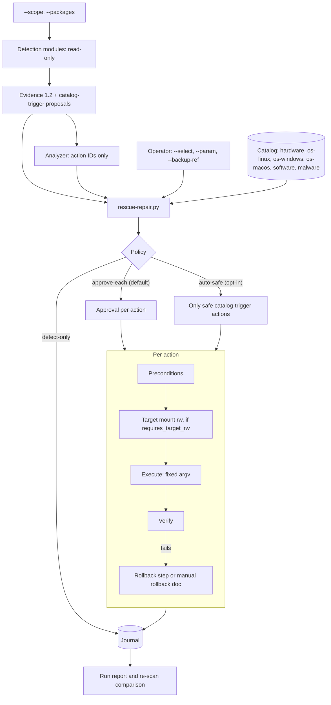

## Recovery media workflow

1. Verify Ventoy and Linux Mint ISO provenance/checksums.
2. Install Ventoy only to the confirmed USB whole disk; this erases that USB.
3. Copy ISO files to the Ventoy data partition; do not write the ISO with `dd`. The preparation helper verifies the ISO first (GPG signature from the pinned Linux Mint signer fingerprint plus direct SHA-256 comparison), copies it, read-back verifies the copy, writes a Ventoy control configuration to `/ventoy/ventoy.json` (the only path Ventoy reads plugin settings from) that auto-selects the verified ISO after a timeout, copies only an allowlisted rescue bundle and the host launchers, optionally adds a persistence image, and can provision only the API key from an ignored local `.env` into the USB's private `config/rescue.env`.
4. Boot the USB from the firmware menu; auto-selection by Ventoy is not the same as firmware auto-selection.
5. In the live environment the launcher records the preflight and the OS scan; record UEFI/Legacy and Secure Boot state.
6. Connect the affected disk read-only first. For formal forensic work, prefer a suitable hardware write blocker; software read-only controls have limitations.
7. If the disk has I/O errors, image to a separate destination with GNU ddrescue and a mapfile before attempting filesystem repair (manual today; no script automates it).
8. Produce bounded metadata and a separate evidence manifest.
9. Use OpenCode Go only on sanitized evidence and preserve the operator's final decision separately from model output.

## Implementation stages

| Stage | Deliverable | Status |
|---|---|---|
| 1 | `rescue-ai/v1` bounded schema (1.0, 1.1, 1.2) and valid/invalid fixtures | Implemented |
| 2 | Read-only collectors and evidence validator | Implemented |
| 3 | Hermes Rescue profile with OpenCode Go/MiMo-V2.6-Flash default | Implemented |
| 4 | Hermes bootstrap, isolated state, autostart, and health check | Implemented |
| 5 | Ventoy download/install/preparation helpers with signer-pinned ISO verification and allowlisted bundle copy | Implemented; the Ventoy write and a physical boot are Hardware-required |
| 6 | Hardware readiness preflight with auto/wizard modes and JSON report | Implemented; physical firmware boot is Hardware-required |
| 7 | Live multi-OS scan, direct analyzer, host launchers (Windows, macOS, Linux) | Implemented; real disks and real Windows/macOS are Hardware-required, the cloud call is Environment-blocked |
| 8 | Scoped detection (hardware, OS, software, malware), typed repair catalog, policy engine, hash-chained journal, target mounts, quarantine | Implemented; real repairs are Hardware-required |
| 9 | Persistence image with Hermes pre-installed | Implemented (docker, network); boot is Hardware-required |
| 10 | Comprehensive run report (Python, PowerShell, JXA) | Implemented |
| 11 | Candidate skill submission to GitHub Issues | Implemented; real GitHub calls are Environment-blocked |
| 12 | Candidate memory, feedback labels, regression evaluation, signed promotion | Planned ([learning loop](hermes-learning-loop.md)) |
| 13 | Hardware boot validation on Pi 5/PC x86 and the UEFI/BIOS matrix | Hardware-required |
| 14 | Live OpenCode Go smoke test and reboot-autostart check | Environment-blocked (API key, provider spend, physical reboot) |
| 15 | Android target: USB inventory, port identification, read-only ADB checks, evidence 1.3 ([android](android.md)) | Implemented (detection and three safe or reversible repair actions); real phones Hardware-required |
| 16 | Printers: USB class 07, CUPS/IPP state, opt-in mDNS network printers, installed-OS spooler checks, evidence 1.3 ([printer](printer.md)) | Implemented (detection and typed repair actions, launcher offer); real printers and CUPS Hardware-required |

## Verification requirements

Before calling the integration ready:

- `scripts/validate-evidence.py` accepts the valid fixtures and rejects raw prompt/response/credential/arbitrary-command fixtures for the intended reason;
- validator never executes discovered files or commands;
- checksum mismatch, a missing or wrong Linux Mint signer fingerprint, and a missing Ventoy digest all fail closed;
- `make check` passes (syntax, catalog validation, `shellcheck -x`, fixture validation, documentation check, unit tests, diff check); see [testing](testing.md);
- the hardware preflight produces a report with all five check IDs and blocks on failed or unknown required checks;
- network failure still permits evidence collection and produces `manual_intervention` or a report outcome (`no-key`, `network-error`, `provider-rejected`) rather than a false AI success;
- OpenCode Go provider/model identity is recorded without secrets;
- all destructive actions remain approval-required, with a backup reference and a rollback plan;
- the documentation distinguishes the staged external companion from implemented OMES code.

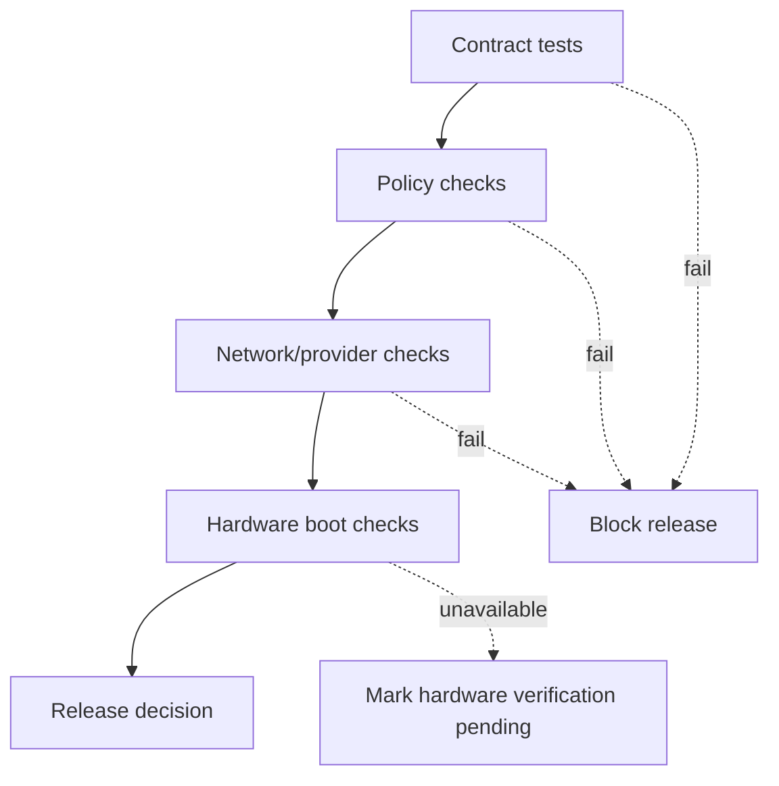

## References

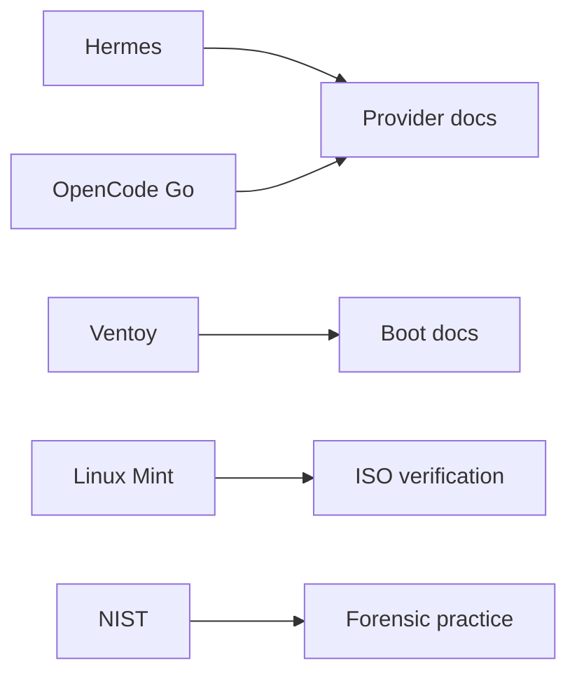

- [OpenCode Go](https://opencode.ai/docs/go)
- [OpenCode providers](https://opencode.ai/docs/providers)
- [OpenCode CLI](https://opencode.ai/docs/cli)
- [Ventoy](https://github.com/ventoy/Ventoy)
- [Linux Mint ISO verification](https://linuxmint.com/verify.php)
- [NIST SP 800-86](https://csrc.nist.gov/pubs/sp/800/86/final)
- [GNU ddrescue manual](https://www.gnu.org/software/ddrescue/manual/ddrescue_manual.html)
