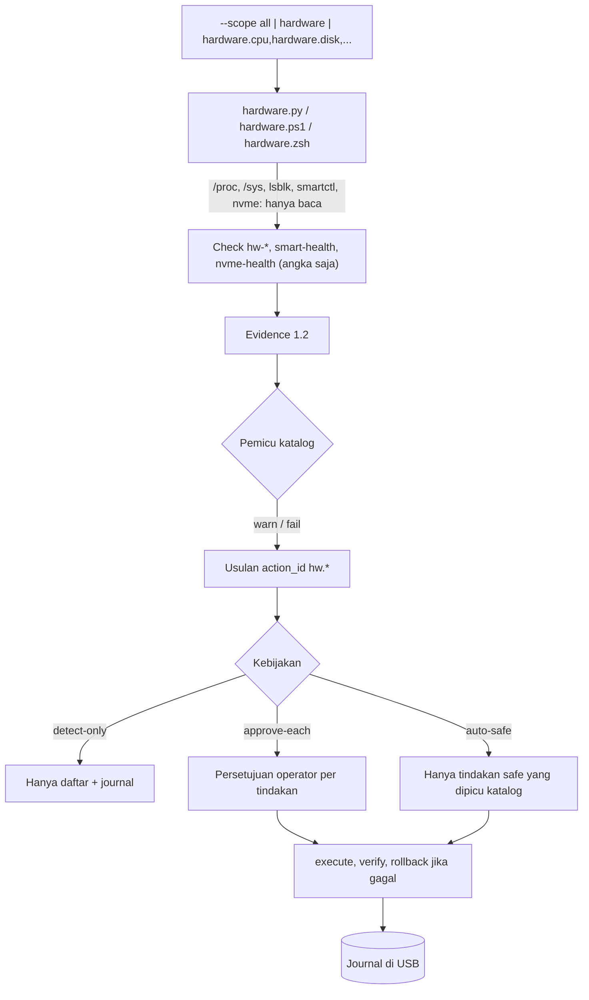

# Deteksi hardware dan perbaikan opsional

> Managed by **ahlikoding.com** and **satpamsiber.com** from **ahliweb.com**.

Dokumen ini menjelaskan modul deteksi hardware (ahliweb/linux-mint-xfce-rescue-ai#15) yang berjalan di atas kontrak di [repair-framework.md](repair-framework.md). Deteksi selalu **hanya baca**. Perbaikan hanya berupa **tindakan katalog bertipe** (`rescue-ai/v1/catalog/hardware.json`) dengan argv tetap, dan tetap mengikuti kebijakan `--repair-policy` (`detect-only`, `approve-each` bawaan, `auto-safe` opsional). AI hanya boleh menyebut `action_id`; AI tidak pernah membuat perintah.

Sebagian besar kerusakan hardware **tidak dapat diperbaiki lewat perangkat lunak**. Karena itu tindakan yang tersedia hanya mitigasi aman: self-test SMART/NVMe (membaca, tidak menulis ke disk), memulai ulang layanan jaringan, dan membuka blokir radio Wi-Fi. Tidak ada flashing firmware, tidak ada penulisan ke disk, tidak ada `dd`, format, atau partisi.

| Bagian | Status |
|---|---|
| Modul Linux `scripts/rescue_modules/hardware.py` (live USB dan host Linux) | Implemented (uji fixture offline) |
| Modul Windows `host/modules/windows/hardware.ps1` | Implemented (logika diuji dengan fakta palsu lewat pwsh); pembacaan CIM/WMI nyata Hardware-required |
| Modul macOS `host/modules/macos/hardware.zsh` | Implemented (diuji dengan shim); perilaku pada Mac nyata Hardware-required |
| Katalog `hw.*` (4 tindakan) | Implemented |
| Pembacaan SMART/NVMe pada disk fisik, sensor suhu, baterai, rfkill, EDAC nyata | Hardware-required |
| Eksekusi tindakan pada disk/NIC nyata | Hardware-required |
| Perbaikan dari host Windows dan macOS | Planned (peluncur hanya mendeteksi) |
| Analisis AI atas evidence | Environment-blocked (perlu `OPENCODE_GO_API_KEY` dan jaringan) |



## Cakupan (scope)

`--scope hardware` memeriksa semuanya. Item terpisah: `hardware.cpu`, `hardware.memory`, `hardware.disk`, `hardware.gpu`, `hardware.display`, `hardware.network`, `hardware.battery`, `hardware.usb`. Contoh: `--scope hardware.disk,hardware.battery`. Bila item tidak dipilih, check-nya tidak dijalankan sama sekali (bukan dianggap sehat).

| Item | Check ID |
|---|---|
| `hardware.cpu` | `hw-cpu`, `hw-cpu-thermal` |
| `hardware.memory` | `hw-memory`, `hw-memory-errors` |
| `hardware.disk` | `hw-disk`, `smart-health`, `nvme-health` |
| `hardware.gpu` | `hw-gpu`, `hw-gpu-driver` |
| `hardware.display` | `hw-display` |
| `hardware.network` | `hw-network-adapter`, `hw-wifi` |
| `hardware.battery` | `hw-battery` |
| `hardware.usb` | `hw-usb` |

Evidence hanya berisi angka (`percent`, `count`, `bytes`) dan status. Tidak ada nama model, nomor seri, alamat MAC, atau path perangkat. Sumber yang tidak dapat dibaca (alat tidak ada, tidak ada izin) menghasilkan `unknown`, bukan galat. `not_applicable` berarti perangkatnya memang tidak ada (misalnya PC desktop tanpa baterai).

## Sumber data (semuanya hanya baca)

- Linux: `/proc/cpuinfo`, `/proc/meminfo`, `/sys/class/{thermal,hwmon,power_supply,net,drm,rfkill}`, `/sys/bus/{pci,usb}/devices`, `/sys/devices/system/{edac,cpu}`, `lsblk -J`, `smartctl -j -H -A`, `nvme smart-log -o json`. `smartctl` dan `nvme` butuh root: di USB live berjalan sebagai root, di host Linux (pengguna biasa) hasilnya `unknown`. Perintah dijalankan tanpa shell dengan `PATH` tetap.
- Windows: CIM/WMI baca-saja (`Win32_Processor`, `Win32_PhysicalMemory`, `Win32_VideoController`, `Win32_Battery`, `Win32_USBControllerDevice`, `Win32_PnPEntity` dengan `ConfigManagerErrorCode`, `MSAcpi_ThermalZoneTemperature`, `BatteryFullChargedCapacity`), `Get-PhysicalDisk`, `Get-StorageReliabilityCounter`, `Get-NetAdapter`, `Get-WinEvent` (WHEA). Tanpa elevasi. Peluncur sudah menghasilkan `smart-health` sendiri, jadi modul ini tidak mengulanginya.
- macOS: `sysctl`, `pmset`, `ioreg`, `diskutil`, `networksetup`, `ifconfig`, dan `system_profiler -json` yang dibatasi timeout. Tanpa python, tanpa sudo.
- Di host Linux, `smart-health` sudah dihasilkan oleh peluncur; modul hanya menambahkannya di USB live agar tidak ada ID ganda.

## Check dan ambang batas

| Check ID | Arti angka | pass | warn | fail | unknown / not_applicable |
|---|---|---|---|---|---|
| `hw-cpu` | `count` = jumlah CPU logis | ada CPU terbaca | Windows: status prosesor bukan OK | - | `cpuinfo` tidak terbaca |
| `hw-cpu-thermal` | `celsius` = suhu tertinggi, derajat Celsius (macOS: `percent` = batas kecepatan CPU dari `pmset -g therm`) | di bawah 80 | 80 atau lebih, atau ada event throttling (macOS: batas kecepatan di bawah 100) | 95 atau lebih (macOS: di bawah 50) | tidak ada sensor / izin |
| `hw-memory` | `bytes` = total RAM | 2 GiB atau lebih | kurang dari 2 GiB | ada `HardwareCorrupted` (Linux) | tidak terbaca |
| `hw-memory-errors` | `count` = error ECC (`ce_count` + `ue_count`; Windows: event WHEA 30 hari terakhir) | 0 | ada error terkoreksi (Windows: ada event WHEA) | ada error tak terkoreksi (Windows: event WHEA level error) | `not_applicable` bila tidak ada EDAC (RAM non-ECC, macOS) |
| `hw-disk` | `count` = disk internal (USB, removable, loop, optik tidak dihitung) | 1 atau lebih | Windows: status operasional disk bukan OK | tidak ada disk internal terlihat | `lsblk` tidak ada |
| `smart-health` | `count` = disk yang butuh perhatian | semua lolos | sektor realokasi/pending/uncorrectable lebih dari 0, atau suhu 60 C atau lebih | `smartctl` melaporkan SMART gagal | `smartctl` tidak ada / bukan root; `not_applicable` tanpa disk SATA |
| `nvme-health` | `percent` = keausan tertinggi (`percent_used`) | normal | keausan 90 atau lebih, `media_errors` lebih dari 0, atau suhu 70 C atau lebih | `critical_warning` tidak nol, keausan 100 atau lebih, spare di bawah ambang, suhu 80 C atau lebih | `nvme` tidak ada / bukan root; `not_applicable` tanpa NVMe |
| `hw-gpu` | `count` = kontroler tampilan PCI | ada | - | - | `not_applicable` tanpa GPU (server, VM) |
| `hw-gpu-driver` | `count` = GPU tanpa driver | 0 | - | 1 atau lebih tanpa driver (Windows: `ConfigManagerErrorCode` tidak nol atau Basic Display Adapter) | mengikuti `hw-gpu` |
| `hw-display` | `count` = layar terhubung | 1 atau lebih | tidak ada layar terhubung | - | tidak ada konektor DRM (biasanya GPU tanpa driver) |
| `hw-network-adapter` | `count` = adapter fisik (yang bermasalah: adapter tanpa driver) | ada adapter dan ada koneksi (Wi-Fi tidak wajib terhubung) | ada adapter tetapi tidak ada yang terhubung | tidak ada adapter fisik, atau adapter tanpa driver | `/sys/class/net` tidak terbaca |
| `hw-wifi` | `count` = radio Wi-Fi terblokir/nonaktif | radio aktif | radio terblokir perangkat lunak atau keras | - | `not_applicable` tanpa Wi-Fi |
| `hw-battery` | `percent` = muatan baterai paling rendah | sehat dan muatan cukup | muatan di bawah 20 saat tidak mengisi, atau kesehatan (penuh/desain) di bawah 60 persen | muatan di bawah 10 saat tidak mengisi, kesehatan di bawah 40 persen, atau status `Dead`/`Overheat` | `not_applicable` tanpa baterai |
| `hw-usb` | `count` = perangkat USB terpasang (hub akar tidak dihitung) | semua terkonfigurasi | ada perangkat yang gagal dikonfigurasi (Windows: ada masalah driver USB) | - | `/sys/bus/usb` tidak terbaca |

## Katalog tindakan

Semua tindakan berlaku untuk `live-linux` dan `linux-host`, butuh root (mesin menambahkan `sudo -n --` sendiri), dan tidak butuh backup karena tidak menulis ke disk. Parameter `device` bertipe `block_device`: dipilih operator lewat `--param ACTION_ID.device=/dev/...` dan diperiksa ulang mesin (bukan USB rescue, bukan media removable). Tindakan Windows dan macOS sengaja tidak ada: perbaikan di kedua platform itu Planned, dan reset adapter membutuhkan cmdlet atau dua langkah yang tidak dapat dinyatakan sebagai argv tunggal.

| action_id | Risiko | Pemicu | Argv |
|---|---|---|---|
| `hw.smart-short-selftest` | safe | `smart-health` warn/fail | `smartctl -t short {device}` |
| `hw.nvme-short-selftest` | safe | `nvme-health` warn | `nvme device-self-test {device} -s 1` |
| `hw.network-service-restart` | safe | `hw-network-adapter` warn | `systemctl restart {service}` |
| `hw.wifi-rfkill-unblock` | reversible | `hw-wifi` warn | `rfkill unblock wlan` |

### SMART

`hw.smart-short-selftest` menjalankan self-test singkat pada disk SATA/SAS. Tes ini hanya membaca dan berjalan di firmware disk (biasanya sekitar 2 menit). Verifikasi: `smartctl -l selftest {device}` (baca log self-test). Rollback: tidak ada yang perlu dikembalikan. Pada disk yang sudah gagal, tes tetap aman, tetapi utamakan backup data: perbaikan hardware tidak mungkin. Auto-safe boleh menjalankannya karena dipicu langsung oleh `smart-health` dan risikonya `safe`.

### NVMe

`hw.nvme-short-selftest` menjalankan device self-test singkat (kode 1) pada drive NVMe. Hanya membaca. Verifikasi: `nvme self-test-log {device}`. Rollback: tidak ada. Keausan tinggi tidak dapat diperbaiki; gantilah drive setelah backup.

### Network

`hw.network-service-restart` memulai ulang `NetworkManager` (bawaan) atau `systemd-networkd` (pilih lewat `--param hw.network-service-restart.service=systemd-networkd`). Verifikasi: `systemctl is-active {service}`. Rollback otomatis bila verifikasi gagal: `systemctl start {service}`. Koneksi jaringan bisa terputus beberapa detik. Kabel yang lepas atau adapter tanpa driver tidak diperbaiki oleh tindakan ini.

### Wifi

`hw.wifi-rfkill-unblock` membuka blokir **perangkat lunak** pada radio Wi-Fi (`rfkill unblock wlan`). Risiko `reversible`, jadi tidak pernah berjalan tanpa persetujuan (auto-safe hanya untuk `safe`). Verifikasi: `rfkill list wlan`. Rollback otomatis: `rfkill block wlan`. Blokir keras (saklar fisik atau tombol Fn) tidak bisa dibuka lewat perangkat lunak; periksa `hw-wifi` lagi setelah tindakan.

## Contoh

```bash
# Deteksi disk dan baterai saja, dari USB live (hasil berupa evidence 1.2)
sudo python3 scripts/scan-target-os.py --output /tmp/rescue-evidence.json --scope hardware.disk,hardware.battery
python3 scripts/rescue-repair.py --evidence /tmp/rescue-evidence.json --policy detect-only --state-dir /tmp/state --list
# Menyetujui self-test SMART untuk satu disk (operator memilih perangkat sendiri)
python3 scripts/rescue-repair.py --evidence /tmp/rescue-evidence.json --policy approve-each --state-dir /tmp/state \
  --approve hw.smart-short-selftest --param hw.smart-short-selftest.device=/dev/sdX
```

Ganti `/dev/sdX` setelah memeriksa `lsblk` (model, ukuran, transport, status mount); jangan menganggap `/dev/sdX` adalah USB.

## Pengujian

`tests/test_hardware.py` memakai pohon fixture (`hardware/proc`, `hardware/sys`, `hardware/cmd`) untuk laptop dengan baterai lemah, CPU terlalu panas, error EDAC, SMART gagal, NVMe aus, dan GPU tanpa driver. Fixture dibaca lewat `scan-target-os.py --fixture-root` atau variabel lingkungan `RESCUE_HARDWARE_FIXTURE_ROOT` (hanya untuk uji). Tidak ada perintah `smartctl` atau `nvme` yang dijalankan pada perangkat nyata dalam pengujian. Uji pwsh dan zsh berjalan bila `pwsh`/`zsh` terpasang. Pengujian pada mesin fisik (sensor nyata, SMART nyata, baterai nyata) dilaporkan terpisah sebagai Hardware-required.
