# Hermes Rescue Learning Loop

> Managed by **ahlikoding.com** and **satpamsiber.com** from **ahliweb.com**.

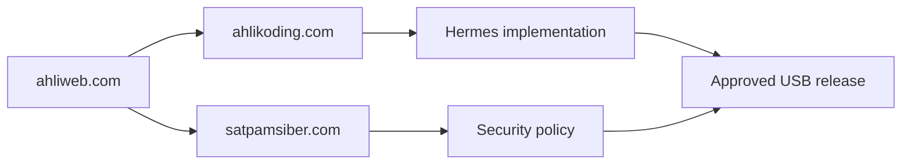

## Tujuan

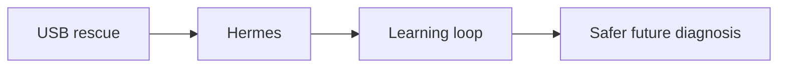

Membuat USB rescue semakin efektif dari kasus ke kasus melalui Hermes Agent, tanpa mengubah USB menjadi agen yang melakukan self-modification tanpa kontrol. OpenCode Go tetap menjadi provider analisis; Hermes menjadi orchestrator, memory/skill manager, approval gate, dan verifier.

## Batas istilah

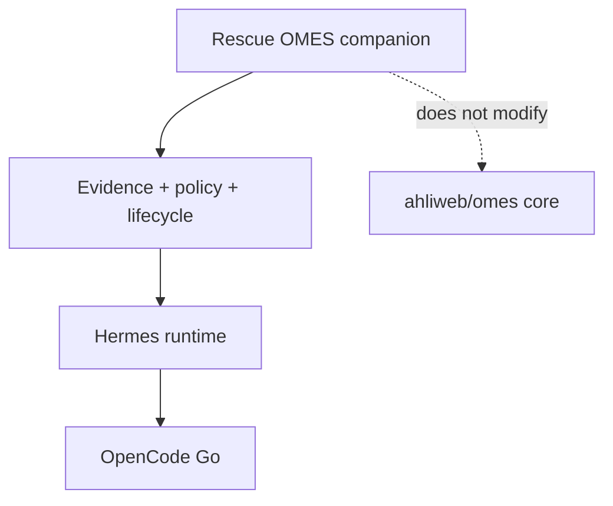

Repository ini adalah companion mandiri. Dokumen ini memakai istilah **Rescue OMES** untuk lapisan operasi lokal yang mengatur evidence, policy, lifecycle, dan verifikasi Hermes di media rescue. Ini bukan perubahan pada repository `ahliweb/omes`.

## Arsitektur target

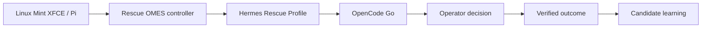

```text
Linux Mint XFCE Live / Raspberry Pi
        |
        v
Rescue OMES controller
  - allowlisted collectors
  - evidence sanitizer
  - case ledger
  - policy and approval gate
  - verifier and rollback record
        |
        v
Hermes Rescue Profile
  - SOUL.md / context
  - rescue skills (read-only bundle)
  - local memory snapshot
  - session search
  - tool adapters
        |
        v
OpenCode Go
  - diagnosis hypotheses
  - next read-only checks
  - structured repair plan
        |
        v
Operator decision + verified outcome
        |
        +--> candidate memory/skill --> evaluation --> promotion
```

Hermes tidak boleh menerima tool generik `shell_exec`. Setiap tool harus berupa adapter typed, allowlisted, timeout-bounded, read-only by default, dan menghasilkan output yang dapat diverifikasi.

## Gate kesiapan sebelum diagnosis

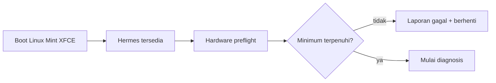

Sebelum loop kasus dimulai, launcher menjalankan pemeriksaan CPU, RAM, VGA/display,
route/DNS/HTTPS, dan USB live media. Mode `auto` adalah default dan menjalankan
semua langkah tanpa interaksi; mode `wizard` meminta konfirmasi operator pada
setiap langkah. Laporan disimpan sebagai JSON di `<state-dir>/reports/` dan
menjadi bukti awal yang terpisah dari `case.json`. Kegagalan atau status unknown
pada syarat wajib mencegah Hermes mulai, sedangkan keberhasilan software tidak
menggantikan uji boot firmware pada PC fisik.

## Bagaimana sistem menjadi lebih cerdas

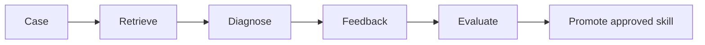

### 1. Belajar dari kasus, bukan dari raw transcript

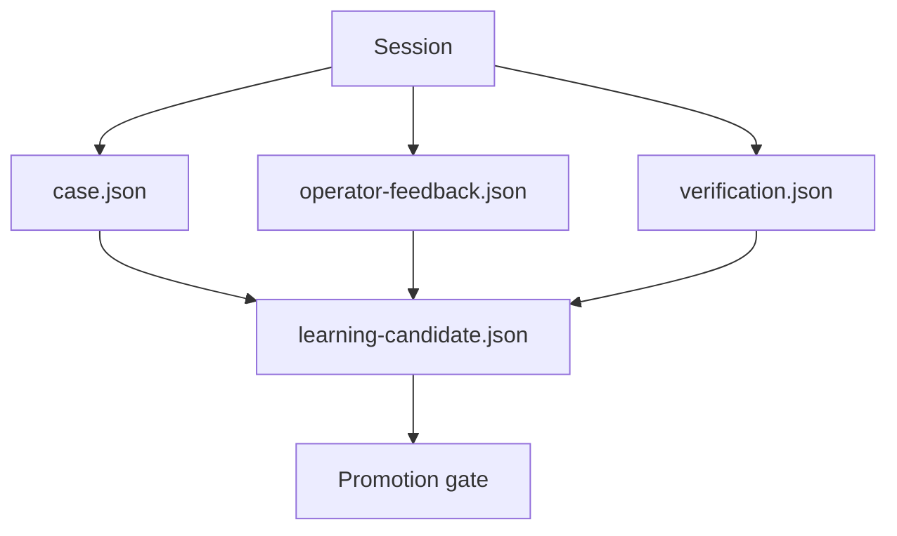
Setiap sesi menghasilkan empat artefak terpisah:

- `case.json`: signature masalah, platform, boot mode, evidence IDs, hipotesis, dan hasil akhir;
- `operator-feedback.json`: diagnosis benar/salah, tindakan yang membantu, tindakan yang tidak relevan, dan catatan singkat;
- `verification.json`: bukti bahwa hasil benar-benar terjadi, misalnya boot kembali berhasil atau disk tetap tidak berubah;
- `learning-candidate.json`: aturan/playbook kandidat yang dihasilkan dari kasus.

Prompt, respons model lengkap, serial number, credential, raw journal, dan path pribadi tidak masuk ke memory jangka panjang. Raw evidence tetap berada di vault lokal terpisah dengan hash dan retention policy.

### 2. Retrieval sebelum diagnosis

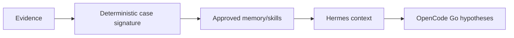

Sebelum Hermes meminta OpenCode Go menganalisis kasus baru, controller membuat `case_signature` deterministik:

- `boot_mode`: UEFI/BIOS;
- `symptom_class`: no-boot, boot-loop, filesystem-error, disk-I/O, network, unknown;
- `storage_class`: SATA/NVMe/USB/unknown;
- `filesystem_family`: ext4/NTFS/LVM/RAID/unknown;
- `firmware_signals`: Secure Boot, boot entry present/missing;
- hasil check allowlist dan statusnya.

Hermes mengambil skill/playbook yang cocok berdasarkan signature dan confidence. Model tidak diberi kebebasan memilih command; model hanya memilih dari daftar check dan tool yang tersedia.

### 3. Feedback operator sebagai label

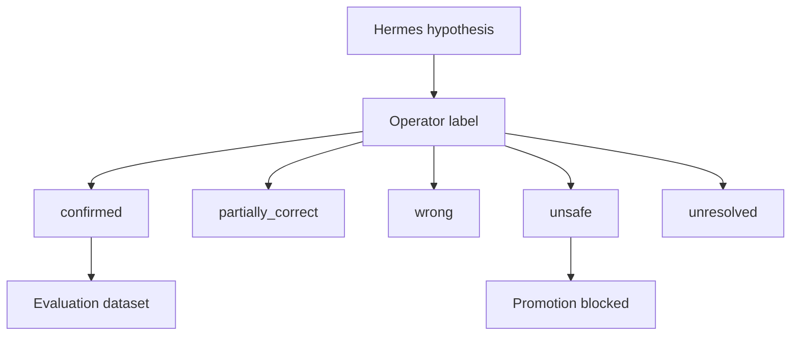

Operator memilih salah satu:

- `confirmed`: diagnosis dan langkah berikutnya tepat;
- `partially_correct`: hipotesis berguna tetapi belum lengkap;
- `wrong`: hipotesis salah;
- `unsafe`: usulan berisiko atau melanggar policy;
- `unresolved`: evidence belum cukup.

Feedback harus dikaitkan dengan evidence hash dan case ID. Tanpa feedback dan verification, kasus tidak boleh dipromosikan menjadi skill.

### 4. Promosi bertahap

Pengajuan kandidat skill ke issue GitHub (setelah sanitasi dan konfirmasi operator) dijelaskan di [skill-submission.md](skill-submission.md).

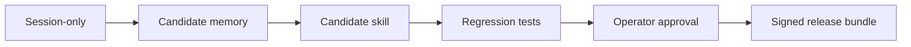

```text
session-only
  -> candidate memory
  -> candidate skill/playbook
  -> offline regression test
  -> operator approval
  -> approved rescue skill bundle
  -> signed USB release
```

Aturan promosi minimum:

- satu kasus tidak pernah langsung mengubah skill produksi;
- kandidat harus lolos schema dan secret scan;
- kandidat tidak boleh menambah executable command baru tanpa review;
- kandidat harus diuji terhadap kasus sebelumnya;
- minimal tiga kasus independen dengan outcome terverifikasi sebelum menjadi playbook default;
- kasus dengan label `unsafe` otomatis memblokir promosi.

## Struktur direktori yang disarankan

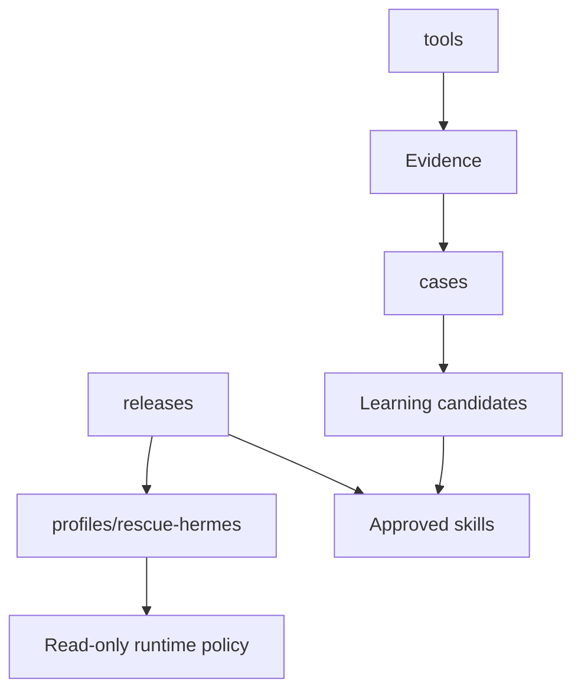

```text
rescue-omes/
  policy/
    allowed-checks.yaml
    approval-policy.yaml
    retention.yaml
  profiles/
    rescue-hermes/
      SOUL.md
      AGENTS.md
      skills/
        boot-diagnosis/SKILL.md
        disk-health/SKILL.md
        filesystem-recovery/SKILL.md
        network-rescue/SKILL.md
      config.yaml.template
  cases/
    sanitized/
    feedback/
    verification/
  learning/
    candidates/
    approved/
    eval/
  tools/
    collect-boot-evidence
    collect-disk-evidence
    collect-network-evidence
    verify-outcome
  releases/
    manifest.json
    checksums.txt
```

`profiles/rescue-hermes` dan `learning/approved` dipasang read-only ketika boot normal. Hanya `cases/`, `learning/candidates/`, dan session workspace yang writable.

## Konfigurasi Hermes pada USB

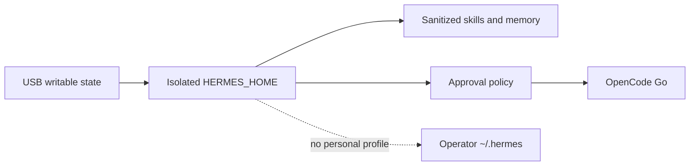

- Gunakan profile Hermes khusus rescue, bukan profile personal.
- Set `HERMES_HOME` ke partisi writable terenkripsi atau media penyimpanan terpisah.
- Nonaktifkan channel messaging dan webhook pada mode rescue kecuali operator mengaktifkannya secara eksplisit.
- Aktifkan memory/skills hanya untuk data yang sudah disanitasi.
- Provider utama: OpenCode Go melalui adapter resmi yang dikonfigurasi operator.
- `.env` lokal yang di-ignore dapat dipakai oleh preparation helper untuk memprovision hanya `OPENCODE_GO_API_KEY` ke `config/rescue.env` pada USB (mode `0600` diminta); helper tidak mengeksekusi isi dotenv, dan salinan bundle rescue memakai allowlist sehingga `.env` tidak pernah ikut tertulis. Skrip runtime membaca `config/rescue.env` dan `<state-dir>/hermes/env` lewat `scripts/lib/rescue-env.sh` (hanya key allowlist, tidak pernah dieksekusi sebagai shell). Gunakan `--no-provision-secrets` bila key tidak boleh ada di USB.
- Installer Hermes membuat autostart XFCE default dengan `--hardware-mode auto`, memakai state writable yang sudah dipasang.
- Jika internet/provider gagal, Hermes tetap menjalankan collector dan membuat laporan `manual_intervention`.
- Toolset default hanya `rescue_read_only`; tool mutating berada pada toolset terpisah dan selalu membutuhkan approval.
- Gunakan checkpoint sebelum tindakan yang disetujui dan lakukan read-back sesudahnya.

Jangan menyalin seluruh `~/.hermes` dari komputer utama ke USB. Gunakan profile terpisah agar session, memory, credential, dan skill personal tidak bocor silang.

## Kontrak tool

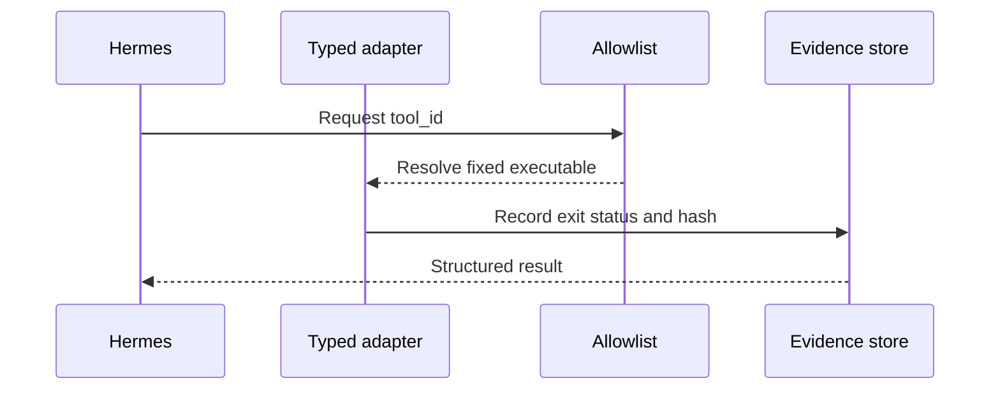

Setiap adapter tool mengembalikan struktur:

```json
{
  "tool_id": "filesystem-discovery",
  "request_id": "req-20260929-0001",
  "mode": "read_only",
  "target_opaque_id": "target-abc123",
  "started_at": "2026-09-29T10:30:00Z",
  "finished_at": "2026-09-29T10:30:01Z",
  "exit_class": "success",
  "evidence_refs": ["ev-0001"],
  "sha256": "..."
}
```

Hermes tidak boleh membuat `tool_id` atau `command` baru dari output model. Controller memetakan `tool_id` ke executable yang sudah dipaketkan dan checksum-nya dicatat di release manifest.

## Evaluasi kecerdasan

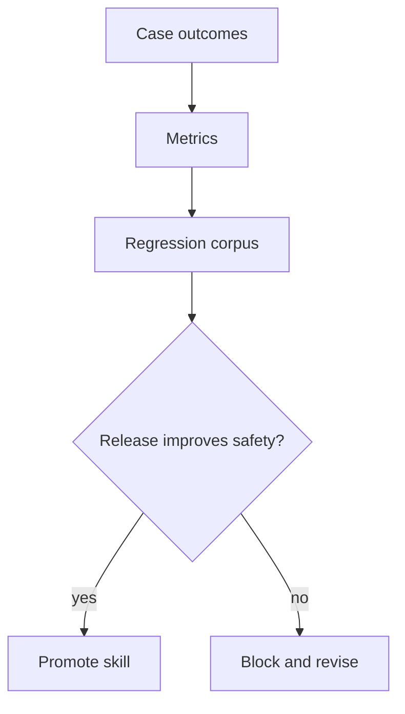

Jangan memakai “jawaban model terlihat pintar” sebagai metrik. Ukur:

- `diagnosis_precision`: proporsi hipotesis yang dikonfirmasi operator;
- `safe_next_check_rate`: usulan berikutnya valid, read-only, dan allowlisted;
- `unsafe_suggestion_rate`: saran yang melanggar policy;
- `verification_success_rate`: tindakan yang benar-benar terverifikasi;
- `false_repair_rate`: perubahan yang memperburuk atau tidak menyelesaikan masalah;
- `time_to_first_useful_evidence`;
- `provider_failure_rate`;
- `repeat_case_resolution_rate` setelah skill dipromosikan.

Sediakan dataset regresi anonim berisi signature dan expected safe checks, bukan raw disk data. Jalankan evaluasi setiap kali skill bundle atau prompt policy berubah.

## Contoh loop operasional

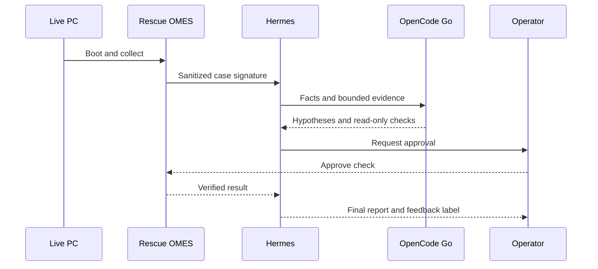

1. Boot USB Linux Mint XFCE.
2. Rescue OMES memeriksa checksum media, environment, network, dan tool manifest.
3. Hermes membuat `case_signature` dari evidence awal.
4. Hermes mengambil playbook yang sudah disetujui.
5. OpenCode Go menerima ringkasan tersanitasi dan diminta mengembalikan:
   - fakta;
   - hipotesis berperingkat;
   - evidence yang masih kurang;
   - check read-only berikutnya;
   - kondisi berhenti.
6. Operator menyetujui check berikutnya.
7. Controller menjalankan adapter typed, bukan command dari model.
8. Hermes memperbarui diagnosis.
9. Jika repair diperlukan, sistem membuat preview, backup/image reference, dan approval request.
10. Setelah tindakan, verifier membaca ulang state dan membuat `verification.json`.
11. Operator memberi label hasil.
12. Learning curator membuat candidate playbook; promosi dilakukan setelah evaluasi dan approval.

## Risiko utama dan mitigasi

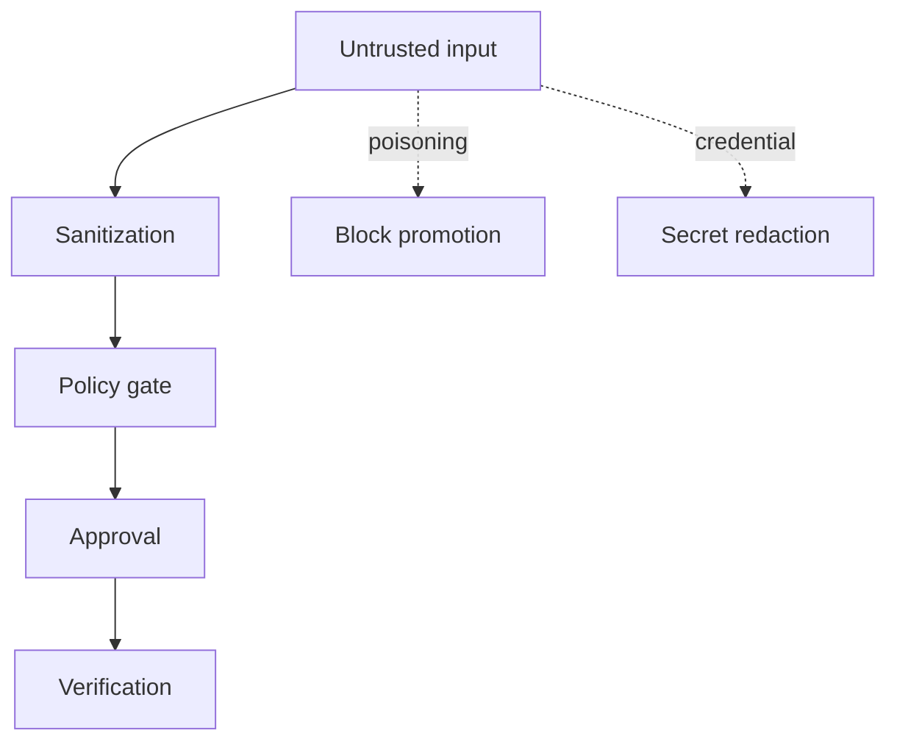

- **Memory poisoning:** hanya evidence yang disanitasi dan feedback terverifikasi yang boleh masuk candidate store.
- **Skill drift:** setiap skill memiliki versi, checksum, author/reviewer, dan tanggal review.
- **Prompt injection dari log:** semua log diperlakukan sebagai data tidak tepercaya; model tidak boleh mengikuti instruksi yang ditemukan dalam log.
- **Credential leakage:** credentials hanya di credential store/provider; tidak pernah ditulis ke case atau prompt artifact.
- **False confidence:** Hermes wajib membedakan fact, hypothesis, unknown, dan verified outcome.
- **Offline failure:** diagnosis tetap berjalan secara lokal; AI status berubah menjadi `manual_intervention`.
- **USB compromise:** signed manifest, checksum, encrypted writable partition, dan release rollback.
- **Overfitting:** skill baru diuji pada kasus lama dan kasus sintetis sebelum promosi.

## Roadmap implementasi

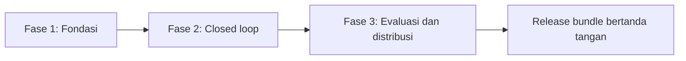

### Fase 1 — fondasi

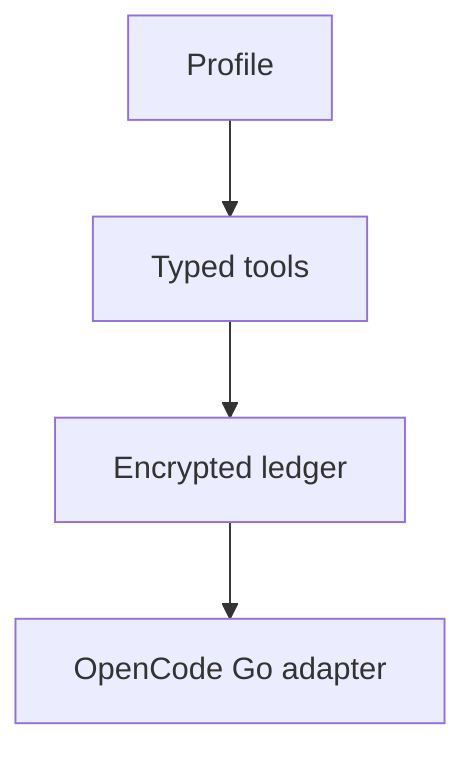
- [ ] profile `rescue-hermes` terpisah;
- [ ] typed read-only tool adapters;
- [ ] case/feedback/verification schemas;
- [ ] local encrypted ledger;
- [ ] OpenCode Go adapter dengan timeout dan sanitization.

### Fase 2 — closed learning loop

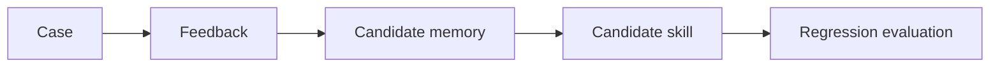
- [ ] case signature dan retrieval;
- [ ] candidate memory writer;
- [ ] candidate skill generator;
- [ ] operator feedback command;
- [ ] promotion gate dan rollback.

### Fase 3 — evaluasi berkelanjutan

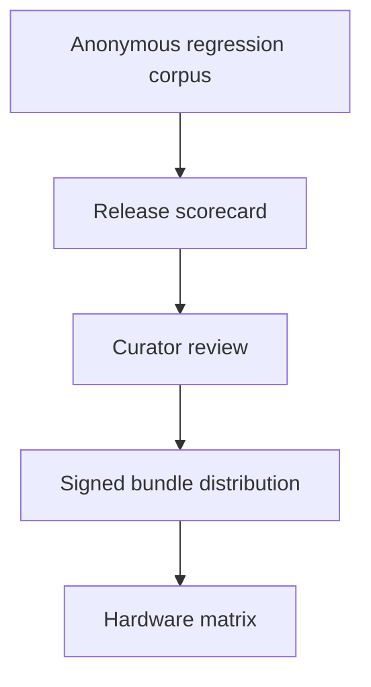
- [ ] regression corpus anonim;
- [ ] scorecard per release;
- [ ] skill curator terjadwal ketika USB online;
- [ ] signed bundle distribution;
- [ ] hardware lab matrix Pi 5/PC x86, SATA/NVMe, UEFI/BIOS.

## Keputusan desain

```mermaid
flowchart LR
    M[Memory terkurasi] --> I[Improved retrieval]
    S[Skill teruji] --> I
    F[Feedback terverifikasi] --> I
    I --> D[Diagnosis lebih aman]
    D -. no unreviewed self-modification .-> X[Control boundary]
```

Solusi ini membuat Hermes semakin cerdas terutama melalui **retrieval, memory terkurasi, skill yang terbukti, dan feedback terverifikasi**. Fine-tuning model OpenCode Go tidak diasumsikan tersedia atau diperlukan. Ini lebih aman, dapat diaudit, bisa berjalan offline untuk collection, dan mencegah satu diagnosis keliru menyebar menjadi aturan permanen.

## Referensi

```mermaid
flowchart TD
    H[Hermes docs] --> P[Provider and memory rules]
    O[OpenCode docs] --> G[Provider/model contract]
    V[Ventoy docs] --> U[USB boot workflow]
    L[Linux Mint docs] --> I[ISO verification]
```

- [Hermes Agent documentation index](https://hermes-agent.nousresearch.com/docs/llms.txt)
- [Hermes persistent memory](https://hermes-agent.nousresearch.com/docs/user-guide/features/memory?full=true)
- [Hermes skills system](https://hermes-agent.nousresearch.com/docs/user-guide/features/skills?full=true)
- [Hermes security](https://hermes-agent.nousresearch.com/docs/user-guide/security?full=true)
- [OpenCode Go](https://opencode.ai/docs/go)
