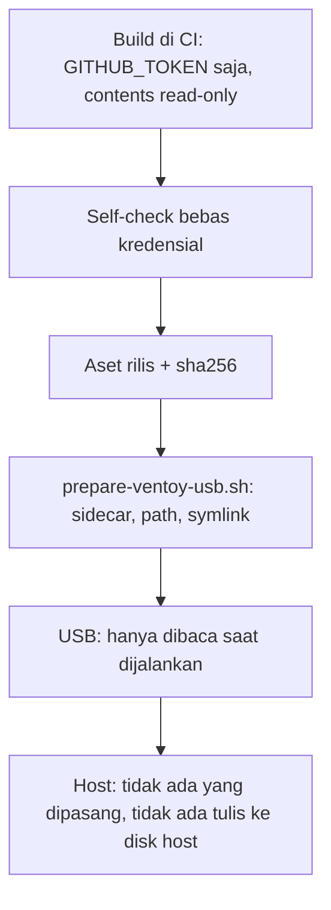

# Hermes portabel di USB untuk host launcher

> Managed by **ahlikoding.com** and **satpamsiber.com** from **ahliweb.com**.

Host launcher ([host launchers](host-launchers.md)) berjalan di Windows, macOS, atau Linux yang sedang menyala. Setelah pemindaian dan perbaikan selesai, operator ingin melanjutkan ke Hermes Agent tanpa memasang apa pun di komputer itu. Dokumen ini menjelaskan runtime Hermes **portabel dan bebas kredensial** yang dibangun di CI, dipasang ke partisi data USB oleh `scripts/prepare-ventoy-usb.sh --hermes-portable`, dan dijalankan langsung dari USB.

## Status

| Bagian | Status | Catatan |
| --- | --- | --- |
| `scripts/build-hermes-portable.py` (build, arsip, manifest, self-check, smoke test) | Implemented | Build `linux-x86_64` dijalankan dan diukur secara lokal; angka di bawah |
| `prepare-ventoy-usb.sh --hermes-portable` (sidecar sha256, penolakan path/symlink, read-back) | Implemented | Diuji tanpa perangkat nyata |
| Job CI `hermes-portable-linux` dan `hermes-portable-windows`, aset GitHub Release | Implemented di sumber; run pertama di GitHub | Environment-blocked di sini (butuh GitHub dan jaringan) |
| Build `windows-x86_64` | Environment-blocked | Hanya berjalan di runner `windows-2022`; belum pernah dijalankan di mesin ini |
| Menjalankan Hermes dari USB di Windows 10/11 sungguhan | Hardware-required | Perlu PC Windows nyata dan USB exFAT |
| Menjalankan dari USB exFAT di Linux dan macOS | Hardware-required | Build lokal diuji dari path lain di ext4, bukan dari exFAT |
| Panggilan model (OpenCode Go) dari runtime ini | Environment-blocked | Butuh API key operator dan biaya penyedia; tidak dipalsukan di sini |

## Alur


1. **Build (CI atau lokal).** Satu build per platform; build lintas platform ditolak.
2. **Aset rilis.** `rescue-omes-hermes-portable-linux-x86_64.tar.gz` dan `rescue-omes-hermes-portable-windows-x86_64.zip`, masing-masing dengan sidecar `.sha256`. Tidak ada paket OCI untuk ini; hanya aset GitHub Release.
3. **Pasang ke USB.** `prepare-ventoy-usb.sh` memverifikasi sidecar, menolak path berbahaya, membongkar ke `<usb>/rescue-omes/hermes-portable/<platform>/`, lalu membaca balik `tree_sha256` dan membandingkannya dengan `MANIFEST.json`.
4. **Host launcher** menjalankan entry di bawah dari USB.

## Kontrak layout (tetap)

```text
<usb>/rescue-omes/hermes-portable/<platform>/        platform = linux-x86_64 | windows-x86_64
  MANIFEST.json
  python/                      CPython standalone (python-build-standalone, via uv), relokatabel
    bin/python3                Linux
    python.exe                 Windows
    lib/python3.11/site-packages/  atau  Lib/site-packages/  (dependensi Hermes, terkunci dan ber-hash)
    hermes-agent/              source Hermes pada commit yang dipin (tanpa .git, tests, docs, UI web/TUI)
```

Entry point (jalankan dari USB, tanpa memasang apa pun di host):

| Platform | Perintah |
| --- | --- |
| `linux-x86_64` | `python/bin/python3 -m hermes_cli.main chat --cli ...` |
| `windows-x86_64` | `python\python.exe -m hermes_cli.main chat --cli ...` |

Catatan desain:

- **Hermes tidak bisa dipasang sebagai wheel.** `setup.py` upstream menolak `bdist_wheel`/`sdist`, dan aset (skills, locales, manifest plugin) dibaca dari tata letak source checkout. Karena itu source pada commit yang dipin disalin ke `python/hermes-agent/` dan ditambahkan ke `sys.path` lewat file `.pth` dengan **path relatif** di `site-packages` (jadi tetap benar di huruf drive atau mount point mana pun).
- **Dependensi** berasal dari `uv.lock` upstream (`uv export --frozen --no-dev --no-emit-project`) dan dipasang dengan `--require-hashes`: versi tepat dan hash, hanya set inti (tanpa extras berat). TUI Node tidak dipakai; launcher memakai `chat --cli`.
- **Tanpa venv dan tanpa symlink.** Semua symlink diganti salinan saat build dan build gagal bila masih ada symlink. Nama file divalidasi untuk exFAT/Windows (karakter terlarang, titik/spasi di akhir, nama perangkat seperti `aux`/`nul`, tabrakan huruf besar-kecil, path relatif maksimum 190 karakter). Direktori `share/terminfo` interpreter Linux dibuang karena `terminfo/Q` dan `terminfo/q` bertabrakan di exFAT.
- **Bytecode dikompilasi saat build** (`compileall`, mode `unchecked-hash`, path build dibuang dari `co_filename`), sehingga runtime memakai `PYTHONDONTWRITEBYTECODE=1` dari USB yang hampir read-only dan tidak bergantung pada cap waktu exFAT. Build menjalankan smoke test lalu memastikan hash pohon tidak berubah.
- **Dibuang untuk menghemat ruang:** `include/`, pustaka statis dan `config-*` CPython, `test`/`idlelib`/`turtledemo` stdlib, direktori `test`/`tests` di `site-packages`, skrip konsol (shebang path absolut), dan `python`/`python3.X` duplikat. `pip` dan `setuptools` tetap ada karena Hermes dapat memasang dependensi malas.
- Bit eksekusi di exFAT berasal dari opsi mount (Linux/macOS); di arsip tar bit itu tetap tercatat.

`MANIFEST.json`: `platform`, `hermes_ref`, `hermes_version`, `python_version`, `built_at` (UTC), `file_count`, `total_bytes`, `tree_sha256` (sha256 atas baris `relpath\0sha256\n` terurut, tanpa `MANIFEST.json` sendiri). Tidak ada nama host, nama pengguna, atau path build.

## Ukuran

Build lokal `linux-x86_64` (Hermes `0.20.6`, commit `178c23fb27c3c5ded9f6a3e096203c60cee6f235`, CPython `3.11.15`):

| Ukuran | Nilai |
| --- | --- |
| Terpasang di USB | 374.156.507 byte (sekitar 357 MiB), 13.540 berkas |
| Arsip `.tar.gz` | 131.671.619 byte (sekitar 126 MiB) |
| Waktu build | sekitar 90 detik dengan jaringan |
| Mulai dingin `--version` | sekitar 0,11 detik (cache halaman OS hangat; dari USB exFAT pertama kali lebih lambat) |

Ukuran Windows belum diukur (Environment-blocked); perkirakan serupa. Ambil angka sebenarnya dari ringkasan job CI.

## Model keamanan



- **Bebas kredensial.** Build memakai environment yang di-allowlist (tidak ada token), tidak membaca `config/rescue.env`, dan memindai hasilnya: pola token (GitHub, `sk-`, AWS, JWT, blok kunci privat), nama berkas `.env`/`*.env`/`rescue.env`/`auth.json`, direktori `.git`, symlink, dan path mesin build. Temuan gagal build; nilai tidak pernah dicetak. API key operator dimasukkan di sesi, tidak pernah ada di arsip.
- **Allowlist false positive** sempit dan terdokumentasi di `SECRET_ALLOWLIST`: path **dan** label temuan **dan** nilai harus cocok penuh. Hanya placeholder dokumentasi Hermes (`sk-xxxx...`), contoh `sk-proj-abcdef...` serta komentar blok kunci di `agent/redact.py` (modul yang justru menyamarkan rahasia), konstanta header OpenSSH di `cryptography`, dan token contoh jwt.io di METADATA PyJWT. Kunci sungguhan di path yang sama tetap ditolak (diuji).
- **Dependensi dikunci.** Versi tepat dan hash dari `uv.lock` upstream, commit upstream dipin penuh (40 hex) dan harus cocok setelah fetch. Pembaruan adalah perubahan sengaja pada konstanta `HERMES_REF`. Commit `main` upstream terbaru saat ini mengunci Python 3.14 saja, jadi pin tetap di rilis `0.20.6`.
- **Jalankan hanya dari USB.** Hermes tidak dipasang di host. Launcher harus mengarahkan `HERMES_HOME`, direktori sementara, dan cache ke USB, memakai `PYTHONDONTWRITEBYTECODE=1` dan `PYTHONNOUSERSITE=1`, dan tidak pernah menaikkan hak akses (lihat [host launchers](host-launchers.md)).
- **Pemasangan ke USB aman.** `prepare-ventoy-usb.sh` memerlukan sidecar `.sha256`, menolak nama arsip tak dikenal, path absolut, `..`, backslash, tipe berkas selain biasa/direktori (symlink, hardlink, perangkat), nama kredensial, dan campuran platform; membongkar ke direktori sementara, memverifikasi `tree_sha256` terhadap `MANIFEST.json`, baru menukar ke `<platform>/`, lalu membaca balik setelah `sync`. Pemasangan ulang bundel tidak menghapus runtime yang sudah ada. Seperti seluruh skrip itu, ia hanya menulis ke mount yang sudah diverifikasi operator.
- **Paket rilis.** Dibangun hanya di CI (`.github/workflows/package.yml`) dengan `GITHUB_TOKEN`, job build `contents: read`, aksi pihak ketiga dipin ke SHA penuh. `uv` di-bootstrap dari Python runner dengan versi dan hash wheel yang dipin (`--require-hashes`) sehingga tidak ada aksi baru; kompromi: hash diperbarui manual saat versi `uv` naik. Lihat [persistence](persistence.md#paket-github-tanpa-kredensial).

## Pemakaian

```bash
# Build lokal (Linux; perlu uv, git, dan jaringan)
python3 scripts/build-hermes-portable.py --platform linux-x86_64 --out /tmp/hp --archive

# Periksa arsip tanpa membongkar, lalu pasang ke USB bersama bundel
python3 scripts/build-hermes-portable.py --check-archive /tmp/hp/rescue-omes-hermes-portable-linux-x86_64.tar.gz
scripts/prepare-ventoy-usb.sh --ventoy-mount /media/$USER/Ventoy \
  --mint-iso /path/linuxmint-22.3-xfce-64bit.iso --sha256sums /path/sha256sum.txt --signature /path/sha256sum.txt.gpg \
  --no-provision-secrets \
  --hermes-portable /tmp/hp/rescue-omes-hermes-portable-linux-x86_64.tar.gz \
  --hermes-portable /tmp/hp/rescue-omes-hermes-portable-windows-x86_64.zip

# Baca balik pohon di USB terhadap manifestnya
python3 scripts/build-hermes-portable.py --verify-tree /media/$USER/Ventoy/rescue-omes/hermes-portable/linux-x86_64
```

Opsi `--hermes-portable` boleh diulang, satu kali per platform. Pada USB yang sudah dipakai, jalankan ulang dengan `--hermes-portable` untuk memperbarui runtime; tanpa opsi itu runtime yang sudah ada dipertahankan.

Mode lain skrip build: `--scan-tree DIR` (self-check bebas kredensial, symlink, nama exFAT), `--check-archive FILE`, `--extract-archive FILE --dest DIR`, `--verify-tree DIR`. Pengujian: `tests/test_hermes_portable.py` (fungsi murni, arsip, penolakan, opsi `prepare-ventoy-usb.sh`) dan `tests/test_package_workflow.py` ([testing](testing.md)).

## Batasan

- Hanya `x86_64`; macOS dan ARM tidak tercakup. macOS tidak tercakup oleh paket ini.
- Build tidak dapat dilakukan lintas platform; `windows-x86_64` hanya dari runner Windows.
- Hermes bukan paket yang didukung upstream untuk wheel/pip; pembaruan pin memerlukan build dan smoke test ulang.
- Ukuran besar (ratusan MiB terpasang); pastikan partisi data Ventoy punya ruang setelah ISO dan persistence image.
