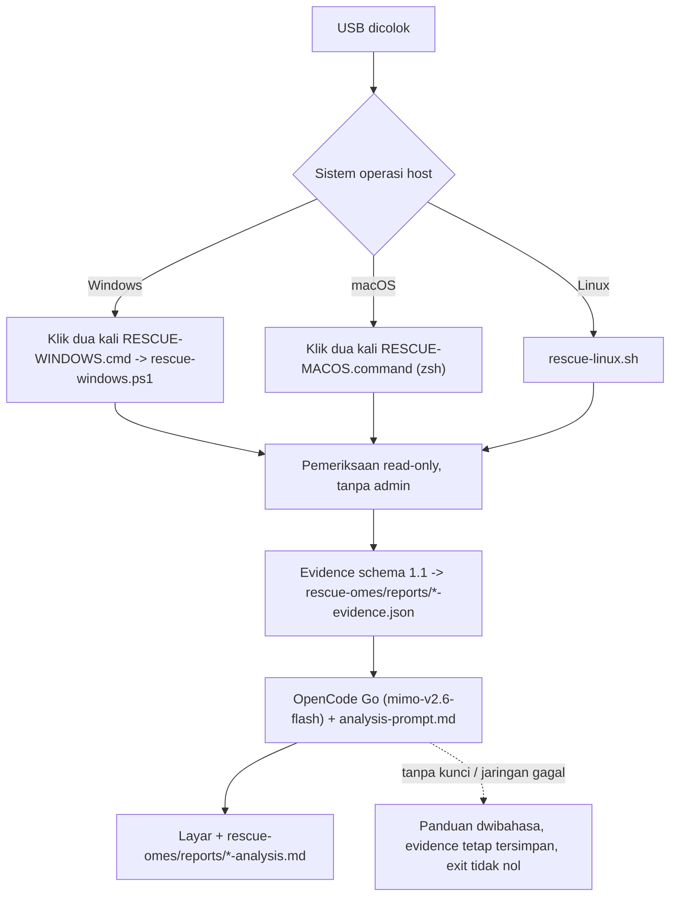

# Launcher host: Windows, macOS, dan Linux yang sedang berjalan

> Managed by **ahlikoding.com** and **satpamsiber.com** from **ahliweb.com**.

Dokumen ini menjelaskan cara memakai USB rescue pada komputer yang **sistem operasinya sedang hidup** (Windows 10/11, macOS 12+ Intel atau Apple Silicon, Linux termasuk Linux Mint), tanpa boot dari USB. Operator menancapkan USB, klik dua kali satu launcher, dan sisanya otomatis: pemeriksaan read-only khusus OS, evidence schema 1.1, panggilan langsung ke OpenCode Go (`mimo-v2.6-flash`) dengan system prompt bersama, lalu hasil analisis tampil di layar dan tersimpan di USB. Untuk boot dari USB dan memindai OS yang terpasang di disk internal, lihat [target-os-scan.md](target-os-scan.md).

Label status: **Implemented** (level source, dicakup `make check`), **Hardware-required** (butuh Windows/macOS nyata), **Environment-blocked** (butuh jaringan, API key, atau biaya provider). Lihat [testing](testing.md).

| Bagian | Status |
|---|---|
| `host/rescue-linux.sh` end-to-end (evidence, analyzer nyata `--dry-run`, server loopback palsu) | **Implemented** |
| `host/rescue-windows.ps1`: parse, fungsi murni, evidence-only lewat `pwsh` di Linux | **Implemented** (dilewati bila `pwsh` tidak terpasang) |
| `host/RESCUE-MACOS.command`: sintaks `zsh -n` dan eksekusi dengan shim perintah macOS | **Implemented** (dilewati bila `zsh` tidak terpasang) |
| Menjalankan launcher di **Windows 10/11 sungguhan** (CIM, BitLocker, Event Log, Defender, `powershell.exe` 5.1, SmartScreen) | **Hardware-required**, **tidak dijalankan** di lingkungan pengembangan |
| Menjalankan launcher di **macOS sungguhan** (`fdesetup`, `csrutil`, `diskutil`, `plutil`, `osascript`, Gatekeeper) | **Hardware-required**, **tidak dijalankan** di lingkungan pengembangan |
| Panggilan cloud sungguhan ke OpenCode Go | **Environment-blocked** (butuh API key dan jaringan; uji otomatis memakai server loopback palsu) |
| Menyalin launcher ke root USB | ditangani oleh `prepare-ventoy-usb.sh` (di luar dokumen ini) |



## Kenapa harus klik dua kali (tanpa AutoRun)

USB **tidak** menjalankan apa pun sendiri, dan ini disengaja:

- Windows menonaktifkan AutoRun untuk USB sejak Windows 7 (hanya CD/DVD yang masih memakai AutoPlay, dan tetap meminta persetujuan pengguna).
- macOS tidak punya mekanisme AutoRun sama sekali.
- Program yang berjalan otomatis dari media yang baru dicolok adalah pola serangan klasik; kami tidak ingin meniru pola itu.

Jadi **satu klik dua kali oleh operator tetap diperlukan**. Itu juga menjadi titik persetujuan eksplisit: tanpa klik, tidak ada yang dibaca dan tidak ada yang dikirim.

## Tata letak di USB

Launcher boleh diletakkan di root partisi data USB (exFAT) atau dijalankan dari `rescue-omes/host/`. Setiap launcher mencari bundle dengan urutan `<folder launcher>/rescue-omes`, lalu `<folder launcher>/..`; penanda bundle adalah `profiles/rescue-hermes/analysis-prompt.md`.

```
USB (exFAT)
|-- RESCUE-WINDOWS.cmd        (salinan dari host/, dijalankan di Windows)
|-- RESCUE-MACOS.command      (salinan dari host/, dijalankan di macOS)
`-- rescue-omes/
    |-- host/                 (rescue-windows.ps1, rescue-linux.sh, dan semua launcher)
    |-- scripts/  profiles/  rescue-ai/
    |-- config/rescue.env     (opsional, hanya jika kunci sengaja disediakan)
    `-- reports/              (SEMUA output: evidence dan analisis)
```

## Cara pakai

### Windows 10/11

1. Buka USB di File Explorer, klik dua kali `RESCUE-WINDOWS.cmd`.
2. Jendela konsol menampilkan ringkasan pemeriksaan, lalu analisis. Jendela tetap terbuka sampai ada tombol ditekan.

Tidak memerlukan hak administrator dan tidak pernah meminta elevasi. Pemeriksaan yang butuh admin (BitLocker via `Get-BitLockerVolume` atau `manage-bde -status`) dilaporkan `unknown`; jalankan launcher dari sesi admin yang sudah dibuka operator bila status itu penting. Jalur alternatif tanpa klik: `RESCUE-WINDOWS.cmd -EvidenceOnly` dari Command Prompt.

**SmartScreen:** file `.cmd` dan `.ps1` dari USB umumnya tidak diberi tanda "Mark of the Web", sehingga jarang memicu SmartScreen. Bila Windows menampilkan "Windows protected your PC", pilih **More info** lalu **Run anyway** hanya setelah operator memverifikasi bahwa USB adalah USB rescue milik sendiri. Kebijakan organisasi (AppLocker, WDAC, Constrained Language Mode) dapat memblokir skrip; jangan mengakalinya di komputer yang bukan milik operator. `-ExecutionPolicy Bypass` hanya berlaku untuk proses itu dan tidak mengubah kebijakan mesin.

### macOS 12+ (Intel dan Apple Silicon)

1. Klik dua kali `RESCUE-MACOS.command`; Terminal terbuka dan menjalankan launcher.
2. Tekan Return untuk menutup jendela di akhir.

Launcher tidak memerlukan Python; hanya alat bawaan macOS (`sw_vers`, `fdesetup`, `csrutil`, `diskutil`, `df`, `bless`, `ioreg`, `shasum`, `curl`, `plutil`/`osascript`).

**Gatekeeper:** bila macOS menolak ("cannot be opened because it is from an unidentified developer") klik kanan file, pilih **Open**, lalu **Open** lagi; atau **System Settings > Privacy & Security > Open Anyway**. Bila file diberi atribut karantina, `xattr -d com.apple.quarantine /Volumes/<USB>/RESCUE-MACOS.command` menghapusnya. exFAT biasanya tampil sebagai executable di macOS; bila klik dua kali membuka editor, pakai cadangan `chmod +x /Volumes/<USB>/RESCUE-MACOS.command`, atau jalankan `zsh /Volumes/<USB>/RESCUE-MACOS.command`. Terminal mungkin meminta izin akses ke volume removable.

### Linux dan Linux Mint (sesi yang sedang berjalan, bukan live USB)

```bash
/media/$USER/<USB>/rescue-omes/host/rescue-linux.sh
```

Manajer file biasanya membuka skrip di editor; jalankan dari terminal, atau tambahkan `--pause` bila dijalankan lewat "Run in terminal". Launcher memanggil `scripts/opencode-go-analyze.py` dari bundle (validasi schema dan panggilan cloud dilakukan di sana) dan memerlukan `python3` serta `python3-jsonschema`.

### Opsi

| Windows | macOS | Linux | Arti |
|---|---|---|---|
| `-EvidenceOnly` | `--evidence-only` | `--evidence-only` | Kumpulkan dan simpan evidence; **tanpa jaringan sama sekali** (`network-connectivity` menjadi `unknown`) |
| `-DryRun` | `--dry-run` | `--dry-run` | Seperti evidence-only, plus tampilkan apa yang akan dikirim (endpoint, model, ukuran, apakah kunci ada; nilai kunci tidak pernah ditampilkan). Tidak ada yang dikirim |
| `-BundleDir DIR` | `--bundle DIR` | `--bundle DIR` | Tentukan folder `rescue-omes` secara eksplisit |
| | `--no-pause` | `--pause` | Perilaku menunggu tombol di akhir |
| `-Scope LIST` | `--scope LIST` | `--scope LIST` | Cakupan deteksi: `all` (default), `hardware`, `hardware.cpu`, ..., `os`, `software`, `software.selected`, `malware` |
| `-Packages LIST` | `--packages LIST` | `--packages LIST` | Paket untuk `software.selected` |
| `-RepairPolicy P` | `--repair-policy P` | `--repair-policy P` | `detect-only`, `approve-each` (default), `auto-safe`. Linux menjalankan `scripts/rescue-repair.py`; Windows dan macOS menjalankan engine native ([host-repair.md](host-repair.md)). Journal ada di `reports/repairs/` |

### Kode keluar

| Kode | Arti |
|---|---|
| `0` | Berhasil (atau evidence-only / dry-run) |
| `2` | Evidence tidak valid; tidak ada yang dikirim |
| `3` | `OPENCODE_GO_API_KEY` tidak ditemukan; evidence tetap tersimpan, panduan dwibahasa dicetak |
| `4` | Jaringan atau HTTP error; evidence tetap tersimpan, panduan dwibahasa dicetak |
| `5` | Bundle tidak ditemukan atau `reports/` di USB tidak bisa ditulis (USB write-protect?) |
| `6` | (Linux) `scripts/opencode-go-analyze.py` tidak ada di bundle; evidence tetap tersimpan |
| `64` | Argumen salah (termasuk `--scope`/`--packages`/`--repair-policy` yang tidak valid), atau launcher macOS dijalankan bukan di macOS |

## Output (semuanya di USB)

Semua output ada di `rescue-omes/reports/`; stempel waktu adalah UTC `YYYYMMDDTHHMMSSZ`.

| File | Isi |
|---|---|
| `windows-<utc>-evidence.json`, `macos-<utc>-evidence.json`, `linux-<utc>-evidence.json` | Evidence schema 1.1 (`source_platform` `windows-host` / `macos-host` / `linux-host`) |
| `windows-<utc>-analysis.md`, `macos-<utc>-analysis.md`, `linux-<utc>-analysis.md` | Analisis model (Bahasa Indonesia) dengan catatan bahwa isinya hanya untuk dibaca |
| `*-evidence-after.json` | Evidence pemindaian ulang setelah minimal satu aksi perbaikan dieksekusi (untuk perbandingan sebelum/sesudah) |
| `run-<utc>/report.md`, `run-<utc>/report.json`, `index.md` | Laporan proses lengkap dan indeks semua run, ditulis di setiap akhir run termasuk yang gagal ([run-report.md](run-report.md)) |

Keluaran model **hanya ditampilkan dan disimpan sebagai teks**; tidak pernah dijalankan atau diparse sebagai perintah. Sesuai [analysis-prompt.md](../profiles/rescue-hermes/analysis-prompt.md), model tidak boleh menyarankan perintah shell atau langkah destruktif sebagai langkah pertama.

## Apa yang diperiksa (read-only)

Setiap evidence berisi satu `target_systems[]` (`os-0`, `detection: host-native`, `access: host-running`), semua check bersumber `host-allowlist`, dan `classification: confidential` (bukti yang dikirim ke cloud tidak boleh `restricted`). Hanya kode status dan angka; tidak ada username, nama komputer, path, serial, atau teks mentah. `target_device_opaque_id` adalah `target-` + 16 hex pertama SHA-256 dari MachineGuid (Windows), `IOPlatformUUID` (macOS), atau `/etc/machine-id` (Linux); nilai mentahnya tidak pernah dikeluarkan.

`encryption-status` / `macos-filevault` bernilai `pass` bila status enkripsi **berhasil ditentukan** (nilainya ada di `target_systems[].encryption`: `bitlocker`, `filevault`, `luks`, `none`) dan `unknown` bila tidak bisa ditentukan (misalnya tanpa admin di Windows). `disk-free-space` melaporkan persen **ruang bebas**: `warn` di bawah 10, `fail` di bawah 5. `unknown` selalu berarti "tidak dapat ditentukan tanpa hak tambahan", bukan "sehat".

| OS | Check |
|---|---|
| Windows | `os-detection`, `encryption-status` (`Get-BitLockerVolume`, cadangan `manage-bde -status` hanya menandai Protection On/Off, hanya admin), `disk-free-space`, `windows-fast-startup` (HiberbootEnabled=1: `warn`), `windows-pending-updates` (RebootPending/RebootRequired: `warn`), `windows-crash-dumps` (jumlah `Minidump\*.dmp`), `windows-event-log-errors` (log System level 1/2, 7 hari; lebih dari 0 `warn`, 50 atau lebih `fail`), `windows-defender-status`, `windows-update-service` (wuauserv Disabled: `warn`), `smart-health` (`Get-PhysicalDisk`), `network-connectivity` (TCP 443 ke `opencode.ai`) |
| macOS | `os-detection`, `macos-apfs-container`, `macos-filevault`, `macos-sip-status`, `macos-crash-reports` (jumlah saja, 7 hari; 3 atau lebih kernel panic: `fail`), `macos-startup-disk`, `disk-free-space`, `network-connectivity`. `macos-software-update` tidak dijalankan (lambat dan butuh jaringan) |
| Linux | `os-detection` (`linuxmint` atau `linux-other`), `disk-free-space`, `linux-failed-units`, `linux-journal-errors` (`unknown` tanpa izin membaca jurnal; 50 atau lebih `fail`), `linux-kernel-initrd`, `linux-package-state` (`dpkg --audit`), `encryption-status` (`lsblk`), `smart-health` (`unknown` tanpa root), `network-connectivity` |

Modul deteksi opsional (schema 1.2) ada di `host/modules/windows/*.ps1`, `host/modules/macos/*.zsh`, dan `scripts/rescue_modules/` (Linux). Keluarannya divalidasi sebagai data; modul yang gagal dilewati. Lihat [repair-framework.md](repair-framework.md).

## Kunci API dan USB yang membawa kredensial

Launcher membaca `rescue-omes/config/rescue.env` **sebagai data**, hanya kunci `OPENCODE_GO_API_KEY`, dengan aturan yang sama dengan `scripts/lib/rescue-env.sh`: awalan `export`, kutip `'...'` dan `"..."`, baris dengan `$` atau backtick yang akan diekspansi shell dilewati, tidak pernah `source`, `Invoke-Expression`, atau dot-source. Variabel lingkungan `OPENCODE_GO_API_KEY` yang sudah terisi diutamakan. Kunci tidak pernah ada di argumen perintah maupun log: Windows mengirimnya hanya di header `Authorization` di dalam proses; macOS lewat `curl --config -` (stdin); Linux lewat `scripts/opencode-go-analyze.py`.

**Bila kunci disediakan di USB, USB itu membawa kredensial.** Siapa pun yang memegang USB dapat membaca kunci; exFAT tidak menegakkan mode `0600`. Simpan USB di tempat aman, jangan pinjamkan, dan cabut kunci di sisi provider bila USB hilang. Tanpa kunci, launcher tetap menyimpan evidence dan mencetak panduan dwibahasa; evidence itu dapat dianalisis dari komputer lain. Jangan menyalin `rescue.env` ke media yang bukan milik operator.

## Apa yang ditulis ke komputer host

Launcher tidak memasang apa pun dan tidak menulis file ke disk host: tidak ada file sementara di host, evidence dan analisis langsung ke `rescue-omes/reports/` di USB, dan `TMPDIR` diarahkan ke `reports/` pada launcher Unix. Berkas permintaan sementara macOS dibuat di `reports/` dan dihapus setelah dipakai. Batasnya perlu dinyatakan jujur: sistem operasi host sendiri tetap dapat mencatat jejak yang tidak kami kendalikan (misalnya Prefetch dan cache modul PowerShell di Windows, unified log dan riwayat Terminal di macOS, riwayat shell dan jurnal di Linux, serta log keamanan atau EDR milik organisasi).

## Verifikasi

`make check` menjalankan `tests/test_host_launchers.py`. Yang **sudah** diverifikasi di level source:

- Linux: evidence valid terhadap schema, tidak memuat hostname/username, `--dry-run` lewat `opencode-go-analyze.py` yang asli, kode keluar 3/4/5/6, server loopback palsu (tanpa jaringan nyata).
- PowerShell (bila `pwsh` ada): parse, parser env-file sama dengan `rescue-env.sh` pada 22 kasus, serializer JSON, evidence yang dibangun valid terhadap schema, `-EvidenceOnly` end-to-end di Linux (semua check khusus Windows menjadi `unknown`).
- zsh (bila `zsh` ada): `zsh -n`, eksekusi penuh dengan shim untuk perintah macOS, kunci hanya di stdin `curl`, isi request JSON benar, parser kunci sama dengan bash.
- Statis: tidak ada `python3`/`source`/`eval`/`sudo` di launcher macOS, tidak ada file sementara di host, tidak ada Invoke-Expression atau elevasi.

**Belum** diverifikasi (Hardware-required): perilaku di Windows dan macOS sungguhan, termasuk versi Windows PowerShell 5.1, hasil `Get-BitLockerVolume`/`Get-WinEvent`/`Get-MpComputerStatus`, keluaran `fdesetup`/`csrutil`/`diskutil`/`bless` pada berbagai versi macOS, `plutil -extract`/`osascript` di macOS 12+, serta peringatan SmartScreen dan Gatekeeper. Jangan melaporkan launcher Windows atau macOS "teruji" sebelum ada bukti dari mesin nyata.
