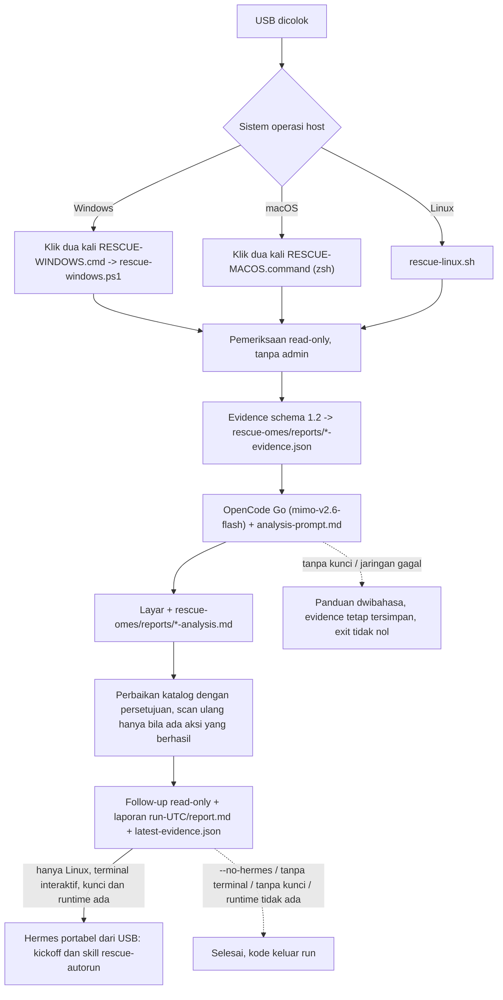

# Launcher host: Windows, macOS, dan Linux yang sedang berjalan

> Managed by **ahlikoding.com** and **satpamsiber.com** from **ahliweb.com**.

Dokumen ini menjelaskan cara memakai USB rescue pada komputer yang **sistem operasinya sedang hidup** (Windows 10/11, macOS 12+ Intel atau Apple Silicon, Linux termasuk Linux Mint), tanpa boot dari USB. Operator menancapkan USB, klik dua kali satu launcher, dan sisanya otomatis: pemeriksaan read-only khusus OS (dan modul hardware, software, malware sesuai `--scope`), evidence schema 1.2, panggilan langsung ke OpenCode Go (`mimo-v2.6-flash`) dengan system prompt bersama, hasil analisis tampil di layar dan tersimpan di USB, lalu perbaikan katalog hanya dengan persetujuan ([host-repair.md](host-repair.md)) dan laporan proses ([run-report.md](run-report.md)). Untuk boot dari USB dan memindai OS yang terpasang di disk internal, lihat [target-os-scan.md](target-os-scan.md).

Label status: **Implemented** (level source, dicakup `make check`), **Hardware-required** (butuh Windows/macOS nyata), **Environment-blocked** (butuh jaringan, API key, atau biaya provider). Lihat [testing](testing.md).

| Bagian | Status |
|---|---|
| `host/rescue-linux.sh` end-to-end (evidence, analyzer nyata `--dry-run`, server loopback palsu) | **Implemented** |
| `host/rescue-windows.ps1`: parse, fungsi murni, evidence-only lewat `pwsh` di Linux | **Implemented** (dilewati bila `pwsh` tidak terpasang) |
| `host/RESCUE-MACOS.command`: sintaks `zsh -n` dan eksekusi dengan shim perintah macOS | **Implemented** (dilewati bila `zsh` tidak terpasang) |
| Menjalankan launcher di **Windows 10/11 sungguhan** (CIM, BitLocker, Event Log, Defender, `powershell.exe` 5.1, SmartScreen) | **Hardware-required**, **tidak dijalankan** di lingkungan pengembangan |
| Menjalankan launcher di **macOS sungguhan** (`fdesetup`, `csrutil`, `diskutil`, `plutil`, `osascript`, Gatekeeper) | **Hardware-required**, **tidak dijalankan** di lingkungan pengembangan |
| Launcher Linux melanjutkan ke Hermes portabel di USB (argv, cwd, isolasi lingkungan, seeding `hermes-home/`, `--no-hermes`, `--hermes-only`; runtime palsu di uji) | **Implemented** di level source |
| Hermes portabel sungguhan dari USB (`hermes-portable/linux-x86_64`) di PC Linux nyata, termasuk sesi dengan provider | **Hardware-required** dan **Environment-blocked** (API key, jaringan, biaya provider) |
| Panggilan cloud sungguhan ke OpenCode Go | **Environment-blocked** (butuh API key dan jaringan; uji otomatis memakai server loopback palsu) |
| Perbaikan katalog, journal, dan laporan proses dari launcher | **Implemented** di level source; lihat [host-repair.md](host-repair.md) dan [run-report.md](run-report.md) |
| Menyalin launcher ke root USB | ditangani oleh `prepare-ventoy-usb.sh` (di luar dokumen ini) |



## Kenapa harus klik dua kali (tanpa AutoRun)

USB **tidak** menjalankan apa pun sendiri, dan ini disengaja:

- Windows menonaktifkan AutoRun untuk USB sejak Windows 7 (hanya CD/DVD yang masih memakai AutoPlay, dan tetap meminta persetujuan pengguna).
- macOS tidak punya mekanisme AutoRun sama sekali.
- Program yang berjalan otomatis dari media yang baru dicolok adalah pola serangan klasik; kami tidak ingin meniru pola itu.

Jadi **satu klik dua kali oleh operator tetap diperlukan**. Itu juga menjadi titik persetujuan eksplisit: tanpa klik, tidak ada yang dibaca dan tidak ada yang dikirim.

## Tata letak di USB

Launcher boleh diletakkan di root partisi data USB (exFAT) atau dijalankan dari `rescue-omes/host/`. Setiap launcher mencari bundle dengan urutan `<folder launcher>/rescue-omes`, lalu `<folder launcher>/..`; penanda bundle adalah `profiles/rescue-hermes/analysis-prompt.md`.

```
USB (exFAT)
|-- RESCUE-WINDOWS.cmd        (salinan dari host/, dijalankan di Windows)
|-- RESCUE-MACOS.command      (salinan dari host/, dijalankan di macOS)
`-- rescue-omes/
    |-- host/                 (rescue-windows.ps1, rescue-linux.sh, dan semua launcher)
    |-- scripts/  profiles/  rescue-ai/
    |-- config/rescue.env     (opsional, hanya jika kunci sengaja disediakan)
    `-- reports/              (SEMUA output: evidence dan analisis)
```

## Cara pakai

### Windows 10/11

1. Buka USB di File Explorer, klik dua kali `RESCUE-WINDOWS.cmd`.
2. Jendela konsol menampilkan ringkasan pemeriksaan, lalu analisis. Jendela tetap terbuka sampai ada tombol ditekan.

Tidak memerlukan hak administrator dan tidak pernah meminta elevasi. Pemeriksaan yang butuh admin (BitLocker via `Get-BitLockerVolume` atau `manage-bde -status`) dilaporkan `unknown`; jalankan launcher dari sesi admin yang sudah dibuka operator bila status itu penting. Jalur alternatif tanpa klik: `RESCUE-WINDOWS.cmd -EvidenceOnly` dari Command Prompt.

**SmartScreen:** file `.cmd` dan `.ps1` dari USB umumnya tidak diberi tanda "Mark of the Web", sehingga jarang memicu SmartScreen. Bila Windows menampilkan "Windows protected your PC", pilih **More info** lalu **Run anyway** hanya setelah operator memverifikasi bahwa USB adalah USB rescue milik sendiri. Kebijakan organisasi (AppLocker, WDAC, Constrained Language Mode) dapat memblokir skrip; jangan mengakalinya di komputer yang bukan milik operator. `-ExecutionPolicy Bypass` hanya berlaku untuk proses itu dan tidak mengubah kebijakan mesin.

### macOS 12+ (Intel dan Apple Silicon)

1. Klik dua kali `RESCUE-MACOS.command`; Terminal terbuka dan menjalankan launcher.
2. Tekan Return untuk menutup jendela di akhir.

Launcher tidak memerlukan Python; hanya alat bawaan macOS (`sw_vers`, `fdesetup`, `csrutil`, `diskutil`, `df`, `bless`, `ioreg`, `shasum`, `curl`, `plutil`/`osascript`).

**Gatekeeper:** bila macOS menolak ("cannot be opened because it is from an unidentified developer") klik kanan file, pilih **Open**, lalu **Open** lagi; atau **System Settings > Privacy & Security > Open Anyway**. Bila file diberi atribut karantina, `xattr -d com.apple.quarantine /Volumes/<USB>/RESCUE-MACOS.command` menghapusnya. exFAT biasanya tampil sebagai executable di macOS; bila klik dua kali membuka editor, pakai cadangan `chmod +x /Volumes/<USB>/RESCUE-MACOS.command`, atau jalankan `zsh /Volumes/<USB>/RESCUE-MACOS.command`. Terminal mungkin meminta izin akses ke volume removable.

### Linux dan Linux Mint (sesi yang sedang berjalan, bukan live USB)

```bash
/media/$USER/<USB>/rescue-omes/host/rescue-linux.sh
```

Manajer file biasanya membuka skrip di editor; jalankan dari terminal, atau tambahkan `--pause` bila dijalankan lewat "Run in terminal". Launcher memanggil `scripts/opencode-go-analyze.py` dari bundle (validasi schema dan panggilan cloud dilakukan di sana) dan memerlukan `python3` serta `python3-jsonschema` di komputer host.

**Hermes otomatis (Linux).** Setelah laporan proses ditulis, launcher membuka Hermes portabel dari USB dan Hermes langsung mengerjakan rekomendasi (kickoff `profiles/rescue-hermes/kickoff.md`, skill `rescue-autorun`). Keluar dengan `Ctrl+D` atau `/exit`. Urutan fase (`[N/8]`): kumpulkan evidence (bar waktu), validasi, analisis AI, perbaikan katalog, scan ulang, follow-up read-only (`scripts/rescue-followup.py --mode linux-host`), laporan proses, Hermes. Hermes dibuka hanya bila **semua** ini benar: stdin dan stdout adalah terminal, bukan `--no-hermes`, `--evidence-only`, atau `--dry-run`, kunci API ada, analisis tidak berakhir `no-key` atau `network-error`, journal perbaikan bisa dipakai, dan runtime `hermes-portable/linux-x86_64/python/bin/python3` ada di USB (`uname -m` = `x86_64`). Tanpa runtime, launcher mencetak catatan dwibahasa yang menunjuk dokumen Hermes portabel (berkas hermes-portable dari #68, `prepare-ventoy-usb.sh --hermes-portable`); itu bukan kegagalan dan kode keluar tidak berubah. Arsitektur lain mendapat catatan "runtime untuk arsitektur ini tidak ada di USB". Kode keluar Hermes sendiri hanya dicatat di log; kode keluar launcher tetap kode run.

- Perintah yang dijalankan (tanpa shell, kunci tidak pernah ada di argv): `<bundle>/hermes-portable/linux-x86_64/python/bin/python3 -m hermes_cli.main chat --cli --provider custom --model mimo-v2.6-flash -s rescue-autorun --query-file <bundle>/profiles/rescue-hermes/kickoff.md`, dengan cwd `reports/` (Hermes hanya melihat path relatif) dan stdout/stderr langsung ke terminal asli, bukan lewat log tee.
- Lingkungan hanya untuk proses Hermes: `HERMES_HOME=<bundle>/hermes-home`, `XDG_CACHE_HOME`, `XDG_DATA_HOME`, `XDG_STATE_HOME`, `XDG_CONFIG_HOME` di bawah `hermes-home/xdg/`, `TMPDIR=<bundle>/reports`, `PYTHONDONTWRITEBYTECODE=1`, `PYTHONNOUSERSITE=1`, `PYTHONSAFEPATH=1`. `HOME` tidak diubah: diuji dengan runtime sungguhan dan `HOME` palsu (`--version`, `chat --cli --help`, dan sesi kickoff nyata), tidak ada satu pun berkas dibuat di `HOME`. `OPENCODE_GO_API_KEY` diekspor hanya di lingkungan proses itu, dibaca sebagai data dari `config/rescue.env` lewat `scripts/lib/rescue-env.sh` (tidak pernah di-`source`), dan `RESCUE_GITHUB_ISSUES_TOKEN` di-`unset`.
- `hermes-home/` di USB diisi ulang di setiap run dari bundle: `SOUL.md`, `AGENTS.md`, `skills/<nama>/SKILL.md` untuk semua skill profil, dan `config.yaml` dari `config/hermes-rescue.config.yaml` (berkas milik profil ditimpa; memori, sesi, `state.db`, dan log dipertahankan). Mode `0700`/`0600` bila sistem file mendukung (exFAT tidak). Kunci tidak disalin ke `hermes-home/`.
- `--no-hermes`: jangan buka Hermes. `--hermes-only`: lewati pemindaian, analisis, dan perbaikan; buka Hermes pada laporan yang sudah ada di USB (untuk membuka Hermes lagi nanti). Tanpa laporan sebelumnya kode keluar `5`; Hermes tidak bisa dibuka (tanpa runtime, terminal, atau arsitektur) kode `6`; tanpa kunci kode `3`. Tidak boleh digabung dengan `--no-hermes`, `--evidence-only`, atau `--dry-run` (kode `64`).
- Scan ulang setelah perbaikan hanya terjadi bila minimal satu aksi run ini mencapai `stage: execute` dengan `outcome: ok` di journal (diparse sebagai JSON). Aksi yang gagal atau tidak tersedia tidak lagi memicu scan ulang. `latest-evidence.json` (salinan evidence run ini, setelah validasi) ditulis ke `reports/` untuk skill `rescue-autorun`.

**Tanpa `python3-jsonschema`** (diperiksa sekali di awal): launcher **tidak memasang apa pun** di host. Ia mencetak catatan dwibahasa (ID/EN) bahwa validasi schema, analisis AI, dan perbaikan katalog membutuhkannya; evidence tetap dikumpulkan (hanya pemeriksaan struktur internal), disimpan di USB, dan tidak ada panggilan jaringan. Analyzer dan engine perbaikan tidak dijalankan (bahkan `--list` tidak). Hasil run `dependency-missing`, kode keluar `6`, dan laporan memuat penanda Kejujuran `host-dependency-missing`. Analisis evidence itu dengan boot dari live USB rescue, atau dari PC lain yang punya `python3-jsonschema`. Dengan `--evidence-only` hasilnya tetap `evidence-only` dan kode `0` (daftar perbaikan dilewati).

### Opsi

| Windows | macOS | Linux | Arti |
|---|---|---|---|
| `-EvidenceOnly` | `--evidence-only` | `--evidence-only` | Kumpulkan dan simpan evidence; **tanpa jaringan sama sekali** (`network-connectivity` menjadi `unknown`) |
| `-DryRun` | `--dry-run` | `--dry-run` | Seperti evidence-only, plus tampilkan apa yang akan dikirim (endpoint, model, ukuran, apakah kunci ada; nilai kunci tidak pernah ditampilkan). Tidak ada yang dikirim |
| `-BundleDir DIR` | `--bundle DIR` | `--bundle DIR` | Tentukan folder `rescue-omes` secara eksplisit |
| | `--no-pause` | `--pause` | Perilaku menunggu tombol di akhir |
| `-Scope LIST` | `--scope LIST` | `--scope LIST` | Cakupan deteksi: `all` (default), `hardware`, `hardware.cpu`, ..., `os`, `software`, `software.selected`, `malware` |
| | | `--malware-full-disk` | Hanya Linux: pindai seluruh sistem (lambat) dengan ClamAV; Windows dan macOS memakai mesin bawaan OS ([malware.md](malware.md)) |
| `-Packages LIST` | `--packages LIST` | `--packages LIST` | Paket untuk `software.selected` |
| | | `--no-hermes` | Hanya Linux: jangan buka Hermes di akhir (bawaan: dibuka di terminal interaktif) |
| | | `--hermes-only` | Hanya Linux: lewati pemindaian, analisis, dan perbaikan; buka Hermes pada laporan yang ada |
| `-RepairPolicy P` | `--repair-policy P` | `--repair-policy P` | `detect-only`, `approve-each` (default), `auto-safe`. Linux menjalankan `scripts/rescue-repair.py` (persetujuan interaktif; launcher Linux tidak punya `--approve`, jalankan `rescue-repair.py` langsung bila perlu `--approve`, `--param`, atau `--backup-ref`); Windows dan macOS menjalankan engine native ([host-repair.md](host-repair.md)). Journal ada di `reports/repairs/` |

### Kode keluar

| Kode | Arti |
|---|---|
| `0` | Berhasil (atau evidence-only / dry-run) |
| `1` | Sebuah aksi perbaikan gagal atau di-rollback, di ketiga launcher ([host-repair.md](host-repair.md), [repair-framework.md](repair-framework.md)) |
| `2` | Evidence tidak valid (tidak ada yang dikirim), atau katalog perbaikan / pilihan aksi tidak valid |
| `3` | `OPENCODE_GO_API_KEY` tidak ditemukan; evidence tetap tersimpan, panduan dwibahasa dicetak |
| `4` | Jaringan atau HTTP error; evidence tetap tersimpan, panduan dwibahasa dicetak. Hasil di laporan proses: `network-error` (tanpa jawaban yang dapat dipakai, atau HTTP 401/403/408/429/5xx) atau `provider-rejected` (provider menjawab HTTP 4xx lain, mis. 400 `MissingSessionID`; pesan memuat kode HTTP dan tipe galat bila berupa token pendek, tidak pernah isi respons) |
| `5` | Bundle tidak ditemukan, `reports/` di USB tidak bisa ditulis (USB write-protect?), atau journal perbaikan tidak bisa ditulis |
| `6` | (Linux) `scripts/opencode-go-analyze.py` tidak ada di bundle (`analyzer-missing`), atau `python3-jsonschema` tidak ada di host (`dependency-missing`); evidence tetap tersimpan |
| `64` | Argumen salah (termasuk `--hermes-only` bersama `--no-hermes`, `--evidence-only`, atau `--dry-run`; `--scope`/`--packages`/`--repair-policy` yang tidak valid), atau launcher macOS dijalankan bukan di macOS |

Kode `3` dan `4` didahulukan atas `1` dan `2`: bila analisis gagal, kode analisis yang dilaporkan, dan hasil perbaikan tetap ada di journal dan laporan proses.

**Urutan hasil (semua launcher: Linux, Windows, macOS, dan live USB).** Hasil run di laporan adalah kegagalan **pertama** (pemindaian, evidence, kunci, jaringan, provider, analyzer). Kegagalan engine perbaikan (kode `2`: evidence, katalog, atau pilihan tidak valid) tidak lagi menimpa hasil itu: ia dicatat tambahan sebagai butir terbuka `repair-engine-failed` (`exit-2`) di laporan, dan kode keluar tetap kode kegagalan pertama. Bila tidak ada kegagalan sebelumnya, hasilnya `repair-invalid` dengan kode `2`. Journal yang tidak bisa dipakai mengalahkan semuanya: hasil `journal-unusable`, butir `repair-engine-failed` (`exit-3`), dan kode keluar `5`. Engine native Windows dan macOS memakai kode `5` untuk journal yang tidak bisa dipakai; launcher meneruskannya ke generator laporan sebagai `exit-3` (angka engine Python), dan kode `2` sebagai `exit-2`. `repair-invalid` hanya menggantikan `completed`, `evidence-only`, atau `dry-run`. Teks butir itu sama di tiga generator (Python, PowerShell, JXA); petunjuk "log launcher" di dalamnya hanya berlaku untuk launcher Linux dan live USB, karena launcher Windows dan macOS tidak menulis log. Launcher live USB tidak pernah memblokir Hermes, jadi hanya hasil di laporan yang mengikuti urutan ini (kode keluarnya tetap 0).

## Output (semuanya di USB)

Semua output ada di `rescue-omes/reports/`; stempel waktu adalah UTC `YYYYMMDDTHHMMSSZ`.

| File | Isi |
|---|---|
| `windows-<utc>-evidence.json`, `macos-<utc>-evidence.json`, `linux-<utc>-evidence.json` | Evidence schema 1.2 (`source_platform` `windows-host` / `macos-host` / `linux-host`) |
| `launcher-linux-<utc>.log` | Hanya Linux: semua yang dicetak launcher dan alat anak (stdout dan stderr) ditambahkan ke sini, `0600` bila sistem file mendukung mode (exFAT tidak), tidak pernah di disk host. Alat-alat itu tidak mencetak kunci API (diuji). Bila engine perbaikan berjalan interaktif (terminal), stdout-nya tampil di terminal saja (journal adalah catatannya); stderr-nya, tempat pesan galat, tetap masuk log |
| `reports/repairs/journal.jsonl`, `reports/malware-detections-<run>.json` | Journal perbaikan berantai hash; daftar deteksi malware LOKAL (`0600`, berisi path; jangan dibagikan) |
| `windows-<utc>-analysis.md`, `macos-<utc>-analysis.md`, `linux-<utc>-analysis.md` | Analisis model (Bahasa Indonesia) dengan catatan bahwa isinya hanya untuk dibaca |
| `*-evidence-after.json` | Evidence pemindaian ulang setelah minimal satu aksi perbaikan dieksekusi **dengan hasil `ok`** (untuk perbandingan sebelum/sesudah) |
| `latest-evidence.json`, `followup-<run_id>.json` | Hanya Linux: salinan evidence run ini dan hasil follow-up read-only ([learning loop](hermes-learning-loop.md)); dibaca skill `rescue-autorun` |
| `../hermes-home/` | Hanya Linux: `HERMES_HOME` Hermes portabel (profil, memori, sesi, `state.db`, log, `xdg/`), di `rescue-omes/`, bukan di `reports/` |
| `run-<utc>/report.md`, `run-<utc>/report.json`, `index.md` | Laporan proses lengkap dan indeks semua run, ditulis di setiap akhir run termasuk yang gagal ([run-report.md](run-report.md)) |

Keluaran model **hanya ditampilkan dan disimpan sebagai teks**; tidak pernah dijalankan atau diparse sebagai perintah. Sesuai [analysis-prompt.md](../profiles/rescue-hermes/analysis-prompt.md), model tidak boleh menyarankan perintah shell atau langkah destruktif sebagai langkah pertama.

## Apa yang diperiksa (read-only)

Setiap evidence berisi satu `target_systems[]` (`os-0`, `detection: host-native`, `access: host-running`), semua check bersumber `host-allowlist`, dan `classification: confidential` (bukti yang dikirim ke cloud tidak boleh `restricted`). Hanya kode status dan angka; tidak ada username, nama komputer, path, serial, atau teks mentah. `target_device_opaque_id` adalah `target-` + 16 hex pertama SHA-256 dari MachineGuid (Windows), `IOPlatformUUID` (macOS), atau `/etc/machine-id` (Linux); nilai mentahnya tidak pernah dikeluarkan.

`encryption-status` / `macos-filevault` bernilai `pass` bila status enkripsi **berhasil ditentukan** (nilainya ada di `target_systems[].encryption`: `bitlocker`, `filevault`, `luks`, `none`) dan `unknown` bila tidak bisa ditentukan (misalnya tanpa admin di Windows). `disk-free-space` melaporkan persen **ruang bebas**: `warn` di bawah 10, `fail` di bawah 5. `unknown` selalu berarti "tidak dapat ditentukan tanpa hak tambahan", bukan "sehat".

| OS | Check |
|---|---|
| Windows | `os-detection`, `encryption-status` (`Get-BitLockerVolume`, cadangan `manage-bde -status` hanya menandai Protection On/Off, hanya admin), `disk-free-space`, `windows-fast-startup` (HiberbootEnabled=1: `warn`), `windows-pending-updates` (RebootPending/RebootRequired: `warn`), `windows-crash-dumps` (jumlah `Minidump\*.dmp`), `windows-event-log-errors` (log System level 1/2, 7 hari; lebih dari 0 `warn`, 50 atau lebih `fail`), `windows-defender-status`, `windows-update-service` (wuauserv Disabled: `warn`), `smart-health` (`Get-PhysicalDisk`), `network-connectivity` (TCP 443 ke `opencode.ai`) |
| macOS | `os-detection`, `macos-apfs-container`, `macos-filevault`, `macos-sip-status`, `macos-crash-reports` (jumlah saja, 7 hari; 3 atau lebih kernel panic: `fail`), `macos-startup-disk`, `disk-free-space`, `network-connectivity`. `macos-software-update` tidak dijalankan (lambat dan butuh jaringan) |
| Linux | `os-detection` (`linuxmint` atau `linux-other`), `disk-free-space`, `linux-failed-units`, `linux-journal-errors` (`unknown` tanpa izin membaca jurnal; 50 atau lebih `fail`), `linux-kernel-initrd`, `linux-package-state` (`dpkg --audit`), `encryption-status` (`lsblk`), `smart-health` (`unknown` tanpa root), `network-connectivity` |

Modul deteksi opsional (schema 1.2) ada di `host/modules/windows/*.ps1`, `host/modules/macos/*.zsh`, dan `scripts/rescue_modules/` (Linux). Keluarannya divalidasi sebagai data; modul yang gagal dilewati. Lihat [repair-framework.md](repair-framework.md).

## Kunci API dan USB yang membawa kredensial

Launcher membaca `rescue-omes/config/rescue.env` **sebagai data**, hanya kunci `OPENCODE_GO_API_KEY`, dengan aturan yang sama dengan `scripts/lib/rescue-env.sh`: awalan `export`, kutip `'...'` dan `"..."`, baris dengan `$` atau backtick yang akan diekspansi shell dilewati, tidak pernah `source`, `Invoke-Expression`, atau dot-source. Variabel lingkungan `OPENCODE_GO_API_KEY` yang sudah terisi diutamakan. Setiap permintaan ke OpenCode Go juga membawa header `x-opencode-session: ses_` + 32 hex pertama dari sha256 evidence JSON yang dikirim (hash, bukan isi evidence; tanpa header ini provider menjawab HTTP 400 `MissingSessionID`); ketiga mesin (Python, PowerShell, JXA/zsh) menurunkannya dengan cara yang sama. Kunci tidak pernah ada di argumen perintah maupun log: Windows mengirimnya hanya di header `Authorization` di dalam proses; macOS lewat `curl --config -` (stdin); Linux lewat `scripts/opencode-go-analyze.py`.

**Bila kunci disediakan di USB, USB itu membawa kredensial.** Siapa pun yang memegang USB dapat membaca kunci; exFAT tidak menegakkan mode `0600`. Simpan USB di tempat aman, jangan pinjamkan, dan cabut kunci di sisi provider bila USB hilang. Tanpa kunci, launcher tetap menyimpan evidence dan mencetak panduan dwibahasa; evidence itu dapat dianalisis dari komputer lain. Jangan menyalin `rescue.env` ke media yang bukan milik operator.

## Apa yang ditulis ke komputer host

Launcher tidak memasang apa pun dan tidak menulis file ke disk host (termasuk Hermes: `HERMES_HOME`, cache XDG, dan `TMPDIR` semuanya di USB): tidak ada file sementara di host, evidence dan analisis langsung ke `rescue-omes/reports/` di USB, dan `TMPDIR` diarahkan ke `reports/` pada launcher Unix. Berkas permintaan sementara macOS dibuat di `reports/` dan dihapus setelah dipakai. Batasnya perlu dinyatakan jujur: sistem operasi host sendiri tetap dapat mencatat jejak yang tidak kami kendalikan (misalnya Prefetch dan cache modul PowerShell di Windows, unified log dan riwayat Terminal di macOS, riwayat shell dan jurnal di Linux, serta log keamanan atau EDR milik organisasi).

## Verifikasi

`make check` menjalankan `tests/test_host_launchers.py`. Yang **sudah** diverifikasi di level source:

- Linux: evidence valid terhadap schema, tidak memuat hostname/username, `--dry-run` lewat `opencode-go-analyze.py` yang asli, kode keluar 3/4/5/6, server loopback palsu (tanpa jaringan nyata); log launcher (ada, `0600`, tanpa kunci), satu `run_id` untuk evidence dan laporan (evidence sesudah perbaikan memakai `<run_id>-after`), SHA-256 katalog di header laporan (juga tanpa `python3-jsonschema`), dan urutan hasil di atas (analyzer 4/5 dan `no-key` dengan engine kode 2, `journal-unusable` mengalahkan); tanpa `python3-jsonschema` (stub yang gagal diimpor): catatan ID/EN, tidak ada permintaan ke server palsu, engine tidak jalan, hasil `dependency-missing`.
- Linux dan Hermes (`LinuxHermesTests`, runtime palsu di `hermes-portable/linux-x86_64/python/bin/python3` yang merekam argv, cwd, dan nama lingkungan, pada pseudo-terminal): argv persis, cwd `reports/`, `HERMES_HOME` dan XDG di bundle, kunci hanya di lingkungan (bukan argv, bukan log), `RESCUE_GITHUB_ISSUES_TOKEN` tidak ada, seeding `hermes-home/` (berkas profil ditimpa, memori dipertahankan), laporan, `index.md`, `latest-evidence.json`, dan follow-up sudah ada sebelum Hermes mulai, Hermes tidak dibuka dengan `--no-hermes`, `--evidence-only`, `--dry-run`, tanpa terminal, tanpa kunci, tanpa runtime, atau arsitektur lain (kode keluar tidak berubah), `--hermes-only`, dan scan ulang dilewati setelah aksi gagal tetapi dijalankan setelah aksi `ok`.
- Urutan hasil di Windows, macOS, dan live USB (`tests/test_run_report.py`, kelas `WindowsReportTests`, `MacReportTests`, `LiveLauncherReportTests`): `-Select`/`--select` yang tidak valid (engine kode 2) dengan `no-key`, `provider-rejected`, atau `network-error` mempertahankan hasil dan kode keluar pertama dan menambah butir `repair-engine-failed`; tanpa kegagalan sebelumnya hasilnya `repair-invalid` (kode 2); journal yang tidak bisa dipakai menghasilkan `journal-unusable` (kode 5) dan butir `exit-3`. Uji statis di `tests/test_host_launchers.py` memeriksa pola ini di keempat launcher tanpa `pwsh` atau `zsh`.
- PowerShell (bila `pwsh` ada): parse, parser env-file sama dengan `rescue-env.sh` pada 22 kasus, serializer JSON, evidence yang dibangun valid terhadap schema, `-EvidenceOnly` end-to-end di Linux (semua check khusus Windows menjadi `unknown`).
- zsh (bila `zsh` ada): `zsh -n`, eksekusi penuh dengan shim untuk perintah macOS, kunci hanya di stdin `curl`, isi request JSON benar, parser kunci sama dengan bash.
- Statis: tidak ada `python3`/`source`/`eval`/`sudo` di launcher macOS, tidak ada file sementara di host, tidak ada Invoke-Expression atau elevasi.

**Belum** diverifikasi (Hardware-required): perilaku di Windows dan macOS sungguhan, termasuk versi Windows PowerShell 5.1, hasil `Get-BitLockerVolume`/`Get-WinEvent`/`Get-MpComputerStatus`, keluaran `fdesetup`/`csrutil`/`diskutil`/`bless` pada berbagai versi macOS, `plutil -extract`/`osascript` di macOS 12+, serta peringatan SmartScreen dan Gatekeeper. Jangan melaporkan launcher Windows atau macOS "teruji" sebelum ada bukti dari mesin nyata.
