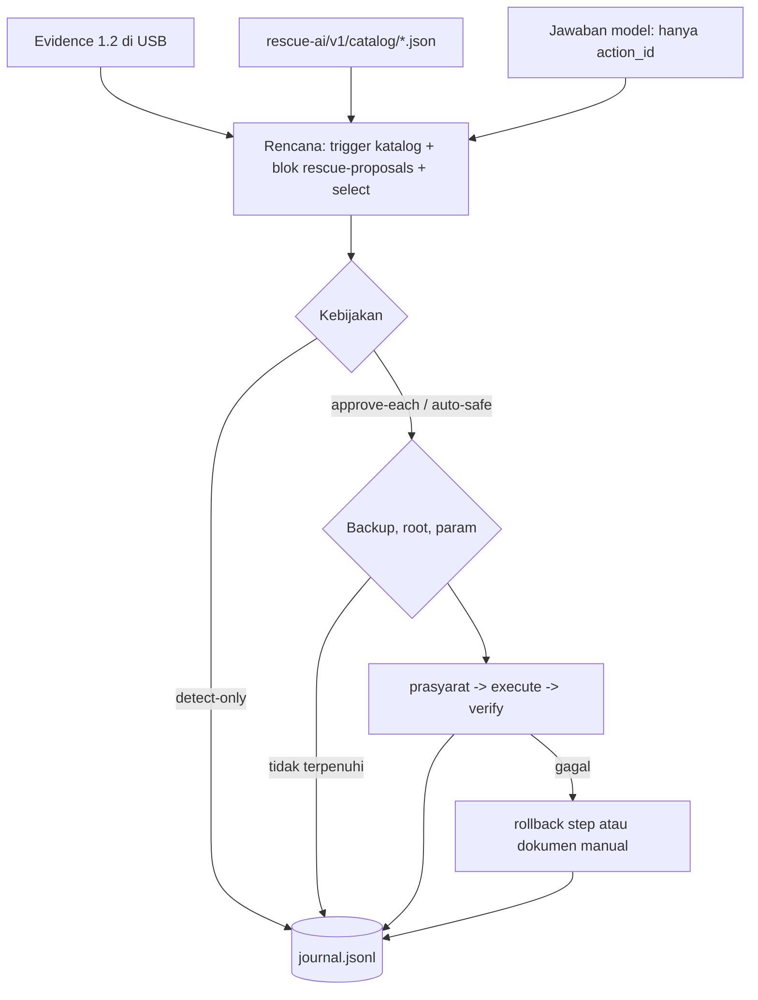

# Perbaikan (repair) di launcher host Windows dan macOS

> Managed by **ahlikoding.com** and **satpamsiber.com** from **ahliweb.com**.

Dokumen ini menjelaskan mesin perbaikan asli (native) di `host/rescue-windows.ps1` dan `host/RESCUE-MACOS.command`. Kontraknya sama dengan mesin Python `scripts/rescue-repair.py` (lihat [repair-framework.md](repair-framework.md)): perbaikan hanya berupa **aksi katalog bertipe** dengan argv tetap dari `rescue-ai/v1/catalog/*.json`. AI, log, nama file, atau isi web paling jauh hanya bisa menyebut `action_id`. Tidak ada Python di Windows/macOS, tidak ada shell, dan tidak pernah ada elevasi.

Label status: **Implemented** (level source, dicakup `make check`), **Hardware-required** (butuh Windows/macOS nyata), **Environment-blocked** (butuh jaringan, API key, atau biaya provider). Lihat [testing](testing.md).

| Bagian | Status |
|---|---|
| Muat katalog, pilih aksi `windows-host` / `macos-host`, usulan dari trigger katalog, blok `rescue-proposals` (4 KiB, 16 item, ID persis) | **Implemented** (diuji terhadap `repair_catalog.triggered` / `parse_ai_proposals`) |
| Kebijakan `detect-only`, `approve-each`, `auto-safe`; `-Approve` / `--approve`; persetujuan interaktif (`ya`/`yes`, ketik `action_id` untuk destructive) | **Implemented** (interaktif diuji lewat pty di Linux) |
| Referensi backup (`-BackupRef` / `--backup-ref`): ukuran + fingerprint, tidak pernah path | **Implemented** (fingerprint identik dengan `backup_fingerprint` Python) |
| Eksekusi tanpa shell, param bertipe, timeout, precondition, verify, rollback | **Implemented** (program palsu di Linux) |
| Journal `rescue-omes/reports/repairs/journal.jsonl` berantai hash | **Implemented** (`rescue-repair.py --verify-journal` menerima journal kedua launcher) |
| Daftar katalog ditambahkan ke pesan analisis (`CATALOG_PREFIX`, tanpa argv) | **Implemented** |
| Eksekusi perbaikan di **Windows 10/11 sungguhan** (`System.Diagnostics.Process`, PowerShell 5.1, program `.exe` asli) | **Hardware-required**, **tidak dijalankan** |
| Eksekusi perbaikan di **macOS sungguhan** (`osascript -l JavaScript` asli, `env -i`, program bawaan macOS) | **Hardware-required**, **tidak dijalankan** |
| Aksi `block_device` / `target_root` / `android_device` / `fastboot_device` / `fastboot_slot` / `firmware_file` / `sha256` / `printer_ref` / `bundle_root` / `requires_target_rw` di host | Tidak didukung; dicatat `target-rw unavailable provider-unavailable` (aksi Android hanya berlaku di `live-linux` dan `linux-host`, jadi tidak pernah diusulkan di Windows/macOS) |



## Cara pakai

Jalankan sebagai pengguna biasa (tidak pernah meminta hak administrator). Bila launcher sudah dijalankan dari sesi administrator/`root` yang dibuka operator sendiri, aksi dengan `requires_root` boleh berjalan; kalau tidak, aksi itu dicatat `unavailable` dan tidak ditanyakan.

| Windows | macOS | Arti |
|---|---|---|
| `-RepairPolicy P` | `--repair-policy P` | `detect-only`, `approve-each` (default), `auto-safe` |
| `-Approve ID[,ID]` | `--approve ID` (boleh diulang) | Setujui aksi ini untuk sesi ini (tanpa terminal, atau tanpa prompt) |
| `-Param ID.NAME=VALUE[,...]` | `--param ID.NAME=VALUE` (boleh diulang) | Nilai parameter bertipe (`enum`, `integer`, `package_name`, `service_name`) |
| `-BackupRef FILE` | `--backup-ref FILE` | File backup/image untuk aksi `destructive` |
| `-Select ID[:os-N]` | `--select ID[:os-N]` | Pilih aksi katalog secara manual; di host `:os-0` boleh dihilangkan |
| `-ListRepairs` | `--list-repairs` | Hanya tampilkan rencana; tidak menjalankan dan tidak menulis journal |
| `-EvidenceOnly` / `-DryRun` | `--evidence-only` / `--dry-run` | Juga hanya rencana (tanpa jaringan, tanpa eksekusi, tanpa journal) |
| `-Scope`, `-Packages` | `--scope`, `--packages` | Cakupan deteksi dan aksi; `software.selected` membatasi nama paket; `malware` memilih modul malware ([malware](malware.md)) |

Contoh:

```powershell
RESCUE-WINDOWS.cmd -ListRepairs
RESCUE-WINDOWS.cmd -Approve os-windows.sfc-verify
RESCUE-WINDOWS.cmd -Select sw.winget-upgrade-package -Param sw.winget-upgrade-package.package=Mozilla.Firefox -BackupRef D:\restore-point.txt -Scope software.selected -Packages Mozilla.Firefox
```

```bash
zsh RESCUE-MACOS.command --list-repairs
zsh RESCUE-MACOS.command --repair-policy detect-only --no-pause   # katalog macOS kosong: tidak ada aksi yang dapat dieksekusi
```

Daftar aksi aktual ada di katalog dan tercetak sebagai "Repair plan". `os-macos.json` sengaja kosong, jadi launcher macOS tidak punya aksi perbaikan untuk dieksekusi ([os-repair.md](os-repair.md)); flag perbaikan macOS tetap berlaku bila katalog kelak berisi aksi.

## Kebijakan

| Kebijakan | Perilaku |
|---|---|
| `detect-only` | Usulan dicatat (`proposed`, lalu `approval skipped policy-detect-only`); tidak ada yang dijalankan |
| `approve-each` (default) | Tiap aksi perlu persetujuan: prompt interaktif (`ya`/`yes`) atau `-Approve` / `--approve`. Aksi `destructive` mewajibkan mengetik `action_id`. Bila dua atau lebih aksi `safe` menunggu, launcher menampilkan tabel semua usulan lalu bertanya sekali "Setujui semua N aksi aman (safe) sekaligus? / Approve all N safe actions at once? [Y/n]" (Enter = ya, hanya untuk pertanyaan ini; akhir input = tidak): ya mencatat tiap aksi `approval ok operator-approved-batch`, tidak kembali ke prompt per aksi. Karantina (`mw.quarantine-*`), `reversible`, `irreversible`, `destructive`, aksi dengan `-Approve`, aksi yang butuh hak administrator/root yang tidak ada, dan aksi yang tidak didukung host tidak pernah masuk batch. Tanpa terminal dan tanpa flag approve: `declined not-interactive` |
| `auto-safe` | Hanya aksi `safe` yang berasal dari **trigger katalog**, tanpa parameter yang hilang. Usulan AI, aksi `-Select`, serta semua aksi `reversible`/`destructive` tetap mengikuti `approve-each` |

Aksi `destructive` juga butuh `-BackupRef` / `--backup-ref`. Journal hanya menyimpan ukuran dan fingerprint (SHA-256 dari ukuran + NUL + 1 MiB pertama + 1 MiB terakhir), bukan path. Setiap aksi yang dieksekusi diikuti langkah `verify`; bila execute atau verify gagal, langkah `rollback` otomatis dijalankan bila ada, atau dicatat `manual-rollback-required` dan dokumennya ditampilkan.

Setiap aksi yang dijalankan didahului satu baris judul `[i/N] action_id  risk=...  menjalankan / running` di stdout (`i` = urutan usulan, `N` = jumlah usulan).

## Keamanan eksekusi

- **argv dari katalog saja.** Placeholder (`{nama}` atau `--opt={nama}`) selalu tetap **satu** elemen argv; nilai lolos validasi tipe yang sama dengan `repair_catalog.validate_param` (nama paket tidak boleh diawali `-` atau diakhiri `-`).
- **Tanpa shell.** Windows: `System.Diagnostics.Process` dengan `UseShellExecute = $false`, stdin ditutup, environment minimal. Karena Windows PowerShell 5.1 tidak punya `ArgumentList`, baris perintah disusun dengan aturan quoting MSVCRT (`CommandLineToArgvW`: spasi, tanda kutip, backslash sebelum tanda kutip dan di akhir) dan diuji dengan parser referensi independen. macOS: array argv dijalankan langsung lewat `env -i` (environment kosong, `PATH` tetap), tidak lewat shell.
- **Program native saja.** Windows: `System32` lebih dulu, lalu `Get-Command -CommandType Application`, hanya `.exe`/`.com` (bukan `.cmd`/`.bat`/`.ps1`). macOS: path absolut di `/usr/bin /bin /usr/sbin /sbin`. Daftar `FORBIDDEN_PROGRAMS` (shell, interpreter, `sudo`, `curl`, `dd`, ...) ditolak lagi di launcher.
- **Tidak pernah elevasi.** `requires_root` hanya berjalan bila launcher sudah elevated (Windows `Test-IsAdmin`) atau `euid` 0 (macOS); kalau tidak, aksi tidak ditanyakan dan tidak dijalankan: `approval unavailable needs-root` (alasan baru di ahliweb/linux-mint-xfce-rescue-ai#70, menggantikan `not-applicable`), dan daftar "Repair plan" menandainya `(perlu root / needs root)`. Mesin Python melakukan hal yang sama untuk `linux-host` dengan memeriksa `sudo -n true` sekali per run ([repair-framework.md](repair-framework.md#pengalaman-operator-precheck-root-pemilih-disk-persetujuan-massal)).
- **Tidak didukung di host:** `block_device`, `target_root`, `android_device`, `fastboot_device`, `fastboot_slot`, `firmware_file`, `sha256`, `printer_ref`, `bundle_root`, `requires_target_rw` (dan bidang `guards` serta `expect_line` yang hanya dibaca mesin Python): dicatat `target-rw unavailable provider-unavailable`. Kedua mesin menerima domain katalog `android` dan tipe parameter itu supaya katalog bersama tetap termuat.
- **Output tidak disimpan.** Journal hanya berisi `exit_code`, durasi, ukuran dan SHA-256 output. Output mentah ditampilkan (baris terakhir, karakter kontrol dibuang). Di macOS output sementara ditulis ke `reports/` di USB lalu dihapus (tidak pernah ke disk Mac).
- **Timeout** per langkah (default 60 dtk precondition, 300 execute, 120 verify, 300 rollback, atau `timeout_seconds` dari katalog); proses yang melewati batas dimatikan dan dicatat `timeout`.

## macOS: perencana JavaScript (JXA)

Launcher macOS tidak memakai Python. Katalog, evidence, dan jawaban model diparse oleh `osascript -l JavaScript` (bawaan macOS 12+), yang hanya **mencetak rencana** berbasis baris (dipisah tab). Shell lalu menjalankannya:

| Baris | Isi |
|---|---|
| `ERR<TAB>pesan` | Katalog tidak valid (tidak ada yang dijalankan, kode keluar 2) |
| `SELERR<TAB>pesan` | `--select` salah (kode keluar 2) |
| `REJ<TAB>n` | Jumlah usulan AI yang ditolak |
| `PROP<TAB>id<TAB>origin<TAB>target` | Usulan berurutan: trigger katalog, AI, lalu `--select` (tanpa duplikat) |
| `ACT`, `PAR`, `STP` | Metadata aksi, parameter, dan langkah (`STP` membawa argv dipisah karakter `0x1f`) |

Mode `prompt` mencetak daftar aksi untuk pesan analisis (JSON `indent=1`, kunci terurut, tanpa argv). Di lingkungan pengembangan Linux perintah `osascript` digantikan shim `tests/host_osascript_shim.js` yang menjalankan **kode JavaScript yang sama** lewat `node`; perilaku JXA di macOS sungguhan tetap **Hardware-required**.

## Journal

`rescue-omes/reports/repairs/journal.jsonl`: satu rekaman JSON per tahap (`proposed`, `approval`, `backup`, `target-rw`, `precondition`, `execute`, `verify`, `rollback`), format persis sama dengan mesin Python (JSON ringkas, kunci terurut, `seq`, `prev_sha256` = SHA-256 baris sebelumnya, `journal_version` `"1"`, `platform` `windows-host` / `macos-host`, `catalog_sha256` = SHA-256 dari nama + NUL + isi + NUL tiap `*.json` terurut). Periksa keutuhannya di PC mana pun yang punya Python:

```bash
python3 scripts/rescue-repair.py --verify-journal <USB>/rescue-omes/reports/repairs/journal.jsonl
```

Catatan: journal ditulis dengan `fsync` (Windows: kunci berkas eksklusif; macOS: `sync` setelah tiap rekaman, tanpa `flock`, jadi jangan menjalankan dua launcher sekaligus pada USB yang sama). exFAT tidak menegakkan mode `0600`; USB yang dibawa adalah sumber kepercayaan fisik.

## Kode keluar

| Kode | Arti |
|---|---|
| `0` | Berhasil; tidak ada aksi yang gagal (atau hanya rencana) |
| `1` | Sebuah aksi gagal atau di-rollback (bila kode lain `0`) |
| `2` | Evidence, katalog, atau `-Select` / `--select` tidak valid; tidak ada yang dijalankan |
| `3` / `4` | Tidak ada API key / galat jaringan (fase perbaikan tetap berjalan untuk usulan trigger katalog; kode ini yang dikembalikan) |
| `5` | Bundle, `reports/`, atau journal tidak bisa ditulis (mengalahkan kode lain) |
| `64` | Argumen salah (termasuk `-Param` / `--param` yang bukan `ACTION_ID.NAME=VALUE`) |

## Verifikasi

`make check` menjalankan `tests/test_host_repair.py` dengan katalog fixture di salinan bundle (katalog asli tidak dipakai): rencana vs `repair_catalog.triggered`, parser AI vs `parse_ai_proposals`, hash katalog dan fingerprint backup identik dengan Python, journal diverifikasi `rescue-repair.py --verify-journal`, policy, param, backup, timeout, rollback, quoting Windows, dan persetujuan interaktif lewat pty. Yang **belum** diverifikasi (Hardware-required): perilaku di Windows dan macOS sungguhan, termasuk PowerShell 5.1, `System.Diagnostics.Process` dengan program `.exe` asli, `osascript` JXA asli, Gatekeeper/SmartScreen, dan program perbaikan bawaan sistem.
