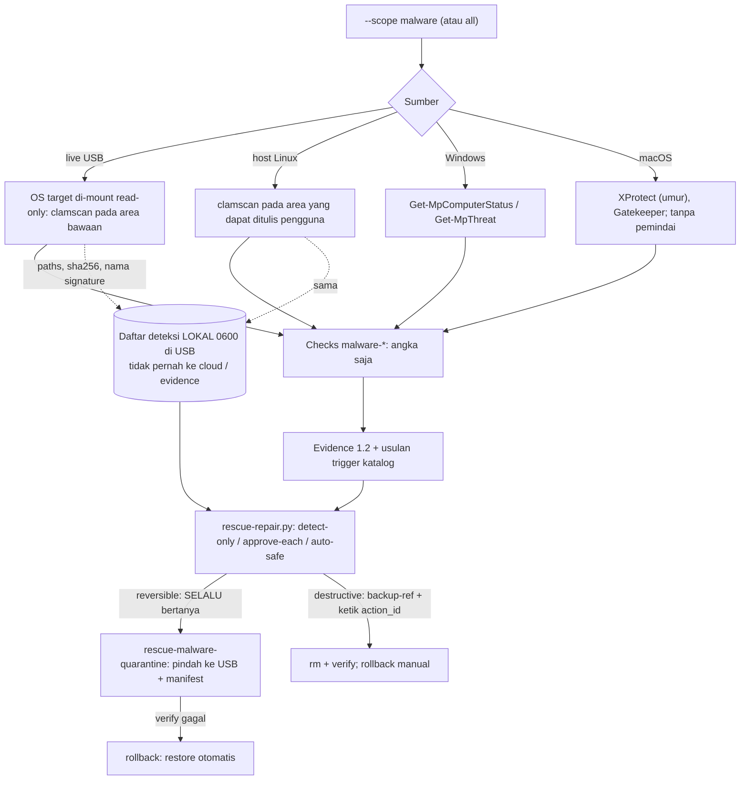

# Malware: deteksi, karantina, dan penghapusan (opsional)

> Managed by **ahlikoding.com** and **satpamsiber.com** from **ahliweb.com**.

Dokumen ini menjelaskan modul malware (ahliweb/linux-mint-xfce-rescue-ai#20) yang dibangun di atas kontrak di [repair-framework](repair-framework.md). Ada dua mode, dipilih operator: **deteksi saja**, atau **deteksi + perbaikan**. Deteksi selalu **read-only**. Perbaikan hanya berupa **aksi katalog bertipe** (`rescue-ai/v1/catalog/malware.json`, prefix `mw`, scope `malware`) yang berjalan lewat `scripts/rescue-repair.py` dan dicatat di journal. AI hanya boleh mengusulkan `action_id`; ia tidak pernah membuat perintah, path, atau parameter.

Label status: **Implemented** (tingkat source, `make check`), **Hardware-required** (perlu PC/OS/disk nyata), **Environment-blocked** (perlu jaringan atau provider), **Planned**.

## Keputusan operator (tetap)

- **Karantina selalu bertanya.** `mw.quarantine-*` bersifat `reversible`, jadi kebijakan opt-in `auto-safe` pun tidak pernah menjalankannya otomatis (`auto-safe` hanya menjalankan aksi `safe` dari trigger katalog).
- **Hapus / disinfeksi di tempat** bersifat `destructive`: `--backup-ref`, persetujuan dengan mengetik `action_id`, dan verifikasi baca-ulang. **Tidak ada penghapusan otomatis penuh.**
- **Hasil bersih bukan bukti bebas malware.** Rootkit dan implan firmware di luar cakupan. Database tanda tangan yang basi memberi `warn`, tidak pernah `pass` bersih.

| Bagian | Status |
|---|---|
| Check `malware-scan`, `malware-signatures`, `malware-realtime-protection`, `malware-quarantine` (evidence 1.2, angka saja) | Implemented |
| Modul ClamAV `scripts/rescue_modules/malware.py`: OS target Linux/Windows/macOS di-mount read-only (live USB) dan sistem Linux host | Implemented (fake `clamscan` di uji); ClamAV nyata dan disk nyata Hardware-required |
| Daftar deteksi LOKAL `malware-detections-<run>.json` (0600) + tipe parameter `detection_ref` (engine Python, Windows, macOS) | Implemented |
| Karantina `mw.quarantine-target-detection` (live USB) dan `mw.quarantine-detection` (host Linux) lewat `rescue-malware-quarantine`, restore dan rollback | Implemented; mount read-write nyata Hardware-required |
| Hapus `mw.delete-target-detection` / `mw.delete-detection` (`destructive`) | Implemented; rollback manual |
| `mw.clamav-update-signatures` (freshclam ke `<state-dir>/clamav/`) | Implemented di katalog dan engine; unduhan nyata Environment-blocked |
| Modul Windows `host/modules/windows/malware.ps1` (Microsoft Defender) dan aksi `mw.defender-*` | Implemented (fixture di pwsh); Defender nyata Hardware-required |
| Modul macOS `host/modules/macos/malware.zsh` (XProtect, Gatekeeper) | Implemented (shim di zsh); macOS nyata Hardware-required. Tidak ada mesin pemindai: `malware-scan` `unknown` |
| Paket `clamav`, `clamav-freshclam` di image persistence | Implemented (skrip build); build docker dan boot nyata Hardware-required / Environment-blocked |
| Perbaikan malware di Windows/macOS lewat berkas terdeteksi (karantina/hapus) | Tidak ada: tidak dapat dinyatakan sebagai argv tetap yang jujur (lihat bawah) |



## Yang dideteksi dan yang tidak

- Dideteksi: berkas yang cocok dengan tanda tangan ClamAV (atau Microsoft Defender di Windows) di area yang dipindai. Bukan pemeriksaan perilaku, bukan pemeriksaan integritas sistem.
- **Tidak dideteksi**: rootkit, bootkit, implan firmware/UEFI, malware yang hanya ada di memori, malware di area yang tidak dipindai, berkas di atas batas ukuran, dan malware yang belum punya tanda tangan. Berkas terenkripsi (BitLocker, LUKS, FileVault) tidak pernah dibuka (`access: not-mounted-encrypted`).
- macOS: tidak ada mesin pemindai. Yang dibaca hanya umur bundel XProtect dan status Gatekeeper.
- Hasil `pass` berarti "tidak ada temuan pada area yang dipindai dengan tanda tangan yang cukup baru", bukan "bebas malware".

## Mode dan cakupan

```bash
# Deteksi saja (tidak ada yang dijalankan atau diubah)
python3 scripts/scan-target-os.py --output /tmp/ev.json --scope malware --state-dir "$HOME/.local/share/rescue-omes"
python3 scripts/rescue-repair.py --evidence /tmp/ev.json --scope malware --policy detect-only --state-dir "$HOME/.local/share/rescue-omes"

# Deteksi + perbaikan (live USB; launcher membuat evidence, lalu bertanya per aksi)
launch-hermes-rescue.sh --scope malware
launch-hermes-rescue.sh --scope malware --malware-full-disk      # seluruh partisi (lambat)
launch-hermes-rescue.sh --scope malware --malware-full-disk --malware-target os-1   # hanya satu target (os-N di evidence)

# Host Linux
./rescue-linux.sh --scope malware
./rescue-linux.sh --scope malware --malware-full-disk

# Windows / macOS
.\rescue-windows.ps1 -Scope malware
./RESCUE-MACOS.command --scope malware
```

`--scope malware` memilih hanya modul malware. `--scope all` (bawaan) ikut memindai malware, sehingga waktu boot awal bertambah; pakai `--scope os,software` bila tidak diperlukan. Daftar `--scope` lain tetap ([repair framework](repair-framework.md#scope)).

### Area yang dipindai (bawaan)

Area bawaan sengaja sempit agar pemindaian selesai. Semuanya relatif terhadap root target yang di-mount read-only; setiap komponen path dicek dengan `lstat` dan symlink tidak pernah diikuti.

| Family | Area |
|---|---|
| Windows | `Users`, `ProgramData`, `Windows/Temp`, `Windows/Tasks`, `Windows/System32/Tasks`, `Windows/System32/drivers` |
| Linux | `home`, `root`, `tmp`, `var/tmp`, `etc`, `usr/local/bin`, `usr/local/sbin` |
| macOS | `Users`, `Library/LaunchAgents`, `Library/LaunchDaemons`, `Library/StartupItems`, `private/tmp` |
| Host Linux | `home`, `root`, `tmp`, `var/tmp`, `etc/xdg/autostart`, `etc/cron.d`, `usr/local/bin` (hanya yang dapat dibaca pengguna) |

Seluruh partisi hanya dengan flag eksplisit `--malware-full-disk` (live USB dan host Linux; variabel `RESCUE_MALWARE_FULL_DISK=1` di host Linux). Windows/macOS host memakai mesin bawaan OS, bukan pemindai kita.

### Memilih satu target (`--malware-target`)

`--malware-target os-N` (live USB: `launch-hermes-rescue.sh` atau `scripts/scan-target-os.py`) memindai malware hanya pada target `os-N` (nomor yang sama dengan `target_systems[].ref` di evidence; format `^os-[0-9]{1,2}$`) dan memberinya seluruh anggaran. Target lain tidak dipindai dan `malware-scan`-nya `unknown` tanpa angka: tidak dipindai pada run ini berarti tidak diketahui, tidak pernah bersih (`pass`) atau `not_applicable`. Nilai yang bukan `os-N` atau tidak cocok dengan target yang ditemukan menghasilkan kesalahan penggunaan (kode keluar 2) tanpa evidence; target terpilih yang terenkripsi atau tidak ter-mount tidak dipindai dan dicatat sebagai peringatan. Pilihan ini hanya untuk pemindaian live USB; host Linux memindai sistemnya sendiri (`os-0`).

### Batas `clamscan` (read-only)

`clamscan --no-summary --infected --recursive --follow-dir-symlinks=0 --follow-file-symlinks=0 --max-filesize=25M --max-scansize=100M --max-files=10000 --max-recursion=8 --max-dir-recursion=15 --alert-exceeds-max=no --database=<state-dir>/clamav -- AREA...`. Tidak pernah `--remove`, `--move`, atau `--copy`. Anggaran waktu satu run dibagi adil antar target: sebelum memindai tiap target, batas waktunya adalah `min(batas per target, sisa anggaran / jumlah target yang masih akan dipindai)`. Batas per target 300 detik dan anggaran total 780 detik untuk semua target; dengan `--malware-full-disk` 3300 detik per target dan 3300 detik total. Waktu yang tidak dipakai target yang cepat tetap di anggaran dan dibawa ke target berikutnya, sehingga satu target yang lambat (misalnya partisi Windows besar) tidak lagi menghabiskan seluruh anggaran dan membuat target berikutnya tidak pernah dipindai. Dua target pada `--malware-full-disk`: yang pertama mendapat paling banyak 1650 detik, yang kedua seluruh sisanya. Jumlah target yang akan dipindai adalah perkiraan: partisi NTFS, ext2/3/4, btrfs, xfs, atau APFS yang tidak terenkripsi dan berukuran minimal 2 GiB (partisi recovery/utilitas yang kecil tidak dihitung); partisi terenkripsi atau yang gagal di-mount tidak dipindai dan tidak mengurangi bagian target lain. Bagian di bawah 5 detik tidak dijalankan: `malware-scan` menjadi `unknown` dengan peringatan "scan time budget exhausted". `launch-hermes-rescue.sh` memberi seluruh pemindaian 1500 detik (4200 detik dengan `--malware-full-disk`), jadi anggaran malware tidak pernah menghabiskan waktu pemeriksaan lain. Bila waktu habis atau `clamscan` melaporkan kesalahan, pemindaian dianggap tidak lengkap: hasil 0 temuan menjadi `warn`, bukan `pass`.

## Check dan ambang batas

| Check | Isi (angka) | Status |
|---|---|---|
| `malware-scan` | jumlah temuan (`count`) | `fail` bila > 0. `pass` hanya bila 0 temuan, pemindaian lengkap, dan tanda tangan berumur <= 7 hari. `warn` bila 0 temuan tetapi pemindaian tidak lengkap atau tanda tangan basi/tidak diketahui umurnya. `unknown` bila tidak ada `clamscan` atau database, tidak ada area yang dapat dibaca, anggaran waktu habis sebelum target dipindai, atau target tidak dipilih oleh `--malware-target`. macOS: selalu `unknown`. Windows: jumlah `Get-MpThreat` aktif (`unknown` tanpa admin/Defender) |
| `malware-signatures` | umur database dalam hari (`days`) | `warn` bila > 7 hari atau umur tidak diketahui; `unknown` tanpa mesin. macOS: bundel XProtect, `warn` bila > 30 hari (Apple merilis tidak harian) |
| `malware-realtime-protection` | tanpa angka | Windows: Defender real-time `pass`/`warn`; macOS: Gatekeeper `spctl --status` `pass`/`warn`; Linux: `not_applicable`; target Windows/macOS offline: `unknown` |
| `malware-quarantine` | jumlah item malware yang sedang dikarantina (`count`; berkas spool printer tidak dihitung) | `warn` bila > 0 (perlu ditinjau), `pass` bila 0. Linux: manifest `<state-dir>/quarantine/`; Windows: `Get-MpThreatDetection` berstatus Quarantined |

Evidence hanya membawa angka. Nama berkas, path, dan nama signature **tidak pernah** masuk evidence, journal, atau permintaan ke cloud (diuji).

### Database tanda tangan basi

Database ClamAV disimpan di USB (`<state-dir>/clamav/`), umurnya dibaca dari header `daily.cvd`/`daily.cld` (`ClamAV-VDB:<tanggal>`), atau dari waktu berkas bila header tidak terbaca. Tanpa database, `malware-scan` `unknown`. Dengan database lebih tua dari 7 hari, `malware-signatures` `warn`, `malware-scan` tidak pernah `pass`, dan katalog mengusulkan `mw.clamav-update-signatures` (aksi `safe`; butuh jaringan). Image persistence tidak mengunduh tanda tangan saat build (tanpa unduhan jaringan pada waktu build) dan layanan `clamav-freshclam`/`clamav-daemon` di-mask supaya tidak berjalan sendiri.

## Daftar deteksi LOKAL dan privasi

Scanner menulis `<state-dir>/reports/malware-detections-<run_id>.json` (host: `<bundle>/reports/malware-detections-<run_id>.json`), mode `0600`. Berkas ini berisi path, sha256, dan nama signature, sehingga **tidak boleh dibagikan** dan **tidak pernah dikirim ke cloud atau dimasukkan ke evidence**. Karantina (`<state-dir>/quarantine/`) juga memuat path dan isi berkas berbahaya: perlakukan sama.

```json
{"list_version": "1", "run_id": "rescue-20260930-080000", "created_at": "...Z", "engine": "clamav",
 "privacy": "local only: contains paths; never send to the cloud, never attach to evidence",
 "detections": [{"id": "d-1", "target_ref": "os-0", "rel": "home/u/x.bin", "sha256": "<64 hex>",
                 "signature": "Sig.Name", "size_bytes": 68}]}
```

`rel` selalu relatif terhadap root target (`/` di host). Paling banyak 500 entri per run; jumlah sebenarnya ada di check `malware-scan`.

### Parameter `detection_ref`

Aksi `mw.*` yang menyentuh berkas memakai parameter bertipe `detection_ref` (pola `^d-[0-9]{1,4}$`): rujukan buram ke satu entri daftar di atas. Engine yang menerjemahkannya ke path; nilai dari evidence, model, atau nama berkas tidak pernah menjadi path. Sebelum eksekusi, engine menolak dengan `invalid-param` bila: rujukan tidak ada di daftar atau milik target lain; path keluar dari root target; ada symlink di jalur mana pun; objek bukan berkas biasa; atau sha256 saat ini berbeda dari daftar (berkas diganti setelah deteksi: penjaga TOCTOU). Journal hanya mencatat `d-N`, tidak pernah path.

```bash
python3 scripts/rescue-repair.py --evidence EV.json --state-dir DIR --scope malware \
  --select mw.quarantine-target-detection:os-1 \
  --param mw.quarantine-target-detection.detection=d-1,d-2     # satu persetujuan per deteksi
```

Pada mode interaktif engine menampilkan daftar deteksi di terminal (path hanya di layar dan USB) lalu meminta `d-N`. Di host Windows/macOS satu deteksi per run (`--param` memisah dengan koma).

## Aksi katalog (`mw.*`)

| action_id | Platform | Risiko | Backup | Rollback | Pemicu |
|---|---|---|---|---|---|
| `mw.clamav-update-signatures` | live-linux (root) | `safe` | tidak | tidak ada | `malware-signatures` warn |
| `mw.quarantine-target-detection` | live-linux (root, target read-write) | `reversible` | tidak | otomatis: `rescue-malware-quarantine restore` | `malware-scan` fail |
| `mw.quarantine-detection` | linux-host | `reversible` | tidak | otomatis: `restore` | `malware-scan` fail |
| `mw.delete-target-detection` | live-linux (root, target read-write) | `destructive` | `file-copy` | manual: [rollback-delete](#rollback-delete) | tidak ada (hanya AI atau `--select`) |
| `mw.delete-detection` | linux-host | `destructive` | `file-copy` | manual: [rollback-delete](#rollback-delete) | tidak ada |
| `mw.defender-update-signatures` | windows-host (admin) | `safe` | tidak | tidak ada | `malware-signatures` warn |
| `mw.defender-quick-scan` | windows-host | `safe` | tidak | tidak ada | tidak ada (hanya AI atau `--select`) |

`mw.defender-remove-threats` tidak disediakan: `Remove-MpThreat` adalah cmdlet PowerShell dan katalog tidak boleh memanggil shell atau interpreter. Catatan jujur untuk `mw.defender-quick-scan`: Defender menerapkan kebijakannya sendiri saat memindai dan dapat mengarantina ancaman sendiri (dapat dipulihkan dari Windows Security, Riwayat perlindungan); langkah `verify` hanya memastikan Defender masih menjawab (`MpCmdRun.exe -Restore -ListAll`, read-only), hasil pemindaian adalah kode keluar `execute` (0 bersih, 2 ada ancaman).

<a id="tanda-tangan-di-host-linux"></a>
### Tanda tangan di host Linux

Di host Linux (launcher `rescue-linux.sh`, tanpa elevasi) pemindaian memakai database terbaru yang ditemukan: `reports/clamav` di USB lebih dulu, lalu `/var/lib/clamav` milik host. **Toolkit tidak memperbarui tanda tangan di host.** Profil AppArmor bawaan `usr.bin.freshclam` membatasi `freshclam` ke `/etc/clamav`, `/var/lib/clamav`, `~/.clamtk` dan `/tmp` (konfigurasi atau database di USB ditolak, bahkan sebagai root), dan launcher host tidak pernah menulis ke disk host. Karena itu tidak ada aksi pembaruan yang diusulkan di host; tanda tangan yang basi tetap `warn`. Operator dapat memperbarui database host sendiri (misalnya `sudo freshclam` bila layanan freshclam host sedang tidak berjalan) atau mem-boot live USB, tempat `mw.clamav-update-signatures` berjalan.

<a id="mw-clamav-update-signatures"></a>
### mw.clamav-update-signatures

**Hanya `live-linux`** (ahliweb/linux-mint-xfce-rescue-ai#70). `freshclam --user=root --stdout --datadir=<state-dir>/clamav` sebagai root (lewat `sudo -n`). Menulis hanya ke direktori database di USB. Aksi ini tidak pernah diusulkan di host Linux: lihat [Tanda tangan di host Linux](#tanda-tangan-di-host-linux). `--user=root` diperlukan karena akun sistem `clamav` tidak ada di sesi live. Butuh jaringan: **Environment-blocked** di pengujian; uji memakai `freshclam` palsu. `verify`: `clamscan --version --database=<state-dir>/clamav`.

<a id="mw-quarantine-target-detection"></a>
### mw.quarantine-target-detection

Untuk OS terpasang dari live USB: target di-mount **read-write** (mount provider, persetujuan eksplisit; NTFS berhibernasi ditolak). Precondition `rescue-malware-quarantine check`, lalu `quarantine`, lalu `verify`, dan bila `execute`/`verify` gagal, rollback otomatis `restore`.

<a id="mw-quarantine-detection"></a>
### mw.quarantine-detection

Sama untuk sistem Linux yang sedang berjalan (tanpa root bila berkas milik pengguna; berkas milik pengguna lain butuh menjalankan launcher sebagai root oleh Anda sendiri).

<a id="mw-delete-target-detection"></a>
### mw.delete-target-detection

`rm -- <path>` untuk satu deteksi pada target read-write; `verify` `test ! -e <path>`. Butuh `--backup-ref` (salinan berkas yang Anda buat sendiri), ketik `action_id`, dan tidak pernah otomatis.

<a id="mw-delete-detection"></a>
### mw.delete-detection

Sama untuk sistem Linux host.

<a id="mw-defender-update-signatures"></a>
### mw.defender-update-signatures

`MpCmdRun.exe -SignatureUpdate` dari sesi admin yang Anda buka sendiri (launcher tidak pernah meminta elevasi). `MpCmdRun.exe` dicari hanya di `%ProgramFiles%\Windows Defender` dan `%ProgramData%\Microsoft\Windows Defender\Platform\*`.

<a id="mw-defender-quick-scan"></a>
### mw.defender-quick-scan

`MpCmdRun.exe -Scan -ScanType 1` (pemindaian cepat, kode keluar 0 dan 2 diterima). Lihat catatan di atas tentang tindakan Defender sendiri.

## Karantina dan restore

`rescue-malware-quarantine` (skrip repositori `scripts/malware-quarantine.py`, dipasang sebagai `/usr/local/bin/rescue-malware-quarantine` oleh `install-hermes-rescue.sh` dan build persistence) adalah satu-satunya program yang menyentuh berkas. Ia tidak menjalankan apa pun dari nama berkas.

1. **quarantine**: path harus absolut, di dalam `--target-root` (bawaan `/`), tanpa symlink pada jalur, berkas biasa, dibuka dengan `O_NOFOLLOW`. Isi disalin ke `<state-dir>/quarantine/blobs/q-<12 hex>` (0600, tidak pernah executable) sambil dihitung sha256; bila berkas asli berubah selama penyalinan, tidak ada yang dipindah. Manifest `manifest.jsonl` (0600, append-only) mencatat `{id, time, root_kind, rel, sha256, size, mode, uid, gid, mtime_ns}` **sebelum** berkas asli dihapus.
2. **verify**: berkas sudah tidak ada di path asal, dan salinan di karantina ada dengan sha256 sama seperti manifest.
3. **restore** (rollback otomatis, atau manual): mengembalikan byte, mode, uid/gid (bila root), dan waktu ubah; menolak menimpa berkas yang sudah ada; menolak bila salinan rusak (sha256 tidak cocok). Tanpa entri aktif tetapi berkas masih di tempat: tidak melakukan apa-apa (aman untuk rollback).

Pembantu yang sama juga menjalankan perintah `spool-check`, `spool-quarantine`, `spool-verify`, dan `spool-restore` untuk aksi printer `printer.target-quarantine-spool` ([printer](printer.md#printer-target-quarantine-spool)): berkas spool cetak yang macet dari OS terpasang masuk karantina yang sama dengan `"kind": "spool"` dan satu id kelompok; entri itu **tidak dihitung** oleh check `malware-quarantine` (itu bukan malware) tetapi tetap dapat dipulihkan satu per satu dengan `restore --id`.

Restore manual di kemudian hari (satu id, misalnya dari live USB yang baru, target di-mount read-write di `/mnt/x`):

```bash
sudo rescue-malware-quarantine list --quarantine-dir "$HOME/.local/share/rescue-omes/quarantine"
sudo rescue-malware-quarantine restore --quarantine-dir "$HOME/.local/share/rescue-omes/quarantine" \
  --id q-0123456789ab --target-root /mnt/x
```

<a id="rollback-delete"></a>
### Rollback penghapusan

`mw.delete-*` tidak dapat dibatalkan oleh engine. Pulihkan berkas dari salinan `--backup-ref` yang Anda siapkan sebelum menyetujui (`cp -a`, atau dari image/backup sistem), lalu jalankan ulang pemindaian. Menghapus berkas berbahaya dari OS yang terinfeksi tidak membersihkan OS: pertimbangkan instal ulang atau pemulihan dari backup yang diketahui baik.

## Keamanan

- Nama berkas, path, dan nama signature adalah **data**: tidak pernah menjadi argumen shell, perintah, atau parameter; `clamscan` dan helper dipanggil dengan argv array tetap tanpa shell.
- TOCTOU: rujukan diverifikasi ulang (sha256, bukan symlink, di dalam root) tepat sebelum aksi, dan helper memeriksa ulang identitas berkas selama penyalinan. Sisa jendela sangat kecil antara verifikasi dan `rm` untuk `mw.delete-*` (berkas yang diganti pada saat itu ikut terhapus): itulah alasan `--backup-ref` dan persetujuan ketik wajib.
- Mount read-write hanya bila operator menyetujui aksi `requires_target_rw`; direktori karantina tidak boleh berada di dalam target.
- Daftar deteksi dan direktori karantina memuat path dan malware sungguhan: jangan dibagikan, jangan disalin ke perangkat lain, dan jangan dilampirkan pada issue atau skill candidate.

## Uji (Implemented)

`tests/test_malware.py`: string EICAR dirakit saat runtime (tidak pernah disimpan sebagai berkas atau literal), `clamscan`/`freshclam`/`MpCmdRun.exe` palsu lewat `RESCUE_REPAIR_TEST_PATH`. Mencakup skema/validator, invarian katalog dan tipe parameter, modul (basi/tanpa mesin/symlink/batas), scanner dan daftar lokal (evidence dan permintaan analyzer tidak berisi path), helper (round trip, TOCTOU, symlink, tanpa timpa), engine (karantina selalu bertanya, hapus destructive, `detection_ref`), serta modul dan engine pwsh/zsh (dilewati bila pwsh/zsh/node tidak ada). Perilaku pada Windows/macOS/ClamAV nyata, mount read-write nyata, dan unduhan tanda tangan tetap **Hardware-required** / **Environment-blocked**.
