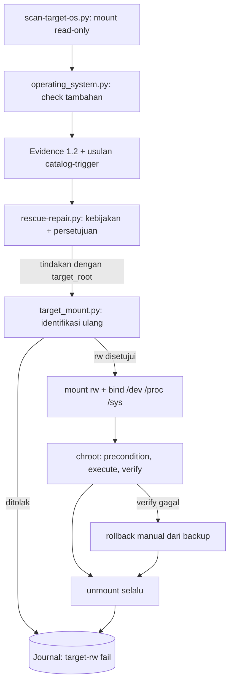

# Deteksi dan perbaikan sistem operasi (Linux Mint, Windows, macOS)

> Managed by **ahlikoding.com** and **satpamsiber.com** from **ahliweb.com**.

Dokumen ini menjelaskan bagian OS dari [repair-framework.md](repair-framework.md) (ahliweb/linux-mint-xfce-rescue-ai#16): check tambahan, katalog tindakan per OS, dan penyedia mount target untuk perbaikan offline. Deteksi tetap **read-only**. Perbaikan hanya berupa **tindakan katalog bertipe** (argv tetap di `rescue-ai/v1/catalog/os-*.json`) yang dijalankan `scripts/rescue-repair.py` sesuai kebijakan operator (`detect-only`, `approve-each` default, `auto-safe`). AI hanya boleh mengusulkan `action_id`; perintah tidak pernah berasal dari AI, log, atau nama file.

Label status: **Implemented** (level source, `make check`), **Hardware-required** (butuh PC/disk nyata), **Environment-blocked** (butuh jaringan atau kunci), **Planned**. Lihat [testing](testing.md).

| Bagian | Status |
|---|---|
| Check baru: Linux (live dan host), Windows offline dan host, macOS (`scripts/rescue_modules/operating_system.py`, `host/modules/windows/os.ps1`, `host/modules/macos/os.zsh`) | Implemented |
| Katalog `os-linux.json` (7 tindakan), `os-windows.json` (4 tindakan), `os-macos.json` (kosong, disengaja) | Implemented |
| Penyedia mount target `scripts/lib/target_mount.py` (mode fixture untuk uji) | Implemented; mount read-write nyata: Hardware-required |
| Perbaikan Linux offline lewat chroot (`os-linux.dpkg-configure-pending`, `initramfs-create`, `update-initramfs`, `update-grub`) | Implemented di source; eksekusi pada disk nyata: Hardware-required |
| Perbaikan Linux host (`os-linux.dpkg-configure-host`, `apt-fix-broken`, `restart-failed-units`) | Implemented; `apt-fix-broken` butuh jaringan: Environment-blocked |
| Tindakan Windows host (`os-windows.*`) | Planned untuk eksekusi: engine Python hanya merencanakan (`--list`); launcher Windows belum mengeksekusi katalog |
| Perbaikan macOS | Tidak ada tindakan otomatis (lihat bagian Yang sengaja tidak diotomatisasi) |

## Check yang ditambahkan

Semua hanya berupa kode status dan angka (tanpa nama file, path, nama paket, atau isi log). Yang tidak bisa dibaca menjadi `unknown`, bukan `pass`. Pada mode live modul dijalankan untuk setiap OS target yang di-mount read-only; pada mode host Linux untuk sistem yang sedang berjalan (`os-0`). Sesi live itu sendiri tidak pernah diperiksa oleh `collect_system`.

| Check | Platform | Isi | Status |
|---|---|---|---|
| `linux-boot-partition-space` | Linux offline dan host | Persen ruang bebas filesystem yang menampung `/boot` (angka `percent`). `warn` di bawah 15, `fail` di bawah 5. `unknown` bila `/boot` terpisah dan tidak ikut diperiksa (tidak ada kernel di `boot/`) | Implemented |
| `linux-grub-config` | Linux offline dan host | `boot/grub/grub.cfg` ada, tidak kosong, dan punya `menuentry` (angka `count`). `warn` bila entri menunjuk kernel yang sudah tidak ada (angka: jumlah entri usang). `fail` bila hilang, kosong, atau tanpa entri. `not_applicable` bila bukan GRUB | Implemented |
| `linux-apt-sources` | Linux offline dan host | Jumlah sumber APT aktif di `sources.list`, `*.list`, dan `*.sources` (`Enabled: no` tidak dihitung). `warn` bila 0. `not_applicable` bila tanpa `/etc/apt` | Implemented |
| `linux-dpkg-lock` | Linux offline dan host | Offline: jumlah entri di `var/lib/dpkg/updates` (dpkg terputus). Host: ditambah lock aktif pada file lock dpkg/apt dari `/proc/locks`. `warn` bila total lebih dari 0. `not_applicable` bila bukan dpkg | Implemented |
| `windows-boot-config` | Windows offline dan host | Offline: `Boot\BCD` ada (`pass`); ada folder `Boot` tanpa BCD (`fail`); selain itu `unknown` karena pada UEFI BCD berada di ESP, bukan di volume Windows. Host: `bcdedit /enum` hanya bila bisa dibaca tanpa elevasi (jumlah entri `winload`), jika tidak `unknown` | Implemented |
| `windows-system-files` | Windows offline dan host | Jumlah penanda korupsi component store di `CBS.log` (4 MiB terakhir) ditambah kunci servicing yang tertunda (host). `warn` bila lebih dari 0. Log lama bisa memicu `warn` meski sudah diperbaiki | Implemented |
| `windows-restore-points` | Windows offline dan host | Offline: jumlah snapshot `{GUID}{GUID}` di `System Volume Information`. Host: `Get-ComputerRestorePoint` (butuh admin, jika tidak `unknown`). `warn` bila 0 | Implemented |
| `macos-disk-verify` | macOS host dan offline | Host: hanya `diskutil info /` dan `diskutil apfs list` (bukan `verifyVolume`, yang tidak aman read-only pada sistem hidup): `fail` bila SMART `Failing`, `pass` bila volume ter-mount dan container APFS terdaftar, `warn` bila ter-mount tanpa container, selain itu `unknown`. Offline dari Linux: selalu `unknown` | Implemented |

Detail penyaringan: file di dalam target dibaca tanpa mengikuti symlink dan tanpa kunci pencarian besar/kecil huruf (semantik NTFS), sehingga target yang jahat tidak bisa mengarahkan check ke sistem live.

## Penyedia mount target (`scripts/lib/target_mount.py`)

`open_target(evidence_path, evidence, target_ref, rw)` mengembalikan context manager yang menghasilkan titik mount target. Engine memanggilnya hanya setelah operator menyetujui tindakan yang punya parameter `target_root`.

| Aturan | Perilaku |
|---|---|
| Identifikasi ulang | Memuat `scripts/scan-target-os.py` dengan `importlib` dan memakai `enumerate_real`, `classify`, dan `inspect_partition` miliknya (aturan pengecualian USB rescue, removable, loop, zram tidak diduplikasi). `os-N` adalah target ke-N yang dilaporkan pemindai |
| Penolakan | Ref tidak dikenal atau salah format; target `host-native`; keluarga hasil identifikasi ulang berbeda dari `target_systems[].family`; evidence menyatakan terenkripsi atau tidak diperiksa; partisi sudah hilang; macOS dengan `rw`. BitLocker, LUKS, dan FileVault tidak pernah dibuka |
| Mount read-only (`rw` salah) | Mount read-only pemindai: `ro,noexec,nosuid,nodev`, tanpa replay journal |
| Mount read-write (`rw` benar) | Di bawah `mkdtemp` pribadi (0700). Linux: `rw,nosuid,nodev` (tanpa `noexec` karena chroot perlu mengeksekusi biner target; xfs menambah `nouuid`; btrfs memakai `subvol=@` bila root ada di sana). Windows: `ntfs3` dengan `rw,noexec,nosuid,nodev`, fallback `ntfs-3g` |
| Hanya sesi live | Di luar mode fixture uji, provider menolak berjalan bila media live rescue tidak ter-mount (`/cdrom`, `/run/live/medium`, atau `/isodevice`). Disk mesin pengembang, runner CI, atau host yang sedang berjalan tidak pernah di-enumerasi atau di-mount |
| Windows | `rw` ditolak bila `hiberfil.sys` tidak kosong (hibernasi/fast startup), bila flag dirty `$Volume` menyala, atau bila flag itu tidak dapat dibaca (dibaca langsung dari volume dan butuh root). Matikan Windows sepenuhnya dulu. Kernel dan `ntfs-3g` juga menolak volume dirty |
| Sudah ter-mount | Target Linux yang sudah di-mount sesi live (mis. oleh desktop) ditolak untuk `rw`: unmount dulu |
| `/boot` terpisah | Bila fstab target menyebut `/boot` dengan UUID/LABEL, partisi itu di-mount di `<root>/boot` dengan opsi yang sama. Bila tidak ditemukan, mount ditolak agar tidak ada yang tertulis ke tempat yang salah |
| Chroot | Untuk target Linux `rw`: `/dev`, `/dev/pts`, `/proc`, `/sys` di-bind-mount (propagasi private) di bawah root. ESP tidak di-mount (`update-grub`, `update-initramfs`, dan `dpkg` tidak memerlukannya). Target read-only tidak pernah mendapat bind mount |
| Pembersihan | Unmount berurutan terbalik di `__exit__`, juga saat exception dan saat SIGINT/SIGTERM/SIGHUP (sinyal dikirim ulang setelah pembersihan). Mount yang gagal dilepas dilaporkan keras dan tidak pernah ditelusuri atau dihapus rekursif |
| Hak akses | `mount`/`umount` lewat `sudo -n` bila engine bukan root; hanya argv tetap, tanpa shell |
| Hook uji | `RESCUE_TARGET_MOUNT_FIXTURE_ROOT=/abs/dir` (diumumkan di stderr) memakai tata letak fixture pemindai; tidak ada yang di-mount, direktori fixture itu sendiri yang dihasilkan, dan aturan penolakan yang sama dipakai |

Yang butuh PC dan disk nyata (Hardware-required): mount read-write sebenarnya, bind mount, perilaku `ntfs3`/`ntfs-3g` pada volume dirty, dan `chroot` pada sistem Linux Mint yang terpasang. `make check` hanya membuktikan logika, urutan perintah, dan pembersihan dengan perintah palsu.

## Katalog tindakan

Semua tindakan di bawah lolos `python3 scripts/lib/repair_catalog.py`. `destructive` selalu memerlukan `--backup-ref FILE`, `action_id` diketik operator, rencana rollback, dan verifikasi (read-back). Tindakan offline (`requires_target_rw`) tidak pernah dijalankan oleh `auto-safe`.

| action_id | Risiko | Platform | Backup | Rollback | Pemicu |
|---|---|---|---|---|---|
| `os-linux.dpkg-configure-pending` | destructive | live-linux | `package-state` | restore-backup | `linux-package-state` fail/warn, `linux-dpkg-lock` warn |
| `os-linux.initramfs-create` | destructive | live-linux | `file-copy` | restore-backup | `linux-kernel-initrd` fail |
| `os-linux.update-initramfs` | destructive | live-linux | `file-copy` | restore-backup | tanpa pemicu (dipilih operator atau AI) |
| `os-linux.update-grub` | destructive | live-linux | `file-copy` | restore-backup | `linux-grub-config` fail/warn |
| `os-linux.dpkg-configure-host` | destructive | linux-host | `package-state` | restore-backup | `linux-package-state` fail/warn |
| `os-linux.apt-fix-broken` | destructive | linux-host | `package-state` | restore-backup | `linux-package-state` fail |
| `os-linux.restart-failed-units` | safe | linux-host | tidak | tidak ada | `linux-failed-units` warn/fail |
| `os-windows.sfc-verify` | safe | windows-host | tidak | tidak ada | `windows-system-files` warn/unknown |
| `os-windows.sfc-scannow` | destructive | windows-host | `system-restore-point` | manual | `windows-system-files` warn |
| `os-windows.dism-restorehealth` | destructive | windows-host | `system-restore-point` | manual | `windows-system-files` warn |
| `os-windows.chkdsk-scan` | safe | windows-host | tidak | tidak ada | tanpa pemicu (dipilih operator atau AI) |

Ringkasan cara kerja (perintah persis ada di file katalog):

### linux-dpkg-configure

`os-linux.dpkg-configure-pending` menjalankan `chroot {target_root} dpkg --configure -a` (precondition: `dpkg --version` di dalam chroot; verifikasi: `apt-get check -q`). Dipilih chroot, bukan `dpkg --root`, karena `dpkg --root` tetap menjalankan skrip pemeliharaan paket di dalam chroot dan butuh `/dev`, `/proc`, `/sys` yang sama. Hasilnya tidak bisa dibatalkan otomatis, sehingga risikonya `destructive`: buat lebih dulu arsip keadaan paket target (mis. `/var/lib/dpkg` dan `/etc`) sebagai `--backup-ref`. `apt-get check` tidak melaporkan paket yang masih setengah terkonfigurasi; pembuktian sebenarnya adalah pemindaian ulang `linux-package-state`. Varian host: `os-linux.dpkg-configure-host` (`dpkg --configure -a`).

### linux-apt-fix

`os-linux.apt-fix-broken` (host): `apt-get --fix-broken install -y -o Dpkg::Options::=--force-confold` (konfigurasi lokal dipertahankan, tanpa prompt). Bisa mengunduh paket, jadi butuh jaringan (Environment-blocked di lab tanpa internet) dan dapat menghapus paket untuk menyelesaikan dependensi: `destructive` dengan backup `package-state`.

### linux-initramfs

`os-linux.initramfs-create` (`update-initramfs -c -k all`) untuk kernel tanpa initrd; `os-linux.update-initramfs` (`update-initramfs -u -k all`) untuk membangun ulang yang sudah ada. Keduanya di dalam chroot; verifikasi: `/boot/initrd.img` ada dan tidak kosong. Backup: salinan file `/boot` target (`file-copy`). Perilaku `-c` pada kernel yang sudah punya initrd, dan `-u` pada initrd yang hilang, bergantung pada versi initramfs-tools; coba pada sistem nyata (Hardware-required) dan pilih tindakan yang sesuai dengan check.

### linux-grub

`os-linux.update-grub`: `chroot {target_root} update-grub`, verifikasi `grub-script-check /boot/grub/grub.cfg`. Hanya menulis `/boot/grub/grub.cfg`; **tidak** memasang ulang bootloader. Backup: salinan `grub.cfg` (`file-copy`).

### linux-units

`os-linux.restart-failed-units` (host): `systemctl restart {unit}` untuk satu unit yang dipilih operator (`--param os-linux.restart-failed-units.unit=NAMA`; tidak ada default, jadi `auto-safe` melewatinya). Verifikasi: `systemctl is-failed --quiet` harus keluar dengan kode 1 (unit tidak lagi gagal).

### windows-sfc

`os-windows.sfc-verify` (`sfc.exe /verifyonly`) hanya memeriksa. `os-windows.sfc-scannow` (`sfc.exe /scannow`) mengganti file sistem yang rusak dari component store: `destructive`, wajib ada System Restore point sebagai backup. Keduanya butuh sesi admin; engine melaporkan `unavailable` bila tidak.

### windows-dism

`os-windows.dism-restorehealth`: `DISM.exe /Online /Cleanup-Image /RestoreHealth` (mungkin memakai Windows Update sebagai sumber), verifikasi `/CheckHealth`. `destructive` dengan restore point.

### windows-chkdsk

`os-windows.chkdsk-scan`: `chkdsk.exe C: /scan`, pemindaian online yang read-only (tidak memakai `/f` atau `/r`). Kode keluar 1 (masalah ditemukan) dianggap eksekusi berhasil dan dilaporkan.

### rollback-linux

Rollback tindakan Linux `destructive` bersifat **manual dari backup**: engine mencatat `manual-rollback-required`. Pulihkan arsip/salinan yang diberikan sebagai `--backup-ref` ke target (mount read-write lewat penyedia yang sama, atau dari sistem yang berjalan), lalu jalankan ulang pemindaian dan bandingkan `linux-package-state`, `linux-kernel-initrd`, dan `linux-grub-config`.

### rollback-windows

Rollback tindakan Windows `destructive` juga manual: buka System Restore (atau Windows Recovery Environment, Startup/System Restore) dan kembalikan ke restore point yang dibuat sebelum tindakan. Catat identitasnya di journal operator.

## Yang sengaja tidak diotomatisasi

- Instal ulang bootloader Windows (`bcdedit`, `bootrec`, perbaikan BCD/ESP), dan `grub-install`/`efibootmgr` di Linux: hanya `update-grub` yang tersedia.
- Perbaikan APFS dari Linux dan `diskutil verifyVolume`/`repairVolume` pada macOS. Untuk macOS gunakan Recovery: Disk Utility First Aid, dari macOS Recovery. Katalog `os-macos.json` sengaja kosong.
- Windows offline dari Linux: tidak ada tindakan (tanpa `ntfsfix`, tanpa `chkdsk`, tanpa menghapus `hiberfil.sys`). Penyedia mount menolak `rw` pada Windows yang hibernasi atau dirty.
- Apa pun pada volume terenkripsi: BitLocker, LUKS, FileVault tidak pernah dibuka; tidak ada tindakan yang bisa menargetkan `access: not-mounted-encrypted`.
- Penghapusan paket massal, pembersihan kernel lama (`autoremove`), pemformatan, partisi, dan `fsck` mode perbaikan.

## Uji (Implemented)

`tests/test_os_repair.py`: pohon fixture Linux Mint (dpkg setengah terkonfigurasi, initrd hilang, `/boot` penuh, `grub.cfg` rusak, dpkg terputus atau terkunci), Windows (BCD hilang, marker CBS, `pending.xml`), dan macOS; penyedia dalam mode fixture (ref tidak dikenal, keluarga tidak cocok, terenkripsi, Windows hibernasi, dirty, macOS `rw`, `/boot` tidak ditemukan); jalur mount nyata dengan perintah privileged palsu (opsi mount, urutan bind, unmount terbalik, exception, SIGTERM); engine dari ujung ke ujung dengan katalog ini dan `RESCUE_REPAIR_TEST_PATH`; modul `os.ps1` (pwsh) dan `os.zsh` (zsh) dengan shim. Tanpa root, mount, disk, atau jaringan.
