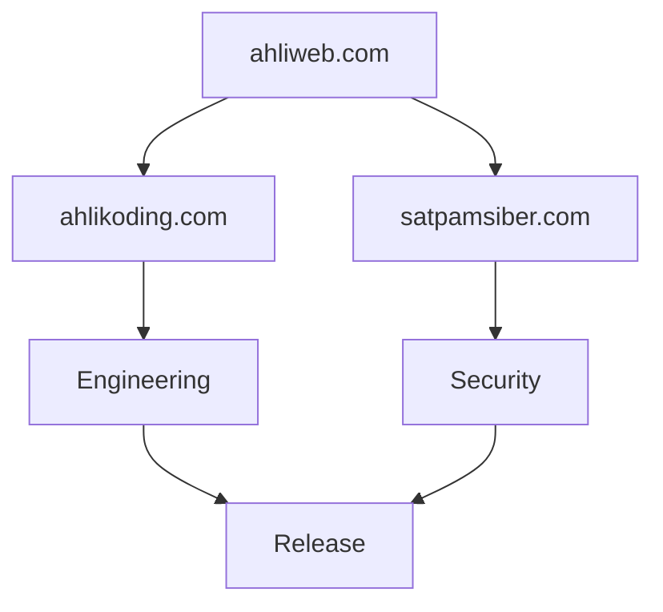
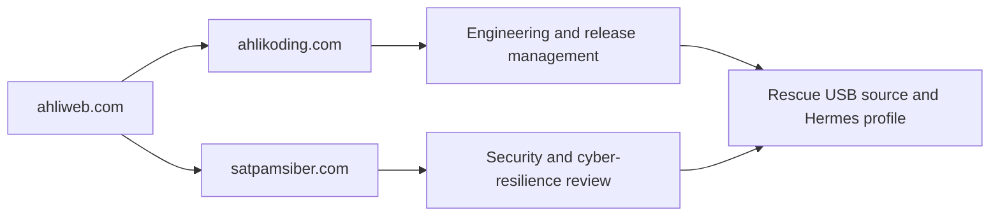
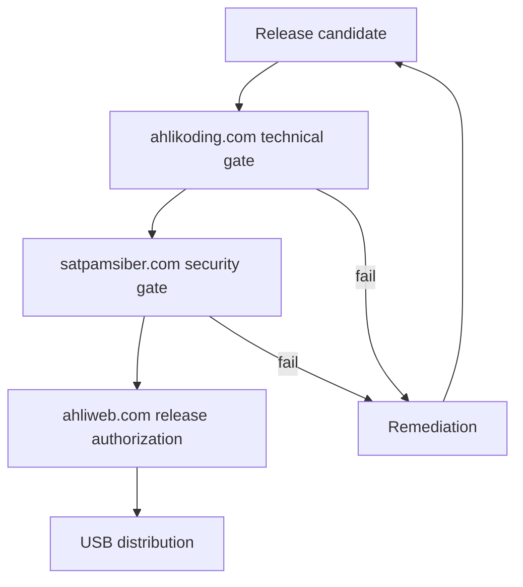
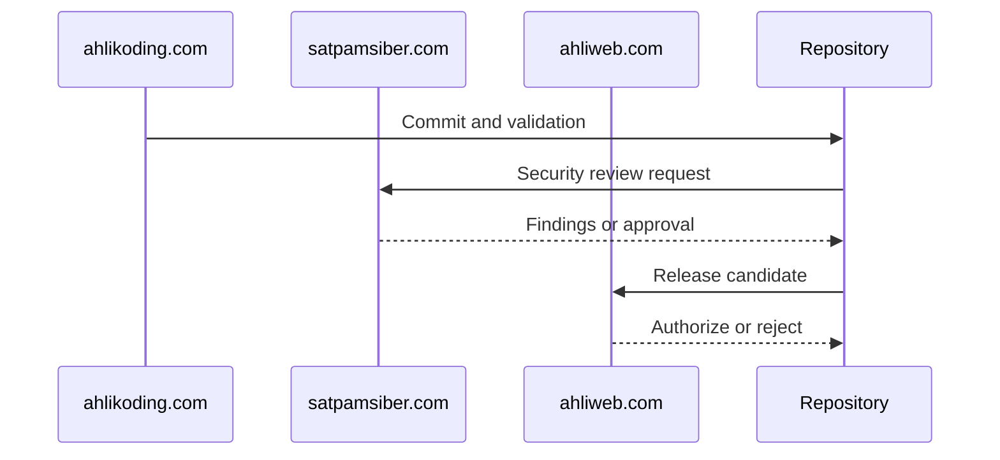
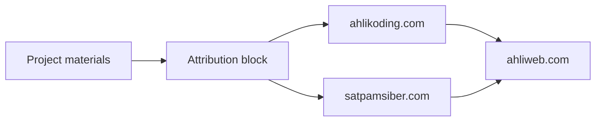

# Ownership and Governance

## Management

Linux Mint XFCE Rescue AI is managed by **ahlikoding.com** and **satpamsiber.com**, both from **ahliweb.com**.

## Responsibilities

- **ahlikoding.com**: source maintenance, implementation, release packaging, compatibility testing, and technical documentation.
- **satpamsiber.com**: security review, threat analysis, evidence-handling policy, and operational safety review.
- **ahliweb.com**: organizational ownership, product direction, branding, and final release authorization.

## Change control

Changes that affect boot media, credentials, evidence transmission, Hermes tools, provider routing, or mutation policy require technical review and security review before release. Documentation-only changes still require link, syntax, and secret checks.

## Branding

Use the following attribution in repository-facing and operator-facing materials:

> Managed by ahlikoding.com and satpamsiber.com from ahliweb.com.

The attribution does not imply that Linux Mint, Ventoy, Hermes Agent, or OpenCode Go are owned by ahliweb.com. Their respective trademarks, licenses, and provider terms remain authoritative.
