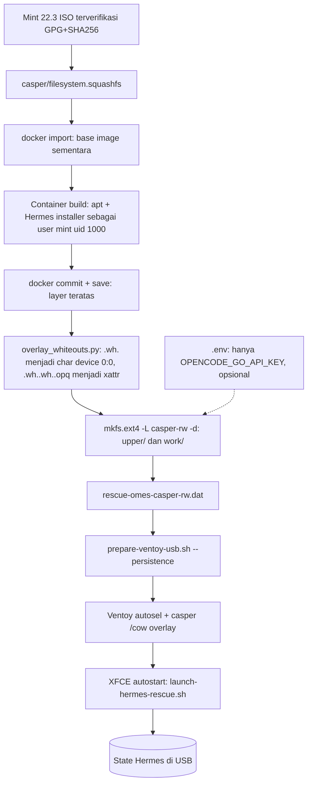

# Persistence: Hermes terpasang di USB, state tersimpan di USB

> Managed by **ahlikoding.com** and **satpamsiber.com** from **ahliweb.com**.

Dokumen ini menjelaskan cara membuat USB rescue yang boot ke Linux Mint 22.3 XFCE live dengan Hermes **sudah terpasang** dan seluruh state Hermes (memory, sessions, reports) **tersimpan di USB** lewat Ventoy persistence image. Perintah, ID, path, dan URL dipertahankan apa adanya. Arsitektur umum ada di [design.md](design.md); kontrol keamanan di [security-model.md](security-model.md); level verifikasi di [testing.md](testing.md).

## Status

| Bagian | Status |
|---|---|
| `scripts/build-persistence.sh` membangun image `casper-rw` (ext4) dari ISO Mint 22.3 yang sudah diverifikasi | Implemented; membutuhkan docker dan jaringan (environment-dependent) |
| `prepare-ventoy-usb.sh --persistence` menyalin image, verifikasi sha256 read-back, dan menggabungkan entri `persistence` ke `/ventoy/ventoy.json` | Implemented; penulisan ke USB nyata Hardware-required |
| Autostart XFCE menjalankan `launch-hermes-rescue.sh --hardware-mode auto` | Implemented di image; perilaku saat boot Hardware-required |
| Boot dengan persistence (Ventoy memilih image, casper me-mount `casper-rw`, overlay berfungsi, Hermes tetap ada setelah reboot) | **Hardware-required; belum diverifikasi di lingkungan ini** |
| Login Hermes ke OpenCode Go dari sesi live | Environment-blocked (butuh API key dan jaringan) |
| Pembaruan Hermes di dalam sesi live (`hermes update`) | Planned / tidak diuji |

Jangan menganggap keberhasilan `make check` atau build image sebagai bukti boot fisik. Laporkan uji boot/reboot secara terpisah dengan bukti fisik.

## Alur



## Membangun image

Prasyarat di host: `docker` (user ada di grup `docker`), `7z` atau `xorriso`, `e2fsprogs`, `python3`; `unsquashfs` + `fakeroot` dipakai bila ada (kalau tidak, dipakai container `alpine`). Tidak perlu `sudo`, tidak menyentuh block device.

```bash
# Tanpa API key (image bebas kredensial; disarankan)
scripts/build-persistence.sh \
  --iso /path/linuxmint-22.3-xfce-64bit.iso \
  --output /path/rescue-omes-casper-rw.dat \
  --no-provision-secrets \
  --installer-sha256 HEX      # sangat disarankan; tanpa pin ada peringatan

# Dengan API key (credential-bearing; lihat risiko di bawah)
scripts/build-persistence.sh --iso ... --output ... --env-file .env
```

Opsi: `--size-mib N` (default 8192, minimum 4096), `--skip-hermes-install`, `--keep-work` (menyimpan work dir, container, dan image untuk inspeksi). Script menolak menimpa `--output` yang sudah ada dan menulis file `0600`. ISO hanya dibaca. Di akhir script menjalankan `e2fsck -fn` (read-only) dan mencetak ukuran serta sha256.

Yang dilakukan di dalam container build (jaringan aktif hanya untuk apt dan installer Hermes):

1. `apt-get install --no-install-recommends dislocker libfsapfs-utils smartmontools nvme-cli` (semuanya ada di arsip Ubuntu 24.04 noble; bila salah satu tidak tersedia, dilaporkan dan build dilanjutkan tanpa paket itu).
2. Membuat user build `mint` (uid/gid 1000, home `/home/mint`).
3. Menjalankan installer resmi Hermes sebagai `mint` dengan `HERMES_HOME=/home/mint/.local/share/rescue-omes/hermes` (tanpa browser/computer-use, non-interaktif). Installer diverifikasi terhadap `--installer-sha256` bila diberikan; sha256 aktual selalu dicetak.
4. Menjalankan `scripts/install-hermes-rescue.sh --state-dir /home/mint/.local/share/rescue-omes --skip-hermes-install` sebagai `mint`: profile (`SOUL.md`, `AGENTS.md`), `config.yaml`, `hermes/env` (`0600`), launcher di `/usr/local/bin`, dan entri autostart `~/.config/autostart/hermes-rescue.desktop`. Bundle runtime lengkap (allowlist yang sama dengan `copy_bundle`, termasuk `host/` bila ada) ditempatkan di `/usr/local/lib/rescue-omes`. Symlink `/usr/local/bin/hermes` ditambahkan supaya launcher menemukan `hermes`.
5. Memasang **semua** skill di `profiles/rescue-hermes/skills/` (`rescue-boot-diagnosis` dan `rescue-target-os`) ke `<state>/hermes/skills/`, karena `install-hermes-rescue.sh` sendiri hanya memasang `rescue-boot-diagnosis`. Build gagal bila salah satu dari dua skill itu tidak terpasang.

Isi image (di dalam `upper/`, yaitu file seperti terlihat di `/`): paket tambahan di `/usr`, `/var/lib/dpkg`, bundle di `/usr/local/lib/rescue-omes`, dan seluruh `/home/mint` (Hermes di `.local/share/rescue-omes/hermes/hermes-agent`, Python terkelola uv di `.local/share/uv`, autostart di `.config/autostart`).

Yang sengaja **tidak** dimasukkan: `/tmp`, `/var/tmp`, `/run`, `/dev`, isi `/var/log`, `/var/cache/apt`, `/var/lib/apt/lists` (kembali ke daftar paket ISO), `/etc/hostname`, `/etc/hosts`, `/etc/resolv.conf`, `machine-id`, cache `~/.cache`, dan database akun (`/etc/passwd`, `group`, `shadow`, `gshadow`, `subuid`, `subgid`). Akun `mint` dibuat oleh casper pada boot pertama dengan uid 1000; `/home/mint` di image sudah dimiliki uid/gid 1000 sehingga cocok. Build gagal bila paket yang dipasang menambah user/group sistem, karena database akun tidak dibawa.

### Hasil build referensi (tanpa secret)

Build nyata di host pengembangan (Docker 29, Linux 6.8) dengan ISO `linuxmint-22.3-xfce-64bit.iso` terverifikasi, `--no-provision-secrets`, `--size-mib 8192`:

| Item | Nilai |
|---|---|
| Durasi | sekitar 19 menit (impor squashfs sekitar 4 menit, apt dan Hermes sekitar 6 menit, sisanya `docker save`, konversi, `mkfs`) |
| Ukuran | 8 GiB apparent, sekitar 2.6 GB terpakai di disk (sparse); konten `upper/` sekitar 2.3 GiB |
| Layer | 94 ribu entri dipertahankan, 1212 dikecualikan, 118 whiteout (char 0:0), 48 direktori opaque |
| `e2fsck -fn` | bersih |
| Hermes | `Hermes Agent 2026.9.24`, Python 3.14.7 (uv), tanpa browser/computer-use |
| Paket tambahan | `dislocker`, `libfsapfs-utils`, `smartmontools`, `nvme-cli` (semua tersedia di noble) |

Checksum image bergantung pada waktu build dan versi Hermes terbaru; catat sha256 yang dicetak script pada build Anda sendiri. Nilai ini bukan bukti boot.

Catatan: `hermes/.env` di dalam state adalah template milik installer Hermes (tanpa nilai secret); key rescue hanya berada di `hermes/env`, yang kosong (`OPENCODE_GO_API_KEY=''`) pada build tanpa secret.

## Menyalin ke USB

```bash
scripts/prepare-ventoy-usb.sh \
  --ventoy-mount /mnt/ventoy \
  --mint-iso /path/linuxmint-22.3-xfce-64bit.iso \
  --sha256sums sha256sum.txt --signature sha256sum.txt.gpg \
  --no-provision-secrets \
  --persistence /path/rescue-omes-casper-rw.dat
```

Hasil di partisi data Ventoy:

| Path | Isi |
|---|---|
| `/ISO/LinuxMintXFCE/<iso>` | ISO terverifikasi |
| `/persistence/rescue-omes-casper-rw.dat` | image `casper-rw` (sha256 read-back diverifikasi) |
| `/ventoy/ventoy.json` | `control` (default image) dan `persistence: [{"image": "/ISO/LinuxMintXFCE/<iso>", "backend": "/persistence/rescue-omes-casper-rw.dat", "autosel": 1, "timeout": 0}]`; kunci dan entri lain dipertahankan |
| `/rescue-omes/` | bundle rescue (juga tersedia untuk launcher host) |
| `/RESCUE-WINDOWS.cmd`, `/RESCUE-MACOS.command`, `/rescue-linux.sh` | launcher host, disalin ke root USB bila direktori `host/` ada di repo |

Script menolak menimpa `/persistence/rescue-omes-casper-rw.dat` yang sudah ada, karena file itu dapat berisi memory dan sessions Hermes. Pakai `--replace-persistence` hanya bila state lama memang boleh dihapus. File `.dat` diperiksa sebelum penyalinan: harus ext2/3/4 berlabel `casper-rw`.

## State Hermes ada di USB

Casper me-mount filesystem berlabel `casper-rw` di `/cow` dan menyusun overlay `upperdir=/cow/upper, workdir=/cow/work`. Semua tulisan sesi live (termasuk Hermes) masuk ke file `.dat` di USB dan bertahan setelah reboot:

| Data | Lokasi di sesi live |
|---|---|
| `HERMES_HOME` (memory, sessions, skills, config) | `/home/mint/.local/share/rescue-omes/hermes` |
| Env Hermes (`KEY='value'`, `0600`) | `/home/mint/.local/share/rescue-omes/hermes/env` |
| Reports hardware/evidence dan analisis (`hardware-readiness-*.json`, `target-evidence-*.json`, `latest-evidence.json`, `analysis-*.md`), cases, learning | `/home/mint/.local/share/rescue-omes/{reports,cases,learning}` |
| Kode Hermes + Python terkelola | `.../hermes/hermes-agent`, `/home/mint/.local/share/uv` |

Konsekuensi: kalau `.dat` hilang, rusak, atau di-replace, state Hermes ikut hilang. Cadangkan `.dat` (saat live session tidak berjalan) sebelum `--replace-persistence`. Data kasus milik target yang dirawat tidak boleh disalin ke media lain tanpa persetujuan.

## Risiko kredensial

- Tanpa `--no-provision-secrets`, `build-persistence.sh` membaca **hanya** `OPENCODE_GO_API_KEY` dari `--env-file` (default `.env` di repo) lewat parser allowlist `scripts/lib/rescue-env.sh` (tidak pernah `source`), lalu menulisnya ke `hermes/env` di dalam image sebagai `KEY='value'`, `0600`, uid/gid 1000. Key tidak pernah muncul di argumen perintah maupun output; file sementara dihapus.
- Key tidak pernah masuk ke container build maupun layer docker; ia hanya ditambahkan di container penolong tanpa jaringan tepat sebelum `mkfs.ext4`.
- Image yang dibangun dengan key adalah **credential-bearing**: siapa pun yang memegang USB atau file `.dat` dapat membaca key. Ext4 menerapkan `0600` di dalam image, tetapi partisi exFAT Ventoy tidak melindungi file `.dat` dari pembaca lain. Pakai USB privat, kontrol akses fisik, dan rotasi key bila USB hilang. Jangan commit `.dat` (sudah ada di `.gitignore`).
- Alternatif yang lebih aman: bangun dengan `--no-provision-secrets` dan masukkan key di sesi live; key itu lalu tersimpan di persistence, sehingga USB tetap menjadi kredensial-bearing setelahnya.

## Membangun ulang dan memperluas

- Bangun ulang setelah mengubah `scripts/`, `profiles/`, atau `config/` (bundle ikut ditanam). Untuk mengubah hanya bundle dan tetap mempertahankan state, salin file ke `/usr/local/lib/rescue-omes` dari dalam sesi live; build ulang membuat image baru dari nol.
- Menambah paket: edit daftar `optional` di `scripts/lib/persistence-container-build.sh` (lalu update dokumen ini dan `CHANGELOG.md`).
- Ukuran: `--size-mib` (image sparse; di exFAT ia ditulis penuh). Isi awal sekitar 2.5 GiB untuk `/home/mint` plus paket; sisakan ruang untuk sessions dan reports.
- Reset ke keadaan bersih: `--replace-persistence` dengan image baru. Untuk tidak memakai persistence, hapus entri `persistence` dari `/ventoy/ventoy.json`.
- Inspeksi tanpa root: `debugfs -R 'ls -l /upper/home/mint' rescue-omes-casper-rw.dat` dan `e2fsck -fn rescue-omes-casper-rw.dat`.

## Batasan dan asumsi

- Whiteout AUFS dari layer docker dikonversi ke char device `0:0`; direktori opaque memakai xattr `trusted.overlay.opaque=y` yang ditulis dengan `debugfs ea_set` ke dalam image (tidak perlu root host). Konversi diuji dengan tar sintetis di `tests/test_persistence.py`, tetapi overlay nyata baru bisa dibuktikan saat boot.
- Build menganggap layout casper Mint 22.3 (`upper/` dan `work/` di root filesystem `casper-rw`) dan user live `mint` uid 1000. Perubahan versi Mint perlu dicek ulang.
- Ventoy harus versi yang mendukung plugin persistence (`ventoy.json` `persistence` dengan `backend`, `autosel`, `timeout`); lihat <https://www.ventoy.net/en/plugin_persistence.html>.
- Uji boot fisik, pemilihan otomatis persistence oleh Ventoy, autostart, dan retensi state setelah reboot: **Hardware-required, belum diverifikasi**.
