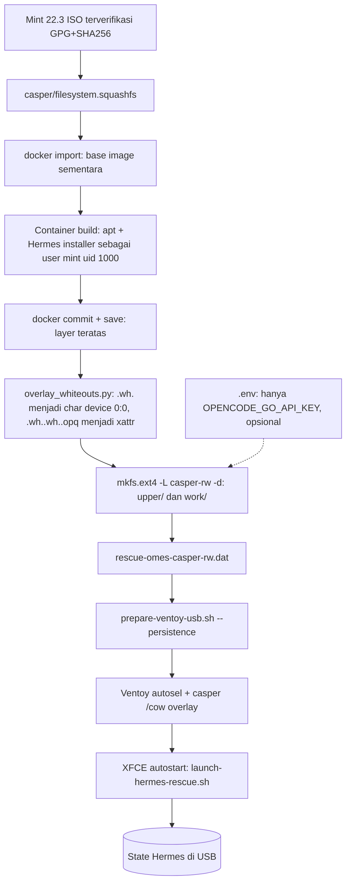
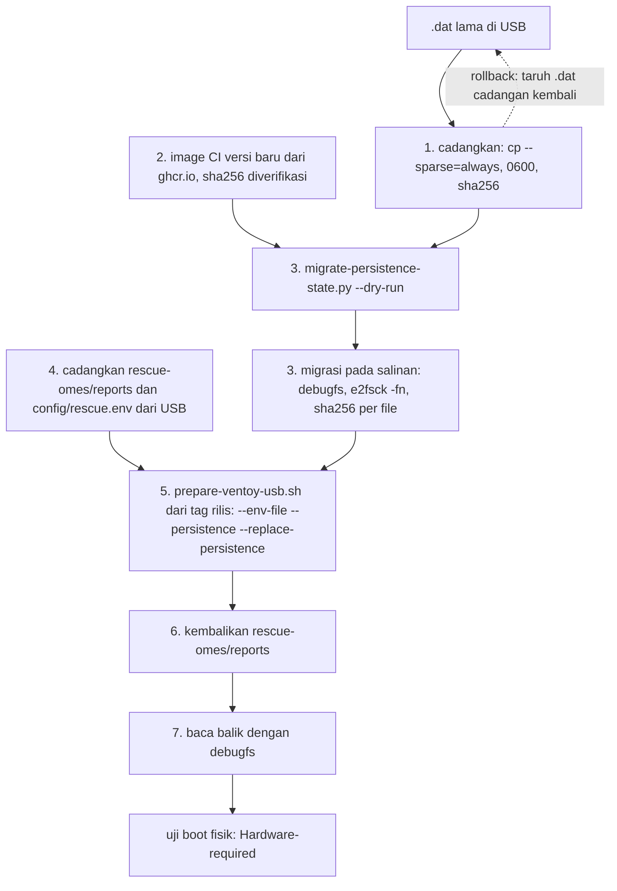
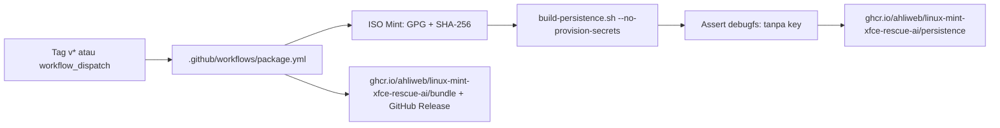

# Persistence: Hermes terpasang di USB, state tersimpan di USB

> Managed by **ahlikoding.com** and **satpamsiber.com** from **ahliweb.com**.

Dokumen ini menjelaskan cara membuat USB rescue yang boot ke Linux Mint 22.3 XFCE live dengan Hermes **sudah terpasang** dan seluruh state Hermes (memory, sessions, reports) **tersimpan di USB** lewat Ventoy persistence image. Perintah, ID, path, dan URL dipertahankan apa adanya. Arsitektur umum ada di [design.md](design.md); kontrol keamanan di [security-model.md](security-model.md); level verifikasi di [testing.md](testing.md).

## Status

| Bagian | Status |
|---|---|
| `scripts/build-persistence.sh` membangun image `casper-rw` (ext4) dari ISO Mint 22.3 yang sudah diverifikasi | Implemented; membutuhkan docker dan jaringan (environment-dependent) |
| `prepare-ventoy-usb.sh --persistence` menyalin image, verifikasi sha256 read-back, dan menggabungkan entri `persistence` ke `/ventoy/ventoy.json` | Implemented; penulisan ke USB nyata Hardware-required |
| Autostart XFCE membuka `xfce4-terminal` lalu menjalankan `launch-hermes-rescue.sh --hardware-mode auto`; entri menu aplikasi yang sama untuk menjalankan ulang | Implemented di image; perilaku saat boot Hardware-required |
| Paket GitHub `bundle` dan `persistence` tanpa kredensial, dibangun di CI ([bagian ini](#paket-github-tanpa-kredensial)) | Implemented di source level; eksekusi pertama di GitHub Environment-blocked dari lingkungan ini |
| Boot dengan persistence (Ventoy memilih image, casper me-mount `casper-rw`, overlay berfungsi, Hermes tetap ada setelah reboot) | **Hardware-required; belum diverifikasi di lingkungan ini** |
| Login Hermes ke OpenCode Go dari sesi live | Environment-blocked (butuh API key dan jaringan) |
| Pembaruan Hermes di dalam sesi live (`hermes update`) | Planned / tidak diuji |

Jangan menganggap keberhasilan `make check` atau build image sebagai bukti boot fisik. Laporkan uji boot/reboot secara terpisah dengan bukti fisik.

## Alur



<a id="autostart-offline-dan-log"></a>
## Autostart, offline, dan log launcher

- **Terminal eksplisit.** Entri `~/.config/autostart/hermes-rescue.desktop` memakai `Terminal=false` dan `Exec=xfce4-terminal --maximize "--title=Hermes Rescue AI" -x /usr/local/bin/launch-hermes-rescue.sh --state-dir <state> --hardware-mode auto`, jadi jendela selalu terlihat. `scripts/verify-autostart.sh` dan pemeriksaan di `persistence-container-build.sh` memeriksa baris ini persis.
- **Menu aplikasi.** Installer juga menulis entri yang sama (tanpa `X-GNOME-Autostart-enabled`) ke `~/.local/share/applications/hermes-rescue.desktop`, sehingga operator dapat menjalankan ulang "Hermes Rescue AI" dari menu setelah Wi-Fi tersambung. `--no-autostart` hanya melewati salinan autostart; entri menu tetap dipasang.
- **Jaringan tidak memblokir.** Autostart berjalan saat login, sebelum Wi-Fi tersambung. Launcher menunggu default route hingga sekitar 60 detik; bila masih offline dan ada terminal, launcher menampilkan petunjuk dwibahasa: sambungkan Wi-Fi lewat ikon jaringan di panel lalu tekan Enter untuk memeriksa ulang, atau ketik `L` untuk lanjut offline (tanpa jawaban 180 detik, atau EOF, berarti offline). Offline: pemindaian read-only, perbaikan katalog sesuai kebijakan operator, dan laporan proses tetap berjalan; analisis OpenCode Go dilewati (outcome `network-error`) dan Hermes tidak dijalankan. Launcher mencetak lokasi laporan dan cara menjalankan ulang setelah online.
- **Tidak pernah menutup diam-diam.** Pada keluar non-nol (dan saat selesai offline) di terminal, launcher mencetak ringkasan dwibahasa beserta lokasi laporan lalu menunggu Enter (EOF tidak membuatnya menggantung).
- **Log lokal.** stdout/stderr launcher juga ditulis ke `<state-dir>/reports/launcher-<utc>.log` (`0600`, hanya lokal, tidak pernah dikirim; launcher tidak pernah mencetak API key). Langkah persetujuan perbaikan interaktif (`rescue-repair.py`) hanya tampil di terminal karena butuh tty; jurnalnya tetap menjadi catatan resminya.

<a id="persistence-active-status-persistensi"></a>
## persistence-active: status persistensi

`scripts/check-hardware-readiness.py` memuat check **advisory** `persistence-active` (`required: false`; tidak pernah memblokir dan tidak mengubah READY/NOT READY, hanya `warn` yang menjadikan `summary.overall` `ready_with_warnings`). Ia membaca `/proc/self/mountinfo` dan `/proc/cmdline` (hanya baca; untuk tes dapat dialihkan lewat `RESCUE_PROC_MOUNTINFO` dan `RESCUE_PROC_CMDLINE`):

| Status | Aturan |
|---|---|
| `pass` | `upperdir` overlay root (`/cow/upper` pada casper) berada di mount ber-`/dev/...` (perangkat blok atau loop, mis. `.dat` Ventoy) dengan sistem berkas ext2/3/4, btrfs, atau xfs; atau parameter `persistent` ada dan backend `casper-rw`/`persistence` ter-mount |
| `warn` | lapisan atas ada di `tmpfs`/`ramfs`: perubahan hanya di RAM (keberadaan `/cow` saja BUKAN bukti RAM-only; yang menentukan adalah sistem berkas di bawahnya) |
| `unknown` | bukan sesi live, atau susunan mount tidak dikenal |

Bila `warn`, launcher mencetak peringatan dwibahasa sebelum Hermes: hasil, laporan, dan state Hermes di sesi ini hilang saat dimatikan kecuali disalin ke area data USB. Yang perlu dilakukan: salin `<state-dir>/reports` ke USB yang dapat ditulis (atau host) sebelum mematikan, atau boot ulang dengan entri persistence Ventoy ([Menyalin ke USB](#menyalin-ke-usb)). Berkas tindak lanjut `followup-<run_id>.json` membawa `persistence.active` sehingga Hermes tidak menebak dari keberadaan `/cow`.

## Membangun image

Prasyarat di host: `docker` (user ada di grup `docker`), `7z` atau `xorriso`, `e2fsprogs`, `python3`; `unsquashfs` + `fakeroot` dipakai bila ada (kalau tidak, dipakai container `alpine`). Tidak perlu `sudo`, tidak menyentuh block device.

```bash
# Tanpa API key (image bebas kredensial; disarankan)
scripts/build-persistence.sh \
  --iso /path/linuxmint-22.3-xfce-64bit.iso \
  --output /path/rescue-omes-casper-rw.dat \
  --no-provision-secrets \
  --installer-sha256 HEX      # sangat disarankan; tanpa pin ada peringatan

# Dengan API key (credential-bearing; lihat risiko di bawah)
scripts/build-persistence.sh --iso ... --output ... --env-file .env
```

Opsi: `--size-mib N` (default 8192, minimum 4096), `--skip-hermes-install`, `--keep-work` (menyimpan work dir, container, dan image untuk inspeksi). Script menolak menimpa `--output` yang sudah ada dan menulis file `0600`. ISO hanya dibaca. Di akhir script menjalankan `e2fsck -fn` (read-only) dan mencetak ukuran serta sha256.

Yang dilakukan di dalam container build (jaringan aktif hanya untuk apt dan installer Hermes):

1. `apt-get install --no-install-recommends dislocker libfsapfs-utils smartmontools nvme-cli clamav clamav-freshclam adb android-sdk-platform-tools-common fastboot heimdall-flash cups cups-client cups-ipp-utils ipp-usb avahi-utils` (`cups-client` menyediakan `lpstat`, `cups-ipp-utils` menyediakan `ipptool`, `ipp-usb` endpoint IPP-over-USB, dan `avahi-utils` `avahi-browse` untuk deteksi printer, [printer](printer.md); sebagian sudah ada di image Mint live; `adb` untuk pemeriksaan ponsel Android, [android](android.md); paket kedua hanya berisi aturan udev agar `adb` jalan tanpa root dan tidak menjalankan layanan; `fastboot` dan `heimdall-flash` hanya untuk aksi flashing yang dipanggil operator, tidak ada yang berjalan otomatis; semuanya ada di `universe` noble) (dengan `policy-rc.d` yang menolak start layanan; unit `clamav-freshclam`/`clamav-daemon` di-mask; tidak ada unduhan tanda tangan saat build, lihat [malware](malware.md); pengguna sistem `clamav` diizinkan; semuanya ada di arsip Ubuntu 24.04 noble; bila salah satu tidak tersedia, dilaporkan dan build dilanjutkan tanpa paket itu).
2. Membuat user build `mint` (uid/gid 1000, home `/home/mint`).
3. Menjalankan installer resmi Hermes sebagai `mint` dengan `HERMES_HOME=/home/mint/.local/share/rescue-omes/hermes` (tanpa browser/computer-use, non-interaktif). Installer diverifikasi terhadap `--installer-sha256` bila diberikan; sha256 aktual selalu dicetak.
4. Menjalankan `scripts/install-hermes-rescue.sh --state-dir /home/mint/.local/share/rescue-omes --skip-hermes-install` sebagai `mint`: profile (`SOUL.md`, `AGENTS.md`), `config.yaml`, `hermes/env` (`0600`), launcher di `/usr/local/bin`, dan entri autostart `~/.config/autostart/hermes-rescue.desktop` (beserta entri menu aplikasi `~/.local/share/applications/hermes-rescue.desktop`). Bundle runtime lengkap (allowlist yang sama dengan `copy_bundle`, termasuk `host/` bila ada) ditempatkan di `/usr/local/lib/rescue-omes`. Symlink `/usr/local/bin/hermes` ditambahkan supaya launcher menemukan `hermes`.
5. Memastikan **semua** skill di `profiles/rescue-hermes/skills/` (`rescue-boot-diagnosis`, `rescue-target-os`, `rescue-skill-submission`, `rescue-android`, `rescue-printer`) ada di `<state>/hermes/skills/`. `install-hermes-rescue.sh` sudah memasang semuanya, dan build menyalinnya ulang. Build gagal bila salah satu skill itu tidak terpasang.

Isi image (di dalam `upper/`, yaitu file seperti terlihat di `/`): paket tambahan di `/usr`, `/var/lib/dpkg`, bundle di `/usr/local/lib/rescue-omes`, dan seluruh `/home/mint` (Hermes di `.local/share/rescue-omes/hermes/hermes-agent`, Python terkelola uv di `.local/share/uv`, autostart di `.config/autostart`).

Yang sengaja **tidak** dimasukkan: `/tmp`, `/var/tmp`, `/run`, `/dev`, isi `/var/log`, `/var/cache/apt`, `/var/lib/apt/lists` (kembali ke daftar paket ISO), `/etc/hostname`, `/etc/hosts`, `/etc/resolv.conf`, `machine-id`, cache `~/.cache`, dan database akun (`/etc/passwd`, `group`, `shadow`, `gshadow`, `subuid`, `subgid`). Akun `mint` dibuat oleh casper pada boot pertama dengan uid 1000; `/home/mint` di image sudah dimiliki uid/gid 1000 sehingga cocok. Build gagal bila paket yang dipasang menambah user/group sistem, karena database akun tidak dibawa.

### Hasil build referensi (tanpa secret)

Build nyata di host pengembangan (Docker 29, Linux 6.8) dengan ISO `linuxmint-22.3-xfce-64bit.iso` terverifikasi, `--no-provision-secrets`, `--size-mib 8192`:

| Item | Nilai |
|---|---|
| Durasi | sekitar 19 menit (impor squashfs sekitar 4 menit, apt dan Hermes sekitar 6 menit, sisanya `docker save`, konversi, `mkfs`) |
| Ukuran | 8 GiB apparent, sekitar 2.6 GB terpakai di disk (sparse); konten `upper/` sekitar 2.3 GiB |
| Layer | 94 ribu entri dipertahankan, 1212 dikecualikan, 118 whiteout (char 0:0), 48 direktori opaque |
| `e2fsck -fn` | bersih |
| Hermes | `Hermes Agent 2026.9.24`, Python 3.14.7 (uv), tanpa browser/computer-use |
| Paket tambahan | `dislocker`, `libfsapfs-utils`, `smartmontools`, `nvme-cli`, `clamav`, `clamav-freshclam`, `adb`, `android-sdk-platform-tools-common`, `fastboot`, `heimdall-flash`, `cups`, `cups-client`, `cups-ipp-utils`, `ipp-usb`, `avahi-utils` (semua tersedia di noble); helper `/usr/local/bin/rescue-malware-quarantine` |

Checksum image bergantung pada waktu build dan versi Hermes terbaru; catat sha256 yang dicetak script pada build Anda sendiri. Nilai ini bukan bukti boot.

Catatan: `hermes/.env` di dalam state adalah template milik installer Hermes (tanpa nilai secret); key rescue hanya berada di `hermes/env`, yang kosong (`OPENCODE_GO_API_KEY=''`) pada build tanpa secret.

## Menyalin ke USB

```bash
scripts/prepare-ventoy-usb.sh \
  --ventoy-mount /mnt/ventoy \
  --mint-iso /path/linuxmint-22.3-xfce-64bit.iso \
  --sha256sums /path/sha256sum.txt --signature /path/sha256sum.txt.gpg \
  --no-provision-secrets \
  --persistence /path/rescue-omes-casper-rw.dat
```

Hasil di partisi data Ventoy:

| Path | Isi |
|---|---|
| `/ISO/LinuxMintXFCE/<iso>` | ISO terverifikasi |
| `/persistence/rescue-omes-casper-rw.dat` | image `casper-rw` (sha256 read-back diverifikasi) |
| `/ventoy/ventoy.json` | `control` (default image) dan `persistence: [{"image": "/ISO/LinuxMintXFCE/<iso>", "backend": "/persistence/rescue-omes-casper-rw.dat", "autosel": 1, "timeout": 0}]`; kunci dan entri lain dipertahankan |
| `/rescue-omes/` | bundle rescue (juga tersedia untuk launcher host) |
| `/RESCUE-WINDOWS.cmd`, `/RESCUE-MACOS.command`, `/rescue-linux.sh` | launcher host, disalin ke root USB bila direktori `host/` ada di repo |

Script menolak menimpa `/persistence/rescue-omes-casper-rw.dat` yang sudah ada, karena file itu dapat berisi memory dan sessions Hermes. Pakai `--replace-persistence` hanya bila state lama memang boleh dihapus; untuk meng-upgrade USB sambil mempertahankan key dan state Hermes, ikuti [Upgrade USB dengan mempertahankan kunci dan state Hermes](#upgrade-usb-dengan-mempertahankan-kunci-dan-state-hermes). File `.dat` diperiksa sebelum penyalinan: harus ext2/3/4 berlabel `casper-rw`.

## State Hermes ada di USB

Casper me-mount filesystem berlabel `casper-rw` di `/cow` dan menyusun overlay `upperdir=/cow/upper, workdir=/cow/work`. Semua tulisan sesi live (termasuk Hermes) masuk ke file `.dat` di USB dan bertahan setelah reboot:

| Data | Lokasi di sesi live |
|---|---|
| `HERMES_HOME` (memory, sessions, skills, config) | `/home/mint/.local/share/rescue-omes/hermes` |
| Env Hermes (`KEY='value'`, `0600`) | `/home/mint/.local/share/rescue-omes/hermes/env` |
| Reports hardware/evidence dan analisis (`hardware-readiness-*.json`, `target-evidence-*.json`, `latest-evidence.json`, `analysis-*.md`), laporan proses (`run-<utc>/report.md`, `report.json`, `index.md`), daftar deteksi malware lokal (`malware-detections-*.json`, berisi path), cases, learning | `/home/mint/.local/share/rescue-omes/{reports,cases,learning}` |
| Journal perbaikan berantai hash, karantina malware, database tanda tangan ClamAV | `/home/mint/.local/share/rescue-omes/{repairs/journal.jsonl,quarantine,clamav}` |
| Kode Hermes + Python terkelola | `.../hermes/hermes-agent`, `/home/mint/.local/share/uv` |

Konsekuensi: kalau `.dat` hilang, rusak, atau di-replace, state Hermes ikut hilang. Cadangkan `.dat` (saat live session tidak berjalan) sebelum `--replace-persistence`; bila key dan state ingin dipertahankan, pindahkan dulu ke image baru dengan `scripts/migrate-persistence-state.py` ([prosedurnya](#upgrade-usb-dengan-mempertahankan-kunci-dan-state-hermes)). Data kasus milik target yang dirawat tidak boleh disalin ke media lain tanpa persetujuan: laporan, journal, daftar deteksi, dan karantina menggambarkan mesin pelanggan, sehingga file `.dat` yang berisi run nyata harus diperlakukan sebagai data rahasia.

<a id="upgrade-usb-state"></a>
## Upgrade USB dengan mempertahankan kunci dan state Hermes

`prepare-ventoy-usb.sh --replace-persistence` mengganti `rescue-omes-casper-rw.dat`, sehingga sessions, memory, skill hasil belajar di lapangan, key di `hermes/env`, dan riwayat kasus ikut hilang. Skrip itu juga membuat ulang folder bundle `rescue-omes/` di USB, sehingga `config/rescue.env` dan `reports/` mode host terhapus. `scripts/migrate-persistence-state.py` memindahkan state itu dari image lama ke image baru **tanpa mount dan tanpa root** (hanya `debugfs` pada file image; tidak pernah block device). Status: **Implemented** dan diuji di source level (`tests/test_persistence_migration.py`, image ext4 kecil dari `mke2fs -d`); dipakai pada 2026-10-01 untuk meng-upgrade USB lapangan dari 0.5.0 ke 0.6.0 (25 direktori, 55 file; `hermes/env` dan `state.db` identik menurut hash, `ahliweb/linux-mint-xfce-rescue-ai#65`). Boot fisik dari USB hasil upgrade tetap **Hardware-required** dan dilaporkan terpisah.



### Yang dibawa dan yang diambil dari image baru

Semua path di bawah `upper/home/mint/.local/share/rescue-omes/` (disingkat `<state>`). Hanya file biasa dan direktori yang dibawa; mode, uid, gid, dan mtime dipertahankan, dan file bernama sama di image baru diganti. Isi file tidak pernah dicetak (hanya path, jumlah, dan hash).

| Kelompok | Path | Asal |
|---|---|---|
| Key provider | `<state>/hermes/env` | Dibawa dari image lama |
| Konfigurasi dan database Hermes | `hermes/config.yaml`, `hermes/state.db` (+ `-wal`, `-shm`), `hermes/projects.db`, `hermes/.hermes_history` | Dibawa |
| State Hermes | `hermes/memories`, `sessions`, `logs`, `cron`, `hooks`, `pairing`, `backups`, `.curator_backups`, `skills/.curator_ledger.jsonl`, `skills/.usage.json` | Dibawa |
| Skill hasil belajar di lapangan | `hermes/skills/<nama>` yang **tidak ada** di image baru | Dibawa |
| Riwayat kasus | `cases`, `learning`, `reports`, `repairs` (journal), `audit`, `clamav` | Dibawa |
| Kode Hermes dan Python terkelola | `hermes/hermes-agent`, `.local/share/uv`, `hermes/SOUL.md`, profile | Dari image baru |
| Skill bawaan (ada di kedua image) | `hermes/skills/rescue-*` | Dari image baru (versi baru menang) |
| File kunci (`*.lock`) dan `.locks` | di mana pun | Dilewati |
| Symlink, device, dan tipe lain | di mana pun | Dilewati dan dilaporkan; tidak pernah diikuti |
| Path lain di luar allowlist (cache, dll.) | | Tidak dibawa |

### Prosedur

Jalankan sebagai user biasa di host dengan `e2fsprogs`, saat USB tidak sedang dipakai boot. Contoh memakai versi `0.6.0`; ganti sesuai rilis. Letakkan cadangan **di luar repo** (mis. `~/rescue-backup/`).

**1. Cadangkan `.dat` lama dan verifikasi.** `.dat` lama berisi key dan data kasus; simpan dengan `0600`.

```bash
mkdir -p -m 700 ~/rescue-backup && umask 077
cp --sparse=always /mnt/ventoy/persistence/rescue-omes-casper-rw.dat ~/rescue-backup/old.dat
( cd /mnt/ventoy/persistence && sha256sum rescue-omes-casper-rw.dat ) | tee ~/rescue-backup/old.dat.sha256
sha256sum ~/rescue-backup/old.dat                    # harus sama dengan baris di atas
```

**2. Unduh image CI versi baru** dari ghcr.io dan verifikasi, sesuai [Paket GitHub](#paket-github-tanpa-kredensial) (`oras pull ...persistence:$V`, `sha256sum -c` pada `.zst` dan `.dat`, `zstd -d --long=27`). Hasilnya `rescue-omes-casper-rw-$V.dat` yang bebas kredensial.

**3. Dry run, lalu migrasi pada salinan.** `--to` diubah di tempat, jadi kerjakan pada salinan dan simpan `old.dat` sebagai rollback.

```bash
cp --sparse=always rescue-omes-casper-rw-0.6.0.dat ~/rescue-backup/migrated.dat
python3 scripts/migrate-persistence-state.py --from ~/rescue-backup/old.dat --to ~/rescue-backup/migrated.dat --dry-run
python3 scripts/migrate-persistence-state.py --from ~/rescue-backup/old.dat --to ~/rescue-backup/migrated.dat
```

Keluaran akhir yang benar: `Migrated and verified: N directories, M files; e2fsck clean.` Kode keluar: `0` berhasil dan terverifikasi; `1` verifikasi gagal (jangan pakai image itu); `2` input ditolak (`--from` dan `--to` file yang sama, bukan file biasa (mis. block device), atau bukan image persistence rescue); `3` `debugfs` atau `e2fsck` tidak ada atau gagal. Setelah penulisan, `e2fsck -fn` harus bersih dan setiap file yang dibawa dibaca balik dari image baru lalu SHA-256-nya dibandingkan dengan image lama.

**4. Cadangkan `rescue-omes/reports/` dan `config/rescue.env` dari USB**, karena langkah 5 membuat ulang folder `rescue-omes/` (laporan mode host dan key bundle akan hilang).

```bash
cp -a /mnt/ventoy/rescue-omes/reports ~/rescue-backup/host-reports
cp -p /mnt/ventoy/rescue-omes/config/rescue.env ~/rescue-backup/rescue.env
chmod 600 ~/rescue-backup/rescue.env
```

**5. Jalankan `prepare-ventoy-usb.sh` dari checkout bersih tag rilis** (bukan dari working tree yang berubah), dengan `.dat` hasil migrasi:

```bash
git clone --branch v0.6.0 https://github.com/ahliweb/linux-mint-xfce-rescue-ai.git /tmp/rescue-v0.6.0
cd /tmp/rescue-v0.6.0
scripts/prepare-ventoy-usb.sh \
  --ventoy-mount /mnt/ventoy \
  --mint-iso /path/linuxmint-22.3-xfce-64bit.iso \
  --sha256sums /path/sha256sum.txt --signature /path/sha256sum.txt.gpg \
  --env-file ~/rescue-backup/rescue.env \
  --persistence ~/rescue-backup/migrated.dat --replace-persistence
```

`--env-file` hanya menyalin `OPENCODE_GO_API_KEY` ke `config/rescue.env` USB (lihat [Risiko kredensial](#risiko-kredensial)). Script memverifikasi ISO (GPG + SHA-256) dan membaca balik sha256 `.dat` yang disalin.

**6. Kembalikan laporan mode host.**

```bash
cp -a ~/rescue-backup/host-reports /mnt/ventoy/rescue-omes/reports
```

**7. Baca balik dengan `debugfs`** langsung dari `.dat` di USB (tanpa mount): pastikan key ada tanpa mencetaknya, dan state tersedia.

```bash
D=/mnt/ventoy/persistence/rescue-omes-casper-rw.dat
S=/upper/home/mint/.local/share/rescue-omes
debugfs -R "stat $S/hermes/env" "$D" | grep -E 'Mode|Size'     # 0600; ukuran sama dengan hermes/env di old.dat
debugfs -R "ls -l $S/hermes" "$D"                                # state.db, memories, sessions, skills ada
e2fsck -fn "$D"
sha256sum "$D" ~/rescue-backup/migrated.dat                      # sama
```

### Peringatan

- **Image hasil migrasi credential-bearing.** Ia berisi key provider dan data kasus milik mesin yang dirawat. Jangan pernah mengunggahnya (bukan ke ghcr.io, GitHub Release, issue, atau chat), jangan commit, simpan `0600` di USB privat. Image publik dari CI tetap tanpa kredensial; key hanya dipindahkan di antara image milik operator. Skrip tidak pernah mencetak isi file (termasuk `hermes/env`), tidak menulis ke tempat selain image `--to`, dan staging sementara (`0700`) dihapus di akhir.
- **Kompatibilitas database Hermes antar versi Hermes tidak dijamin.** `state.db` dan `config.yaml` dibawa apa adanya sementara kode Hermes berasal dari image baru. Bila Hermes versi baru gagal membaca state lama, lakukan **rollback**: taruh `~/rescue-backup/old.dat` kembali sebagai `/persistence/rescue-omes-casper-rw.dat` (salin langsung, atau `--replace-persistence` dengan image lama).
- `old.dat` adalah satu-satunya jalan kembali; jangan hapus sebelum USB hasil upgrade diuji boot fisik dan Hermes memuat sessions lama.
- Migrasi tidak membuktikan apa pun tentang boot: uji boot dengan persistence, autostart, dan retensi state setelah reboot tetap **Hardware-required**.

## Paket GitHub (tanpa kredensial)



Setiap rilis (`ahliweb/linux-mint-xfce-rescue-ai#42`) dipaketkan oleh GitHub Actions ke GitHub Packages dengan `GITHUB_TOKEN` saja. Tidak ada secret repository yang dipakai dan image yang berisi kredensial tidak pernah diunggah. Status: **Implemented** di source level (`tests/test_package_workflow.py`); eksekusi workflow di GitHub dan boot dari image hasil unduhan adalah **Environment-blocked / Hardware-required** sampai dijalankan.

| Paket | Isi |
|---|---|
| `ghcr.io/ahliweb/linux-mint-xfce-rescue-ai/bundle:<versi>` | `rescue-omes-bundle-<versi>.tar.gz` (bundle allowlist `rescue-omes/` plus `RESCUE-WINDOWS.cmd`, `RESCUE-MACOS.command`, `rescue-linux.sh` di root) dan file `.sha256`. Tarball dan sha256 yang sama juga menjadi aset GitHub Release. |
| `ghcr.io/ahliweb/linux-mint-xfce-rescue-ai/persistence:<versi>` | `rescue-omes-casper-rw-<versi>.dat.zst` (zstd) dibangun dari ISO Mint 22.3 yang sudah lolos GPG + SHA-256, dengan `--no-provision-secrets`. Anotasi `org.ahliweb.rescue-omes.dat.sha256` memuat sha256 file `.dat` mentah dan `org.ahliweb.rescue-omes.credential-free=true`. Bukan aset Release karena batas 2 GiB. |

Sebelum diunggah, workflow memastikan dengan `debugfs` bahwa `hermes/env` di image tidak berisi `OPENCODE_GO_API_KEY` yang terisi, bahwa `config/rescue.env` tidak ada, dan bahwa bundle tidak mengandung `.env`, `.git`, atau string berbentuk secret. Bila peringatan installer Hermes tanpa pin muncul saat build, peringatan itu tampil di ringkasan job. Pull request yang menyentuh workflow atau script build hanya menjalankan build kering (tanpa kompresi dan tanpa unggah).

Mengunduh dan memverifikasi (paket harus berstatus public; jika `oras pull` ditolak, admin repository perlu mengubah visibilitas paket sekali di halaman Packages):

```bash
V=0.6.0
oras pull ghcr.io/ahliweb/linux-mint-xfce-rescue-ai/persistence:$V -o pkg
cd pkg
sha256sum -c rescue-omes-casper-rw-$V.dat.zst.sha256
zstd -d --long=27 rescue-omes-casper-rw-$V.dat.zst -o rescue-omes-casper-rw-$V.dat
sha256sum -c rescue-omes-casper-rw-$V.dat.sha256      # cocok dengan anotasi dat.sha256 paket
oras manifest fetch ghcr.io/ahliweb/linux-mint-xfce-rescue-ai/persistence:$V   # lihat anotasi

oras pull ghcr.io/ahliweb/linux-mint-xfce-rescue-ai/bundle:$V -o bundle
( cd bundle && sha256sum -c rescue-omes-bundle-$V.tar.gz.sha256 && tar -xzf rescue-omes-bundle-$V.tar.gz )
```

Menulis ke USB Ventoy memakai `prepare-ventoy-usb.sh` dari bundle yang diekstrak (atau clone repo pada tag yang sama). ISO tetap diverifikasi oleh script itu sendiri:

```bash
cd bundle/rescue-omes
scripts/prepare-ventoy-usb.sh \
  --ventoy-mount /mnt/ventoy \
  --mint-iso /path/linuxmint-22.3-xfce-64bit.iso \
  --sha256sums /path/sha256sum.txt --signature /path/sha256sum.txt.gpg \
  --no-provision-secrets \
  --persistence ../../rescue-omes-casper-rw-$V.dat
# USB sudah punya persistence lama (state Hermes akan HILANG kecuali dimigrasi dulu, lihat
# bagian "Upgrade USB dengan mempertahankan kunci dan state Hermes"): tambahkan --replace-persistence
```

`--no-provision-secrets` (atau tanpa `--env-file`, lihat [Menyalin ke USB](#menyalin-ke-usb)) menentukan apakah `config/rescue.env` berisi key di bundle pada USB; itu tidak mengubah image `.dat`, yang dari paket ini selalu tanpa key. `--env-file FILE` menyalin hanya `OPENCODE_GO_API_KEY` ke `config/rescue.env` USB dan membuat USB credential-bearing.

Menambahkan key di sesi live (launcher membaca `<state-dir>/hermes/env` lewat parser allowlist; tanpa key ia mencetak outcome `no-key`, tetap menjalankan scan lokal read-only dan laporan, lalu melewati analisis cloud). Di terminal sesi live:

```bash
nano /home/mint/.local/share/rescue-omes/hermes/env
# ubah hanya baris: OPENCODE_GO_API_KEY=''  menjadi  OPENCODE_GO_API_KEY='KEY_ANDA'
ls -l /home/mint/.local/share/rescue-omes/hermes/env   # harus tetap -rw------- (0600)
```

Setelah itu jalankan ulang "Hermes Rescue AI" dari menu aplikasi. Key tersimpan di persistence sehingga USB menjadi credential-bearing (lihat [Risiko kredensial](#risiko-kredensial)). Image publik tidak berisi key, dan image yang berisi kredensial tidak boleh diunggah ke paket mana pun; pembangunan paket hanya terjadi di CI.

## Risiko kredensial

- Tanpa `--no-provision-secrets`, `build-persistence.sh` membaca **hanya** `OPENCODE_GO_API_KEY` dari `--env-file` (default `.env` di repo) lewat parser allowlist `scripts/lib/rescue-env.sh` (tidak pernah `source`), lalu menulisnya ke `hermes/env` di dalam image sebagai `KEY='value'`, `0600`, uid/gid 1000. Key tidak pernah muncul di argumen perintah maupun output; file sementara dihapus.
- Key tidak pernah masuk ke container build maupun layer docker; ia hanya ditambahkan di container penolong tanpa jaringan tepat sebelum `mkfs.ext4`.
- Image yang dibangun dengan key adalah **credential-bearing**: siapa pun yang memegang USB atau file `.dat` dapat membaca key. Ext4 menerapkan `0600` di dalam image, tetapi partisi exFAT Ventoy tidak melindungi file `.dat` dari pembaca lain. Pakai USB privat, kontrol akses fisik, dan rotasi key bila USB hilang. Jangan commit `.dat` (sudah ada di `.gitignore`).
- Alternatif yang lebih aman: bangun dengan `--no-provision-secrets` dan masukkan key di sesi live; key itu lalu tersimpan di persistence, sehingga USB tetap menjadi kredensial-bearing setelahnya.

## Membangun ulang dan memperluas

- Bangun ulang setelah mengubah `scripts/`, `profiles/`, atau `config/` (bundle ikut ditanam). Untuk mengubah hanya bundle dan tetap mempertahankan state, salin file ke `/usr/local/lib/rescue-omes` dari dalam sesi live; build ulang membuat image baru dari nol.
- Menambah paket: edit daftar `optional` di `scripts/lib/persistence-container-build.sh` (lalu update dokumen ini dan `CHANGELOG.md`).
- Ukuran: `--size-mib` (image sparse; di exFAT ia ditulis penuh). Isi awal sekitar 2.5 GiB untuk `/home/mint` plus paket; sisakan ruang untuk sessions dan reports.
- Reset ke keadaan bersih: `--replace-persistence` dengan image baru (tanpa migrasi, state lama hilang; untuk mempertahankannya lihat [Upgrade USB](#upgrade-usb-dengan-mempertahankan-kunci-dan-state-hermes)). Untuk tidak memakai persistence, hapus entri `persistence` dari `/ventoy/ventoy.json`.
- Inspeksi tanpa root: `debugfs -R 'ls -l /upper/home/mint' rescue-omes-casper-rw.dat` dan `e2fsck -fn rescue-omes-casper-rw.dat`.

## Batasan dan asumsi

- Whiteout AUFS dari layer docker dikonversi ke char device `0:0`; direktori opaque memakai xattr `trusted.overlay.opaque=y` yang ditulis dengan `debugfs ea_set` ke dalam image (tidak perlu root host). Konversi diuji dengan tar sintetis di `tests/test_persistence.py`, tetapi overlay nyata baru bisa dibuktikan saat boot.
- Build menganggap layout casper Mint 22.3 (`upper/` dan `work/` di root filesystem `casper-rw`) dan user live `mint` uid 1000. Perubahan versi Mint perlu dicek ulang.
- Ventoy harus versi yang mendukung plugin persistence (`ventoy.json` `persistence` dengan `backend`, `autosel`, `timeout`); lihat <https://www.ventoy.net/en/plugin_persistence.html>.
- Uji boot fisik, pemilihan otomatis persistence oleh Ventoy, autostart, dan retensi state setelah reboot: **Hardware-required, belum diverifikasi**.
