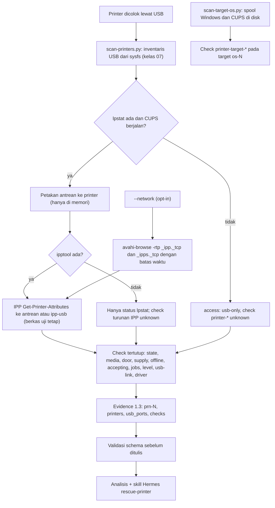
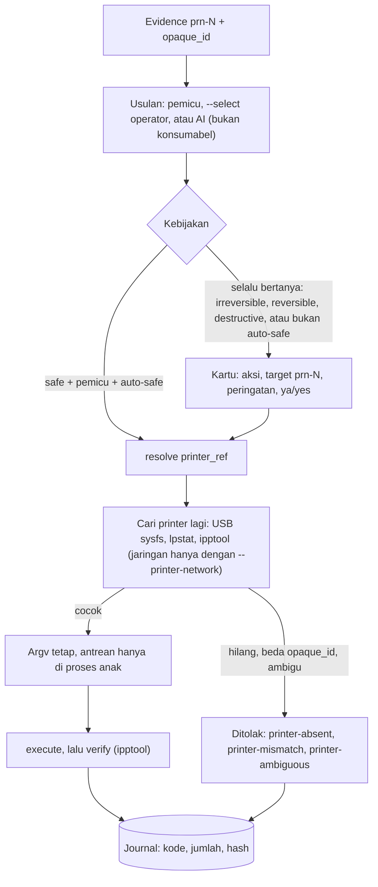

# Printer (USB, jaringan opt-in, dan spooler OS di disk)

> Managed by **ahlikoding.com** and **satpamsiber.com** from **ahliweb.com**.

Toolkit mendeteksi printer yang dicolok lewat USB ke PC yang menjalankan USB rescue, membaca status antreannya (CUPS) dan atribut IPP-nya, dan memeriksa subsistem cetak dari sistem operasi yang terpasang di disk. Printer jaringan hanya dicari bila operator mengaktifkannya untuk satu kali jalan. Isu: ahliweb/linux-mint-xfce-rescue-ai#57. Fase 1 adalah **deteksi read-only**; fase 2 menambahkan **tindakan perbaikan katalog bertipe** dan pemasangan ke launcher live ([Tindakan perbaikan](#tindakan-perbaikan-fase-2)). Label status: **Implemented** (level source, dicakup `make check`), **Planned**, **Hardware-required** (butuh PC dan printer nyata), **Environment-blocked**. Lihat [testing](testing.md).

## Lingkup dan keputusan operator

| Bagian | Keputusan operator (2026-10-01) | Status |
|---|---|---|
| Printer USB di PC yang menjalankan USB rescue: kelas 07 dari inventaris USB bersama ([android](android.md)), port, kecepatan, lokasi ACPI, IPP-over-USB (`ipp-usb`) bila didukung, status IPP | Dalam lingkup | Implemented (deteksi) |
| Subsistem cetak OS di disk: file spool macet (Windows Spooler, Linux CUPS), layanan `cups` | Dalam lingkup | Implemented (deteksi); Spooler Windows start type `unknown` (tanpa parser hive) |
| Printer jaringan | **Opt-in per jalan** (`--network`): mDNS/DNS-SD `_ipp._tcp` dan `_ipps._tcp` di link lokal saja; tanpa pemindaian subnet, tanpa SNMP, tanpa kredensial | Implemented |
| Konsumabel (halaman uji, pembersihan head) | Aksi katalog, hanya operator (`--select`, tanpa pemicu, model tidak boleh mengusulkannya), **selalu bertanya**, tidak pernah otomatis: kelas risiko `irreversible` ([di bawah](#kelas-risiko-irreversible)) | Implemented (fase 2); printer nyata Hardware-required |
| Tindakan perbaikan katalog (`rescue-ai/v1/catalog/printer.json`), parameter `printer_ref`, scope `printer`, pemasangan ke launcher live, karantina spool OS target | Fase 2 | Implemented (level source); printer dan PC nyata Hardware-required |
| Flashing firmware, alat pemeliharaan vendor, kredensial printer jaringan, pemindaian subnet | Di luar lingkup | Tidak akan dibuat |
| Uji dengan printer, PC, dan CUPS nyata | | Hardware-required |



## Sumber deteksi

| Sumber | Dipakai untuk | Tanpa sumber ini |
|---|---|---|
| `/sys/bus/usb/devices` (`rescue_modules/usb_devices.py`) | Printer USB: antarmuka kelas 07 subkelas 01, protokol 01 (unidirectional), 02 (bidirectional), 04 (IPP-over-USB); port, kecepatan, kedalaman hub, lokasi ACPI, merek dari vendor ID | Tidak ada printer USB; sysfs tak terbaca menghasilkan `unknown` |
| `lpstat -r`, `-p`, `-v`, `-a`, `-o` (paket `cups-client`) | Apakah CUPS berjalan, status antrean (`idle`/`processing`/`stopped`), URI perangkat (hanya di memori, untuk memetakan antrean ke printer), antrean menerima pekerjaan atau tidak, jumlah pekerjaan | Tanpa antrean: `printer-driver` `unknown`; check IPP tetap bisa dari endpoint `ipp-usb` |
| `ipptool` (paket `cups-ipp-utils`) dengan `scripts/lib/ipp/get-printer-attributes.test` | Satu IPP Get-Printer-Attributes: `printer-state`, `printer-state-reasons`, `printer-is-accepting-jobs`, `queued-job-count`, `marker-levels`, `marker-types`, `printer-make-and-model` | Check turunan IPP (media, pintu, supply, offline, level tinta) `unknown`, tidak pernah `pass` |
| `/var/ipp-usb/dev/*.state` (paket `ipp-usb`) | Nomor port loopback endpoint IPP-over-USB (60000-65535) dari printer yang mendukungnya; hanya dua ID heks pada nama berkas dan baris `http-port` yang dibaca | Printer IPP-over-USB hanya tampil dari inventaris USB |
| `avahi-browse -rtp` (paket `avahi-utils`), hanya dengan `--network` | Printer jaringan di link lokal | Pencarian jaringan dilewati dengan catatan |

**Mengapa `ipptool`, bukan klien IPP buatan sendiri.** IPP adalah protokol biner; `ipptool` adalah klien milik proyek CUPS, memakai berkas permintaan deklaratif tetap (hanya meminta atribut yang dibutuhkan check, tidak pernah nama, URI, serial, `printer-info`, atau lokasi) dan mencetak CSV kecil yang diurai terhadap allowlist. Encoder IPP dalam Python berarti kode penguraian baru untuk data dari peer tak tepercaya, sedangkan `ipptool` membuat argv tetap dan keluarannya mudah diuji. Tanpa `ipptool` modul turun ke `lpstat` saja.

Semua panggilan: argv tetap, `stdin` dari `/dev/null`, batas waktu (`lpstat` 8 detik, `ipptool` 10 detik dengan `-T 6`, `avahi-browse` 12 detik), keluaran dibaca paling banyak 1 MiB, `LC_ALL=C`, lingkungan bersih (tanpa `CUPS_SERVER`). Satu-satunya elemen argv yang berubah adalah URI IPP, dan URI itu dibentuk dan divalidasi di modul (lihat [Printer jaringan](#printer-jaringan-opt-in)). Pemindaian tidak membuat, mengaktifkan, menjeda, atau membatalkan antrean, dan tidak mencetak apa pun; yang mengubahnya hanya aksi katalog fase 2 setelah persetujuan operator.

## Identifikasi port USB

`python3 scripts/scan-printers.py --list` mencetak tabel dwibahasa printer yang ditemukan (tanpa root, tanpa jaringan kecuali `--network`):

| Kolom | Sumber |
|---|---|
| REF | `prn-0`..`prn-7`: printer di port USB menurut urutan port, lalu antrean tanpa printer terlihat, lalu printer jaringan (menurut id opak); stabil selama printer tidak dipindah |
| KONEKSI / CONNECTION | `USB`, `IPP-over-USB` (lewat endpoint `ipp-usb` di loopback), `jaringan/network`, `lain/other` |
| PORT, LOKASI, KECEPATAN | nama entri `/sys/bus/usb/devices/<bus>-<port>[.<port>]*`, `port/physical_location` (ACPI `_PLD`, bila firmware menyediakannya), `speed`; `-` bila tidak ada |
| MEREK / BRAND | allowlist, lihat di bawah |
| STATUS, ALASAN, TINTA%, ANTRIAN | `printer-state`, kata kunci tertutup dari `printer-state-reasons` (lihat tabel), tingkat terendah konsumabel, jumlah pekerjaan |
| TANDA | `[HUB]` bila printer ada di belakang hub; `[USB RESCUE]` bila printer ada di hub yang sama dengan USB rescue (jangan cabut hub itu) |

Printer dengan antrean tetapi tidak ada di port USB mana pun (dimatikan atau kabel lepas) tetap ditampilkan tanpa port, dengan `printer-usb-link` `fail`. Setelah tabel, panduan dwibahasa per masalah: kertas macet, pintu terbuka, kertas habis, toner atau tinta rendah, offline (periksa kabel dan daya), antrean berhenti (`printer.resume-queue`), tidak menerima pekerjaan (`printer.accept-jobs`), pekerjaan menumpuk (`printer.cancel-stuck-jobs`), dan printer terdeteksi tanpa antrean (driver; pembuatan antrean driverless oleh toolkit belum ada, **Planned**). `scan-printers.py --count` hanya mencetak jumlah printer (dipakai launcher untuk memutuskan apakah menawarkan pemindaian). Layar boleh menampilkan **merek, port, dan kata status tertutup**, tidak pernah nama antrean, URI, alamat, atau serial.

Merek berasal dari **vendor ID USB** (HP, Canon, Epson, Brother, Samsung, Xerox, Lexmark, Kyocera, Ricoh, Konica Minolta, OKI, Sharp, Pantum, Fujifilm, Dell, Zebra) atau dari **kata pertama `printer-make-and-model`** IPP; selain itu `other`. Teks model itu sendiri dibuang saat diurai.

## Pemetaan `printer-state-reasons`

IPP mengirim kata kunci dengan akhiran keparahan opsional `-error`, `-warning`, `-report` (tanpa akhiran dianggap `error`). Hanya kata kunci pada tabel ini yang memengaruhi check; yang lain diabaikan. Kata kunci yang berakhiran kata keparahan tetapi merupakan kata kunci tersendiri (`offline-report`) tidak dipotong.

| Check | Kata kunci | Status |
|---|---|---|
| `printer-media` | `media-jam` | `fail` (apa pun keparahannya) |
| `printer-media` | `media-empty`, `media-needed`, `input-tray-missing`, `output-area-full`, `output-tray-missing` | `fail` bila `error` atau tanpa akhiran, `warn` bila `warning`/`report` |
| `printer-media` | `media-low`, `output-area-almost-full` | `warn` |
| `printer-door` | `door-open`, `cover-open`, `interlock-open` | `fail` |
| `printer-marker-supply` | `toner-empty`, `ink-empty`, `marker-supply-empty`, `opc-life-over`, `marker-waste-full` | `fail` bila `error`/tanpa akhiran, `warn` bila `warning`/`report` |
| `printer-marker-supply` | `toner-low`, `ink-low`, `marker-supply-low`, `opc-near-eol`, `marker-waste-almost-full` | `warn` |
| `printer-offline` | `offline-report`, `connecting-to-device`, `shutdown`, `timed-out`, `other-offline` | `warn` |
| (hanya panduan) | `paused`, `moving-to-paused` | antrean dijeda; `printer-state` sudah `stopped` |

Tidak ada kata kunci yang cocok berarti `pass`; alasan yang tidak terbaca berarti `unknown` untuk keempat check. Status terburuk menang, dan check tidak saling memengaruhi.

## Check yang dihasilkan

Check lingkungan (tanpa `target_ref`, source `collector-allowlist`): `usb-device-count` (angka perangkat USB non-hub) dan `printer-count` (angka printer yang ditemukan; `warn` bila 0). Check per printer memakai `target_ref` `prn-0`..`prn-7`:

| Check | Nilai | Status |
|---|---|---|
| `printer-state` | - | `idle`/`processing` `pass`; `stopped` `fail`; tidak terbaca `unknown` |
| `printer-media` | - | tabel di atas |
| `printer-door` | - | tabel di atas |
| `printer-marker-supply` | - | tabel di atas |
| `printer-offline` | - | tabel di atas |
| `printer-accepting-jobs` | - | `printer-is-accepting-jobs` (atau `lpstat -a`): `false` `fail` |
| `printer-queued-jobs` | `count` pekerjaan menunggu | `warn` bila lebih dari 0 **dan** status `stopped`; selain itu `pass`. Umur pekerjaan tidak ditentukan (format tanggal `lpstat` bergantung pada locale), jadi tidak dipakai |
| `printer-marker-level-min` | `percent` konsumabel terendah | `warn` di bawah 15, `fail` di bawah 3. Wadah limbah (`waste-*`) dan level tak diketahui (-1, -2, -3) diabaikan; tanpa `marker-types` tidak ada level yang dipercaya |
| `printer-usb-link` | - | `warn` bila negosiasi di bawah 12 Mbps atau di belakang lebih dari satu hub; `fail` bila ada antrean untuk printer USB yang tidak ada di port mana pun (hanya bila tidak ada printer USB lain yang belum berpasangan); `not_applicable` untuk jaringan; `unknown` tanpa kecepatan |
| `printer-driver` | - | `pass` bila antrean atau endpoint `ipp-usb` ada; `warn` bila printer USB terdeteksi tanpa antrean (membuat antrean driverless oleh toolkit belum ada: **Planned**); `unknown` bila CUPS tidak terbaca atau ada antrean yang tidak dapat dipasangkan; `not_applicable` untuk printer jaringan tanpa antrean |

Soal `printer-usb-link`: printer yang berjalan di 12 Mbps itu normal (banyak printer hanya full-speed, dan USB 2.0 full-speed tidak dapat dibedakan dari kabel buruk), jadi kecepatan tersebut **tidak** ditandai; hanya low-speed (di bawah 12 Mbps) atau rantai hub lebih dari satu yang `warn`. Berbeda dengan Android, tidak ada ambang 480 Mbps.

Ambang di atas adalah heuristik. `pass` berarti status yang dilaporkan sehat, bukan bahwa kualitas cetak baik.

## Spool OS di disk (target `os-N`)

Dijalankan oleh `scan-target-os.py` lewat registri modul (`rescue_modules/printer.py`, domain `printer` dengan scope `printer`), untuk setiap OS yang dipasang read-only. Sejak fase 2 check ini termasuk **scope `printer`** (sebelumnya `os`): `--scope all` (default) dan `--scope printer` memuatnya, `--scope os` tidak lagi. Keputusan: aksi pemulihnya (`printer.target-quarantine-spool`) ada di katalog printer, jadi deteksi, aksi, dan domain laporan (`printer`, [run-report](run-report.md)) satu scope; check tetap bernomor skema 1.2 dan menempel pada target `os-N`. File tidak pernah dibuka isinya, tidak ada nama file yang dikeluarkan, symlink tidak pernah diikuti (satu symlink di jalur membuat hasil `unknown`), dan pencarian tidak peka huruf besar/kecil untuk NTFS.

| Check | Windows | Linux (`linuxmint`, `linux-other`) |
|---|---|---|
| `printer-target-spool-stuck` | jumlah berkas `*.SPL` dan `*.SHD` di `Windows/System32/spool/PRINTERS` (berkas, bukan pekerjaan; satu pekerjaan biasanya dua berkas); `warn` bila 1 atau lebih, `unknown` bila folder tidak terbaca | jumlah berkas pekerjaan `c#####` dan `d#####-###` di `var/spool/cups`; `warn` bila 1 atau lebih; `not_applicable` bila CUPS tidak terpasang |
| `printer-target-spooler-service` | selalu `unknown`: start type Spooler ada di hive registri SYSTEM dan proyek ini tidak memiliki parser hive | tidak ada |
| `printer-target-cups-service` | tidak ada | `pass` bila unit `cups.service`/`cups.socket`/`cups.path` di-enable (symlink di `etc/systemd/system/{printer,sockets,multi-user}.target.wants`, tidak diikuti), `warn` bila terpasang tetapi tidak di-enable, `fail` bila di-mask (`cups.service` menunjuk `/dev/null`), `not_applicable` bila CUPS tidak terpasang |

Berkas spool macet adalah penyebab klasik antrean yang "tersangkut" setelah crash. Memindahkannya ke karantina yang dapat dibalik adalah aksi `printer.target-quarantine-spool` ([di bawah](#printer-target-quarantine-spool)). macOS dan keluarga `unknown` tidak menghasilkan check printer.

## Printer jaringan (opt-in)

Mati secara default: tanpa `--network`, `avahi-browse` tidak pernah dipanggil (diuji: shim mencatat bahwa ia **tidak** dipanggil). Dengan `--network`:

1. `avahi-browse -rtp _ipp._tcp` dan `avahi-browse -rtp _ipps._tcp` (mDNS/DNS-SD di link lokal, `-t` berhenti setelah dump, batas waktu 12 detik). Tidak ada pemindaian subnet, SNMP, atau kredensial.
2. Layanan yang diterima adalah **data tak tepercaya dari peer di LAN**. Hanya baris `=` yang sudah di-resolve, dengan alamat loopback/privat/ULA (alamat publik, link-local IPv6 tanpa zona, multicast, dan antarmuka `lo` dibuang; antarmuka `lo` dipakai `ipp-usb` untuk printer USB-nya sendiri). `rp` harus cocok dengan pola ketat tanpa `..`. Printer yang dibagikan PC ini sendiri (alamat ada di `/proc/net/fib_trie`) dan printer yang sudah punya antrean lokal (alamat, nama host, atau nama instance dnssd sama) dilewati. Paling banyak 6 printer jaringan, dan total delapan printer.
3. Setiap printer dibaca dengan satu `ipptool -T 6 -c <uri> get-printer-attributes.test` ke `ipp(s)://<alamat>:<port>/<rp>`; URI itu hanya ada di memori dan dibentuk dari bagian yang sudah divalidasi, tidak pernah dari teks mentah, tidak pernah diawali `-`. Bila tidak menjawab, `access: ipp-unavailable` dan semua check turunan IPP `unknown`.
4. Printer jaringan yang sudah dikonfigurasi sebagai antrean CUPS lokal selalu ditampilkan (status dari cache CUPS, tanpa lalu lintas LAN dari toolkit), dengan atau tanpa `--network`. Antrean virtual (PDF, file) bukan printer dan dilewati.

Batas jujur: mDNS hanya menjangkau satu link; printer di VLAN atau subnet lain, atau yang mematikan Bonjour/IPP, tidak ditemukan; jawaban IPP dari printer yang rusak atau hostile hanya menghasilkan status tertutup dan angka terbatas.

## Evidence schema 1.3

Skema tetap 1.3 (belum dirilis; tidak dinaikkan lagi). Fase 2 tidak menambah bidang evidence: nilai `printer` ditambahkan ke enum `scope`, pola `action_id` menerima prefiks `printer`, dan `repair_proposals[].target_ref` menerima `prn-N`. `scan-printers.py` kini menulis `scope: ["printer"]`, `repair_policy` (`--repair-policy`, default `detect-only`), dan `repair_proposals` dari pemicu katalog (ID saja).

- `target_systems[]`: `family: printer`, `ref: prn-N`, `detection`: `usb-enumerated` (hanya terlihat di USB), `usb-cups` (antrean CUPS, status dari `lpstat`), `usb-ipp` (antrean CUPS, status dibaca lewat IPP), `ipp-usb` (endpoint IPP-over-USB tanpa antrean), `network-ipp` (printer non-USB: antrean jaringan atau hasil mDNS); `access`: `ipp-read`, `cups-only`, `ipp-unavailable`, `usb-only`; `encryption: unknown`; `opaque_id`; `usb_port` bila terpasang di port USB. Tidak ada `release` atau `architecture`.
- `printers[]` (maks. 8, objek tertutup): `ref`, `connection` (`usb`, `ipp-over-usb`, `network`, `other`), `usb_port` (harus ada di `usb_ports[]` dan sama dengan target), `brand` (enum tertutup), `ipp_usb_capable` (boolean). Tanpa string bebas.
- Check ID baru: `printer-count`, 10 check per printer (di atas), dan `printer-target-spool-stuck`, `printer-target-spooler-service`, `printer-target-cups-service`. Yang terakhir valid sejak skema 1.2 (dipakai `scan-target-os.py`); selebihnya hanya 1.3. `target_ref` kini `^(os|and|prn)-[0-7]$`. Jenis nilai tidak bertambah.
- Aturan semantik (`scripts/validate-evidence.py`): prefiks ref cocok dengan family; `detection` dan `access` milik family-nya; `printers[]` dan target `printer` berpasangan satu-satu; `usb_port` cocok dengan `usb_ports[]` dan hanya untuk koneksi USB; `printer-count` tanpa `target_ref`, `printer-*` memakai `prn-N`, `printer-target-*` memakai `os-N`. Skema 1.0-1.2 menolak semua bidang printer 1.3.
- Fixture: `rescue-ai/v1/fixtures/valid-printer.json`, `invalid-printer-queue.json` (nama antrean dan IP diselundupkan ke `printers[]`).

## Privasi

| Data | Perlakuan |
|---|---|
| Nama antrean, URI perangkat, alamat IP/MAC, nama host, serial (SN IEEE-1284, iSerial USB), nama pekerjaan, nama pengguna, string `printer-info` dan lokasi | **Tidak pernah** masuk evidence, laporan, journal, permintaan analyzer, issue, skill, atau layar. Nama antrean dan fakta URI hidup di memori proses (kunci `_private` pada dict printer) dan hilang bersama proses; `public_view` adalah satu-satunya jalan keluar. Berkas uji IPP tidak meminta atribut tersebut sama sekali. Mesin perbaikan memakai nama antrean hanya di argv proses anak: kartu persetujuan menampilkan `<printer prn-N>`, keluaran alat printer (`lp` mencetak `request id is ANTREAN-12`) **tidak ditampilkan**, dan journal hanya memuat kode, jumlah, dan hash |
| Identitas printer | `opaque_id` = `target-` + 16 hex pertama HMAC-SHA256 dengan kunci `/etc/machine-id` mesin (tidak pernah dikeluarkan) atas serial USB (atau port dan `vendor:product`, nama antrean, atau nama instance mDNS). Tebakan tidak dapat dicocokkan dari evidence; id stabil untuk printer yang sama di PC yang sama |
| `vendor:product` | Tidak ada di evidence; hanya `brand` dari enum tertutup |
| Keluaran IPP, `lpstat`, `avahi-browse` | Data tak tepercaya: diurai ke status tertutup, kata kunci tertutup, dan angka terbatas lalu dibuang |

## Model ancaman dan batas

Printer, antrean, dan LAN adalah peer yang tidak tepercaya: mereka dapat menjawab dengan data sembarang, keluaran tak terbatas, atau tidak menjawab. Karena itu panggilan memakai batas waktu dan batas ukuran, keluaran tidak pernah dijadikan perintah, dan hasil hanya status tertutup. Lihat [security-model](security-model.md).

- Butuh printer, PC, dan CUPS nyata: aturan udev, ACPI `_PLD`, bentuk keluaran `ipptool` berbagai versi, `ipp-usb`, dan mDNS nyata adalah **Hardware-required** dan tidak diverifikasi `make check` (uji memakai pohon sysfs palsu dan shim `lpstat`/`ipptool`/`avahi-browse`). Format CSV `ipptool -c` diverifikasi terhadap CUPS 2.4.7 pada mesin pengembang; header tak dikenal membuat hasil `unknown`.
- Dua printer identik (vendor:product sama) tidak dipasangkan ke endpoint `ipp-usb` (ambigu); antrean `usb://` tanpa serial hanya dipasangkan bila tepat satu antrean dan satu printer yang tersisa. Yang ambigu tidak ditebak: `printer-driver` menjadi `unknown`.
- Printer hanya-pengisi-daya atau yang dimatikan tidak terlihat di USB; kabel tanpa jalur data sama.
- Umur pekerjaan, kualitas cetak, dan kerusakan perangkat keras (head, fuser, sensor) tidak dideteksi.
- Skill Hermes [`rescue-printer`](../profiles/rescue-hermes/skills/rescue-printer/SKILL.md) memandu diagnosis read-only dan melarang flashing firmware, alat vendor, pemindaian jaringan di luar mDNS opt-in, mencetak tanpa persetujuan, dan menyebut nama antrean atau alamat.

## Tindakan perbaikan (fase 2)

Tindakan printer hanyalah **aksi katalog bertipe** di `rescue-ai/v1/catalog/printer.json` (domain `printer`, prefix `printer.`, scope `printer`), dijalankan oleh `scripts/rescue-repair.py` dengan kontrak yang sama seperti domain lain ([repair-framework](repair-framework.md)): `approve-each` default, setiap aksi di-verify dan dicatat di journal. Argv selalu tetap; AI hanya dapat menyebut `action_id` dan `target_ref` (`prn-N`). Satu aksi menyasar **satu printer** (`printer_ref`, `target_families: ["printer"]`, platform `live-linux` dan `linux-host`) **atau** spooler OS terpasang (`target_root`, hanya `live-linux`), tidak keduanya.

| Aksi | Risiko | Pemicu | Argv (ringkas) | Verify | Rollback |
|---|---|---|---|---|---|
| `printer.resume-queue` | `safe` | `printer-state` fail | `cupsenable ANTREAN` (root) | `ipptool` dengan `verify-queue-ready.test`: `printer-state` idle atau processing, bukan stopped | tidak ada |
| `printer.accept-jobs` | `safe` | `printer-accepting-jobs` fail | `cupsaccept ANTREAN` (root) | `ipptool` dengan `verify-accepting.test`: `printer-is-accepting-jobs` true | tidak ada |
| `printer.cancel-stuck-jobs` | `irreversible` | `printer-queued-jobs` warn | `cancel -a ANTREAN` (root) | `ipptool` dengan `verify-no-jobs.test`: `queued-job-count` 0 | tidak ada: pekerjaan hilang |
| `printer.identify` | `safe` | tanpa pemicu: hanya `--select` | `ipptool -q -T 10 ipp://localhost/printers/ANTREAN identify-printer.test` | `lpstat -p ANTREAN` (kode keluar 0: antrean masih ada) | tidak ada |
| `printer.print-test-page` | `irreversible` | tanpa pemicu: hanya `--select` | `lp -d ANTREAN -t rescue-test-page test-page.txt` | `verify-queue-ready.test` | tidak ada: kertas dan tinta terpakai |
| `printer.clean-print-heads` | `irreversible` | tanpa pemicu: hanya `--select` | `lp -d ANTREAN -o raw clean-heads.cupscmd` | `verify-queue-ready.test` | tidak ada: tinta terpakai |
| `printer.target-quarantine-spool` | `reversible` | `printer-target-spool-stuck` warn (target `os-N`) | `rescue-malware-quarantine spool-quarantine --target-root=ROOT --quarantine-dir=USB` (root, target read-write) | `spool-verify` | otomatis: `spool-restore` |

`ANTREAN` adalah nama antrean CUPS yang diselesaikan mesin (tidak pernah ditampilkan); berkas `*.test`, `test-page.txt`, dan `clean-heads.cupscmd` adalah berkas tetap yang dikirim dalam bundel (`scripts/lib/ipp/`, `scripts/lib/printer/`). Hanya program `cupsenable`, `cupsaccept`, `cancel`, `lp`, `ipptool`, `lpstat` (dan `rescue-malware-quarantine` untuk spool) yang dapat muncul di katalog printer, masing-masing dalam satu bentuk argv tetap yang dijaga validator ([di bawah](#batas-yang-dijaga-validator-katalog)). Tidak ada `lpadmin`, firmware, alat vendor, kredensial, atau URI selain antrean lokal.



<a id="printer-resume-queue"></a>
**`printer.resume-queue`.** Menjalankan `cupsenable` pada antrean yang berhenti atau dijeda. `safe` dan boleh berjalan otomatis pada `auto-safe` bila `printer-state` fail. Ini hanya perintah perangkat lunak: bila penyebab fisiknya belum diperbaiki (kertas macet, penutup terbuka, kertas habis), CUPS menghentikan antrean lagi setelah satu pekerjaan gagal. **Awas:** melanjutkan antrean yang berisi pekerjaan macet **mencetak pekerjaan itu**; bila tidak diinginkan, jalankan `printer.cancel-stuck-jobs` lebih dulu. Verify membaca `printer-state` lewat IPP segera setelah perintah dan hanya membuktikan antrean tidak lagi `stopped` pada saat itu.

<a id="printer-accept-jobs"></a>
**`printer.accept-jobs`.** Menjalankan `cupsaccept` pada antrean yang menolak pekerjaan baru (`printer-accepting-jobs` fail). `safe`. Verify memastikan `printer-is-accepting-jobs` bernilai `true`.

<a id="printer-cancel-stuck-jobs"></a>
**`printer.cancel-stuck-jobs`.** Menjalankan `cancel -a ANTREAN`: **membatalkan semua pekerjaan** antrean itu, termasuk milik pengguna lain. Dipicu `printer-queued-jobs` warn (pekerjaan menumpuk di antrean yang berhenti), tetapi **selalu bertanya**, juga pada `auto-safe`. Risiko `irreversible` ([di bawah](#kelas-risiko-irreversible)): pekerjaan tidak dapat dikembalikan, tetapi dokumennya masih ada di aplikasi asalnya dan dapat dicetak ulang. Verify memastikan `queued-job-count` 0.

<a id="printer-identify"></a>
**`printer.identify`.** Mengirim IPP Identify-Printer (`identify-actions` display dan sound) agar printer menyalakan layar dan berbunyi, sehingga operator tahu printer mana yang dimaksud `prn-N`. `safe`, tanpa pemicu (hanya `--select`). Hanya printer dan driver yang mengimplementasikan operasi itu yang bereaksi; pada antrean raw atau printer lama CUPS menjawab `operation-not-supported`, langkah execute gagal dan aksi dilaporkan `failed` tanpa efek lain (diuji terhadap CUPS 2.4 pribadi: antrean raw menjawab tepat begitu). Verify hanya memeriksa antrean masih ada.

<a id="printer-print-test-page"></a>
**`printer.print-test-page`.** Mencetak **satu halaman uji tetap** (`scripts/lib/printer/test-page.txt`, dwibahasa, tanpa nama pengguna, komputer, alamat, atau serial) dengan `lp -d ANTREAN -t rescue-test-page`. **Konsumabel:** memakai kertas dan tinta atau toner. Hanya operator (`--select`), tanpa pemicu, model tidak dapat mengusulkannya, selalu bertanya (`irreversible`). Verify membaca `printer-state` lewat IPP: ia membuktikan pekerjaan diterima dan antrean tidak berhenti, **bukan** bahwa halaman keluar atau kualitas cetaknya baik; lihat kertasnya.

<a id="printer-clean-print-heads"></a>
**`printer.clean-print-heads`.** Mengirim berkas perintah CUPS tetap (`#CUPS-COMMAND` dan `Clean all`) dengan `lp -d ANTREAN -o raw`. **Konsumabel:** pembersihan head memakai tinta (dan beberapa model menghitungnya sebagai siklus pemeliharaan terbatas). Hanya driver yang menyediakan filter perintah CUPS (paket CUPS membawa `commandtoepson`, `commandtocanon`, `commandtoescpx`, `commandtopclx`, `commandtops`) yang bertindak; antrean driverless/IPP Everywhere biasanya mengabaikannya tanpa galat, jadi lakukan pembersihan dari panel printer bila tidak ada reaksi. Aturan persetujuan sama dengan halaman uji. Verify sama dan tidak membuktikan head bersih.

<a id="printer-target-quarantine-spool"></a>
**`printer.target-quarantine-spool`.** Memindahkan berkas spool macet dari OS terpasang di disk ke karantina reversibel di USB, lalu verify, dengan rollback otomatis. Dipicu `printer-target-spool-stuck` warn pada target `os-N` (Windows, Linux Mint, atau Linux lain). Hanya berkas yang dihitung modul deteksi: `*.SPL` dan `*.SHD` di `Windows/System32/spool/PRINTERS`, atau berkas pekerjaan `c#####` dan `d#####-###` di `var/spool/cups` (daftar dibaca oleh `rescue_modules.printer.list_spool_files`, tidak pernah dari data). Target di-mount **read-write** oleh `scripts/lib/target_mount.py` hanya setelah persetujuan dan hanya di sesi live (NTFS dengan hibernasi/fast startup ditolak); BitLocker, LUKS, dan FileVault tidak pernah dibuka. Pembantunya adalah `rescue-malware-quarantine` dengan perintah tetap baru: `spool-check` (prasyarat: ada berkas dan tiap berkas biasa tanpa symlink), `spool-quarantine` (menyalin tiap berkas ke `<state>/quarantine/blobs`, mencatat manifes dengan satu id kelompok `s-...` dan nomor perangkat mount, baru menghapus aslinya), `spool-verify` (tidak ada berkas spool tersisa, tiap salinan cocok SHA-256) dan `spool-restore` (mengembalikan kelompok terakhir, tidak pernah menimpa berkas, menolak bila mount berbeda dari saat karantina). Bila execute berhenti di tengah, rollback otomatis mengembalikan berkas yang sudah dipindah. Manifes mencatat jalur, jadi direktori karantina bersifat privat seperti daftar deteksi malware; entri spool bertanda `"kind": "spool"` dan **tidak dihitung** sebagai temuan malware oleh check `malware-quarantine`. Pemulihan manual lama: `sudo rescue-malware-quarantine list --quarantine-dir DIR` lalu `restore --id ID --target-root ROOT` ([malware](malware.md)).

### Kelas risiko `irreversible`

Kebijakan mesin hanya mengenal satu kelas yang boleh jalan tanpa bertanya: `safe` yang dipicu katalog pada `auto-safe`. `reversible` butuh rollback otomatis dan `destructive` butuh backup dan `action_id` diketik, padahal halaman uji, pembersihan head, dan pembatalan pekerjaan **tidak punya rollback dan tidak kehilangan data tersimpan** (tidak ada yang bisa dibackup). Karena itu fase 2 menambah kelas keempat, `irreversible`: perubahan yang tidak dapat dibatalkan tetapi tidak membuang apa pun yang tersimpan (kertas dan tinta terpakai, pekerjaan cetak antrean dibuang; dokumennya tetap ada di aplikasi). Aturannya: tanpa rollback (`none`), tanpa backup, tanpa mount read-write, **selalu bertanya** (seperti semua kelas selain `safe`, juga pada `auto-safe` dan juga bila dipicu), dan kartu persetujuan menampilkan peringatan dwibahasa. Aksi `lp` (konsumabel) lebih ketat: wajib `irreversible`, tidak boleh punya pemicu, dan model tidak boleh mengusulkannya (usulan AI untuk `irreversible` tanpa pemicu ditolak dan tidak ditawarkan di daftar aksi analisis). `--approve ACTION_ID` tetap persetujuan eksplisit operator untuk satu kali jalan itu. Kelas baru ada di skema katalog, journal, laporan, dan ketiga mesin (Python, PowerShell, JXA).

### Parameter `printer_ref`

Aksi printer menyebut printernya lewat parameter bertipe `printer_ref`, yang **tidak pernah** berasal dari operator, evidence, atau model (`--param` untuk tipe ini ditolak). Mesin menyelesaikannya saat eksekusi, setelah persetujuan:

1. `target_ref` (`prn-N`) usulan harus ada di `target_systems[]` evidence dengan `family: printer` dan `opaque_id`.
2. Mesin menjalankan **pencarian printer lagi** (`printer.discover`: inventaris USB sysfs, `lpstat`, `ipptool`; mDNS hanya dengan `--printer-network`) lalu mengambil `prn-N` yang sama.
3. Ia menolak bila: tidak ada, atau tidak punya antrean CUPS untuk dialamati, atau printer jaringan tanpa `--printer-network` (`printer-absent`); lebih dari satu printer berbagi `opaque_id` (`printer-ambiguous`); atau `opaque_id` sekarang tidak sama dengan evidence, misalnya printer lain di port itu atau penomoran bergeser (`printer-mismatch`).
4. Bila lolos, `{printer_ref}` dirender sebagai nama antrean (cocok `[A-Za-z0-9_][A-Za-z0-9._-]{0,126}`, tidak pernah diawali `-`) hanya di argv proses anak, termasuk bentuk `ipp://localhost/printers/{printer_ref}` untuk `ipptool` (satu-satunya URI yang boleh dibentuk aksi). Nama itu **tidak** masuk journal, laporan, atau layar.

Penolakan dicatat sebagai `precondition fail` dengan `reason` bertipe (`printer-absent`, `printer-mismatch`, `printer-ambiguous`) dan hasil akhir `skipped`; tidak ada perintah yang dijalankan. **Printer jaringan** hanya menjadi sasaran bila operator menjalankan jalan itu dengan `--printer-network` (peluncur live meneruskannya ke pemindaian dan mesin): printer hasil mDNS tanpa antrean lokal tidak dapat disasar karena tidak ada antrean CUPS; antrean jaringan yang sudah dikonfigurasi boleh. Lingkungan proses anak bersih (tanpa `CUPS_SERVER`, tanpa kunci API); `requires_root` memakai `sudo -n` seperti aksi lain (`cupsenable`, `cupsaccept`, `cancel`; `lp` dan `ipptool` berjalan sebagai pengguna desktop).

### Parameter `bundle_root`

Parameter tipe `bundle_root` adalah direktori bundel rescue (di sesi live `/usr/local/lib/rescue-omes`), disediakan mesin, dan hanya boleh muncul sebagai `{bundle_root}/scripts/lib/...` menuju salah satu berkas tetap yang dikirim: `scripts/lib/ipp/{identify-printer,verify-queue-ready,verify-accepting,verify-no-jobs}.test`, `scripts/lib/printer/test-page.txt`, `scripts/lib/printer/clean-heads.cupscmd`. Validator menolak jalur lain, jadi katalog tidak dapat menyuruh `lp` mencetak berkas sembarang.

### Batas yang dijaga validator katalog

`scripts/lib/repair_catalog.py` menolak aksi printer yang: memakai program di luar `cupsenable`, `cupsaccept`, `cancel`, `lp`, `ipptool`, `lpstat` (atau `rescue-malware-quarantine` dengan `spool-check|spool-quarantine|spool-verify|spool-restore` dan hanya `--target-root=` dan `--quarantine-dir=`); memakai bentuk selain `cupsenable|cupsaccept {printer}`, `cancel -a {printer}`, `lpstat -p|-a|-o {printer}`, `lp -d {printer} [-t rescue-test-page | -o raw] {berkas tetap}`, `ipptool -q -T N ipp://localhost/printers/{printer} {berkas tetap}`; menyasar printer dan target OS sekaligus atau tidak keduanya; atau memakai `lp` tanpa kelas `irreversible` atau dengan pemicu. Program printer di domain lain juga ditolak. Jadi `lpadmin`, `lpoptions`, `cupsctl`, `lprm` bebas, `lp` ke berkas lain, URI jaringan, firmware, dan alat vendor tidak dapat masuk katalog tanpa mengubah validator itu sendiri. Mesin host Windows dan macOS menerima katalog yang sama dan menandai `printer_ref`/`bundle_root` sebagai tidak didukung (aksi printer tidak pernah berlaku di platform mereka).

### Cara memakai

**Live USB (launcher).** Setelah pemindaian OS (dan tawaran Android), `scripts/launch-hermes-rescue.sh` menjalankan `scan-printers.py --count`. Bila ada printer dan sesi interaktif, launcher menampilkan tabel printer lalu bertanya (default **tidak**; tanpa terminal dilewati) apakah printer dipindai. Bila ya: pemindaian read-only sebagai pengguna desktop ke `<state-dir>/reports/printer-evidence-<stamp>.json`, lalu `rescue-repair.py --scope printer` dengan kebijakan yang sama (`--repair-policy`, default `approve-each`), pemindaian ulang bila ada aksi yang dijalankan (`printer-evidence-<stamp>-after.json`), dan **laporan run tersendiri** (`run_id` berakhiran `-printer`). Printer jaringan hanya ikut bila launcher dijalankan dengan `--printer-network` (diteruskan ke `scan-printers.py --network` dan `rescue-repair.py --printer-network`). Analisis cloud tidak diminta untuk evidence printer. Lewati fase ini dengan `--no-target-scan` atau `--scope` tanpa `all`/`printer`. Aksi spool OS terpasang tidak butuh tawaran ini: ia diusulkan oleh evidence pemindaian OS biasa (`printer-target-spool-stuck`) dan memakai alur target read-write yang sudah ada.

**Linux host (`host/rescue-linux.sh` belum memasangnya).** Tawaran di launcher host akan menyentuh jalur keluar dan analisis yang rumit, jadi pakai skrip langsung dari bundel, sebagai pengguna biasa:

```bash
python3 scripts/scan-printers.py --list
python3 scripts/scan-printers.py --source-platform linux-host --repair-policy approve-each --output /tmp/printer-evidence.json
python3 scripts/rescue-repair.py --evidence /tmp/printer-evidence.json --scope printer --journal /tmp/printer-journal.jsonl --list
python3 scripts/rescue-repair.py --evidence /tmp/printer-evidence.json --scope printer --journal /tmp/printer-journal.jsonl
python3 scripts/rescue-repair.py --evidence /tmp/printer-evidence.json --journal /tmp/printer-journal.jsonl --select printer.print-test-page:prn-0
```

Perintah terakhir menjalankan aksi operator (halaman uji tidak punya pemicu), menampilkan kartu dengan peringatan konsumabel, dan meminta `ya`/`yes`; tanpa terminal tambahkan `--approve printer.print-test-page`. Tambahkan `--network` pada pemindaian dan `--printer-network` pada mesin bila printer jaringan ikut dalam jalan ini.

**Contoh / examples.**

- ID: "Printer tidak mau mencetak, antrean berhenti." Jalankan pemindaian dan perbaikan di atas; bila `printer-state` fail mesin mengusulkan `printer.resume-queue` dan, bila ada pekerjaan menumpuk, `printer.cancel-stuck-jobs`. Perbaiki penyebab fisik dulu (kertas macet, penutup), batalkan pekerjaan lama bila tidak ingin tercetak, baru lanjutkan antrean.
- EN: "The printer does not print, the queue is stopped." Run the scan and repair above; with `printer-state` fail the engine proposes `printer.resume-queue` and, when jobs are piled up, `printer.cancel-stuck-jobs`. Fix the physical cause first (jam, cover), cancel old jobs if you do not want them printed, then resume the queue.
- ID: "Hasil cetak bergaris." Pilih `--select printer.print-test-page:prn-0`, lihat halaman uji; bila perlu `--select printer.clean-print-heads:prn-0` (memakai tinta, selalu bertanya).
- EN: "Prints are streaky." Use `--select printer.print-test-page:prn-0`, look at the page; if needed `--select printer.clean-print-heads:prn-0` (uses ink, always asks).
- ID: "Printer mana `prn-1`?" `--select printer.identify:prn-1` membuat printer menyala dan berbunyi bila mendukung Identify-Printer.
- EN: "Which printer is `prn-1`?" `--select printer.identify:prn-1` makes the printer light up and beep when it supports Identify-Printer.

### Untuk operator

- **Konsumabel (halaman uji, pembersihan head) memakai kertas dan tinta atau toner dan tidak dapat dibatalkan.** Keduanya hanya berjalan atas pilihan Anda (`--select`) dan persetujuan Anda setiap kali; tidak ada pemicu, tidak pernah otomatis, dan model tidak dapat mengusulkannya. Gunakan seperlunya; pembersihan head berulang menghabiskan tinta.
- `printer.cancel-stuck-jobs` membatalkan pekerjaan **semua pengguna** di antrean itu. Pastikan antrean memang macet.
- `printer.resume-queue` pada antrean berisi pekerjaan akan **mencetak** pekerjaan itu; batalkan dulu bila tidak diinginkan.
- Jika muncul penolakan `printer-mismatch`, jangan pindahkan atau ganti printer di antara pemindaian dan perbaikan; pindai ulang agar `prn-N` dan `opaque_id` cocok lagi. Jika `printer-absent`: nyalakan printer, colok ulang, pastikan CUPS berjalan dan antrean ada (membuat antrean oleh toolkit belum ada), atau untuk printer jaringan jalankan dengan `--printer-network`.
- Tidak ada tindakan firmware, alat vendor, kredensial, atau perubahan pengaturan jaringan printer; lakukan itu sendiri lewat panel printer atau layanan resmi pabrikan.

### Batas fase 2 dan Hardware-required

- Diuji di level source dengan sysfs palsu dan shim `lpstat`/`ipptool`/`cupsenable`/`cupsaccept`/`cancel`/`lp`. Berkas uji `ipptool` (`verify-*.test`) dan perintah `cupsenable`/`cupsaccept`/`cancel`/`lp` juga dicoba pada cupsd CUPS 2.4 pribadi tanpa hak istimewa dengan antrean raw (status berhenti, menolak pekerjaan, pekerjaan tertunda terbaca benar, `lp` menerima berkas tetap). Printer, PC, dan CUPS nyata tetap **Hardware-required**: perilaku Identify-Printer, perintah CUPS `Clean all`, `cupsenable` oleh pengguna sesi live (butuh `sudo -n`), keluarnya halaman uji, serta mount read-write NTFS/ext4 target nyata untuk karantina spool.
- Verify membuktikan keadaan antrean menurut CUPS/IPP, bukan hasil fisik (halaman keluar, head bersih, kertas tidak macet).
- Antrean raw dan printer lama mungkin tidak mengerti Identify-Printer atau perintah CUPS; aksi dilaporkan gagal, bukan berhasil palsu.
- Pembuatan antrean driverless (`lpadmin`) belum ada (**Planned**): printer USB tanpa antrean tetap `printer-driver` warn dan ditambahkan operator di Pengaturan Printer.
