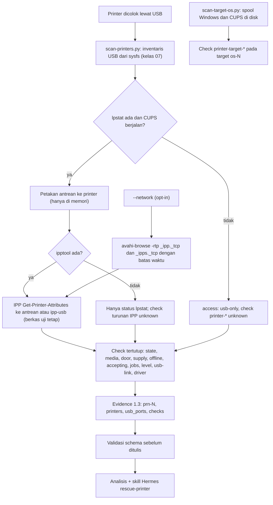

# Printer (USB, jaringan opt-in, dan spooler OS di disk)

> Managed by **ahlikoding.com** and **satpamsiber.com** from **ahliweb.com**.

Toolkit mendeteksi printer yang dicolok lewat USB ke PC yang menjalankan USB rescue, membaca status antreannya (CUPS) dan atribut IPP-nya, dan memeriksa subsistem cetak dari sistem operasi yang terpasang di disk. Printer jaringan hanya dicari bila operator mengaktifkannya untuk satu kali jalan. Isu: ahliweb/linux-mint-xfce-rescue-ai#57. Fase 1 (dokumen ini) adalah **deteksi read-only**; tindakan perbaikan adalah fase 2. Label status: **Implemented** (level source, dicakup `make check`), **Planned**, **Hardware-required** (butuh PC dan printer nyata), **Environment-blocked**. Lihat [testing](testing.md).

## Lingkup dan keputusan operator

| Bagian | Keputusan operator (2026-10-01) | Status |
|---|---|---|
| Printer USB di PC yang menjalankan USB rescue: kelas 07 dari inventaris USB bersama ([android](android.md)), port, kecepatan, lokasi ACPI, IPP-over-USB (`ipp-usb`) bila didukung, status IPP | Dalam lingkup | Implemented (deteksi) |
| Subsistem cetak OS di disk: file spool macet (Windows Spooler, Linux CUPS), layanan `cups` | Dalam lingkup | Implemented (deteksi); Spooler Windows start type `unknown` (tanpa parser hive) |
| Printer jaringan | **Opt-in per jalan** (`--network`): mDNS/DNS-SD `_ipp._tcp` dan `_ipps._tcp` di link lokal saja; tanpa pemindaian subnet, tanpa SNMP, tanpa kredensial | Implemented |
| Konsumabel (halaman uji, pembersihan head) | Aksi katalog, hanya operator, selalu bertanya; tidak pernah otomatis | **Planned** (fase 2) |
| Tindakan perbaikan katalog (`rescue-ai/v1/catalog/printer.json`), parameter `printer_ref`, pemasangan ke launcher, karantina spool OS target | Fase 2 | **Planned** |
| Flashing firmware, alat pemeliharaan vendor, kredensial printer jaringan, pemindaian subnet | Di luar lingkup | Tidak akan dibuat |
| Uji dengan printer, PC, dan CUPS nyata | | Hardware-required |

## Sumber deteksi

| Sumber | Dipakai untuk | Tanpa sumber ini |
|---|---|---|
| `/sys/bus/usb/devices` (`rescue_modules/usb_devices.py`) | Printer USB: antarmuka kelas 07 subkelas 01, protokol 01 (unidirectional), 02 (bidirectional), 04 (IPP-over-USB); port, kecepatan, kedalaman hub, lokasi ACPI, merek dari vendor ID | Tidak ada printer USB; sysfs tak terbaca menghasilkan `unknown` |
| `lpstat -r`, `-p`, `-v`, `-a`, `-o` (paket `cups-client`) | Apakah CUPS berjalan, status antrean (`idle`/`processing`/`stopped`), URI perangkat (hanya di memori, untuk memetakan antrean ke printer), antrean menerima pekerjaan atau tidak, jumlah pekerjaan | Tanpa antrean: `printer-driver` `unknown`; check IPP tetap bisa dari endpoint `ipp-usb` |
| `ipptool` (paket `cups-ipp-utils`) dengan `scripts/lib/ipp/get-printer-attributes.test` | Satu IPP Get-Printer-Attributes: `printer-state`, `printer-state-reasons`, `printer-is-accepting-jobs`, `queued-job-count`, `marker-levels`, `marker-types`, `printer-make-and-model` | Check turunan IPP (media, pintu, supply, offline, level tinta) `unknown`, tidak pernah `pass` |
| `/var/ipp-usb/dev/*.state` (paket `ipp-usb`) | Nomor port loopback endpoint IPP-over-USB (60000-65535) dari printer yang mendukungnya; hanya dua ID heks pada nama berkas dan baris `http-port` yang dibaca | Printer IPP-over-USB hanya tampil dari inventaris USB |
| `avahi-browse -rtp` (paket `avahi-utils`), hanya dengan `--network` | Printer jaringan di link lokal | Pencarian jaringan dilewati dengan catatan |

**Mengapa `ipptool`, bukan klien IPP buatan sendiri.** IPP adalah protokol biner; `ipptool` adalah klien milik proyek CUPS, memakai berkas permintaan deklaratif tetap (hanya meminta atribut yang dibutuhkan check, tidak pernah nama, URI, serial, `printer-info`, atau lokasi) dan mencetak CSV kecil yang diurai terhadap allowlist. Encoder IPP dalam Python berarti kode penguraian baru untuk data dari peer tak tepercaya, sedangkan `ipptool` membuat argv tetap dan keluarannya mudah diuji. Tanpa `ipptool` modul turun ke `lpstat` saja.

Semua panggilan: argv tetap, `stdin` dari `/dev/null`, batas waktu (`lpstat` 8 detik, `ipptool` 10 detik dengan `-T 6`, `avahi-browse` 12 detik), keluaran dibaca paling banyak 1 MiB, `LC_ALL=C`, lingkungan bersih (tanpa `CUPS_SERVER`). Satu-satunya elemen argv yang berubah adalah URI IPP, dan URI itu dibentuk dan divalidasi di modul (lihat [Printer jaringan](#printer-jaringan-opt-in)). Tidak ada yang membuat, mengaktifkan, menjeda, atau membatalkan antrean, dan tidak ada yang dicetak.

## Identifikasi port USB

`python3 scripts/scan-printers.py --list` mencetak tabel dwibahasa printer yang ditemukan (tanpa root, tanpa jaringan kecuali `--network`):

| Kolom | Sumber |
|---|---|
| REF | `prn-0`..`prn-7`: printer di port USB menurut urutan port, lalu antrean tanpa printer terlihat, lalu printer jaringan (menurut id opak); stabil selama printer tidak dipindah |
| KONEKSI / CONNECTION | `USB`, `IPP-over-USB` (lewat endpoint `ipp-usb` di loopback), `jaringan/network`, `lain/other` |
| PORT, LOKASI, KECEPATAN | nama entri `/sys/bus/usb/devices/<bus>-<port>[.<port>]*`, `port/physical_location` (ACPI `_PLD`, bila firmware menyediakannya), `speed`; `-` bila tidak ada |
| MEREK / BRAND | allowlist, lihat di bawah |
| STATUS, ALASAN, TINTA%, ANTRIAN | `printer-state`, kata kunci tertutup dari `printer-state-reasons` (lihat tabel), tingkat terendah konsumabel, jumlah pekerjaan |
| TANDA | `[HUB]` bila printer ada di belakang hub; `[USB RESCUE]` bila printer ada di hub yang sama dengan USB rescue (jangan cabut hub itu) |

Printer dengan antrean tetapi tidak ada di port USB mana pun (dimatikan atau kabel lepas) tetap ditampilkan tanpa port, dengan `printer-usb-link` `fail`. Setelah tabel, panduan dwibahasa per masalah: kertas macet, pintu terbuka, kertas habis, toner atau tinta rendah, offline (periksa kabel dan daya), antrean berhenti, tidak menerima pekerjaan, pekerjaan menumpuk, dan printer terdeteksi tanpa antrean (driver). Setiap perbaikan yang membutuhkan perubahan antrean ditandai **Planned** (fase 2). Layar boleh menampilkan **merek, port, dan kata status tertutup**, tidak pernah nama antrean, URI, alamat, atau serial.

Merek berasal dari **vendor ID USB** (HP, Canon, Epson, Brother, Samsung, Xerox, Lexmark, Kyocera, Ricoh, Konica Minolta, OKI, Sharp, Pantum, Fujifilm, Dell, Zebra) atau dari **kata pertama `printer-make-and-model`** IPP; selain itu `other`. Teks model itu sendiri dibuang saat diurai.

## Pemetaan `printer-state-reasons`

IPP mengirim kata kunci dengan akhiran keparahan opsional `-error`, `-warning`, `-report` (tanpa akhiran dianggap `error`). Hanya kata kunci pada tabel ini yang memengaruhi check; yang lain diabaikan. Kata kunci yang berakhiran kata keparahan tetapi merupakan kata kunci tersendiri (`offline-report`) tidak dipotong.

| Check | Kata kunci | Status |
|---|---|---|
| `printer-media` | `media-jam` | `fail` (apa pun keparahannya) |
| `printer-media` | `media-empty`, `media-needed`, `input-tray-missing`, `output-area-full`, `output-tray-missing` | `fail` bila `error` atau tanpa akhiran, `warn` bila `warning`/`report` |
| `printer-media` | `media-low`, `output-area-almost-full` | `warn` |
| `printer-door` | `door-open`, `cover-open`, `interlock-open` | `fail` |
| `printer-marker-supply` | `toner-empty`, `ink-empty`, `marker-supply-empty`, `opc-life-over`, `marker-waste-full` | `fail` bila `error`/tanpa akhiran, `warn` bila `warning`/`report` |
| `printer-marker-supply` | `toner-low`, `ink-low`, `marker-supply-low`, `opc-near-eol`, `marker-waste-almost-full` | `warn` |
| `printer-offline` | `offline-report`, `connecting-to-device`, `shutdown`, `timed-out`, `other-offline` | `warn` |
| (hanya panduan) | `paused`, `moving-to-paused` | antrean dijeda; `printer-state` sudah `stopped` |

Tidak ada kata kunci yang cocok berarti `pass`; alasan yang tidak terbaca berarti `unknown` untuk keempat check. Status terburuk menang, dan check tidak saling memengaruhi.

## Check yang dihasilkan

Check lingkungan (tanpa `target_ref`, source `collector-allowlist`): `usb-device-count` (angka perangkat USB non-hub) dan `printer-count` (angka printer yang ditemukan; `warn` bila 0). Check per printer memakai `target_ref` `prn-0`..`prn-7`:

| Check | Nilai | Status |
|---|---|---|
| `printer-state` | - | `idle`/`processing` `pass`; `stopped` `fail`; tidak terbaca `unknown` |
| `printer-media` | - | tabel di atas |
| `printer-door` | - | tabel di atas |
| `printer-marker-supply` | - | tabel di atas |
| `printer-offline` | - | tabel di atas |
| `printer-accepting-jobs` | - | `printer-is-accepting-jobs` (atau `lpstat -a`): `false` `fail` |
| `printer-queued-jobs` | `count` pekerjaan menunggu | `warn` bila lebih dari 0 **dan** status `stopped`; selain itu `pass`. Umur pekerjaan tidak ditentukan (format tanggal `lpstat` bergantung pada locale), jadi tidak dipakai |
| `printer-marker-level-min` | `percent` konsumabel terendah | `warn` di bawah 15, `fail` di bawah 3. Wadah limbah (`waste-*`) dan level tak diketahui (-1, -2, -3) diabaikan; tanpa `marker-types` tidak ada level yang dipercaya |
| `printer-usb-link` | - | `warn` bila negosiasi di bawah 12 Mbps atau di belakang lebih dari satu hub; `fail` bila ada antrean untuk printer USB yang tidak ada di port mana pun (hanya bila tidak ada printer USB lain yang belum berpasangan); `not_applicable` untuk jaringan; `unknown` tanpa kecepatan |
| `printer-driver` | - | `pass` bila antrean atau endpoint `ipp-usb` ada; `warn` bila printer USB terdeteksi tanpa antrean ("antrean driverless dapat dibuat di fase 2"); `unknown` bila CUPS tidak terbaca atau ada antrean yang tidak dapat dipasangkan; `not_applicable` untuk printer jaringan tanpa antrean |

Soal `printer-usb-link`: printer yang berjalan di 12 Mbps itu normal (banyak printer hanya full-speed, dan USB 2.0 full-speed tidak dapat dibedakan dari kabel buruk), jadi kecepatan tersebut **tidak** ditandai; hanya low-speed (di bawah 12 Mbps) atau rantai hub lebih dari satu yang `warn`. Berbeda dengan Android, tidak ada ambang 480 Mbps.

Ambang di atas adalah heuristik. `pass` berarti status yang dilaporkan sehat, bukan bahwa kualitas cetak baik.

## Spool OS di disk (target `os-N`)

Dijalankan oleh `scan-target-os.py` lewat registri modul (`rescue_modules/printer.py`, domain `printer` dengan scope `os`), untuk setiap OS yang dipasang read-only. Check ini dilaporkan **di bawah scope `os`** yang sudah ada dan memakai skema 1.2 yang sama dengan check OS lain; scope `printer` tersendiri adalah **Planned** (fase 2, karena nilai scope ada di `scripts/lib/repair_catalog.py`). File tidak pernah dibuka isinya, tidak ada nama file yang dikeluarkan, symlink tidak pernah diikuti (satu symlink di jalur membuat hasil `unknown`), dan pencarian tidak peka huruf besar/kecil untuk NTFS.

| Check | Windows | Linux (`linuxmint`, `linux-other`) |
|---|---|---|
| `printer-target-spool-stuck` | jumlah berkas `*.SPL` dan `*.SHD` di `Windows/System32/spool/PRINTERS` (berkas, bukan pekerjaan; satu pekerjaan biasanya dua berkas); `warn` bila 1 atau lebih, `unknown` bila folder tidak terbaca | jumlah berkas pekerjaan `c#####` dan `d#####-###` di `var/spool/cups`; `warn` bila 1 atau lebih; `not_applicable` bila CUPS tidak terpasang |
| `printer-target-spooler-service` | selalu `unknown`: start type Spooler ada di hive registri SYSTEM dan proyek ini tidak memiliki parser hive | tidak ada |
| `printer-target-cups-service` | tidak ada | `pass` bila unit `cups.service`/`cups.socket`/`cups.path` di-enable (symlink di `etc/systemd/system/{printer,sockets,multi-user}.target.wants`, tidak diikuti), `warn` bila terpasang tetapi tidak di-enable, `fail` bila di-mask (`cups.service` menunjuk `/dev/null`), `not_applicable` bila CUPS tidak terpasang |

Berkas spool macet adalah penyebab klasik antrean yang "tersangkut" setelah crash. Memindahkannya ke penyimpanan karantina yang dapat dibalik adalah aksi katalog **Planned** (fase 2), dengan persetujuan dan rencana rollback. macOS dan keluarga `unknown` tidak menghasilkan check printer.

## Printer jaringan (opt-in)

Mati secara default: tanpa `--network`, `avahi-browse` tidak pernah dipanggil (diuji: shim mencatat bahwa ia **tidak** dipanggil). Dengan `--network`:

1. `avahi-browse -rtp _ipp._tcp` dan `avahi-browse -rtp _ipps._tcp` (mDNS/DNS-SD di link lokal, `-t` berhenti setelah dump, batas waktu 12 detik). Tidak ada pemindaian subnet, SNMP, atau kredensial.
2. Layanan yang diterima adalah **data tak tepercaya dari peer di LAN**. Hanya baris `=` yang sudah di-resolve, dengan alamat loopback/privat/ULA (alamat publik, link-local IPv6 tanpa zona, multicast, dan antarmuka `lo` dibuang; antarmuka `lo` dipakai `ipp-usb` untuk printer USB-nya sendiri). `rp` harus cocok dengan pola ketat tanpa `..`. Printer yang dibagikan PC ini sendiri (alamat ada di `/proc/net/fib_trie`) dan printer yang sudah punya antrean lokal (alamat, nama host, atau nama instance dnssd sama) dilewati. Paling banyak 6 printer jaringan, dan total delapan printer.
3. Setiap printer dibaca dengan satu `ipptool -T 6 -c <uri> get-printer-attributes.test` ke `ipp(s)://<alamat>:<port>/<rp>`; URI itu hanya ada di memori dan dibentuk dari bagian yang sudah divalidasi, tidak pernah dari teks mentah, tidak pernah diawali `-`. Bila tidak menjawab, `access: ipp-unavailable` dan semua check turunan IPP `unknown`.
4. Printer jaringan yang sudah dikonfigurasi sebagai antrean CUPS lokal selalu ditampilkan (status dari cache CUPS, tanpa lalu lintas LAN dari toolkit), dengan atau tanpa `--network`. Antrean virtual (PDF, file) bukan printer dan dilewati.

Batas jujur: mDNS hanya menjangkau satu link; printer di VLAN atau subnet lain, atau yang mematikan Bonjour/IPP, tidak ditemukan; jawaban IPP dari printer yang rusak atau hostile hanya menghasilkan status tertutup dan angka terbatas.

## Evidence schema 1.3

Skema tetap 1.3 (belum dirilis; tidak dinaikkan lagi).

- `target_systems[]`: `family: printer`, `ref: prn-N`, `detection`: `usb-enumerated` (hanya terlihat di USB), `usb-cups` (antrean CUPS, status dari `lpstat`), `usb-ipp` (antrean CUPS, status dibaca lewat IPP), `ipp-usb` (endpoint IPP-over-USB tanpa antrean), `network-ipp` (printer non-USB: antrean jaringan atau hasil mDNS); `access`: `ipp-read`, `cups-only`, `ipp-unavailable`, `usb-only`; `encryption: unknown`; `opaque_id`; `usb_port` bila terpasang di port USB. Tidak ada `release` atau `architecture`.
- `printers[]` (maks. 8, objek tertutup): `ref`, `connection` (`usb`, `ipp-over-usb`, `network`, `other`), `usb_port` (harus ada di `usb_ports[]` dan sama dengan target), `brand` (enum tertutup), `ipp_usb_capable` (boolean). Tanpa string bebas.
- Check ID baru: `printer-count`, 10 check per printer (di atas), dan `printer-target-spool-stuck`, `printer-target-spooler-service`, `printer-target-cups-service`. Yang terakhir valid sejak skema 1.2 (dipakai `scan-target-os.py`); selebihnya hanya 1.3. `target_ref` kini `^(os|and|prn)-[0-7]$`. Jenis nilai tidak bertambah.
- Aturan semantik (`scripts/validate-evidence.py`): prefiks ref cocok dengan family; `detection` dan `access` milik family-nya; `printers[]` dan target `printer` berpasangan satu-satu; `usb_port` cocok dengan `usb_ports[]` dan hanya untuk koneksi USB; `printer-count` tanpa `target_ref`, `printer-*` memakai `prn-N`, `printer-target-*` memakai `os-N`. Skema 1.0-1.2 menolak semua bidang printer 1.3.
- Fixture: `rescue-ai/v1/fixtures/valid-printer.json`, `invalid-printer-queue.json` (nama antrean dan IP diselundupkan ke `printers[]`).

## Privasi

| Data | Perlakuan |
|---|---|
| Nama antrean, URI perangkat, alamat IP/MAC, nama host, serial (SN IEEE-1284, iSerial USB), nama pekerjaan, nama pengguna, string `printer-info` dan lokasi | **Tidak pernah** masuk evidence, laporan, journal, permintaan analyzer, issue, skill, atau layar. Nama antrean dan fakta URI hidup di memori proses (kunci `_private` pada dict printer) dan hilang bersama proses; `public_view` adalah satu-satunya jalan keluar. Berkas uji IPP tidak meminta atribut tersebut sama sekali |
| Identitas printer | `opaque_id` = `target-` + 16 hex pertama HMAC-SHA256 dengan kunci `/etc/machine-id` mesin (tidak pernah dikeluarkan) atas serial USB (atau port dan `vendor:product`, nama antrean, atau nama instance mDNS). Tebakan tidak dapat dicocokkan dari evidence; id stabil untuk printer yang sama di PC yang sama |
| `vendor:product` | Tidak ada di evidence; hanya `brand` dari enum tertutup |
| Keluaran IPP, `lpstat`, `avahi-browse` | Data tak tepercaya: diurai ke status tertutup, kata kunci tertutup, dan angka terbatas lalu dibuang |

## Model ancaman dan batas

Printer, antrean, dan LAN adalah peer yang tidak tepercaya: mereka dapat menjawab dengan data sembarang, keluaran tak terbatas, atau tidak menjawab. Karena itu panggilan memakai batas waktu dan batas ukuran, keluaran tidak pernah dijadikan perintah, dan hasil hanya status tertutup. Lihat [security-model](security-model.md).

- Butuh printer, PC, dan CUPS nyata: aturan udev, ACPI `_PLD`, bentuk keluaran `ipptool` berbagai versi, `ipp-usb`, dan mDNS nyata adalah **Hardware-required** dan tidak diverifikasi `make check` (uji memakai pohon sysfs palsu dan shim `lpstat`/`ipptool`/`avahi-browse`). Format CSV `ipptool -c` diverifikasi terhadap CUPS 2.4.7 pada mesin pengembang; header tak dikenal membuat hasil `unknown`.
- Dua printer identik (vendor:product sama) tidak dipasangkan ke endpoint `ipp-usb` (ambigu); antrean `usb://` tanpa serial hanya dipasangkan bila tepat satu antrean dan satu printer yang tersisa. Yang ambigu tidak ditebak: `printer-driver` menjadi `unknown`.
- Printer hanya-pengisi-daya atau yang dimatikan tidak terlihat di USB; kabel tanpa jalur data sama.
- Umur pekerjaan, kualitas cetak, dan kerusakan perangkat keras (head, fuser, sensor) tidak dideteksi.
- Skill Hermes [`rescue-printer`](../profiles/rescue-hermes/skills/rescue-printer/SKILL.md) memandu diagnosis read-only dan melarang flashing firmware, alat vendor, pemindaian jaringan di luar mDNS opt-in, mencetak tanpa persetujuan, dan menyebut nama antrean atau alamat.

## Planned (fase 2, belum diimplementasikan)

Dirancang, **belum ada**: katalog aksi printer (`rescue-ai/v1/catalog/printer.json`) yang dijalankan hanya oleh mesin perbaikan Python lewat parameter bertipe `printer_ref` (di-resolve mesin dari urutan `prn-N` ke antrean, tidak pernah dari evidence, model, atau nama antrean), dengan argv tetap dan persetujuan per tindakan: lanjutkan antrean (`cupsenable`), terima pekerjaan (`cupsaccept`), batalkan pekerjaan macet (`cancel -a`), IPP Identify-Printer, buat antrean driverless; **konsumabel hanya operator dan selalu bertanya**: halaman uji dan pembersihan head; karantina berkas spool OS target (Windows `PRINTERS`, Linux `var/spool/cups`) yang dapat dibalik; scope `printer`; dan pemasangan ke launcher live dan host (`--printer-network`). Lihat [repair-framework](repair-framework.md) untuk kontrak mesin yang akan dipakai.
