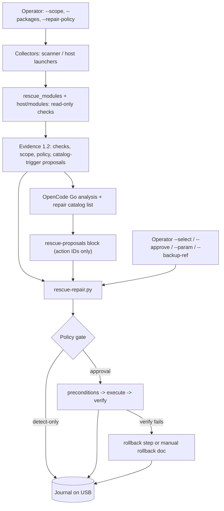

# Repair framework: scoped detection, typed catalog, policy engine, journal

> Managed by **ahlikoding.com** and **satpamsiber.com** from **ahliweb.com**.

This is the contract that the hardware (ahliweb/linux-mint-xfce-rescue-ai#15), operating system (#16), software (#17), and malware (#20) workstreams build on. Detection stays read-only. A repair can only be a **typed catalog action**: a fixed argv reviewed in this repository. The AI (and anything else that is data, such as logs, filenames, or web content) can at most name an `action_id`. The engine decides under the operator's policy whether that action runs, and it journals every stage on the USB.

Status labels: **Implemented** (source level, `make check`), **Hardware-required** (needs a real PC or disk), **Environment-blocked** (needs network, a key, or provider spend), **Planned** (design only). See [testing](testing.md).

| Part | Status |
|---|---|
| Evidence schema 1.2 (`scope`, `repair_policy`, `repair_proposals`, `hw-*` / `sw-*` / `malware-*` / new OS check IDs, up to 160 checks) | Implemented |
| Catalog schema + invariants (`rescue-ai/v1/repair-catalog.schema.json`, `scripts/lib/repair_catalog.py`) | Implemented; `hardware.json` 4 actions ([hardware](hardware.md)), `software.json` 6 ([software](software.md)), `os-linux.json` 7 and `os-windows.json` 4 ([OS repair](os-repair.md)), `malware.json` 7 ([malware](malware.md)), `android.json` 3 ([android](android.md#tindakan-perbaikan-fase-2)); `os-macos.json` is empty on purpose |
| Policy engine `scripts/rescue-repair.py` (live USB and Linux host) | Implemented; real repairs on real disks are Hardware-required |
| Hash-chained journal (`rescue-ai/v1/repair-journal.schema.json`) | Implemented |
| Detection module hooks: `scripts/rescue_modules/` (scanner + Linux host), `host/modules/windows/*.ps1`, `host/modules/macos/*.zsh` | Implemented (hardware, operating system, software, malware) |
| AI proposals (`rescue-proposals` block, validated against the catalog) | Implemented; the real model response is Environment-blocked |
| Target mount provider for offline OS repairs (`scripts/lib/target_mount.py`) | Implemented ([OS repair](os-repair.md)); real mounts are Hardware-required |
| Run report from the journal, evidence, and analysis ([run report](run-report.md)) | Implemented (`scripts/rescue-report.py`, PowerShell, JXA); real Windows/macOS runs are Hardware-required |
| Android target (phone/tablet over USB): USB inventory, `and-N` evidence 1.3, read-only ADB checks ([android](android.md)) | Implemented: detection, plus three catalog actions (`android.trim-caches`, `android.enable-package-verifier`, `android.reboot`) behind the engine-resolved `android_device` parameter; real phones are Hardware-required |
| Printers (USB, opt-in network, installed-OS spooler): `prn-N` evidence 1.3, `printer-*` checks ([printer](printer.md)) | Implemented (detection only); printer catalog actions, the `printer_ref` parameter, and the `printer` scope are **Planned**; real printers are Hardware-required |
| Repair execution on Windows and macOS hosts | Implemented natively in the launchers ([host repair](host-repair.md)); real Windows/macOS execution is Hardware-required |



## Scope

`--scope` takes a comma list: `all` (default, alone), `hardware` or items `hardware.cpu`, `hardware.memory`, `hardware.disk`, `hardware.gpu`, `hardware.display`, `hardware.network`, `hardware.battery`, `hardware.usb`, then `os`, `software`, `software.selected` (only the packages in `--packages`), `malware` ([malware](malware.md)), or `android` ([android](android.md)). A group and its own items cannot be combined (`hardware,hardware.cpu` is refused). The scope selects detection modules and applicable catalog actions. It is recorded in the evidence, and the analysis prompt tells the model not to treat unscanned areas as healthy. In live mode the OS detection that `scan-target-os.py` already did runs regardless of scope, because software and OS modules need the target list.

## Policy

| Policy | Behavior |
|---|---|
| `detect-only` | Proposals are listed and journaled (`approval skipped policy-detect-only`); nothing executes |
| `approve-each` (default) | Every action needs approval: an interactive prompt (`ya`/`yes`), or `--approve ACTION_ID`. Destructive actions need the `action_id` typed. Without a terminal and without `--approve`, the action is declined (`not-interactive`) |
| `auto-safe` (opt-in) | `safe` actions that came from a **catalog trigger**, need no read-write target, and have no missing parameter run without a prompt. AI-proposed or operator-selected actions, and every `reversible`/`destructive` action, still follow `approve-each` |

Destructive actions also need `--backup-ref FILE`. The journal records the file's size and a fingerprint (SHA-256 over the size and the first and last MiB), never its path. Every executed action is followed by its `verify` step. When execute or verify fails, the engine runs the automatic `rollback` step if the catalog has one. Otherwise it records `manual-rollback-required` and prints the rollback doc.

## Catalog (`rescue-ai/v1/catalog/<domain>.json`)

One file per domain, each owned by one workstream: `hardware.json` (#15), `os-linux.json` / `os-windows.json` / `os-macos.json` (#16), `software.json` (#17), `malware.json` (#20), `android.json` (#48). Action IDs are `<prefix>.<name>` with prefix `hw`, `os-linux`, `os-windows`, `os-macos`, `sw`, `mw`, or `android`, and are unique across files. `python3 scripts/lib/repair_catalog.py` validates them (part of `make check`).

Example (abridged from the real `hw.smart-short-selftest` entry in `hardware.json`):

```json
{
  "action_id": "hw.smart-short-selftest",
  "title": "Run a SMART short self-test",
  "title_id": "Jalankan SMART short self-test",
  "scope": "hardware.disk",
  "platforms": ["live-linux", "linux-host"],
  "risk": "safe",
  "requires_root": true,
  "triggers": [{"check_id": "smart-health", "status": ["warn", "unknown"]}],
  "params": [{"name": "device", "type": "block_device"}],
  "execute": {"argv": ["smartctl", "-t", "short", "{device}"], "timeout_seconds": 60},
  "verify": {"argv": ["smartctl", "-l", "selftest", "{device}"]},
  "rollback": {"kind": "none"},
  "backup": {"required": false},
  "doc": "docs/hardware.md#smart"
}
```

Invariants enforced by the loader (every one is a test in `tests/test_repair_contract.py`):

- `argv[0]` is a literal program name, resolved on a fixed `PATH` (`/usr/local/sbin:/usr/local/bin:/usr/sbin:/usr/bin:/sbin:/bin`). Shells, interpreters, privilege wrappers, command runners, network fetchers, and `dd` are refused (`sh`, `bash`, `python3`, `sudo`, `env`, `xargs`, `find`, `awk`, `sed`, `curl`, `powershell.exe`, `cmd`, `osascript`, ...). The engine adds `sudo -n --` itself for `requires_root`.
- Placeholders take one of three forms only: `{name}`, `--opt={name}`, or `{target_root}/literal/path` (no `..`). Every placeholder is a declared parameter, and every parameter is used. A substituted value always stays **one** argv element, and nothing is ever passed to a shell.
- Parameter types: `enum` (`values`, optional `default`), `integer` (`minimum`..`maximum`), `block_device` (operator-chosen, re-checked with `lsblk` against the same exclusions as the scanner, never the rescue USB or removable media), `target_root` (live-linux only, provided by the mount provider), `package_name` and `service_name` (strict patterns that cannot start with `-`; with `software.selected` the package must be in `--packages`), `detection_ref` (`^d-[0-9]{1,4}$`: an opaque reference to one entry of the LOCAL malware detection list, resolved by the engine to a verified regular-file path; see [malware](malware.md#parameter-detection_ref)), `state_dir` (engine-provided, never operator input: one fixed subdirectory `clamav` or `quarantine` of the USB state, declared with exactly one `values` entry), and `android_device` (engine-provided: the integer `adb -t` transport id of the phone named by the proposal's `and-N` target_ref, looked up again from the USB inventory and `adb devices -l` at execution time and only used when the phone is adb-authorized and has the evidence's `opaque_id`; refusals are journaled as `device-absent`, `device-not-authorized`, `device-ambiguous`, or `device-mismatch`; the id is never journaled; `--param` cannot set it; see [android](android.md#parameter-android_device)). Engine-provided types exist only on the platforms where the Python engine can resolve them (`android_device`: `live-linux` and `linux-host`). Values come from `--param ACTION_ID.NAME=VALUE`, the default, or an interactive prompt, never from evidence or the model. `--param` with a `detection_ref` accepts a comma list on the Python engine (one approval per reference).
- Risk classes:
  - `safe`: rollback `none` or `step`, no backup, no read-write target.
  - `reversible`: an automatic rollback `step` is required.
  - `destructive`: a backup (`what`) is required, and rollback is `restore-backup` or `manual` with a `doc`.
- `chroot` requires `requires_root` and a non-safe risk class. `requires_target_rw` requires live-linux and a `target_root` parameter.
- Domain rules: `hardware` actions use `hardware.*` scopes and no `target_families`. OS and software actions need `target_families` (`os-linux`: `linuxmint`/`linux-other`; `os-windows`: `windows`; `os-macos`: `macos`) and matching `platforms`. Malware actions use scope `malware`; `target_families` is optional (actions about the scanner or its signature database have none). Android actions use scope `android`, `target_families: ["android"]`, exactly one `android_device` parameter, and `adb` only as `adb -t {android_device}` plus a closed list of sub-commands (`shell` with `pm trim-caches`, `settings get|put|delete global <key>` or `df`; `reboot` and `get-state` without arguments). Trigger `check_id`s must exist in the evidence schema.

## Engine (`scripts/rescue-repair.py`)

```bash
python3 scripts/rescue-repair.py --evidence FILE [--analysis FILE] \
  [--policy detect-only|approve-each|auto-safe] [--scope LIST] [--packages LIST] \
  (--state-dir DIR | --journal FILE) [--select ACTION_ID[:os-N]]... [--approve ACTION_ID]... \
  [--param ACTION_ID.NAME=VALUE]... [--backup-ref FILE] [--list]
python3 scripts/rescue-repair.py --verify-journal FILE
```

Proposals come from catalog triggers (deterministic), the last `rescue-proposals` block of `--analysis` (at most 4 KiB and 16 items; exact catalog IDs that apply to this platform, scope, and target family; anything else is rejected and counted), and `--select`. The evidence is validated first. For each command the engine keeps only `exit_code`, duration, and the SHA-256 and byte count of the output: raw output is shown to the operator (last lines, control characters stripped) and never stored. `--list` plans only; it neither executes nor journals. The Python engine executes on `live-linux` and `linux-host`. On Windows and macOS the host launchers implement the same engine natively ([host-repair.md](host-repair.md)); their journals verify with `rescue-repair.py --verify-journal`.

Exit codes: `0` finished and nothing failed | `1` an action failed or was rolled back, or `--verify-journal` found a broken chain | `2` invalid arguments, evidence, catalog, or analysis | `3` journal not writable.

Test hooks (for the offline tests only): `RESCUE_REPAIR_TEST_PATH` replaces the fixed `PATH` (absolute directories only, announced on stderr) so fake programs can stand in, `--catalog-dir DIR` reads the catalog from another directory, `RESCUE_REPAIR_TEST_USB_ROOT` points the USB inventory at a fake `/sys` + `/proc` tree for `android_device`, and `RESCUE_REPAIR_TEST_ANDROID_WAIT` shortens the wait for a restarted phone (never above the built-in 150 s); both are announced on stderr.

## Journal

`<state-dir>/repairs/journal.jsonl` on the live USB, `rescue-omes/reports/repairs/journal.jsonl` in Linux host mode. It is one JSON record per stage (`proposed`, `approval`, `backup`, `target-rw`, `precondition`, `execute`, `verify`, `rollback`), written append-only under `flock` with `fsync` and mode `0600`. Records carry `seq` and `prev_sha256` (the SHA-256 of the previous line), so editing or deleting a line is detected by `--verify-journal`. Records never contain raw output, prompts, model text, credentials, usernames, or filenames. The comprehensive run report ([run-report.md](run-report.md), ahliweb/linux-mint-xfce-rescue-ai#22) is generated from this journal plus the evidence and analysis: per proposal it lists the origin, the approval decision, the backup fingerprint, every stage, the final outcome, and whether the hash chain verifies, with parameters shown only as placeholders.

## Detection modules

| Where | Interface | Owner |
|---|---|---|
| `scripts/rescue_modules/{hardware,operating_system,software,malware}.py` | `collect_system(ctx)` (machine, and in host mode the running OS) and `collect_offline_target(ctx, root, target)` (live: one installed OS mounted **read-only** by the scanner). Return `{'check_id', 'status'}` plus optional `kind`/`number`. `ctx.mode`, `ctx.scope`, `ctx.packages`, `ctx.wants(domain, item)`, `ctx.fixture_root` (tests), `ctx.state_dir`, `ctx.malware_full_disk` | #15 / #16 / #17 / #20 |
| `host/modules/windows/{hardware,os,software,malware}.ps1` | Script with `param([string[]]$Scope, [string[]]$Packages)`, run with `&` in a child scope. It emits hashtables `@{ check_id; status; kind; number }` | #15 / #16 / #17 / #20 |
| `host/modules/macos/{hardware,os,software,malware}.zsh` | Run as `zsh -f FILE` (never sourced) with `RESCUE_SCOPE` / `RESCUE_PACKAGES`. It prints `CHECK_ID STATUS [KIND NUMBER]` lines; allowed IDs are `hw-*`, `sw-*`, `malware-*`, `macos-*`, `smart-health`, `nvme-health`, `disk-free-space`, `encryption-status` | #15 / #16 / #17 / #20 |

Module output is data. The collectors validate every item against the evidence contract and drop anything else with a warning. A module that raises, exits non-zero, or emits garbage never breaks the collection. Hardware checks carry no `target_ref`. In host mode OS and software checks get `os-0`. Modules must be read-only: no writes, mounts, unlocking, or repairs; those are catalog actions.

## Target mount provider

`scripts/lib/target_mount.py` exposes `open_target(evidence_path, evidence, target_ref, rw)`, which returns a context manager yielding the target's mount point. It re-identifies the target the same way `scan-target-os.py` does and mounts it read-write only when `rw` is true (the operator approved an action with `requires_target_rw`), and always unmounts. It is implemented; see [os-repair.md](os-repair.md) for mount options and refusal rules. Outside its fixture test mode it refuses to run unless the rescue live medium is mounted (`/cdrom`, `/run/live/medium`, or `/isodevice`). A refusal is journaled `target-rw fail` and the action never runs.

## Untuk operator (Bahasa Indonesia)

- Default-nya **approve-each**: tidak ada perbaikan yang berjalan tanpa persetujuan Anda. Ketik `ya`/`yes` untuk menyetujui. Untuk tindakan `destructive`, ketik `action_id`-nya, dan siapkan dulu backup/image (`--backup-ref`).
- `--repair-policy detect-only` hanya menampilkan usulan. `--repair-policy auto-safe` menjalankan otomatis hanya tindakan `safe` yang dipicu langsung oleh hasil pemeriksaan. Usulan dari AI tetap ditanyakan.
- Pilih cakupan dengan `--scope`, misalnya `--scope hardware.disk,os`, atau `--scope software.selected --packages firefox,vlc`.
- Cakupan malware: `--scope malware` ([malware](malware.md)). Karantina selalu bertanya, bahkan pada `auto-safe`; penghapusan `destructive`.
- Semua langkah tercatat di journal pada USB. Periksa keutuhannya dengan `python3 scripts/rescue-repair.py --verify-journal <state-dir>/repairs/journal.jsonl`.
- Keluaran AI hanya berupa usulan `action_id`. Perintah yang dijalankan selalu berasal dari katalog di repository ini, bukan dari AI, log, atau nama file.
