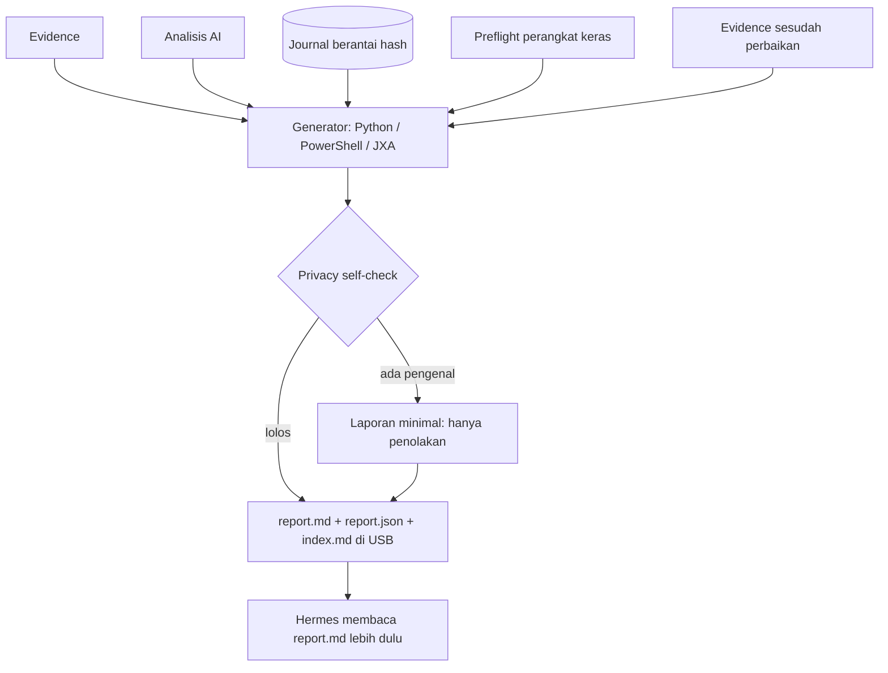

# Laporan proses (run report) di USB

> Managed by **ahlikoding.com** and **satpamsiber.com** from **ahliweb.com**.

Setiap kali launcher rescue selesai, termasuk run yang gagal atau parsial (preflight gagal, tanpa kunci, jaringan bermasalah, pemindaian gagal, perbaikan ditolak), ia menulis **satu laporan lengkap** dari deteksi sampai remediasi ke USB, ditambah indeks semua run. Laporan dibuat dari artefak yang sudah ada (evidence, analisis, journal berantai hash, hasil preflight); ia tidak menjalankan pemeriksaan sendiri dan tidak pernah menulis ke disk host atau disk internal. Referensi isu: ahliweb/linux-mint-xfce-rescue-ai#22.

Label status: **Implemented** (level source, dicakup `make check`), **Hardware-required** (butuh PC/OS nyata), **Environment-blocked** (butuh jaringan, kunci, atau biaya provider). Lihat [testing](testing.md).

| Bagian | Status |
|---|---|
| Generator Python `scripts/rescue-report.py` + `scripts/lib/run_report.py` (live USB dan Linux host) | **Implemented** |
| Generator PowerShell native di `host/rescue-windows.ps1` (kompatibel PS 5.1) | **Implemented** (diuji dengan `pwsh` di Linux; PS 5.1 di Windows nyata **Hardware-required**) |
| Generator JXA (`osascript -l JavaScript`, tanpa Python) di `host/RESCUE-MACOS.command` | **Implemented** (diuji dengan shim `node`; JXA di macOS nyata **Hardware-required**) |
| Skema `rescue-ai/v1/run-report.schema.json`, fixture, `make validate` | **Implemented** |
| Uji silang: JSON dan Markdown dari PowerShell dan JXA sama dengan Python untuk input yang sama | **Implemented** |
| Pemindaian ulang setelah aksi dieksekusi (sebelum/sesudah) di live USB, Linux host, Windows, macOS | **Implemented** (pemindaian pada mesin nyata **Hardware-required**) |
| Analisis AI di dalam laporan | Teks nyata dari cloud **Environment-blocked**; uji memakai server loopback palsu |
| Boot fisik, reboot, dan efek perbaikan pada disk sungguhan | **Hardware-required**; laporan menyatakannya, tidak membuktikannya |



## Lokasi dan format

| Mode | Folder laporan | Generator |
|---|---|---|
| Live USB (`launch-hermes-rescue.sh`) | `<state-dir>/reports/` | `scripts/rescue-report.py` |
| Linux host (`host/rescue-linux.sh`) | `rescue-omes/reports/` | `scripts/rescue-report.py` |
| Windows host (`host/rescue-windows.ps1`) | `rescue-omes\reports\` | fungsi PowerShell di skrip itu |
| macOS host (`host/RESCUE-MACOS.command`) | `rescue-omes/reports/` | JXA di skrip itu (tulis file: zsh) |

```
reports/
|-- index.md                      satu baris per run, terbaru dulu (waktu, mode, hasil, ringkasan, tautan)
|-- run-20260930T080000Z/
|   |-- report.md                 Bahasa Indonesia dengan judul dan label Inggris; terbaca di OS apa pun
|   `-- report.json               kembaran mesin, divalidasi skema
`-- run-20260930T091500Z/ ...
```

File dibuat `0600` bila sistem berkas mengizinkan (exFAT tidak menegakkan mode), ditulis atomik (file sementara di folder yang sama lalu rename), dan hanya di USB. Dua run dalam detik yang sama mendapat akhiran `-2`, `-3`. `index.md` dibangun ulang dari semua `run-*/report.json` yang valid, jadi tidak ada state yang bisa rusak sebagian.

## Isi laporan

Setiap bagian menyatakan apa yang **diverifikasi** dan apa yang **tidak**.

1. **Header**: `run_id`, waktu UTC mulai dan selesai, mode (`live-linux`, `linux-host`, `windows-host`, `macos-host`), `VERSION` toolkit, SHA-256 katalog, scope, kebijakan perbaikan, apakah kunci provider **ada** (nilainya tidak pernah dicatat), hasil run (`completed`, `completed-with-failures`, `evidence-only`, `dry-run`, `preflight-failed`, `scan-failed`, `scan-skipped`, `evidence-invalid`, `no-key`, `network-error`, `analysis-failed`, `analyzer-missing`, `repair-invalid`, `journal-unusable`, `interrupted`, `report-privacy-refused`), SHA-256 evidence.
2. **Preflight perangkat keras** (hanya live USB): hasil gerbang dan status tiap check (`cpu`, `ram`, `vga-display`, `internet-connectivity`, `usb-boot-media`). Teks `observed` (model CPU, perangkat) sengaja tidak dibawa.
3. **Deteksi**: semua check dikelompokkan per domain (hardware, OS per sistem target, software, malware, lingkungan), status, dan nilai terbatas dengan satuan. Legenda: `unknown` berarti **tidak dapat ditentukan, bukan sehat**.
4. **Analisis AI**: model, SHA-256 evidence, teks analisis apa adanya (hanya dibaca, karakter kontrol dibuang, ditandai sebagai keluaran model yang tidak pernah dijalankan; dipotong pada 32768 karakter), jumlah usulan diterima dan ditolak.
5. **Remediasi**: per usulan dari journal (difilter `run_id`): asal (`catalog-trigger`, `ai-proposal`, `operator`), keputusan persetujuan dan siapa/bagaimana, sidik backup (ukuran dan 12 hex awal, tanpa path), semua tahap (prasyarat, execute, verify, rollback) dengan kode keluar, hasil akhir (`verified`, `rolled-back`, `failed`, `skipped`, `declined`, `proposed`), dan rujukan dokumen rollback manual bila perlu (teks bundel-relatif seperti `docs/malware.md#rollback-delete`, bukan tautan relatif; laporan menyebut lokasi bundel: `/usr/local/lib/rescue-omes/` di live USB, `rescue-omes/` di USB pada mode host). Hasil verifikasi rantai hash journal ditampilkan; bila tidak valid, **INVALID** ditampilkan mencolok.
6. **Sebelum/sesudah**: bila minimal satu aksi dieksekusi, launcher memindai ulang dengan scope yang sama dan laporan mendaftar check yang statusnya berubah (sebelum, sesudah). Bila tidak ada aksi yang jalan, laporan menyatakannya.
7. **Butir terbuka**: aksi gagal, ditolak, atau dilewati; rollback manual; eskalasi (disk terenkripsi, indikasi kerusakan perangkat keras, signature antivirus kedaluwarsa, temuan malware yang perlu ditinjau, check `unknown`, regresi setelah perbaikan).
8. **Kejujuran**: yang **Hardware-required** dan **Environment-blocked** pada run ini (misalnya tanpa kunci tidak ada analisis), scope yang dibatasi, dan pernyataan bahwa hasil bersih bukan bukti kesehatan.

## Privasi

Laporan bisa dibaca Hermes (model di cloud) dan mungkin ditunjukkan ke orang lain, jadi aturannya sama dengan [evidence](../rescue-ai/v1/rescue-evidence.schema.json): tidak ada nama pengguna, nama komputer, serial, MAC/IP, path, nama file, nama signature malware, nama paket, atau log/keluaran mentah, dan laporan berklasifikasi `confidential`.

- Parameter journal: nilai `enum` dan `integer` ditampilkan; `package_name`, `service_name`, `block_device`, dan `detection_ref` hanya sebagai placeholder (`<package>`, `<service>`, `<device>`, `<detection d-3>`). Tipe parameter datang dari katalog; tipe yang tidak dikenal menjadi `<value>` (gagal tertutup).
- Daftar deteksi malware dan manifest karantina tetap berkas lokal terpisah (`malware-detections-<run>.json`, `quarantine/`); laporan hanya menyebut hitungannya.
- Input yang tidak sesuai kontrol (check dengan ID aneh, catatan journal di luar enum) dibuang, bukan dipercaya setengah; evidence yang rusak diperlakukan sebagai tidak ada.
- Satu-satunya teks bebas adalah teks analisis model (sudah berasal dari cloud), diberi tanda jelas. Skema (`additionalProperties: false`, enum, pola) menolak field lain; `make check` memeriksanya.
- **Redaksi teks analisis**: teks model dimasukkan apa adanya kecuali potongan yang menyerupai pengenal, yang diganti placeholder sebelum dirender: path `/home/<x>`, `/Users/<x>`, `C:\Users\<x>` menjadi `<path>` (seluruh rangkaian komponen path), alamat MAC menjadi `<mac>`, IPv4 dan IPv6 menjadi `<ip>` (nomor versi berpola IPv4 seperti `5.15.0.91` juga), dan nilai kunci API yang dikonfigurasi menjadi `<redacted>`. Pola dan urutannya sama di ketiga generator (kunci, path Windows, `/home`, `/Users`, MAC, IPv6, IPv4); jumlah penggantian dicatat di `analysis.redactions` dan disebut di laporan. Laporan **tidak** ditolak karena ini. Di macOS kunci diganti oleh zsh pada salinan analisis sebelum sampai ke generator (kunci tidak pernah diberikan ke `osascript`).
- **Privacy self-check** (bagian terstruktur): sebelum menulis, generator memindai `report.md` dan `report.json` untuk `/home/<x>`, `/Users/<x>`, `C:\Users\`, alamat MAC, IPv4, IPv6, dan nilai kunci API yang dikonfigurasi. Karena teks analisis sudah diredaksi, temuan di sini berarti bug nyata di bagian terstruktur: laporan lengkap **tidak ditulis**; yang ditulis adalah laporan minimal (`outcome: report-privacy-refused`, `run_id` `privacy-refused`, hanya header, aturan yang terpicu, dan penjelasan). Artefak sumber tetap ada di USB.

## Kapan laporan ditulis

| Launcher | Jalur yang menghasilkan laporan |
|---|---|
| `launch-hermes-rescue.sh` | Setiap keluar setelah folder `reports/` ada: preflight gagal (`preflight-failed`), `--no-target-scan` (`scan-skipped`), pemindaian gagal (`scan-failed`), tanpa kunci (`no-key`), jaringan/HTTP (`network-error`), analisis gagal (`analysis-failed`), perbaikan (`completed`, `completed-with-failures`, `repair-invalid`, `journal-unusable`), keluar normal tepat sebelum `exec hermes`, dan jebakan `EXIT`/`INT`/`TERM` (`interrupted`) |
| `host/rescue-linux.sh` | Fungsi `finish` (semua jalur `finish`: `evidence-only`, `dry-run`, `completed`, `no-key`, `network-error`, `analysis-failed`, `analyzer-missing`, `evidence-invalid`, `scan-failed`), jebakan `EXIT`, `INT`, `TERM` |
| `host/rescue-windows.ps1` | Blok `finally` di `Invoke-RescueMain`: semua `return` setelah folder `reports` diketahui (`evidence-only`, `dry-run`, `completed`, `no-key`, `network-error`, `evidence-invalid`, `repair-invalid`, `journal-unusable`) |
| `host/RESCUE-MACOS.command` | `finish`, jebakan `EXIT`, dan `INT`/`TERM`/`HUP` (hasil yang sama seperti di Windows) |

Tidak ada laporan bila folder `reports/` di USB tidak bisa ditulis atau bundle tidak ditemukan (kode keluar 5), atau argumen salah (kode keluar 64): tidak ada tempat aman untuk menulisnya. Di macOS tanpa `osascript` laporan dilewati dengan catatan, karena launcher tidak memakai Python.

### Sebelum/sesudah

Setelah fase perbaikan, launcher mencari catatan `execute` untuk run ini di journal. Bila ada, ia menjalankan pemindaian yang sama lagi (live: `scan-target-os.py` dengan scope yang sama; Linux host: kolektor yang sama; Windows dan macOS: koleksi host yang sama) dan menyimpan `*-evidence-after.json` di USB. Kegagalan pemindaian ulang hanya membuat perbandingan kosong (`rescan-missing`, tercantum di bagian Kejujuran), tidak pernah memblokir launcher.

## `scripts/rescue-report.py`

```bash
python3 scripts/rescue-report.py --reports-dir DIR --run-id ID --mode live-linux|linux-host|windows-host|macos-host \
  [--outcome OUTCOME] [--evidence FILE] [--evidence-after FILE] [--analysis FILE] [--journal FILE] [--readiness FILE] \
  [--scope LIST] [--repair-policy POLICY] [--started-at UTC] [--ended-at UTC] [--key-present yes|no] [--env-file FILE]...
python3 scripts/rescue-report.py --validate FILE...
```

Semua input opsional: run yang gagal tetap mendapat laporan. `--key-present` bawaannya dihitung dari lingkungan atau `--env-file` (dibaca sebagai data, sama seperti analyzer). Rantai hash journal diperiksa dengan pemeriksa yang sama seperti `rescue-repair.py --verify-journal` (skema dan rantai). Generator PowerShell dan JXA memeriksa **rantai hash** (urutan `seq` dan `prev_sha256`) tetapi tidak skema JSON journal; catatan yang tidak sesuai kontrol tetap tidak masuk ke laporan.

Kode keluar: `0` laporan ditulis (atau `--validate`: semua valid) | `1` privacy self-check menolak laporan lengkap (laporan minimal ditulis), atau `--validate` menemukan file tidak valid | `2` argumen tidak valid | `3` folder laporan tidak bisa ditulis. Launcher hanya memperingatkan bila kode bukan `0`.

## Skema `report.json`

`rescue-ai/v1/run-report.schema.json`: objek tertutup (`additionalProperties: false`), semuanya enum, hash, hitungan, dan angka terbatas, kecuali `analysis.text`.

| Kunci | Isi |
|---|---|
| `report_version`, `report_type`, `run_id`, `classification` | `1.0`, `rescue-run-report`, id run, selalu `confidential` |
| `header` | waktu, `mode`, `toolkit_version`, `catalog_sha256`, `scope`, `repair_policy`, `provider_key_present`, `outcome`, `evidence_run_id`, `evidence_sha256` |
| `readiness` | `performed`, `gate`, `overall`, `checks[]` (`check_id`, `status`, `required`) |
| `detection` | `available`, `totals`, `targets[]`, `domains{hardware,os,software,malware,environment}` |
| `analysis` | `status`, `model_id`, `evidence_sha256`, `text`, `text_truncated`, `redactions`, `proposals{accepted,rejected}` |
| `remediation` | `journal{chain: valid/INVALID/absent, records_total, records_run}`, `actions[]` |
| `comparison` | `performed`, `reason`, `compared`, `unchanged`, `only_before`, `only_after`, `changed[]` |
| `open_items[]`, `honesty`, `summary`, `privacy_check` | butir terbuka (enum), penanda Hardware-required/Environment-blocked, ringkasan untuk indeks, hasil pemeriksaan privasi |

Fixture: `rescue-ai/v1/fixtures/run-report-valid-*.json` (harus lolos) dan `run-report-invalid-*.json` (harus ditolak; alasannya di `*.reason.txt`); `make validate` memeriksa keduanya.

## Contoh (ringkas)

```markdown
# Laporan Proses Rescue / Rescue Run Report
> Managed by **ahlikoding.com** and **satpamsiber.com** from **ahliweb.com**.

## 1. Header / Ringkasan Proses
| Run ID | rescue-20260930-080000-live |
| Mode | live-linux |     | Hasil / Outcome | completed-with-failures |
| Kunci provider ada / Provider key present (nilai tidak pernah dicatat) | ya / yes |

## 3. Deteksi / Detection
Legenda / Legend: `unknown` = tidak dapat ditentukan (BUKAN sehat) / could not be determined (NOT healthy).
### hardware (6)
| hw-memory | - | pass | 8589934592 B |     | hw-battery | - | warn | 41% |

## 5. Remediasi / Remediation
Rantai hash journal: valid (32 catatan total, 31 untuk run ini). ...
### os-linux.update-grub (os-0)
| Origin | ai-proposal |   | Persetujuan / Approval | operator (interaktif) [operator-approved] |
| Backup | 123456 B, fingerprint abababababab |   | Hasil akhir / Final outcome | **failed** |
Rollback MANUAL diperlukan: `docs/os-repair.md#rollback-linux`

## 6. Sebelum/sesudah / Before-after
| linux-package-state | os-0 | fail | pass |

## 7. Butir terbuka / Open items
- **manual-rollback os-linux.update-grub**: Rollback MANUAL diperlukan; ikuti dokumen yang ditautkan.
- **escalate-hardware-fault**: Indikasi kerusakan perangkat keras; cadangkan data sekarang dan bawa ke teknisi.

## 8. Kejujuran / Honesty
- Hardware-required: boot fisik dan reboot dari USB tidak dibuktikan oleh laporan ini.
- Hasil bersih BUKAN bukti kesehatan. / A clean result is not proof of health.
```

(Tabel di laporan asli lengkap dengan header dan baris pemisah; contoh di atas dipadatkan.) Dokumen dirujuk sebagai teks (`docs/os-repair.md#rollback-linux`); `install-hermes-rescue.sh` dan image persistence menaruh `docs/` di `/usr/local/lib/rescue-omes/docs/`, dan USB host membawa `rescue-omes/docs/`.

## Untuk operator

- Buka `reports/index.md`, lalu `run-<waktu>/report.md`. Bagian 7 (butir terbuka) dan 8 (kejujuran) paling penting.
- Jika bagian 5 berkata **INVALID**, jangan percayai catatan perbaikan sebelum journal diperiksa dengan `python3 scripts/rescue-repair.py --verify-journal <reports>/repairs/journal.jsonl`.
- Laporan bersifat rahasia dan ada di USB. Jangan dibagikan sebelum Anda membacanya; berkas sumber (evidence, analisis, journal, daftar deteksi malware lokal) tetap lebih sensitif.
- Hermes membaca `report.md` terbaru lebih dulu ([skill rescue-target-os](../profiles/rescue-hermes/skills/rescue-target-os/SKILL.md)).

## Verifikasi

`make check` menjalankan `tests/test_run_report.py`: model dan renderer (bagian, redaksi parameter, hasil akhir, sebelum/sesudah, butir terbuka, kejujuran), kasus rantai hash yang dirusak, privacy self-check (setiap aturan, nilai kunci), skema dan fixture, CLI (izin `0600`, atomik, kode keluar, journal dari engine nyata), uji silang PowerShell dan JXA terhadap Python (JSON, Markdown, indeks), dan jalur launcher (live USB dengan pemindai stub, Linux host, Windows dengan `pwsh`, macOS dengan `zsh` dan shim `node`) termasuk pemindaian ulang. **Belum** diverifikasi (Hardware-required): perilaku Windows PowerShell 5.1 dan JXA di macOS sungguhan, serta run pada mesin dan disk nyata.
