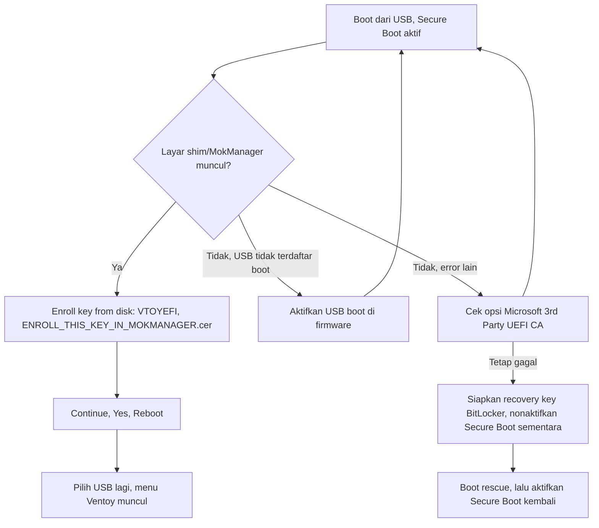

# Secure Boot: boot pertama USB rescue di komputer baru

> Managed by **ahlikoding.com** and **satpamsiber.com** from **ahliweb.com**.

Dokumen ini menjelaskan layar error Secure Boot yang muncul saat USB rescue pertama kali di-boot di sebuah komputer, dan cara melewatinya dengan enrollment kunci (MOK) satu kali. Perintah, nama file, dan ID dipertahankan apa adanya. Ringkasan proyek ada di [README.md](../README.md); USB dengan persistence di [persistence.md](persistence.md); pemeriksaan hardware di [hardware.md](hardware.md).

## Status

| Bagian | Status |
| --- | --- |
| Instalasi Ventoy dengan Secure Boot (`Ventoy2Disk.sh -i -s`) | **Implemented** (`scripts/install-ventoy-usb.sh`) |
| Langkah enrollment MOK di bawah | **Hardware-required** |
| Menu firmware (nama opsi, lokasi) | **Hardware-required**; berbeda per vendor dan versi firmware |

Catatan sumber: nama file dan isi partisi `VTOYEFI` dicek pada paket Ventoy 1.1.17 (image `ventoy/ventoy.disk.img.xz` berisi `ENROLL_THIS_KEY_IN_MOKMANAGER.cer` di root partisi berlabel `VTOYEFI`). Teks layar MokManager tidak dicek ulang di perangkat keras untuk semua vendor; bila tampilannya berbeda, ikuti layar di komputer Anda.

## Mengapa error muncul

Ventoy dipasang dengan `-s` (dukungan Secure Boot). Ventoy memakai shim pihak ketiga yang ditandatangani CA UEFI Microsoft, dan shim itu hanya mau menjalankan grub Ventoy jika kunci Ventoy sudah terdaftar di daftar **MOK** (Machine Owner Key) komputer tersebut. Komputer baru belum mengenal kunci itu, sehingga boot pertama menampilkan layar shim/MokManager, biasanya dengan pesan seperti `Verification failed: (0x1A) Security Violation`.

- Enrollment hanya perlu dilakukan **sekali per komputer**. Dokumentasi Ventoy menyebut langkahnya "only need to be done once for each computer".
- Sejak Ventoy 1.1.13, dokumentasi Ventoy menyebut perlunya enroll kunci baru terkait isu UEFI CA 2023. Gunakan file `.cer` dari USB ini, bukan dari versi lama.
- Pada uji fisik 2026-10-01 di laptop Windows, error ini muncul sekali dan Linux Mint 22.3 XFCE tetap berjalan setelahnya.

## Peringatan BitLocker (baca sebelum mengubah apa pun)

> **Peringatan.** Laptop Windows sering memakai BitLocker atau Device Encryption. Mengubah Secure Boot atau pengaturan firmware dapat memicu layar pemulihan BitLocker pada boot Windows berikutnya. Siapkan **recovery key** (aka.ms/myrecoverykey, dari akun Microsoft pemilik laptop) **sebelum** mengubah pengaturan firmware, dan aktifkan kembali Secure Boot setelah selesai.

- Jangan menonaktifkan Secure Boot pada mesin ber-BitLocker tanpa recovery key di tangan.
- Toolkit rescue tidak pernah membuka (unlock) BitLocker, LUKS, atau FileVault; lihat [security-model.md](security-model.md).
- Enrollment MOK di bawah tidak mengubah Secure Boot di firmware, tetapi tetap mengubah state boot; siapkan recovery key bila disk Windows terenkripsi.

## Alur keputusan boot pertama



## Langkah enrollment (Hardware-required)

1. Siapkan recovery key BitLocker jika komputer menjalankan Windows terenkripsi (lihat peringatan di atas).
2. Boot dari USB (tombol boot menu berbeda per vendor) dengan Secure Boot tetap aktif.
3. Saat muncul pesan seperti `Verification failed: (0x1A) Security Violation`, pilih **OK**.
4. MokManager (layar biru) terbuka. Pilih **Enroll key from disk**.
5. Pilih partisi **VTOYEFI**, lalu file `ENROLL_THIS_KEY_IN_MOKMANAGER.cer`.
6. Pilih **Continue**, konfirmasi **Yes**, lalu **Reboot**.
7. Pilih USB lagi di boot menu. Menu Ventoy sekarang tampil dan Linux Mint 22.3 XFCE dapat dipilih.

Teks dan urutan menu persis dapat berbeda antar versi shim dan firmware. Dokumentasi Ventoy (https://www.ventoy.net/en/doc_secure.html) menampilkan layar biru MokManager sebagai tanda keberhasilan tahap pertama. Jika yang muncul layar error lain (bukan layar biru MokManager), solusi Secure Boot tidak bekerja di mesin itu; lihat bagian berikut.

Alternatif "Enroll hash from disk": menu ini ada di MokManager, tetapi dokumentasi Ventoy yang kami baca tidak menjelaskannya sebagai jalur yang didukung, jadi jalur resmi di sini adalah enroll key dari `.cer`. Jangan berimprovisasi dengan hash file lain.

## Jika MokManager tidak muncul atau firmware menolak

Periksa berurutan. Nama opsi berbeda per vendor; jangan mengandalkan nama persis di bawah.

1. **USB boot aktif** di firmware dan USB muncul di boot menu (mode UEFI, bukan legacy).
2. **Izinkan CA UEFI Microsoft pihak ketiga.** Beberapa perangkat (misalnya sebagian Lenovo dan perangkat Secured-core) punya opsi seperti "Allow Microsoft 3rd Party UEFI CA" di pengaturan Secure Boot; tanpanya shim Ventoy ditolak.
3. **Nonaktifkan Secure Boot sementara** hanya sebagai jalan terakhir, setelah recovery key BitLocker siap. Boot rescue, selesaikan pekerjaan, lalu aktifkan kembali Secure Boot.

## Mencatat state Secure Boot di sesi live

Di sesi live Linux Mint, periksa (hanya baca):

```bash
mokutil --sb-state
```

Catat hasilnya (aktif/nonaktif) bersama langkah yang dipakai (enroll MOK, opsi 3rd-party CA, atau Secure Boot dimatikan sementara) di catatan operator atau laporan uji. Jangan menyalin kunci, recovery key, atau identifier mesin ke evidence atau laporan; lihat [run-report.md](run-report.md) untuk aturan privasi laporan.

## Yang belum terverifikasi

- Teks layar dan nama menu pada vendor selain laptop Windows yang diuji.
- Perilaku "Enroll hash from disk" dengan Ventoy ini.
- Uji boot fisik harus dilaporkan terpisah dari uji tingkat source; lihat [testing.md](testing.md).
