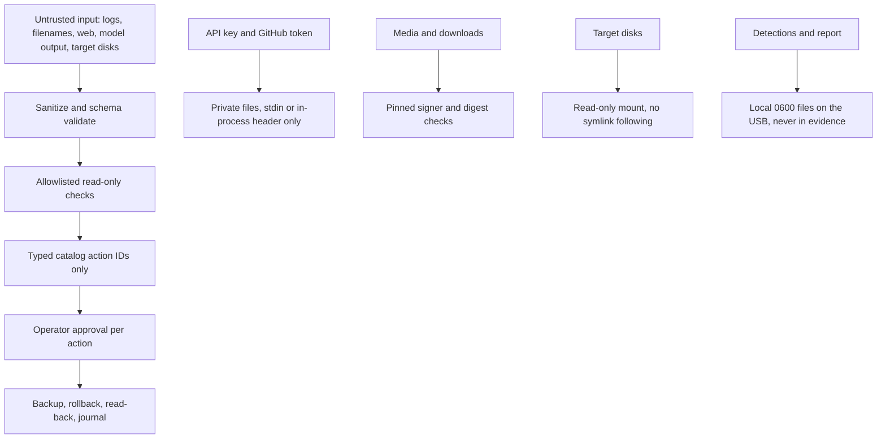

# Security model

> Managed by **ahlikoding.com** and **satpamsiber.com** from **ahliweb.com**.

Ringkasan ancaman dan kontrol untuk toolkit rescue, dikelompokkan per area. Arsitektur lengkap ada di [design.md](design.md); cara memverifikasi kontrol ada di [testing.md](testing.md). Kolom "Implemented in" menunjuk ke skrip yang menegakkan kontrol. Kolom "Status" memakai label: Implemented (level source, dicakup `make check`), Hardware-required (butuh PC/USB nyata), Environment-blocked (butuh jaringan, kunci, atau biaya provider), Planned. Perintah, ID, dan path dipertahankan apa adanya.

## Trust boundaries

| Boundary | Trusted | Untrusted (data only) |
|---|---|---|
| Code | This repository at the release, the catalog JSON | Anything else |
| Input to commands | The operator's flags and typed approvals | Model output, evidence, logs, filenames, signature names, web content |
| Machine under repair | Nothing: it may be compromised | Files, symlinks, `os-release`, journals, detections |
| Phone or tablet attached over USB | Nothing: an untrusted USB peer | Everything it reports: USB descriptors and serial, `adb` output, property values, package lists |
| Network | HTTPS to `opencode.ai` (analysis), `api.github.com` (skill submission, opt-in), the Ventoy release, `hermes-agent.nousresearch.com` (installer) | Everything else; redirects are refused by the Python clients |

## Media, ISO, and Ventoy

| Threat | Control (actual behavior) | Implemented in | Status |
|---|---|---|---|
| Wrong disk is formatted | Requires `--device` and `--yes`; parses `lsblk -J`; refuses non-whole-disk, non-removable/non-USB, any mounted disk or child, and the disk backing `/`; prints model, size, transport first | `scripts/install-ventoy-usb.sh` | Implemented; the write is Hardware-required |
| Tampered or substituted Linux Mint ISO | Requires a valid GPG signature over `sha256sum.txt` from primary fingerprint `27DEB15644C6B3CF3BD7D291300F846BA25BAE09` (override: `--signer-fingerprint`), then compares the ISO hash directly against exactly one matching entry. The operator must import the Linux Mint key first (`gpg --keyserver hkp://keyserver.ubuntu.com:80 --recv-key "27DE B156 44C6 B3CF 3BD7  D291 300F 846B A25B AE09"`) | `scripts/verify-mint-iso.sh` | Implemented |
| Tampered Ventoy download | Validates `--version`, makes one release API call, requires a `sha256:` digest, checks the URL prefix, and deletes the file on mismatch | `scripts/download-ventoy.sh` | Implemented |
| Corrupt ISO or persistence image copy on the USB | Re-hashes the copied ISO and the copied `.dat` against the verified source; the `.dat` must be ext2/3/4 labelled `casper-rw` | `scripts/prepare-ventoy-usb.sh` | Implemented |
| Persistence state overwritten by accident | An existing `/persistence/rescue-omes-casper-rw.dat` is only replaced with `--replace-persistence` | `scripts/prepare-ventoy-usb.sh` | Implemented |
| Upgrading the USB loses, leaks, or mangles the operator's key and Hermes state | `migrate-persistence-state.py` copies an allowlist of state paths between two operator-owned ext4 image files with `debugfs` (no mount, no root, regular files only, never a block device, `--from` and `--to` must differ); program files and bundled skills come from the new image; symlinks and lock files are skipped; the key in `hermes/env` is never printed or put on a command line (only paths, counts, and hashes are shown); the staging directory is `0700` and removed; `e2fsck -fn` and a per-file SHA-256 read-back must pass; the migrated image is credential-bearing and is never uploaded (published packages stay credential-free) | `scripts/migrate-persistence-state.py`, `tests/test_persistence_migration.py`, [persistence](persistence.md#upgrade-usb-dengan-mempertahankan-kunci-dan-state-hermes) | Implemented; boot of the migrated USB Hardware-required |
| Persistence build touches the host or a disk | Runs in docker, never uses a block device, refuses to overwrite `--output`, writes `0600`, fails when packages add system users | `scripts/build-persistence.sh`, `scripts/lib/persistence-container-build.sh`, `scripts/lib/persistence-container-image.sh` | Implemented (docker and network needed) |
| Unpinned Hermes installer | `--installer-sha256 HEX` (or `HERMES_INSTALLER_SHA256`) verifies the download before execution; without a pin a warning is printed and the actual digest is shown | `scripts/install-hermes-rescue.sh`, `scripts/build-persistence.sh` | Implemented (pin optional) |
| Installer run as root or clobbering a directory | Refuses root; refuses unsafe `--prefix` (`/`, `$HOME`, source tree, non-bundle directory); rejects newline or `%` in paths used for autostart | `scripts/install-hermes-rescue.sh` | Implemented |
| Firmware boots the internal disk instead of the USB | Cannot be controlled by files; must be tested physically | Not automatable | Hardware-required |

## Secrets and keys

| Threat | Control (actual behavior) | Implemented in | Status |
|---|---|---|---|
| Secrets written to the USB by the bundle copy | Allowlisted copy: no `.env`, `config/rescue.env`, `.git`, ISOs, images, archives; the clean-bundle assertion re-checks; `--bundle-only DEST` allows inspection | `scripts/prepare-ventoy-usb.sh` (`copy_bundle`, `assert_bundle_clean`) | Implemented |
| API key on a USB the operator did not intend | Provisioning is a separate step that writes only `OPENCODE_GO_API_KEY` to `config/rescue.env` (mode `0600` requested; FAT/exFAT may not enforce it); `--no-provision-secrets` skips it; the persistence build only puts the key into a network-less helper container just before `mkfs.ext4` | `scripts/prepare-ventoy-usb.sh`, `scripts/build-persistence.sh` | Implemented; residual risk documented |
| Config file executes code | Parses `KEY=VALUE` as data with an allowlist of six keys (`OPENCODE_GO_API_KEY`, `RESCUE_STATE_DIR`, `HERMES_HOME`, `OPENCODE_ADAPTER_COMMAND`, `OPENCODE_TIMEOUT_SECONDS`, `RESCUE_GITHUB_ISSUES_TOKEN`); `$` and backticks in unquoted or double-quoted values invalidate the line; never `source`d. The Python, PowerShell, and zsh clients apply the same rules | `scripts/lib/rescue-env.sh`, `scripts/opencode-go-analyze.py`, `scripts/submit-skill.py`, `host/rescue-windows.ps1`, `host/RESCUE-MACOS.command` | Implemented |
| Config file tampering | World-writable config is refused; a file owned by another non-root user is skipped with a warning; existing environment variables are not overridden | `scripts/lib/rescue-env.sh` | Implemented |
| Request header leaks evidence | The only non-secret custom header is `x-opencode-session`: `ses_` + 32 hex of sha256 of the evidence JSON that is sent, so it identifies a conversation without carrying any evidence content; error responses are reduced to an HTTP status and a short `[A-Za-z][A-Za-z0-9_]{0,63}` error-type token, never the body | `scripts/opencode-go-analyze.py`, `host/RESCUE-MACOS.command`, `host/rescue-windows.ps1` | Implemented |
| Key visible in the process list | `Authorization` header goes to `curl --config -` on stdin, or is sent in-process by Python and PowerShell; control characters in the key are rejected; the key is never in argv, logs, or evidence | `scripts/check-hermes-rescue.sh`, `scripts/opencode-go-analyze.py`, `host/RESCUE-MACOS.command`, `host/rescue-windows.ps1` | Implemented |
| Key stored insecurely in state | `<state-dir>/hermes/env` is written as `KEY='value'` under `umask 077` and `0600`; newlines in the key are refused | `scripts/install-hermes-rescue.sh` | Implemented |
| GitHub token misuse | `RESCUE_GITHUB_ISSUES_TOKEN` must be a fine-grained token with Issues read/write on this repository only; it is sent only in an in-process `Authorization` header to `api.github.com` (HTTPS, no redirects), never in argv, logs, output, or the issue; it is removed from the Hermes environment before Hermes starts | `scripts/submit-skill.py`, `scripts/launch-hermes-rescue.sh`, `scripts/lib/rescue-env.sh` | Implemented; token scope is the operator's responsibility |
| Publishing leaks a credential or is abused (package workflow) | Packages are built only in CI with `--no-provision-secrets`; the only credential is `GITHUB_TOKEN` (no other secret is referenced), top-level permissions are `contents: read` and only the two publish jobs get `packages: write` (and `contents: write` for the Release), and they never run on a pull request; every third-party action is pinned to a full commit SHA; before publishing, `debugfs` asserts that the image's `hermes/env` has no key and that no `rescue.env`, dotenv file, `.git`, or secret-shaped string is in the bundle; the ISO is GPG (pinned signer) and SHA-256 verified | `.github/workflows/package.yml`, `tests/test_package_workflow.py` | Implemented at source level; the real run is on GitHub |
| Key or token leaks into a skill or the report | The secret scan refuses a candidate skill that contains the configured key or token values; the report privacy check and redaction cover the configured key value | `scripts/lib/skill_sanitize.py`, `scripts/lib/run_report.py` | Implemented |

## Evidence and the cloud

| Threat | Control (actual behavior) | Implemented in | Status |
|---|---|---|---|
| Evidence meant to stay local is sent to the cloud | `classification: restricted` is refused before anything is sent; shipped collectors write `confidential` | `scripts/opencode-go-analyze.py`, `scripts/analyze-opencode-go.sh` | Implemented |
| Unvalidated or raw evidence sent to the cloud | The analyzer validates first and sends nothing on failure; the schema rejects prompts, responses, raw logs, credentials, and extra properties; check IDs are a closed set and values are bounded numbers | `scripts/validate-evidence.py`, `rescue-ai/v1/rescue-evidence.schema.json` | Implemented |
| Model output becomes a command | Model output is displayed and saved as text only. The adapter command comes only from the operator-set `OPENCODE_ADAPTER_COMMAND`; collectors run a fixed allowlist; the Hermes profile forbids executing commands from logs or model output | `scripts/opencode-go-analyze.py`, `scripts/analyze-opencode-go.sh`, `profiles/rescue-hermes/` | Implemented (adapter itself is operator-supplied) |
| Silent provider substitution | OpenCode Go is the only configured provider; the health check verifies `provider: custom`, model, and base URL and does not fall back; the analyzer refuses redirects | `scripts/check-hermes-rescue.sh`, `scripts/opencode-go-analyze.py`, `config/hermes-rescue.config.yaml` | Implemented |
| False assurance in evidence | The generic collector states `hashes_verified: false`, `read_back_verified: false`, `status: not_applicable`; check status derives from real signals; `unknown` never reads as healthy; areas outside `scope` are not reported as healthy; the opaque ID is a truncated hash | `scripts/collect-evidence.sh`, `scripts/scan-target-os.py`, `profiles/rescue-hermes/analysis-prompt.md` | Implemented |
| Evidence or reports readable by others | Evidence, hardware reports, and reports are created `0600` atomically (temp file plus rename) where the filesystem allows; exFAT does not enforce modes | `scripts/collect-evidence.sh`, `scripts/scan-target-os.py`, `scripts/check-hardware-readiness.py`, `scripts/rescue-report.py` | Implemented |
| Rescue runs on unsuitable hardware | Gate on CPU, RAM, display, internet, and USB media; `fail` or `unknown` required checks block | `scripts/check-hardware-readiness.py`, `scripts/launch-hermes-rescue.sh` | Implemented; results depend on the target PC |
| Detection module injects data or code | Modules are repository code; their output is validated against the evidence contract and invalid items are dropped; macOS modules run as child processes and Windows modules in a child scope (no string evaluation) | `scripts/rescue_modules/__init__.py`, `host/rescue-windows.ps1`, `host/RESCUE-MACOS.command` | Implemented |

## Repair catalog and engine

| Threat | Control (actual behavior) | Implemented in | Status |
|---|---|---|---|
| Unsafe repair or disk write | Read-only by default. Repairs exist only as typed catalog actions: fixed argv arrays, whole-element placeholders, forbidden shells, interpreters, privilege wrappers, network fetchers, and `dd`, typed parameters, and risk classes (`safe`, `reversible` with an automatic rollback, `destructive` with a backup and a manual or restore rollback). The engine adds `sudo -n --` itself | `scripts/lib/repair_catalog.py`, `rescue-ai/v1/repair-catalog.schema.json`, `rescue-ai/v1/catalog/*.json` | Implemented; real repairs are Hardware-required |
| Repair runs without consent | `approve-each` (default) requires approval per action; `auto-safe` is opt-in and limited to `safe` catalog-trigger actions; `detect-only` executes nothing. Destructive actions need `--backup-ref` and the typed `action_id`. Every executed action is followed by `verify`, then an automatic rollback or a manual rollback doc | `scripts/rescue-repair.py`, `host/rescue-windows.ps1`, `host/RESCUE-MACOS.command` | Implemented |
| Model output becomes a repair command | The model can only name `action_id`s in a `rescue-proposals` block (at most 4 KiB and 16 items, exact catalog IDs, applicable platform, scope, and family); argv and parameter values never come from it; AI proposals are never auto-run | `scripts/lib/repair_catalog.py` (`parse_ai_proposals`), `scripts/opencode-go-analyze.py` | Implemented |
| A parameter value smuggles an option or a device | Parameter types are validated (`enum`, `integer`, `block_device` re-checked with `lsblk` against the scanner's exclusions and never the rescue USB, `package_name` and `service_name` that cannot start or end with `-`, `detection_ref`, `state_dir`); each value stays one argv element; values come from `--param`, defaults, or a prompt, never from evidence or the model | `scripts/lib/repair_catalog.py`, `scripts/rescue-repair.py` | Implemented |
| Repair history altered after the fact | Append-only journal with `seq` and a SHA-256 chain, written under `flock` with `fsync` and `0600`; `--verify-journal` detects edits and deletions; no raw output, identities, or paths stored (only exit code, duration, size, and output hash) | `scripts/rescue-repair.py`, `rescue-ai/v1/repair-journal.schema.json` | Implemented |
| Host launchers elevate or run unlisted programs | The Windows and macOS engines run the same catalog without a shell: `System.Diagnostics.Process` with MSVCRT quoting and a minimal environment, or the argv array under `env -i`; only native programs; forbidden programs are refused again; `requires_root` runs only when the launcher is already elevated; no `block_device`, `target_root`, `android_device`, or `requires_target_rw` on hosts | `host/rescue-windows.ps1`, `host/RESCUE-MACOS.command` | Implemented; real Windows/macOS Hardware-required |

## Target mounts

| Threat | Control (actual behavior) | Implemented in | Status |
|---|---|---|---|
| The scan alters or executes the customer's disk | Mounts only under a private `0700` directory, `ro,noexec,nosuid,nodev`, without journal replay; never fsck, `ntfsfix`, or `chkdsk`; unmounts in `finally` and on SIGINT/SIGTERM/SIGHUP; never mounts the rescue USB or removable disks | `scripts/scan-target-os.py` | Implemented; real disks Hardware-required |
| A malicious target redirects a check to the live system | Files are read component by component without following symlinks (absolute links are re-rooted); case-insensitive lookup for NTFS | `scripts/scan-target-os.py`, `scripts/rescue_modules/operating_system.py`, `scripts/rescue_modules/software.py` | Implemented |
| Encrypted volumes are opened or bypassed | BitLocker, LUKS, and FileVault are never unlocked; they are reported as `not-mounted-encrypted`, and no action can target them | `scripts/scan-target-os.py`, `scripts/lib/target_mount.py` | Implemented |
| A read-write mount hits the wrong or a live system | The mount provider re-identifies the target with the scanner's logic, refuses a family mismatch, encryption, unknown refs, macOS `rw`, a hibernated or dirty (or unverifiable) NTFS volume, an already mounted target, and a missing separate `/boot`; outside fixture mode it refuses unless the rescue live medium is mounted; chroot binds only for read-write Linux targets; reverse-order unmount also on signals | `scripts/lib/target_mount.py` | Implemented; real mounts Hardware-required |

## Malware quarantine

| Threat | Control (actual behavior) | Implemented in | Status |
|---|---|---|---|
| Malicious file names, paths, or signature names become a command or a path | They are data only: `clamscan` and `rescue-malware-quarantine` run from fixed argv arrays without a shell; the catalog names files only through an opaque `detection_ref` (`d-N`) that the engine resolves from the local list; evidence, journal, analyzer request, and report carry counts and `d-N`, never names (tests assert this) | `scripts/rescue_modules/malware.py`, `scripts/lib/malware_detections.py`, `scripts/rescue-repair.py`, `rescue-ai/v1/catalog/malware.json` | Implemented |
| Quarantine or delete acts on the wrong file (TOCTOU, symlink) | The engine and the helper require the path inside the target root, no symlink on the way, a regular file opened with `O_NOFOLLOW`, and the sha256 recorded at detection; a swapped file gives `invalid-param`; the helper copies, checks the original was not replaced, writes the manifest, and only then unlinks; restore never overwrites and refuses a corrupt copy; `mw.delete-*` are `destructive` (backup reference and typed approval); the residual window before `rm` is documented | `scripts/malware-quarantine.py`, `scripts/lib/quarantine_store.py`, `scripts/rescue-repair.py` | Implemented; real mounts Hardware-required |
| Malware is executed by handling it | The scan never uses `--remove`, `--move`, or `--copy`; quarantined blobs are `0600` and never executable; the helper never runs anything from a file name | `scripts/rescue_modules/malware.py`, `scripts/malware-quarantine.py` | Implemented |
| Detection list or quarantine leaks the customer's paths or malware | `malware-detections-<run>.json` and `<state-dir>/quarantine/` are `0600`, live only on the USB, and are never sent to the cloud, put into evidence, or written to the journal; the operator is told not to share them | `scripts/lib/malware_detections.py`, `scripts/lib/quarantine_store.py` | Implemented |
| A clean scan is read as "no malware" | Stale or unknown signature age and incomplete scans give `warn`, never `pass`; macOS reports `malware-scan` `unknown`; rootkits and firmware implants are stated as out of scope; the analysis prompt and report repeat it ([malware](malware.md)) | `scripts/rescue_modules/malware.py`, `profiles/rescue-hermes/analysis-prompt.md`, `scripts/lib/run_report.py` | Implemented |
| Signature updates fetch or run unexpected code | `mw.clamav-update-signatures` is a `safe` catalog action (`freshclam` into `<state-dir>/clamav`); the persistence image masks the `clamav` services and downloads nothing at build time | `rescue-ai/v1/catalog/malware.json`, `scripts/lib/persistence-container-build.sh` | Implemented; downloads Environment-blocked |

## Android and USB peers

| Threat | Control (actual behavior) | Implemented in | Status |
|---|---|---|---|
| A phone or USB device feeds hostile data (huge or malformed output, a command in a string, a hang) | `adb` output and sysfs values are untrusted data: parsed into closed-set statuses and bounded numbers and then dropped; every call has a timeout and an output cap (4 MiB); `stdin` is `/dev/null`; the transport is a parsed integer and every other argv element is a constant tuple, so no data ever becomes a command; no `adb root`, `install`, `push`, `pull`, `sideload`, `reboot`, `unlock`, or shell string built from data; mDNS discovery is off | `scripts/rescue_modules/android.py`, `scripts/rescue_modules/usb_devices.py` | Implemented; real phones Hardware-required |
| The phone's serial, IMEI, accounts, package names, or addresses leak | The USB serial is read only to compute an opaque ID (`target-` + HMAC-SHA256 keyed with the machine ID); USB strings, `vendor:product`, `ro.*` properties outside a small allowlist, and all names are never kept; evidence has no free-string field for them (`usb_ports[]` and the Android target fields are closed, `additionalProperties: false`); the terminal shows brand and port, never the serial; tests assert none of the dummy serials or package names appears in evidence or output | `scripts/scan-android.py`, `rescue-ai/v1/rescue-evidence.schema.json`, `scripts/validate-evidence.py`, `tests/test_android.py` | Implemented |
| The operator confuses the rescue USB with the target | `usb_ports[].is_boot_media` and the `[USB RESCUE]` marker identify the device that holds the live medium (mountinfo, device-mapper slaves, Ventoy labels); the table shows port, speed, and location | `scripts/scan-android.py`, `scripts/rescue_modules/usb_devices.py` | Implemented; real ACPI locations Hardware-required |
| A repair tool flashes or bricks the phone | Flashing is operator-invoked only and never proposed by a trigger or run by `auto-safe` ([android](android.md#flashing-dan-unbrick-52)); unlock, root, factory reset, EDL, and BROM are never run (EDL/BROM get guidance only: no pip tools, firehose programmers, or exploits); the Hermes skill forbids proposing them. The catalog validator accepts `adb` only as `adb -t {android_device}` with `shell pm trim-caches`, `shell settings get/put/delete global <key>`, `shell df`, `reboot` (no argument, so never bootloader or recovery) and `get-state`, and `fastboot` only as `fastboot -s {fastboot_device}` with `getvar` (product, unlocked, current-slot, slot-count, is-userspace), `reboot`, `--set-active=`, `flash` (partition allowlist) and `update` (no `-w`), and `heimdall` only as `detect`, `print-pit --no-reboot` and `flash --{PARTITION} {file} --no-reboot` ([android](android.md#batas-yang-dijaga-validator-katalog)) | `scripts/lib/repair_catalog.py`, `rescue-ai/v1/catalog/android.json`, `profiles/rescue-hermes/skills/rescue-android/SKILL.md` | Implemented |
| A repair is sent to the wrong phone (another phone in the port, a renumbered `and-N`, a stale transport id, two phones with one serial, an unauthorized phone) | `android_device` is resolved by the engine at execution time, never from `--param`, evidence, or the model: it re-reads the USB inventory and `adb devices -l`, takes the proposal's `and-N`, and requires state `device` and the same `opaque_id` as the evidence; otherwise the action is refused and journaled (`device-absent`, `device-not-authorized`, `device-ambiguous`, `device-mismatch`) before anything is sent; the verify and rollback steps look the phone up again; the transport id and serial never reach the journal, the report, or the screen | `scripts/rescue-repair.py`, `scripts/lib/repair_catalog.py`, `tests/test_android_repair.py` | Implemented; real phones Hardware-required |
| Firmware supply chain: a tampered, swapped, or wrong file is flashed | `firmware_file` is operator-supplied (never evidence or model output); the operator also supplies the expected SHA-256 (`firmware_sha256`) and the engine refuses on mismatch (`firmware-hash-mismatch`); the file is opened once without following a final symlink, must be a regular file inside size bounds, is hashed through that descriptor, and the child reads the same descriptor (`/dev/fd/N`), so the flashed bytes are the hashed bytes; only the SHA-256 is journaled, never the path; zips are read as data (nothing extracted or run, no `flash-all`, no bootloader/radio/modem/persist/efs/frp/userdata image); `--backup-ref` and the typed `action_id` are required | `scripts/rescue-repair.py` (`bind_firmware`), `scripts/lib/repair_catalog.py`, `tests/test_android_flash.py` | Implemented; real flashing Hardware-required |
| Firmware for another device model is flashed (device identity mismatch) | `fastboot_device` is resolved by the engine (USB inventory + `fastboot devices -l`, the evidence's `opaque_id`, selector `usb:<port>` that must answer `getvar product`); the `image-matches-device` guard compares the image's `android-info.txt` `require board/product` lines with `getvar product` and refuses on mismatch or when it cannot tell (`identity-mismatch`); Heimdall runs only with exactly one Samsung download-mode device on USB and a PIT that lists the partition; the model's product string is never printed, journaled, or put in evidence | `scripts/rescue-repair.py`, `scripts/rescue_modules/android_flash.py` | Implemented; Heimdall on modern Samsung phones Hardware-required |
| A locked bootloader is "worked around" (unlock automated, or a flash forced) | The toolkit never runs `fastboot flashing unlock/lock`, `oem`, `erase`, `-w`, or any wipe; the `bootloader-unlocked` guard refuses flashing unless `getvar unlocked` is `yes` (an unreadable state counts as locked) and prints the manual-unlock guidance; the catalog validator rejects those commands | `scripts/rescue-repair.py`, `scripts/lib/repair_catalog.py`, `rescue-ai/v1/catalog/android.json` | Implemented |
| A phone in EDL or BROM mode is attacked with leaked programmers or exploits | Detection and guidance only (`android-low-level-mode` `warn`, "take it to an authorized service center"); no pip tools, firehose programmers, or mtkclient are installed or run | `scripts/rescue_modules/android_flash.py`, `scripts/lib/persistence-container-build.sh` | Implemented |
| A printer, a print queue, or a LAN peer feeds hostile data (huge or malformed output, a command in a string, a hang, a public address to make the scan talk to the Internet) | Printers, queues, and the local link are untrusted peers. `lpstat`, `ipptool`, and `avahi-browse` output is parsed against allowlists into closed-set states, keyword-shaped reasons, and bounded numbers, then dropped (IPP responses are data); every call has a timeout and a 1 MiB output cap, `stdin` is `/dev/null`, the environment is clean (no `CUPS_SERVER`); the only variable argv element is an IPP URI built from validated parts (a queue name matching `[A-Za-z0-9_._-]`, a loopback `ipp-usb` port, or a private/ULA address literal), never a name from the network, never starting with `-`; mDNS answers with public, multicast, or link-local-without-zone addresses are discarded | `scripts/rescue_modules/printer.py` | Implemented; real printers Hardware-required |
| Network discovery runs without the operator asking, or becomes a scan | mDNS/DNS-SD `_ipp._tcp` and `_ipps._tcp` (`avahi-browse -rtp`, timeout) run **only** with `--network`; no subnet scan, no SNMP sweep, no credentials; a test asserts that `avahi-browse` is not called without the flag | `scripts/scan-printers.py`, `tests/test_printer.py` | Implemented |
| Queue names, device URIs, addresses, serials, job or user names, or printer-info/location text leak | They exist only in memory (`_private` of a printer dict) and are never put in a check, an evidence file, the terminal, or a report; the fixed IPP request file asks only for state, reasons, accepting, job count, marker levels and make-and-model (reduced to an allowlisted brand); the printer ID is `target-` + HMAC-SHA256 keyed with the machine ID; `printers[]` and the printer target fields are closed (`additionalProperties: false`); tests assert none of the dummy names, URIs, IPs, serials, or job names appears in evidence or output | `scripts/lib/ipp/get-printer-attributes.test`, `rescue-ai/v1/rescue-evidence.schema.json`, `scripts/validate-evidence.py`, `tests/test_printer.py` | Implemented |
| A scan or a model changes a printer, a queue, or the spooler of an installed OS | The scan is read-only: it never runs `cupsenable`, `cupsaccept`, `cancel`, `lp`, `lpadmin`, firmware, or a vendor tool, and the spool and CUPS directories of a target are only counted, never opened, followed through symlinks, or changed. Changes exist only as typed catalog actions run by `scripts/rescue-repair.py` under the repair policy: the validator confines a printer action to `cupsenable`, `cupsaccept`, `cancel -a`, `lpstat`, `lp` and `ipptool` in fixed argv forms and to the fixed files the bundle ships, so `lpadmin`, other files, other URIs, firmware and vendor tools cannot enter the catalog; the Hermes skill forbids proposing anything else | `scripts/lib/repair_catalog.py`, `scripts/rescue-repair.py`, `rescue-ai/v1/catalog/printer.json`, `tests/test_printer_repair.py` ([printer](printer.md#batas-yang-dijaga-validator-katalog)) | Implemented; real printers Hardware-required |
| A repair is sent to the wrong printer (another printer in the port, a renumbered `prn-N`, a queue renamed or swapped, two queues for one printer, a network printer the operator did not opt in to) | `printer_ref` is resolved by the engine at execution time, never from `--param`, evidence, or the model: it runs the printer discovery again, takes the proposal's `prn-N`, and requires the same `opaque_id` as the evidence; it refuses with `printer-absent` (gone, no CUPS queue, or a network printer without `--printer-network`), `printer-ambiguous` (two printers with one identity) or `printer-mismatch` (a different printer now); the queue name is rendered only into the child argv (strict `[A-Za-z0-9._-]` pattern, never starting with `-`) and a refusal runs nothing | `scripts/rescue-repair.py` (`resolve_printer`), `scripts/rescue_modules/printer.py`, `tests/test_printer_repair.py` | Implemented; real printers Hardware-required |
| Consumables are used by accident or by automation (a test page or a head cleaning that eats paper and ink, jobs cancelled that belong to someone else) | The risk class `irreversible` always asks, also under `auto-safe` and also when a trigger proposed it; an `lp` action must be `irreversible`, cannot have a trigger, and an AI proposal of an `irreversible` action without a trigger is rejected; the approval card shows a bilingual warning, the launcher never passes `--approve`, and a non-interactive run declines (`not-interactive`); the test page and the CUPS command file are fixed files shipped in the bundle | `scripts/lib/repair_catalog.py`, `scripts/rescue-repair.py`, `scripts/lib/printer/` | Implemented |
| A queue name, a URI, an address, a serial, or a job or user name reaches the screen, the journal, or a report through a repair | The approval card shows `<printer prn-N>`; the output of a printer tool (for example `lp` prints `request id is QUEUE-12`) is not echoed; the journal keeps only codes, counts, and hashes; the `prn-N` refs, the `irreversible` risk, and the three refusal reasons are in the closed journal and report contracts of all three engines; tests assert the dummy queue name, serial, and address appear nowhere | `scripts/rescue-repair.py`, `scripts/lib/run_report.py`, `rescue-ai/v1/repair-journal.schema.json`, `tests/test_printer_repair.py` | Implemented |
| Stuck spool files are moved out of an installed OS and lost, or the wrong files are moved | `printer.target-quarantine-spool` moves only the files the detection counts (Windows `*.SPL`/`*.SHD` in `PRINTERS`, CUPS `c#####`/`d#####-###`), listed by the module and never named by data, each opened without following symlinks and recorded with its SHA-256 in the reversible quarantine under one batch id; the target is mounted read-write only after approval, only in the live session, never unlocking BitLocker/LUKS/FileVault; verify re-hashes the copies, rollback restores the batch and never overwrites a file, and a batch from another mount is refused | `scripts/malware-quarantine.py`, `scripts/lib/quarantine_store.py`, `scripts/lib/target_mount.py`, `tests/test_printer_repair.py` ([printer](printer.md#printer-target-quarantine-spool)) | Implemented; real mounts Hardware-required |

## Skill submission (public repository)

| Threat | Control (actual behavior) | Implemented in | Status |
|---|---|---|---|
| Case data leaks into the public repository through a skill submission | Sanitizes hostnames, usernames, paths, serials, MAC/IP/e-mail, and disk UUIDs, then secret-scans and refuses on any finding (no fix-and-send); front matter limited to `name` and `description`; the operator sees the full body and confirms by typing `kirim`/`submit`, or with `--confirm-sha256` bound to the previewed hash (there is no `--yes`) | `scripts/submit-skill.py`, `scripts/lib/skill_sanitize.py` | Implemented; GitHub call Environment-blocked |
| Duplicate or unreviewed submissions | The sanitized content hash is embedded as `<!-- skill-sha256: HEX -->` and searched in open and closed issues; only an issue labelled `skill-candidate` is created; promotion needs tests, review, and a merged pull request | `scripts/submit-skill.py`, [skill-submission.md](skill-submission.md) | Implemented |
| The model submits on its own | The `rescue-skill-submission` skill requires the operator's explicit confirmation in the conversation and forbids reading or printing the token | `profiles/rescue-hermes/skills/rescue-skill-submission/SKILL.md` | Implemented (instruction level) |

## Run report privacy

| Threat | Control (actual behavior) | Implemented in | Status |
|---|---|---|---|
| Run report leaks identifiers or is altered | `report.md`/`report.json` are generated from evidence, analysis, and the hash-chained journal with the same privacy rules as the evidence: parameters only as placeholders (`<package>`, `<device>`, `<detection d-N>`), no paths, names, signature names, or raw output, a closed JSON schema, and the model text as the only free field (marked, never executed). Identifier-shaped parts of the model text are redacted (`<path>`, `<mac>`, `<ip>`, `<redacted>`) and counted; a privacy self-check (home/user paths, MAC/IPv4/IPv6, the configured key value) on the structured parts refuses the full report and writes a minimal one; a broken journal chain is shown as INVALID; files are `0600` where allowed, written atomically, and only on the USB ([run report](run-report.md)) | `scripts/rescue-report.py`, `scripts/lib/run_report.py`, `rescue-ai/v1/run-report.schema.json`, `host/rescue-windows.ps1`, `host/RESCUE-MACOS.command` | Implemented; real Windows/macOS runs Hardware-required |
| The three generators disagree | Tests assert equal JSON, Markdown, and index from Python, PowerShell, and JXA | `tests/test_run_report.py` | Implemented |

## Host launchers (running systems)

| Threat | Control (actual behavior) | Implemented in | Status |
|---|---|---|---|
| Autorun-style execution from the USB | There is no AutoRun: one double-click by the operator is the approval point. `RESCUE-WINDOWS.cmd` uses `-ExecutionPolicy Bypass` for its own process only and does not change machine policy | `host/RESCUE-WINDOWS.cmd`, [host-launchers.md](host-launchers.md) | Implemented |
| The launcher changes or fills the host | Read-only checks; nothing is installed; no temporary files on the host (`TMPDIR` points to `reports/` on the USB); Windows and macOS never elevate; the host OS may still keep its own traces (Prefetch, unified log, shell history), which is stated in the docs | `host/rescue-windows.ps1`, `host/RESCUE-MACOS.command`, `host/rescue-linux.sh` | Implemented; real Windows/macOS Hardware-required |
| Host evidence contains identities | Only closed status codes and bounded numbers; `target_device_opaque_id` is a truncated hash of the machine ID | `host/rescue-windows.ps1`, `host/RESCUE-MACOS.command`, `host/rescue-linux.sh` | Implemented |
| Concurrent launchers corrupt the macOS journal | Documented: no `flock` on macOS; do not run two launchers on the same USB | `host/RESCUE-MACOS.command`, [host-repair.md](host-repair.md) | Residual risk |

## Residual risks

- A credential-bearing USB exposes the API key to anyone with physical access; prefer `--no-provision-secrets` and enter the key in the live session (then the persistence image holds it). exFAT does not enforce `0600`.
- A USB that holds `RESCUE_GITHUB_ISSUES_TOKEN` is credential-bearing too. Anyone holding it can open issues as the token owner until the token is revoked.
- The Linux Mint key must be obtained through a channel the operator trusts; the pinned fingerprint only helps if the operator confirms it against Linux Mint's own guide.
- The Hermes installer is downloaded from `https://hermes-agent.nousresearch.com/install.sh`; pin its SHA-256 for high-assurance use.
- The detection list, quarantine, journal, and report of a run describe the customer's machine. Treat the USB as confidential data, do not share these files, and do not attach them to issues or skills.
- A clean scan is not proof of health or of absence of malware; rootkits, firmware implants, and threats without signatures are out of scope.
- There is a small window between verification and `rm` for `mw.delete-*`; that is why a backup reference and typed approval are mandatory.
- Hibernated or dirty Windows volumes can make offline results stale; the mount provider refuses read-write access instead.
- Software checks cannot prove a physical boot or a hardware write blocker; Windows and macOS launcher behavior on real machines is Hardware-required and untested here.

Report vulnerabilities to **satpamsiber.com** through the governance process in [ownership-and-governance.md](ownership-and-governance.md).
