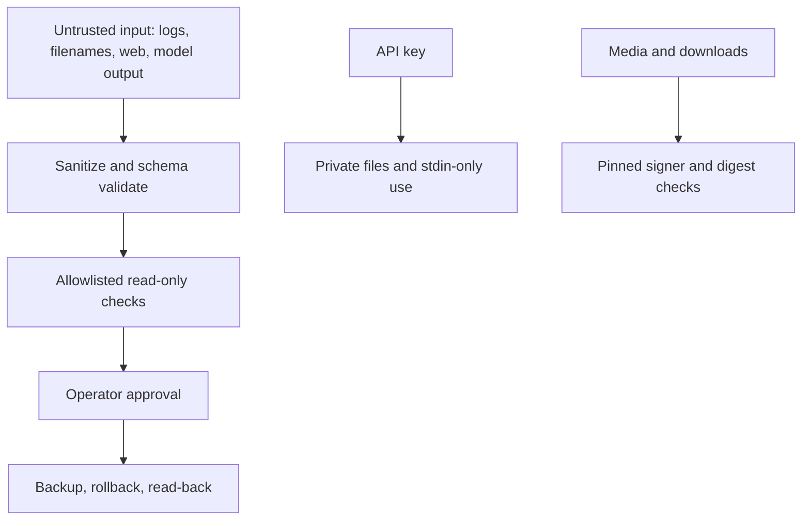

# Security model

> Managed by **ahlikoding.com** and **satpamsiber.com** from **ahliweb.com**.

Ringkasan ancaman dan kontrol untuk toolkit rescue. Arsitektur lengkap ada di [design.md](design.md); cara memverifikasi kontrol ada di [testing.md](testing.md). Kolom "Status" memakai label: Implemented, Hardware-required, Planned.

## Threats and controls

| Threat | Control (actual behavior) | Status |
|---|---|---|
| Wrong disk is formatted | `install-ventoy-usb.sh` requires `--device` and `--yes`; parses `lsblk -J`; refuses non-whole-disk, non-removable/non-USB, any mounted disk or child, and the disk backing `/`; prints model, size, transport first | Implemented; the write is Hardware-required |
| Tampered or substituted Linux Mint ISO | `verify-mint-iso.sh` requires a valid GPG signature over `sha256sum.txt` from primary fingerprint `27DEB15644C6B3CF3BD7D291300F846BA25BAE09` (override: `--signer-fingerprint`), then compares the ISO hash directly against exactly one matching entry. The operator must import the Linux Mint key first (`gpg --keyserver hkp://keyserver.ubuntu.com:80 --recv-key "27DE B156 44C6 B3CF 3BD7  D291 300F 846B A25B AE09"`) | Implemented |
| Tampered Ventoy download | `download-ventoy.sh` validates `--version`, makes one release API call, requires a `sha256:` digest, checks the URL prefix, and deletes the file on mismatch | Implemented |
| Corrupt ISO copy on USB | `prepare-ventoy-usb.sh` re-hashes the copied ISO against the verified source | Implemented |
| Secrets written to USB by the bundle copy | Allowlisted copy: no `.env`, `config/rescue.env`, `.git`, ISOs, images, archives; `assert_bundle_clean` re-checks; `--bundle-only DEST` allows inspection | Implemented |
| API key on a USB the operator did not intend | Provisioning is a separate step that writes only `OPENCODE_GO_API_KEY` to `config/rescue.env` (mode `0600` requested; FAT/exFAT may not enforce it); `--no-provision-secrets` skips it. A provisioned USB is credential-bearing and needs physical access control | Implemented; residual risk documented |
| Config file executes code | `scripts/lib/rescue-env.sh` parses `KEY=VALUE` as data with an allowlist of six keys; `$` and backticks in unquoted or double-quoted values invalidate the line; never `source`d | Implemented |
| Config file tampering | World-writable config is refused; a file owned by another non-root user is skipped with a warning; existing environment variables are not overridden | Implemented |
| Key visible in process list | `check-hermes-rescue.sh` passes the `Authorization` header to `curl --config -` on stdin; control characters in the key are rejected | Implemented |
| Key stored insecurely in state | `<state-dir>/hermes/env` is written as `KEY='value'` under `umask 077` and `0600`; newlines in the key are refused | Implemented |
| Unpinned Hermes installer | `install-hermes-rescue.sh --installer-sha256 HEX` (or `HERMES_INSTALLER_SHA256`) verifies the download before execution; without a pin it prints a warning | Implemented (pin optional) |
| Installer run as root or clobbering a directory | Refuses root; refuses unsafe `--prefix` (`/`, `$HOME`, source tree, non-bundle directory); rejects newline or `%` in paths used for autostart | Implemented |
| Case data leaks into the public repository through a skill submission | `submit-skill.py` sanitizes hostnames, usernames, paths, serials, MAC/IP/e-mail and disk UUIDs, then secret-scans and refuses on any finding; the operator sees the full body and confirms by typing `kirim`/`submit` or with `--confirm-sha256` bound to the previewed hash | Implemented; GitHub call Environment-blocked |
| GitHub token misuse | `RESCUE_GITHUB_ISSUES_TOKEN` must be a fine-grained token with Issues read/write on this repository only; it is sent only in an in-process `Authorization` header to `api.github.com` (HTTPS, no redirects) and is removed from the Hermes environment by `launch-hermes-rescue.sh` | Implemented; token scope is the operator's responsibility |
| Evidence meant to stay local is sent to the cloud | `classification: restricted` is refused by `opencode-go-analyze.py` and `analyze-opencode-go.sh` before anything is sent; shipped collectors write `confidential` | Implemented |
| Unvalidated or raw evidence sent to the cloud | `analyze-opencode-go.sh` runs `validate-evidence.py` first and sends nothing on failure; the schema rejects prompts, responses, raw logs, credentials, and extra properties | Implemented |
| Model output becomes a command | The adapter command comes only from the operator-set `OPENCODE_ADAPTER_COMMAND`; the collector runs a fixed allowlist; the Hermes profile forbids executing commands from logs or model output | Implemented (adapter itself is operator-supplied) |
| False assurance in evidence | Collector states `hashes_verified: false`, `read_back_verified: false`, `status: not_applicable`; check status derives from real signals; opaque ID is a truncated hash of `/etc/machine-id` | Implemented |
| Evidence or reports readable by others | Evidence and hardware reports are created `0600` atomically (temp file plus rename) | Implemented |
| Rescue runs on unsuitable hardware | `check-hardware-readiness.py` gates Hermes on CPU, RAM, display, internet, and USB media; `fail` or `unknown` required checks block | Implemented; results depend on the target PC |
| Silent provider substitution | OpenCode Go is the only configured provider; `check-hermes-rescue.sh` verifies `provider: custom`, model, and base URL and does not fall back | Implemented |
| Unsafe repair or disk write | Read-only by default. Repairs exist only as typed catalog actions (fixed argv, forbidden shells/interpreters/`dd`, typed parameters, risk classes). `rescue-repair.py` requires approval under `approve-each` (default); `auto-safe` is opt-in and limited to `safe` catalog-trigger actions. Destructive actions need `--backup-ref` and the typed `action_id`. Every action runs verify, then an automatic rollback or a manual rollback doc | Implemented (catalogs empty until #15-#17); real repairs Hardware-required |
| Model output becomes a repair command | The model can only name `action_id`s in a `rescue-proposals` block (size-limited, exact catalog IDs, applicable platform/scope/family); argv and parameter values never come from it; AI proposals are never auto-run | Implemented |
| Repair history altered after the fact | Append-only journal with `seq` and a SHA-256 chain; `--verify-journal` detects edits and deletions; no raw output or identities stored | Implemented |
| Malicious file names, paths, or signature names become a command or a path | They are data only: `clamscan` and `rescue-malware-quarantine` run from fixed argv arrays without a shell; the catalog names files only through an opaque `detection_ref` (`d-N`) that the engine resolves from the local list; evidence, journal, and analyzer request carry counts and `d-N`, never names (tests assert this) | Implemented |
| Quarantine or delete acts on the wrong file (TOCTOU, symlink) | The engine and the helper require the path inside the target root, no symlink on the way, a regular file opened with `O_NOFOLLOW`, and the sha256 recorded at detection; a swapped file gives `invalid-param`; the helper copies, checks the original was not replaced, writes the manifest, and only then unlinks; restore never overwrites; `mw.delete-*` are `destructive` (backup reference and typed approval); residual window before `rm` is documented | Implemented; real mounts Hardware-required |
| Detection list or quarantine leaks the customer's paths or malware | `malware-detections-<run>.json` and `<state-dir>/quarantine/` are `0600`, live only on the USB, and are never sent to the cloud, put into evidence, or written to the journal; the operator is told not to share them | Implemented |
| A clean scan is read as "no malware" | Stale or unknown signature age and incomplete scans give `warn`, never `pass`; macOS reports `malware-scan` `unknown`; rootkits and firmware implants are stated as out of scope ([malware](malware.md)) | Implemented |
| Detection module injects data or code | Modules are repository code; their output is validated against the evidence contract and invalid items are dropped; macOS modules run as child processes and Windows modules in a child scope (no string evaluation) | Implemented |
| Firmware boots the internal disk instead of the USB | Cannot be controlled by files; must be tested physically | Hardware-required |

## Residual risks

- A credential-bearing USB exposes the API key to anyone with physical access; prefer `--no-provision-secrets` and enter the key in the live session.
- A USB that holds `RESCUE_GITHUB_ISSUES_TOKEN` is credential-bearing too. Anyone holding it can open issues as the token owner until the token is revoked.
- The Linux Mint key must be obtained through a channel the operator trusts; the pinned fingerprint only helps if the operator confirms it against Linux Mint's own guide.
- The Hermes installer is downloaded from `https://hermes-agent.nousresearch.com/install.sh`; pin its SHA-256 for high-assurance use.
- Software checks cannot prove a physical boot or a hardware write blocker.

Report vulnerabilities to **satpamsiber.com** through the governance process in [ownership-and-governance.md](ownership-and-governance.md).
