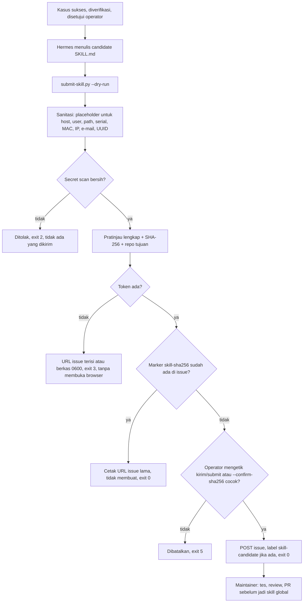

# Pengiriman kandidat skill ke GitHub Issues

> Managed by **ahlikoding.com** and **satpamsiber.com** from **ahliweb.com**.

Dokumen ini menjelaskan cara Hermes menyiapkan **kandidat skill** dari kasus yang sudah berhasil dan mengirimkannya sebagai GitHub issue ke `ahliweb/linux-mint-xfce-rescue-ai` (issue `ahliweb/linux-mint-xfce-rescue-ai#18`). Keputusan operator: persiapan otomatis, **pengiriman hanya setelah operator mengonfirmasi**. Repositori ini **publik**, jadi tidak ada data kasus yang boleh ikut terkirim. Perintah, ID, dan URL dipertahankan apa adanya.

Issue hanya **kandidat**. Promosi menjadi skill global tetap lewat tes, review, dan PR yang di-merge (lihat [hermes-learning-loop.md](hermes-learning-loop.md), bagian "Promosi bertahap").

## Status

| Bagian | Status |
|---|---|
| `scripts/submit-skill.py`, `scripts/lib/skill_sanitize.py`: sanitasi, secret scan, hash, dedupe, konfirmasi, fallback URL | **Implemented** (level source, `make check`) |
| Skill Hermes `rescue-skill-submission` | **Implemented** |
| Uji dengan server GitHub palsu di `127.0.0.1` (`tests/test_skill_submission.py`) | **Implemented** |
| Pemanggilan `api.github.com` sungguhan dengan token nyata | **Environment-blocked** (butuh jaringan dan token operator; tidak diuji otomatis) |
| Pembuatan label `skill-candidate` | Tugas maintainer (token Issues-only tidak boleh membuat label) |

## Alur



## Perintah

Selalu mulai dengan dry run (hanya sanitasi, scan, dan pratinjau; tidak pernah membuat issue):

```bash
scripts/submit-skill.py --dry-run --state-dir "$STATE_DIR" \
  --skill "$STATE_DIR/learning/candidates/NAMA/SKILL.md"
```

Kirim setelah membaca pratinjau. Di terminal interaktif skrip meminta operator mengetik `kirim` atau `submit`:

```bash
scripts/submit-skill.py --state-dir "$STATE_DIR" \
  --skill "$STATE_DIR/learning/candidates/NAMA/SKILL.md"
```

Tanpa terminal (mis. dipanggil Hermes), konfirmasi harus diikat ke isi yang sudah dilihat operator: berikan hash yang tercetak pada pratinjau. Tidak ada opsi `--yes`.

```bash
scripts/submit-skill.py --state-dir "$STATE_DIR" \
  --skill "$STATE_DIR/learning/candidates/NAMA/SKILL.md" \
  --confirm-sha256 HEX_DARI_PRATINJAU
```

`--skill` harus berupa `SKILL.md` di bawah `<state-dir>/hermes/skills/` atau `<state-dir>/learning/candidates/`. Opsi `--env-file FILE` dapat diulang; bila tidak ada, dibaca `<state-dir>/hermes/env` lalu `config/rescue.env`.

### Kode keluar

| Kode | Arti |
|---|---|
| 0 | Terkirim, atau duplikat ditemukan (URL issue lama dicetak), atau dry run berhasil |
| 1 | Kesalahan I/O lokal (membaca skill, menulis berkas fallback) |
| 2 | Ditolak oleh sanitizer/secret scan atau skill tidak valid; tidak ada yang dikirim |
| 3 | Tidak ada token yang dapat dipakai; fallback (URL terisi atau berkas) dicetak |
| 4 | Kesalahan jaringan atau HTTP dari GitHub |
| 5 | Operator menolak, atau konfirmasi tidak ada/tidak cocok dengan hash |
| 64 | Kesalahan penggunaan (argumen, lokasi `--skill`) |

## Apa yang disanitasi

Isi diperiksa sebagai **data**, tidak pernah dijalankan. Front matter hanya boleh `name` dan `description`. Hostname, username, e-mail, serial, alamat MAC dan IP, UUID/label disk, dan path di bawah `/home`, `/Users`, atau `C:\Users` diganti placeholder seperti `<HOSTNAME>`, `<USERNAME>`, `<EMAIL>`, `<SERIAL>`, `<MAC>`, `<IP>`, `<UUID>`, `<PATH>`. Setelah itu secret scan menolak (exit 2) bila masih ada token GitHub (`ghp_`, `github_pat_`), kunci gaya `sk-`, `AKIA`, blok private key, JWT, penugasan `password=`/`token=` dengan nilai nyata, string entropi tinggi, atau nilai `OPENCODE_GO_API_KEY` / `RESCUE_GITHUB_ISSUES_TOKEN` yang sedang dikonfigurasi. Skrip **tidak** memperbaiki lalu mengirim; skill harus ditulis ulang lebih umum. Batas ukuran isi: 32 KiB. Sanitasi adalah lapisan pengaman, bukan izin untuk memasukkan data kasus: skill harus ditulis umum sejak awal.

## Deduplikasi

SHA-256 dihitung atas skill terkanonisasi yang sudah disanitasi (front matter dibangun ulang, LF, tanpa spasi akhir baris). Hash disematkan di isi issue sebagai `<!-- skill-sha256: HEX -->`. Sebelum membuat issue, skrip mencari marker persis itu di issue terbuka **dan** tertutup (pencarian, lalu daftar issue terbaru bila indeks pencarian tertinggal). Bila ada: URL issue lama dicetak dan tidak ada issue baru.

## Token GitHub (fine-grained)

Buat di GitHub, Settings, Developer settings, Personal access tokens, Fine-grained tokens:

- **Repository access**: Only select repositories, pilih hanya `ahliweb/linux-mint-xfce-rescue-ai`.
- **Permissions**: Issues: **Read and write**. Tidak ada izin lain (tanpa Contents, Pull requests, Actions, Administration, dan sebagainya; Metadata read-only otomatis).
- Beri masa berlaku pendek dan cabut bila USB hilang.

Simpan di config USB yang di-allowlist, `config/rescue.env` atau `<state-dir>/hermes/env`:

```bash
RESCUE_GITHUB_ISSUES_TOKEN='...'
```

Kunci ini ditambahkan ke allowlist `scripts/lib/rescue-env.sh`; berkas dibaca sebagai data (tidak pernah di-`source`). Token hanya dikirim di header `Authorization` oleh `urllib` di dalam proses (HTTPS, hanya `api.github.com`, redirect ditolak); tidak pernah ada di argv, log, keluaran, atau isi issue.

### Risiko USB yang membawa kredensial

USB yang berisi token dapat dipakai siapa pun yang memegangnya untuk membuat issue atas nama Anda di repositori ini (dan hanya itu, berkat batas token). Gunakan USB pribadi, batasi izin token seperti di atas, jangan menyalin berkas config ke media lain, dan cabut token bila USB hilang atau dipinjamkan. Lihat juga [security-model.md](security-model.md) dan aturan provisioning rahasia di `AGENTS.md`.

## Tanpa token (fallback)

Bila tidak ada token, skrip mencetak URL `https://github.com/ahliweb/linux-mint-xfce-rescue-ai/issues/new?title=...&body=...&labels=skill-candidate` (URL-encoded, maksimum 7000 karakter) dan keluar dengan kode 3. Bila isi terlalu panjang untuk URL, isi yang sudah disanitasi disimpan ke `<state-dir>/reports/skill-candidate-<12 hex pertama hash>.md` (mode `0600`), dan URL yang dicetak hanya berisi judul dan label; tempel isi berkas sebagai isi issue. Browser tidak pernah dibuka otomatis; operator meninjau lalu membuka tautan sendiri.

## Catatan untuk maintainer

Token Issues-only **tidak dapat membuat label**. Buat label `skill-candidate` sekali di repositori (Issues, Labels, New label). Bila label belum ada, skrip tetap membuat issue tanpa label dan melaporkannya; maintainer lalu memasang label secara manual.

Menguji tanpa jaringan: `RESCUE_TEST_GITHUB_BASE_URL=http://127.0.0.1:PORT` (hanya URL loopback yang dihormati) mengarahkan skrip ke server GitHub palsu; nilai lain diabaikan.
