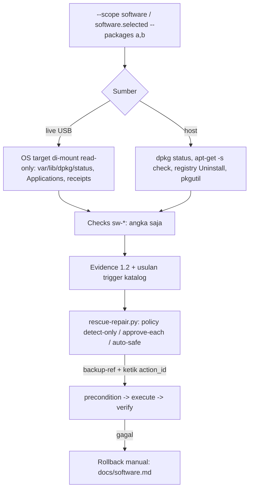

# Perangkat lunak terpasang: inventaris, deteksi terbatas, dan perbaikan opsional

> Managed by **ahlikoding.com** and **satpamsiber.com** from **ahliweb.com**.

Dokumen ini menjelaskan modul software (ahliweb/linux-mint-xfce-rescue-ai#17) yang dibangun di atas kontrak di [repair-framework](repair-framework.md). Deteksi selalu **read-only**. Perbaikan hanya berupa **aksi katalog bertipe** (`rescue-ai/v1/catalog/software.json`) yang berjalan lewat engine `scripts/rescue-repair.py` dengan persetujuan per aksi. AI hanya boleh mengusulkan `action_id`; ia tidak pernah membuat perintah. Bukti (evidence) hanya berisi **angka**: nama paket, path, versi, dan vendor tidak pernah masuk ke evidence. Nama paket hanya muncul sebagai parameter aksi yang diberikan operator.

Label status: **Implemented** (tingkat source, `make check`), **Hardware-required** (perlu PC/OS nyata), **Environment-blocked** (perlu jaringan atau provider), **Planned**.

| Bagian | Status |
|---|---|
| Inventaris + kesehatan paket Linux (dpkg/apt), OS target di-mount read-only (live) dan host Linux | Implemented; PC nyata Hardware-required |
| Inventaris macOS target (live): `Applications/*.app`, `var/db/receipts` | Implemented; volume macOS nyata Hardware-required |
| Inventaris Windows target (live) | `unknown` (lihat di bawah); Implemented sebagai perilaku jujur |
| Modul host Windows `host/modules/windows/software.ps1` (registry Uninstall, Run, winget) | Implemented (diuji lewat fixture di pwsh); Windows nyata Hardware-required |
| Modul host macOS `host/modules/macos/software.zsh` | Implemented (diuji lewat shim); macOS nyata Hardware-required |
| Aksi perbaikan Linux host (`sw.dpkg-configure-pending`, `sw.apt-fix-broken`, `sw.apt-reinstall-package`) | Implemented (engine, fake program); eksekusi pada sistem nyata Hardware-required |
| Aksi perbaikan OS target dari live USB (`sw.dpkg-configure-target`) | Implemented di katalog dan engine, memakai penyedia mount target `scripts/lib/target_mount.py` ([os-repair.md](os-repair.md)); mount read-write nyata Hardware-required |
| Aksi winget (`sw.winget-repair-package`, `sw.winget-upgrade-package`) | Implemented di katalog; dieksekusi oleh engine native `host/rescue-windows.ps1` ([host-repair.md](host-repair.md)); eksekusi di Windows nyata Hardware-required |
| Perbaikan macOS | Tidak ada aksi katalog; hanya langkah manual (lihat bawah) |



## Cakupan: semua atau paket terpilih

```bash
# Semua perangkat lunak terpasang
./rescue-linux.sh --scope software                   # host Linux, sebagai pengguna biasa (read-only, tanpa root)
python3 scripts/scan-target-os.py --output /tmp/ev.json --scope software

# Hanya paket tertentu
./rescue-linux.sh --scope software.selected --packages firefox,vlc
python3 scripts/scan-target-os.py --output /tmp/ev.json --scope software.selected --packages firefox,vlc
```

Pada `software.selected` hanya paket dalam `--packages` yang diperiksa (status, konfigurasi tertunda, hold, dependensi, integritas). Paket terpilih yang **tidak terpasang** dilaporkan sebagai **jumlah** di `sw-app-health` (`warn`), tidak pernah dengan nama. Nama paket di Windows adalah ID winget (misalnya `Vendor.App`), di macOS nama aplikasi tanpa `.app` (tanpa spasi), di Linux nama paket dpkg (akhiran `:arch` diabaikan).

## Pemeriksaan (check) dan ambang batas

Semua nilai berupa `count` (angka), tanpa nama. `pass`/`warn`/`fail`/`unknown`/`not_applicable` mengikuti skema evidence.

| check_id | Linux (dpkg) | Windows host | macOS |
|---|---|---|---|
| `sw-inventory` | jumlah paket terpasang; `pass` bila > 0, `warn` bila 0; mode terpilih: jumlah terpasang, `warn` bila ada yang tidak terpasang; `unknown` bila database tidak terbaca atau bukan dpkg | jumlah entri Uninstall (HKLM, WOW6432Node, HKCU) tanpa komponen sistem/update; mode terpilih: jumlah ID yang ada menurut `winget list --id X --exact`; `unknown` tanpa registry/winget | jumlah `*.app` di `/Applications` dan `~/Applications`; `unknown` bila folder tidak terbaca |
| `sw-package-health` | paket `half-installed` atau flag `reinstreq`; `fail` bila > 0 | entri dengan `InstallLocation` yang foldernya sudah hilang (instalasi yatim); `warn` bila > 0 | jumlah receipt `pkgutil --pkgs` (`pass`; `unknown` bila tidak terbaca) |
| `sw-pending-config` | `half-configured`, `unpacked`, `triggers-awaited/pending`; `fail` bila ada `half-configured`, `warn` bila hanya sisanya | tidak dipancarkan | tidak dipancarkan |
| `sw-broken-dependencies` | paket terpasang dengan grup `Depends`/`Pre-Depends` yang tidak dipenuhi apa pun (alternatif `|` dan `Provides` diperhitungkan; **versi tidak dibandingkan**, jadi hanya bisa under-report); `fail` bila > 0. Di host, `apt-get -s check` (simulasi, read-only, tanpa root) yang gagal juga menghasilkan `fail` | tidak dipancarkan | tidak dipancarkan |
| `sw-held-packages` | paket dengan status `hold`; `warn` bila > 0 (bisa menghalangi pembaruan) | tidak dipancarkan | tidak dipancarkan |
| `sw-package-integrity` | paket terpasang yang berkas `/var/lib/dpkg/info/<paket>.list`-nya hilang; `fail` bila > 0. Host + `software.selected`: `debsums -s` bila terpasang, maksimum 20 paket, batas 60 detik | tidak dipancarkan | tidak dipancarkan |
| `sw-app-health` | mode terpilih: jumlah paket terpilih yang tidak terpasang (`warn`); mode semua: `not_applicable` | mode terpilih: jumlah ID terpilih yang tidak ditemukan winget (`warn`), maksimum 20 ID, tiap panggilan dibatasi 20 detik, `unknown` bila winget tidak ada; mode semua: `not_applicable` | mode terpilih: jumlah aplikasi terpilih yang tanda tangan kodenya gagal `codesign --verify --deep --strict` ditambah yang tidak ada (`fail` bila ada tanda tangan gagal, `warn` bila hanya hilang), maksimum 10 aplikasi, tiap panggilan 20 detik |
| `sw-startup-items` | berkas `.desktop` di `etc/xdg/autostart`; `warn` bila > 50 | nilai Run (HKLM, WOW6432Node, HKCU) + isi folder Startup (pengguna dan umum); `warn` bila > 50 | plist di `~/Library/LaunchAgents`, `/Library/LaunchAgents`, `/Library/LaunchDaemons`; `warn` bila > 50 |

Catatan kejujuran:

- **Windows target dari live USB**: program terpasang ada di hive registry `SOFTWARE`. Membacanya memerlukan parser hive (dependensi yang tidak dipakai proyek ini), sehingga `sw-inventory` bernilai `unknown`. Modul host Windows membaca registry langsung dan tidak punya batasan ini.
- **Distro non-dpkg** (`linux-other` tanpa `var/lib/dpkg/status`): `sw-inventory` `unknown`. RPM/pacman belum didukung (Planned).
- Item login macOS yang sebenarnya memerlukan `osascript`, yang dilarang; sebagai gantinya dihitung plist launch agent/daemon.
- Modul tidak pernah memakai root, tidak menulis, dan tidak mengikuti symlink di dalam OS target (jalur dijalani per komponen); symlink berarti `unknown`.
- Ambang (`50` item startup, `20` paket debsums, `10` aplikasi codesign, `20` ID winget) adalah batas bawaan modul, bukan klaim medis; ubah lewat perubahan kode yang direview.

## Aksi perbaikan (katalog `sw.*`)

Semua aksi software bersifat `destructive` (mengubah state paket dan tidak bisa dibatalkan otomatis secara jujur). Karena itu: **tidak pernah berjalan di `auto-safe`**; selalu butuh `--backup-ref FILE` (salinan state paket yang Anda buat sendiri), persetujuan dengan mengetik `action_id`, dan langkah `verify`. Bila `execute` atau `verify` gagal, engine mencetak dokumen rollback manual di bawah.

| action_id | Platform | Pemicu | Parameter | Backup | Rollback |
|---|---|---|---|---|---|
| `sw.dpkg-configure-pending` | `linux-host` (root) | `sw-pending-config` warn/fail | tidak ada | `package-state` | manual: [rollback-dpkg](#rollback-dpkg) |
| `sw.apt-fix-broken` | `linux-host` (root) | `sw-broken-dependencies` warn/fail | tidak ada | `package-state` | manual: [rollback-dpkg](#rollback-dpkg) |
| `sw.apt-reinstall-package` | `linux-host` (root) | `sw-package-health` fail, `sw-package-integrity` fail | `package` | `package-state` | manual: [rollback-dpkg](#rollback-dpkg) |
| `sw.dpkg-configure-target` | `live-linux` (root, target read-write) | `sw-pending-config` warn/fail | `target_root` (dari mount provider, bukan operator) | `package-state` | manual: [rollback-dpkg](#rollback-dpkg) |
| `sw.winget-repair-package` | `windows-host` | `sw-app-health` warn/fail | `package` | `system-restore-point` | manual: [rollback-winget](#rollback-winget) |
| `sw.winget-upgrade-package` | `windows-host` | tidak ada (hanya diusulkan AI atau `--select`) | `package` | `system-restore-point` | manual: [rollback-winget](#rollback-winget) |

Parameter `package` bertipe `package_name`: pola ketat yang tidak boleh diawali `-`, dan pada `software.selected` harus termasuk dalam `--packages`. Nilai berasal dari `--param ACTION_ID.package=NAMA`, bukan dari evidence atau model.

<a id="sw-dpkg-configure-pending"></a>
### sw.dpkg-configure-pending

Menjalankan `dpkg --configure -a` sebagai root (lewat `sudo -n`, ditambahkan engine). Menjalankan skrip maintainer paket; dapat mengubah berkas konfigurasi. `verify` menjalankan ulang `dpkg --configure -a`: perintah idempoten yang keluar dengan kode 0 hanya bila tidak ada lagi paket tertunda (`dpkg --audit` selalu keluar 0, sehingga tidak dipakai sebagai verifikasi).

<a id="sw-apt-fix-broken"></a>
### sw.apt-fix-broken

Precondition `apt-get -s -f install` (simulasi). Lalu `apt-get -y -f install` dengan `--force-confold` (konfigurasi lokal dipertahankan). **Peringatan**: apt dapat memutuskan menghapus paket untuk menyelesaikan dependensi; baca hasil simulasi (baris terakhir keluaran) sebelum menyetujui. `verify`: `apt-get check`.

<a id="sw-apt-reinstall-package"></a>
### sw.apt-reinstall-package

Precondition simulasi `apt-get -s install --reinstall PAKET`, lalu `apt-get install --reinstall -y -o Dpkg::Options::=--force-confold PAKET`. `verify`: `dpkg --verify PAKET` (memeriksa berkas terhadap md5sums; keluar 0 bila utuh).

<a id="sw-dpkg-configure-target"></a>
### sw.dpkg-configure-target

Live USB: `dpkg --root=<target_root> --configure -a` pada OS terpasang yang di-mount read-write (persetujuan eksplisit untuk read-write). Skrip maintainer berjalan chroot di target, sehingga `/proc`, `/dev`, dan `/sys` target disediakan oleh penyedia mount `scripts/lib/target_mount.py`, yang menolak mount bila syaratnya tidak terpenuhi (dicatat `target-rw fail` di journal dan aksi tidak dijalankan; lihat [os-repair.md](os-repair.md)). **Implemented**; eksekusi pada disk nyata **Hardware-required**.

<a id="sw-winget-repair-package"></a>
### sw.winget-repair-package

`winget.exe repair --id ID --exact --disable-interactivity --accept-source-agreements`, dengan precondition dan `verify` berupa `winget.exe list --id ID --exact` (keluar 0 bila paket masih terdaftar). Memerlukan winget 1.7+ dan installer yang mendukung repair.

<a id="sw-winget-upgrade-package"></a>
### sw.winget-upgrade-package

`winget.exe upgrade --id ID --exact ...`. Versi baru dapat mengubah perilaku aplikasi; itu sebabnya tidak ada pemicu otomatis.

## Rollback manual

<a id="rollback-dpkg"></a>
### Rollback paket dpkg/apt

1. Sebelum menyetujui, buat backup state paket dan berikan sebagai `--backup-ref`, misalnya `tar -C / -cf /media/USB/pkgstate.tar var/lib/dpkg etc/apt` (jalankan sendiri; engine hanya mencatat ukuran dan fingerprint berkas, bukan path).
2. Bila hasil buruk: dari live USB, mount OS target dan pulihkan `var/lib/dpkg` dari backup; untuk paket yang diubah gunakan `apt-get install PAKET=VERSI-LAMA` dari cache (`/var/cache/apt/archives`) atau `apt-get install --reinstall`.
3. Baca ulang: jalankan lagi `--scope software` dan pastikan `sw-pending-config` dan `sw-broken-dependencies` kembali `pass`, serta tinjau `<state-dir>/repairs/journal.jsonl` dengan `--verify-journal`.

<a id="rollback-winget"></a>
### Rollback winget (Windows)

1. Sebelum menyetujui, buat titik pemulihan sistem (System Restore) dan catat referensinya dalam berkas `--backup-ref`.
2. Bila hasil buruk: pulihkan ke titik tersebut, atau pasang ulang versi sebelumnya: `winget install --id ID --version VERSI-LAMA`.
3. Baca ulang dengan `-Scope software.selected -Packages ID`.

### macOS

Tidak ada aksi katalog. Langkah manual: aplikasi App Store diperbarui lewat App Store; aplikasi dengan tanda tangan rusak dipasang ulang dari sumber resmi. Modul hanya melaporkan `sw-app-health`.

## Contoh operasional

```bash
# Deteksi semua, tanpa eksekusi
python3 scripts/rescue-repair.py --evidence EV.json --policy detect-only --state-dir STATE

# Pasang ulang satu paket terpilih (approve-each, destructive)
python3 scripts/rescue-repair.py --evidence EV.json --scope software.selected --packages firefox \
  --select sw.apt-reinstall-package --approve sw.apt-reinstall-package \
  --param sw.apt-reinstall-package.package=firefox --backup-ref /media/USB/pkgstate.tar --state-dir STATE
```

Default-nya `approve-each`; `detect-only` hanya mendaftar usulan; `auto-safe` tidak menjalankan satu pun aksi software karena semuanya `destructive`. Lihat [repair-framework](repair-framework.md) untuk journal dan kode keluar, dan [testing](testing.md) untuk tingkat verifikasi.
