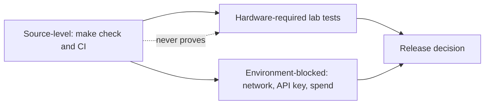

# Testing and verification

> Managed by **ahlikoding.com** and **satpamsiber.com** from **ahliweb.com**.

Dokumen ini menjelaskan apa yang diverifikasi oleh pengujian tingkat source, cara menjalankannya, dan apa yang tetap membutuhkan hardware atau lingkungan nyata. Perintah, ID, dan URL dipertahankan apa adanya.



## Verification levels

| Level | Meaning | Examples | Where it runs |
|---|---|---|---|
| Implemented / source-level | Deterministic, no real USB, no cloud | Syntax, `shellcheck -x`, schema fixtures, unit tests | `make check`, CI |
| Hardware-required | Needs a physical PC and USB | Ventoy write, firmware boot menu, live XFCE session, reboot autostart | Lab |
| Environment-blocked | Needs network, a real key, or provider spend | `test-hermes-conversation.sh --live`, `check-hermes-rescue.sh` provider probe | Operator-approved run |
| Planned | Design only | Learning promotion pipeline | Not testable yet |

A passing source-level run must never be reported as a USB boot, reboot, or cloud success.

## Running the source-level gate

```bash
make check
```

`make check` runs, in order: `syntax` (`bash -n scripts/*.sh scripts/lib/*.sh` and `python3 -m py_compile scripts/*.py`), `lint` (`shellcheck -x scripts/*.sh scripts/lib/*.sh`), `validate` (the valid fixture must pass and `invalid-raw-ai-fields.json` must be rejected), `test` (`python3 -m unittest discover -s tests -v`), and `diff-check` (`git diff --check`). Individual targets can be run alone, for example `make test`. Other targets: `make collect`, `make hardware-check`, `make version`.

Prerequisites: `bash`, `shellcheck`, `gnupg` (the ISO tests create a throwaway GPG key), `python3` with `jsonschema` (`sudo apt install shellcheck gnupg python3-jsonschema`). CI (`.github/workflows/ci.yml`, ubuntu-24.04, Python 3.12) installs the same tools, runs `make check PYTHON=python`, then a collector smoke test and an informational hardware-readiness report (its gate result does not fail CI).


## What the tests cover

The tests in `tests/` are all standard-library `unittest` (run `make test` for the current count).

| File | Covers |
|---|---|
| `tests/test_ventoy_iso.py` | `verify-mint-iso.sh` (signer fingerprint pinning, normalization, tampered ISO or sums, missing/duplicate entries), `install-ventoy-usb.sh` refusals (no `--yes`, non-block device), `prepare-ventoy-usb.sh --bundle-only` allowlist and clean-bundle check, `download-ventoy.sh` version validation and single API call |
| `tests/test_hermes_scripts.py` | `rescue-env.sh` parser (quotes, `printf %q` output, no code execution, environment precedence, world-writable refusal, Desktop Entry quoting), installer bundle, symlinks, autostart and `hermes/env` round trip, bad state-dir refusal, key never on `curl` argv, dry-run smoke test, launcher threshold validation, `analyze-opencode-go.sh` refusing invalid evidence |
| `tests/test_repair_contract.py` | Schema 1.2 rules and fixtures, every catalog invariant, trigger matching, AI proposal parsing, parameter validation and rendering, the engine under each policy (fake programs through `RESCUE_REPAIR_TEST_PATH`, interactive approval on a pseudo-terminal), backup fingerprint, rollback, `sudo -n`, journal chain and tamper detection, module sanitizing, scanner scope/proposals |
| `tests/test_host_launchers.py` (module hook classes) | The Linux, PowerShell, and zsh launchers run their detection modules, drop invalid output, survive failing modules, and record `scope`/`repair_policy`; invalid flags exit `64` |
| `tests/test_evidence_readiness.py` | `validate-evidence.py` exit codes `0`/`1`/`2`, collector output (honest verification fields, `0600`), hardware-readiness thresholds, aggregation, wizard minimums and EOF handling |

Hermes script tests run as an unprivileged user: when the suite is executed as root it re-runs the scripts as uid `65534` through `setpriv`, because the installer refuses root. Tests use dummy keys only and never touch a real block device or the network.

## Manual and lab checks

### Evidence and readiness (safe anywhere)

```bash
./scripts/collect-evidence.sh --output /tmp/rescue-evidence.json
python3 scripts/validate-evidence.py /tmp/rescue-evidence.json
python3 scripts/check-hardware-readiness.py --mode auto --output /tmp/rescue-hardware-readiness.json
```

`validate-evidence.py` accepts several files and exits `0` (all valid), `1` (at least one invalid), or `2` (usage error, unreadable file, JSON parse error, or `jsonschema` missing). The collector reports `verification.hashes_verified: false` and `status: not_applicable` on purpose; do not treat that as a failure.

### Interpreting `check-hardware-readiness.py` exit 1

The command exits `1` when a required check is `fail` or `unknown`. In CI containers, VMs, and developer machines this is usually a **lab blocker**, not a defect: there is no `/run/live/medium` USB, no DNS/HTTPS route, or no display adapter. Read the JSON report (`summary`, then each `checks[]` entry with `observed` and `minimum`):

| Report signal | Interpretation |
|---|---|
| `usb-boot-media` fail with `live-media mount was not detected` | Not running from a live USB; lab blocker unless you are on the live session |
| `internet-connectivity` fail | No default route, DNS, or HTTPS to `https://opencode.ai`; blocker in offline environments, genuine on the target PC |
| `cpu` / `ram` fail with real numbers below the minimum | Genuine gate failure on that machine |
| `summary.overall: ready_with_warnings` | Exit `0`; wizard skips or unverified items are warnings |

Report file permissions are `0600`, created atomically. A software report cannot prove the firmware booted from USB.

### Hardware-required checklist

Record physical evidence (photo, log, or lab sheet) for each item; without it, report the item as not tested.

1. `./scripts/install-ventoy-usb.sh --device /dev/sdX --ventoy-dir DIR --yes` on a confirmed removable USB (destroys its data).
2. `./scripts/prepare-ventoy-usb.sh ...` against the mounted Ventoy partition; confirm the ISO read-back line and, if provisioned, treat the USB as credential-bearing.
3. Boot the PC from the USB via the firmware menu (UEFI and Legacy where applicable) and confirm Ventoy auto-selects Linux Mint XFCE.
4. In the live session run `./scripts/install-hermes-rescue.sh --state-dir ...` as the desktop user, then `./scripts/check-hermes-rescue.sh --state-dir ...`.
5. `./scripts/verify-autostart.sh --state-dir ...`, reboot, log in, and check `pgrep -af "hermes.*mimo-v2.6-flash"`.

### Environment-blocked checks

- `./scripts/test-hermes-conversation.sh --state-dir PATH` is a no-cost dry run.
- `./scripts/test-hermes-conversation.sh --state-dir PATH --live` sends one bounded request to OpenCode Go and incurs provider usage. It needs an operator-provided `OPENCODE_GO_API_KEY`. Never fabricate a successful response and never print the key.
- The provider probe inside `check-hermes-rescue.sh` needs network and a key; without them it prints `Provider network check skipped` and, if the key is unset, reports `NOT READY`.

## Secret and diff hygiene before committing

```bash
git diff --check
git status --short   # no .env, config/rescue.env, ISOs, Ventoy archives, generated evidence, or Hermes state
```

Use dummy keys in any provisioning test.
