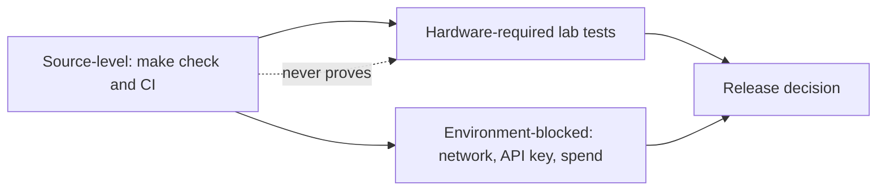

# Testing and verification

> Managed by **ahlikoding.com** and **satpamsiber.com** from **ahliweb.com**.

Dokumen ini menjelaskan apa yang diverifikasi oleh pengujian tingkat source, cara menjalankannya, dan apa yang tetap membutuhkan hardware atau lingkungan nyata. Perintah, ID, dan URL dipertahankan apa adanya.



## Verification levels

| Level | Meaning | Examples | Where it runs |
|---|---|---|---|
| Implemented / source-level | Deterministic, no real USB, no real disk, no cloud; fake programs, fixtures, and loopback servers | Syntax, `shellcheck -x`, schema fixtures, catalog invariants, docs check, unit tests | `make check`, CI |
| Hardware-required | Needs a physical PC, disk, USB, or a real Windows or macOS | Ventoy write, firmware boot menu, live XFCE session, persistence boot, reboot autostart, real mounts and repairs, Windows 10/11 and macOS launcher runs | Lab |
| Environment-blocked | Needs network, a real key, or provider spend | `test-hermes-conversation.sh --live`, `check-hermes-rescue.sh` provider probe, `freshclam` downloads, real GitHub issue creation, the docker persistence build | Operator-approved run |
| Planned | Design only | Learning promotion pipeline | Not testable yet |

A passing source-level run must never be reported as a USB boot, reboot, real repair, or cloud success.

## Running the source-level gate

```bash
make check
```

`make check` runs, in order:

| Target | What it does |
|---|---|
| `syntax` | `bash -n` on `scripts/*.sh`, `scripts/lib/*.sh`, and `host/rescue-linux.sh`; `py_compile` on `scripts/*.py`, `scripts/lib/*.py`, and `scripts/rescue_modules/*.py`; `python3 scripts/lib/repair_catalog.py` (catalog schema and invariants); `zsh -n host/RESCUE-MACOS.command` and a PowerShell parse of `host/rescue-windows.ps1` (each is skipped with a message when `zsh` or `pwsh` is missing) |
| `lint` | `shellcheck -x` on the same shell scripts |
| `validate` | The valid evidence fixtures must pass and the three invalid ones (raw AI fields, text value in 1.1, 1.2 fields in 1.1) must be rejected; `scripts/rescue-report.py --validate` accepts `run-report-valid-*.json` and rejects `run-report-invalid-*.json` |
| `docs` | `python3 scripts/check-docs.py`: relative links and `#anchors`, Mermaid block types and bracket/quote balance, the attribution line on README, CHANGELOG, and every `docs/*.md`, secret patterns in fenced blocks, and references to docs files and anchors (also the `doc` fields of the repair catalogs) |
| `test` | `python3 -m unittest discover -s tests -v` |
| `diff-check` | `git diff --check` |

Individual targets can be run alone, for example `make test` or `make docs`. Other targets: `make collect`, `make hardware-check`, `make version`. `make check` takes several minutes because the launcher and engine tests run real shells, `pwsh`, `zsh`, and `node`.


### Package workflow gate

`.github/workflows/package.yml` is a second CI gate for release packaging (credential-free `bundle` and `persistence` packages on ghcr.io, see [persistence](persistence.md#paket-github-tanpa-kredensial)). At source level `tests/test_package_workflow.py` checks that only `GITHUB_TOKEN` is referenced, `--no-provision-secrets` is on the build line, every `uses:` is pinned to a 40-hex SHA with a version comment, publishing and write permissions exist only in jobs gated off for `pull_request`, and top-level permissions are read-only; `actionlint` was also run against it. On a pull request that touches the workflow, the build scripts, or the Makefile, the workflow runs a dry build (bundle assembled and checked, ISO downloaded and GPG+SHA-256 verified, persistence image built and asserted credential-free with `debugfs`, no compression, no push). The two portable Hermes jobs (`hermes-portable-linux`, `hermes-portable-windows`) build, scan, and smoke-test the archives that `bundle-publish` attaches to the Release ([Hermes portabel](hermes-portable.md)); the Windows build and run are Environment-blocked here and Hardware-required on a real PC. The real publish on a tag or `workflow_dispatch` is Environment-blocked here (needs GitHub, docker, and the network) and must be confirmed by reading the run and the pushed package back.

### Requirements

| Tool | Needed for | If missing |
|---|---|---|
| `bash`, `python3` (3.12 in CI), `git` | Everything | Cannot run |
| `shellcheck` | `make lint` | Lint fails |
| `gnupg` | The ISO tests create a throwaway GPG key | Those tests are skipped |
| `python3-jsonschema` | Schema validation (`validate-evidence.py`, report and catalog checks) | Tests are skipped or validators exit `2` |
| `pwsh` (optional) | The PowerShell parse check and the Windows launcher, module, engine, and report tests | Skipped with a message |
| `zsh` (optional) | `zsh -n` and the macOS launcher and module tests | Skipped |
| `node` (optional) | The JXA planner and report generator tests (a shim runs the same JavaScript that `osascript -l JavaScript` runs on macOS) | Skipped |

Install the required tools with `sudo apt install shellcheck gnupg python3-jsonschema`. Install `pwsh`, `zsh`, and `node` as well so the launcher tests run instead of skip; a skip is not a pass, and a run without them says nothing about the Windows and macOS launchers. CI (`.github/workflows/ci.yml`, ubuntu-24.04, Python 3.12) installs `shellcheck`, `gnupg`, `zsh`, and `jsonschema` and uses the `pwsh` and `node` that the runner image ships, so those tests run there; it runs `make check PYTHON=python`, then a collector smoke test and an informational hardware-readiness report (its gate result does not fail CI).

## Test inventory

The tests in `tests/` are standard-library `unittest`. `tests/host_osascript_shim.js` is a helper for the macOS JXA tests, not a test. Do not rely on a total quoted in prose; get the current numbers by running the suite. The last lines of

```bash
python3 -m unittest discover -s tests -v 2>&1 | tail -4
```

are `Ran N tests` and `OK` (with `skipped=K` when tools are missing), and the per-file counts come from

```bash
python3 -m unittest discover -s tests -v 2>&1 | grep -oE '\(test_[a-z_0-9]+\.' | sort | uniq -c
```

The counts below come from that command (skipped tests are counted too) with `pwsh`, `zsh`, and `node` available; regenerate them when tests are added.

| File | Tests | Covers |
|---|---|---|
| `tests/test_check_docs.py` | 29 | `scripts/check-docs.py`: slug rules, links, anchors, Mermaid, attribution, secret patterns, doc references, catalog `doc` fields, CLI exit codes, and that this repository passes |
| `tests/test_ventoy_iso.py` | 25 | `verify-mint-iso.sh` (signer fingerprint pinning, normalization, tampered ISO or sums, missing/duplicate entries), `install-ventoy-usb.sh` refusals (no `--yes`, non-block device), `prepare-ventoy-usb.sh --bundle-only` allowlist and clean-bundle check, `download-ventoy.sh` version validation and single API call |
| `tests/test_hermes_scripts.py` | 26 | `rescue-env.sh` parser (quotes, `printf %q` output, no code execution, environment precedence, world-writable refusal, Desktop Entry quoting), installer bundle, symlinks, autostart and application-menu desktop entries (explicit `xfce4-terminal` Exec) and `hermes/env` round trip, launcher helpers (route wait, offline prompt, pause on EOF), bad state-dir refusal, key never on `curl` argv, dry-run smoke test, launcher threshold validation, `analyze-opencode-go.sh` refusing invalid evidence, and the live kickoff (fake `hermes`/`sudo`: argv with `-s rescue-autorun --query-file`, cwd is the reports folder, follow-up args, re-scan only after an ok execute of this run, persistence warning, fallback without `kickoff.md`) |
| `tests/test_evidence_readiness.py` | 42 | `validate-evidence.py` exit codes `0`/`1`/`2`, collector output (honest verification fields, `0600`), hardware-readiness thresholds, sysfs-first dm/loop/partition live-media resolution (Ventoy dm over the whole disk, unresolved-chain diagnostics), warn-versus-fail semantics, advisory network check, advisory `persistence-active` (tmpfs upper layer warns, ext4 on loop or block device passes, `persistent` parameter, garbage is unknown, never blocks READY), aggregation, wizard minimums and EOF handling |
| `tests/test_progress.py` | 18 | `scripts/lib/progress.py` and `progress.sh`: bar/step drawn only on the terminal (test hook `RESCUE_PROGRESS_TTY`), nothing on stdout/stderr, disabled by `RESCUE_PROGRESS=0`/`TERM=dumb`/no terminal, width limit, `Budget` capped at 99%, never raises, shell wrapper keeps exit code and output and leaves no drawer, plain `[N/T]` line on stdout; offline module concurrency keeps the domain order; `scan-target-os.py` progress never reaches stdout/stderr |
| `tests/test_target_scan.py` | 42 | Analyzer `x-opencode-session` header (hash of the sent evidence, stable, no content) and exit `5` on a provider 4xx rejection; `scan-target-os.py` on fixture roots (Windows, Linux Mint, macOS, encrypted, unmountable, limits, symlinks), `opencode-go-analyze.py` against a loopback fake provider (validation, exit codes `2`/`3`/`4`, dry run, restricted evidence, key never printed), and the launcher wiring |
| `tests/test_repair_contract.py` | 54 | Schema 1.2 rules and fixtures, every catalog invariant, trigger matching, AI proposal parsing, parameter validation and rendering, the engine under each policy (fake programs through `RESCUE_REPAIR_TEST_PATH`, interactive approval on a pseudo-terminal), backup fingerprint, rollback, `sudo -n`, journal chain and tamper detection, module sanitizing, scanner scope and proposals, and the 0.3.0 alignment (classification, provider fields, `celsius`) |
| `tests/test_repair_engine_ux.py` | 41 | Repair engine UX (ahliweb/linux-mint-xfce-rescue-ai#70): the `needs-root` precheck with a fake `sudo` (probe once, cached, never prompts or runs), the live-only `mw.clamav-update-signatures` (no host proposal), the host-mode state directory rule and the `provider-unavailable` refusal, the device picker with fake `lsblk` JSON (candidate filtering, removable fallback, values outside the list rejected, no model in the journal, non-interactive `missing-param`), batch approval on a pseudo-terminal (only `safe`, never quarantine or reversible, `n` falls back, no batch under `auto-safe`/`detect-only`), `--select` under `auto-safe`, and static cross-engine parity of the new reasons, prompts and headers across Python, PowerShell and zsh |
| `tests/test_hardware.py` | 45 | The hardware module on fixture trees (weak battery, hot CPU, EDAC errors, failing SMART, worn NVMe, GPU without a driver), scope selection, and the `hardware.ps1` (`pwsh`) and `hardware.zsh` (`zsh`) modules |
| `tests/test_os_repair.py` | 60 | The OS checks for Linux, Windows, and macOS fixtures, the OS catalogs, the target mount provider (fixture mode, refusals, real path with a fake privileged mount, signals, live-session guard), the engine with the provider, and the `os.ps1`/`os.zsh` modules |
| `tests/test_software.py` | 48 | The `sw-*` checks (dpkg fixtures, selected packages, honest `unknown` for Windows targets), the software catalog, the engine, and the `software.ps1`/`software.zsh` modules |
| `tests/test_malware.py` | 101 | Schema 1.2 malware IDs and scope, `mw` catalog invariants and the `detection_ref`/`state_dir` parameter types, the ClamAV module (fake `clamscan`, EICAR built at runtime, stale/absent signatures, limits, symlinks, fair budget share with carry-forward, `--malware-target` selector), the scanner's local detection list (no path in evidence or the analyzer request), `rescue-malware-quarantine` (round trip, TOCTOU, symlinks, no overwrite), the engine (quarantine always asks, delete destructive, rollback restore), and the pwsh/zsh module and engine tests |
| `tests/test_host_launchers.py` | 88 | Session-header and `provider-rejected` parity across the three engines; the Linux launcher end to end (evidence, real analyzer `--dry-run`, fake loopback server, exit codes `1`/`3`/`4`/`5`/`6`/`64`, re-collect only after an `ok` action), the Linux launcher opening Hermes on a pseudo-terminal with a fake portable runtime (`LinuxHermesTests`: argv, cwd, environment isolation, key only in the environment, `hermes-home/` seeding, `--no-hermes`/`--hermes-only`, no terminal/key/runtime/architecture), the PowerShell launcher (`pwsh`: parse, env-file parser parity, evidence), the macOS launcher (`zsh -n`, shimmed macOS commands, key only on `curl` stdin), static rules (no `eval`, `source`, `sudo`, `Invoke-Expression`, elevation, host temp files), the module hook classes, and the Windows Hermes continuation (`WindowsHermesStaticTests` for the exact argv, environment isolation, key and token handling, progress and ordering; `WindowsHermesTests` under `pwsh`, including a pseudo-terminal run against a fake `python.exe`: launch contract, `hermes-home` seeding, re-scan trigger, follow-up validated against `followup.schema.json`, phase lines, `-HermesOnly` usage; the Hermes session itself is Hardware-required) |
| `tests/test_host_repair.py` | 76 | The native Windows and macOS repair engines against the Python one: plan versus `repair_catalog.triggered`, AI parsing versus `parse_ai_proposals`, catalog hash and backup fingerprint, journals accepted by `rescue-repair.py --verify-journal`, policy, parameters, timeouts, rollback, Windows argument quoting, interactive approval on a pseudo-terminal, and the JXA planner via the `node` shim |
| `tests/test_run_report.py` | 104 | The run report ([run report](run-report.md)): model and Markdown renderer from fixtures (sections, redaction, outcomes, before/after, open items, honesty), a tampered journal chain shown as INVALID, the privacy self-check per rule and for the key value, the schema and fixtures, the CLI (`0600`, atomic, exit codes, a journal from the real engine), PowerShell (`pwsh`) and JXA (`node` shim) generators equal to the Python one (JSON, Markdown, index), and the launcher exit paths including the post-repair re-scan on the live USB, the offline path, the private launcher log, and the tty pause (via `script`), Linux, Windows, and macOS |
| `tests/test_persistence.py` | 32 | `build-persistence.sh` argument validation and secret handling (no docker needed), `overlay_whiteouts.py` (layer conversion, `debugfs` scripts, a real ext4 image), and `prepare-ventoy-usb.sh --persistence` (`ventoy.json` merge, refusal to overwrite, invalid images, host launchers copied to the USB root) |
| `tests/test_persistence_migration.py` | 18 | `scripts/migrate-persistence-state.py` on small ext4 images built with `mke2fs -d` (no root; skipped without e2fsprogs): dry run changes nothing, full migration keeps content/mode/uid/gid/mtime and replaces same-path files, program files and bundled skills stay from the new image while field-learned skills are carried, locks and symlinks are skipped and reported, refusals (same file or hard link, device node, missing file, no state root), missing `debugfs` exits 3, `e2fsck` clean, the key is never printed, staging is removed, repeat run |
| `tests/test_hermes_portable.py` | 54 | `scripts/build-hermes-portable.py` pure functions and CLI without downloads ([Hermes portabel](hermes-portable.md)): tree hash and manifest, symlink and exFAT/Windows name rules, secret scan and its precise allowlist, archive validation (absolute, `..`, symlink, hardlink, mixed platform, name mismatch), deterministic tar.gz/zip round trip with tamper refusal, `--verify-tree`/`--scan-tree`/`--check-archive` exit codes, cross-build and bad-ref refusal, Tcl/Tk byte-compile exclusion, and the `prepare-ventoy-usb.sh --hermes-portable` pre-flight (sidecar, checksum, name, unsafe content, duplicates, usage). The real build is Environment-blocked here and runs in CI |
| `tests/test_package_workflow.py` | 18 | `.github/workflows/package.yml` (text checks): the `hermes-portable-linux`/`hermes-portable-windows` jobs (read-only, no token, smoke test and credential scan before upload, uv from a pinned hashed wheel, no new actions) and both archives plus checksums attached to the Release by `bundle-publish`; triggers, only `GITHUB_TOKEN`, `--no-provision-secrets`, SHA-pinned actions, read-only top-level permissions, publish jobs and uploads gated off for pull requests, ref/tag/version handling, pinned-signer ISO verification before the build, the `debugfs` credential-free assertion before compression, and the deterministic bundle |
| `tests/test_skill_submission.py` | 47 | `skill_sanitize.py` (placeholders, secret scan, hash), `submit-skill.py` dry run, refusals, fallback URL or file, submit and de-duplication against a fake GitHub on `127.0.0.1`, exit codes, token never on argv or in output, and the `RESCUE_GITHUB_ISSUES_TOKEN` allowlist entry |
| `tests/test_android.py` | 61 | Android over USB ([android](android.md)): sysfs USB inventory on a fake tree (port path, speed, hub depth, ACPI location, rescue-USB marker through dm slaves and Ventoy labels), Android mode classification (ADB, fastboot, MTP/PTP, EDL, MediaTek BROM, Samsung download), a PATH-shim `adb` (fixed argv, `-t` transport ids, unauthorized/offline states), check thresholds, `scan-android.py` table and evidence, schema 1.3 and validator rules, and privacy (no serial, USB strings or package names in evidence or output) |
| `tests/test_android_repair.py` | 72 | Android repair actions ([android](android.md)): the `android.json` catalog and the `adb -t {android_device}` invariants, scope and `and-N` matching, the engine's execution-time `android_device` resolution and its typed refusals (absent, not authorized, ambiguous, mismatch), policy (auto-safe runs only `android.trim-caches`), journal privacy, the reboot verify-wait, run-report generators accepting `and-N`, host engines accepting the catalog, and the live launcher's phone offer |
| `tests/test_android_flash.py` | 79 | Android flashing and unbrick ([android](android.md#flashing-dan-unbrick-52)): fastboot/Heimdall catalog invariants and partition allowlists, `expect_line` and the guards, `fastboot_device`/`firmware_file`/`sha256` validation (symlink, relative path, size, hash mismatch, file changed while hashing), locked-bootloader, product-mismatch and single-download-device refusals, `flash-all` never executed and the `-w`-free update, destructive policy (backup ref, typed id, never auto-safe), journal with the SHA-256 but no path or serial, fake `fastboot`/`heimdall` shims, run-report reasons, host engines accepting the catalog |
| `tests/test_printer.py` | 102 | Printers ([printer](printer.md)): USB class 07 and IPP-over-USB on a fake sysfs tree, PATH shims for `lpstat`/`ipptool`/`avahi-browse` (stopped, paused, media-jam, toner-low, offline, virtual queues skipped), state-reason mapping and thresholds, `ipp-usb` endpoints, queue pairing, offline Windows/Linux spool trees and the CUPS unit, `scan-printers.py` table and evidence, schema 1.3 printer rules, `--network` off by default, and privacy (queue names, URIs, IPs, serials and job names never in evidence or output) |
| `tests/test_printer_repair.py` | 120 | Printer repair actions ([printer](printer.md)): `printer.json` invariants (closed program list, fixed argv forms, shipped `bundle_root` files, `irreversible` rules), execution-time `printer_ref` resolution and typed refusals (absent, mismatch, ambiguous), auto-safe versus always-ask policy for consumables and cancelled jobs, privacy of screen, journal and report (no queue name), network opt-in, the spool quarantine helper and engine round trip (rollback restores, other mount refused), run-report generators (Python, JXA, PowerShell static), host engine lists, `scan-printers.py --count`, the live launcher offer |
| `tests/test_followup.py` | 48 | Hermes autorun ([learning loop](hermes-learning-loop.md#autorun-hermes-69)): `scripts/rescue-followup.py` with fake `lsblk`/`smartctl`/`journalctl` shells through `RESCUE_REPAIR_TEST_PATH` (SMART and NVMe attributes, last self-test parsing, `needs-root`, missing tool, scope, only flagged checks), journal categories counts-only and the read-only target journal (symlinks refused, unmountable target), malware coverage facts, persistence from fake `/proc` files (loop/block/tmpfs, `/cow` fallback, mismatch warning), the CLI contract (exit `0`/`2`, atomic `0600` file, bilingual summary, deadline and timeout), the privacy self-check per rule, the schema and fixtures (generated from the script tables), the profile (skill front matter, `rescue-autorun` allows only the two typed commands and no `--approve`/`--param`/`--backup-ref`, kickoff with relative paths only), the installer and container wiring, and the `approvals.deny` list (fnmatch, plus `tools.approval._match_user_deny_rule` and `hermes config check` when a Hermes checkout exists; skipped without one) |

Hermes script tests run as an unprivileged user: when the suite is executed as root it re-runs the scripts as uid `65534` through `setpriv`, because the installer refuses root. Tests use dummy keys only and never touch a real block device or the network (loopback fake servers only).

## Manual and lab checks

### Evidence and readiness (safe anywhere)

```bash
./scripts/collect-evidence.sh --output /tmp/rescue-evidence.json
python3 scripts/validate-evidence.py /tmp/rescue-evidence.json
python3 scripts/check-hardware-readiness.py --mode auto --output /tmp/rescue-hardware-readiness.json
python3 scripts/lib/repair_catalog.py
python3 scripts/rescue-report.py --validate rescue-ai/v1/fixtures/run-report-valid-full.json
```

`validate-evidence.py` accepts several files and exits `0` (all valid), `1` (at least one invalid), or `2` (usage error, unreadable file, JSON parse error, or `jsonschema` missing). The collector reports `verification.hashes_verified: false` and `status: not_applicable` on purpose; do not treat that as a failure.

### Interpreting `check-hardware-readiness.py` exit 1

The command exits `1` when a required check is `fail` or `unknown` (the network check is not required and the USB check only fails for a resolved USB disk that is too small). In CI containers, VMs, and developer machines this is usually a **lab blocker**, not a defect: there is no `/run/live/medium` USB, no DNS/HTTPS route, or no display adapter. Read the JSON report (`summary`, then each `checks[]` entry with `observed` and `minimum`):

| Report signal | Interpretation |
|---|---|
| `usb-boot-media` warn with `live-media mount was not detected` or `transport=unknown` | Not running from a live USB, or the source (dm, loop) could not be resolved; never blocks. `fail` only means a resolved USB disk smaller than the minimum |
| `internet-connectivity` warn | No default route, DNS, or HTTPS to `https://opencode.ai`; not required, so exit stays `0` with `ready_with_warnings`; the live launcher then runs offline |
| `cpu` / `ram` fail with real numbers below the minimum | Genuine gate failure on that machine |
| `summary.overall: ready_with_warnings` | Exit `0`; wizard skips or unverified items are warnings |

Report file permissions are `0600`, created atomically. A software report cannot prove the firmware booted from USB.

### Hardware-required checklist

Record physical evidence (photo, log, or lab sheet) for each item; without it, report the item as not tested.

1. `./scripts/install-ventoy-usb.sh --device /dev/sdX --ventoy-dir DIR --yes` on a confirmed removable USB (destroys its data).
2. `./scripts/prepare-ventoy-usb.sh ...` against the mounted Ventoy partition; confirm the ISO read-back line and, if provisioned, treat the USB as credential-bearing.
3. Boot the PC from the USB via the firmware menu (UEFI and Legacy where applicable) and confirm Ventoy auto-selects Linux Mint XFCE.
4. In the live session run `./scripts/install-hermes-rescue.sh --state-dir ...` as the desktop user, then `./scripts/check-hermes-rescue.sh --state-dir ...`.
5. `./scripts/verify-autostart.sh --state-dir ...`, reboot, log in, and check `pgrep -af "hermes.*mimo-v2.6-flash"`.
6. Persistence image: boot with the `persistence` entry, confirm `/cow` is the `casper-rw` overlay, install or change something, reboot, and confirm Hermes state and reports survived ([persistence](persistence.md)).
7. Live scan on a PC with real Windows, Linux Mint, and macOS disks: mounts stay read-only, encrypted volumes stay closed, the reports appear under `<state-dir>/reports/` ([target OS scan](target-os-scan.md)).
8. Repairs on a sacrificial disk only: a read-write remount with a backup reference, one action per class (safe, reversible, destructive), the journal verified with `rescue-repair.py --verify-journal`, and the run report read ([repair framework](repair-framework.md), [OS repair](os-repair.md)).
9. Windows 10/11 and macOS 12+ (Intel and Apple Silicon): double-click the launchers, including SmartScreen and Gatekeeper behavior, Windows PowerShell 5.1, `osascript` JXA, Defender, `fdesetup`, `csrutil`, `diskutil`, and the native repair engines ([host launchers](host-launchers.md), [host repair](host-repair.md)).
10. Malware: real ClamAV and Defender on real files, quarantine and restore on a read-write target ([malware](malware.md)).

### Environment-blocked checks

- `./scripts/test-hermes-conversation.sh --state-dir PATH` is a no-cost dry run.
- `./scripts/test-hermes-conversation.sh --state-dir PATH --live` sends one bounded request to OpenCode Go and incurs provider usage. It needs an operator-provided `OPENCODE_GO_API_KEY`. Never fabricate a successful response and never print the key.
- The provider probe inside `check-hermes-rescue.sh` needs network and a key; without them it prints `Provider network check skipped` and, if the key is unset, reports `NOT READY`.
- `scripts/build-persistence.sh` needs docker and network (apt archive and the Hermes installer).
- `mw.clamav-update-signatures` (`freshclam`) and `apt-get`-based repairs need network.
- `scripts/submit-skill.py` against `api.github.com` needs network and a real fine-grained token; the automated tests use a fake GitHub on `127.0.0.1`.

## Secret and diff hygiene before committing

```bash
python3 scripts/check-docs.py
git diff --check
git status --short   # no .env, config/rescue.env, ISOs, Ventoy archives, generated evidence, or Hermes state
```

Use dummy keys in any provisioning test. The docs checker scans fenced blocks for secret-shaped strings; do not paste real keys or tokens into documents.
